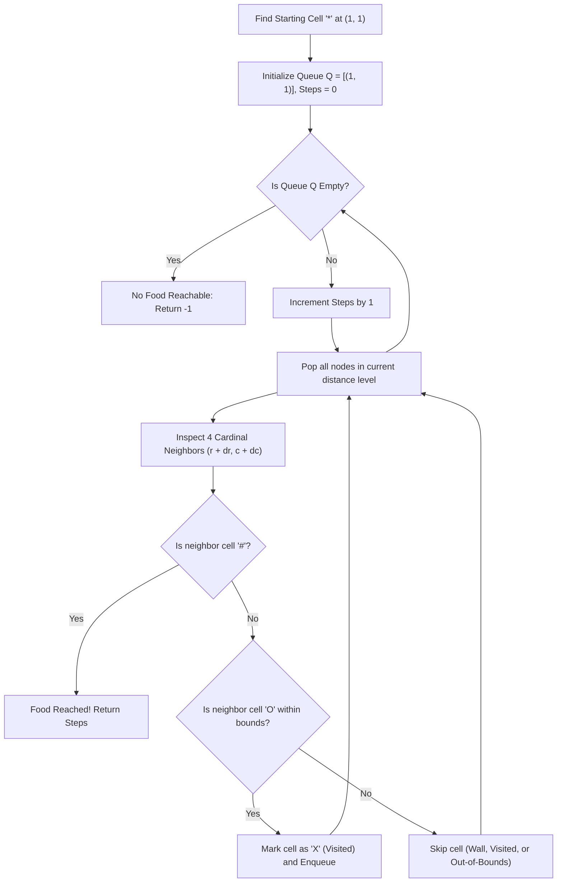

# Guided Example: Shortest Path to Get Food

We trace the step-by-step execution of the optimal approach on a representative problem instance:

- **Input:**
  $$\text{grid} = \begin{bmatrix} \text{X} & \text{X} & \text{X} & \text{X} & \text{X} & \text{X} \\ \text{X} & \text{*} & \text{O} & \text{O} & \text{O} & \text{X} \\ \text{X} & \text{O} & \text{O} & \text{\#} & \text{O} & \text{X} \\ \text{X} & \text{X} & \text{X} & \text{X} & \text{X} & \text{X} \end{bmatrix}$$
- **Required Output:** `3`

This instance features obstacles, multiple paths to food, and open intermediate spaces, demonstrating how level-by-level Breadth-First Search (BFS) guarantees the minimal step count in an unweighted grid graph.

---

## 1. Instance & Teaching Goal

We are given an $m \times n$ character grid with the following cell symbols:
- `'*'`: Starting location (exactly one)
- `'#'`: Destination food cell (one or more)
- `'O'`: Empty traversable space
- `'X'`: Impassable obstacle/wall

From any cell, valid moves consist of jumping to an orthogonally adjacent cell (North, South, East, West) within grid bounds that is not an obstacle `'X'`. We seek the minimum number of steps to reach any cell containing `'#'`. If no food cell is reachable, the output must be `-1`.

Because every step has uniform cost $1$, Dijkstra's algorithm simplifies to standard queue-based Breadth-First Search. Exploring the grid level-by-level ensures that the very first time any `'#'` cell is encountered, the path discovered to it is mathematically guaranteed to be shortest.

---

## 2. Conceptual Foundation & Invariants

### State Representation

| Component | Definition | Initial State |
|---|---|---|
| BFS Queue $Q$ | FIFO queue holding active frontier coordinates $(r, c)$ | Enqueue starting coordinate $(r_*, c_*)$ |
| Visited Marking | In-place overwrite of visited open cells `'O'` to `'X'` | Mark starting cell as visited |
| Distance Counter $d$ | Current exploration radius (path length) | $0$ |

### Mathematical Invariants

> **Unit-Cost Monotonic Wavefront Expansion Theorem.**
> In a graph where all edges have weight $1$, Breadth-First Search processes vertices in monotonically non-decreasing order of their geodesic distance from the source $s$:
> $$\text{dist}(s, u) \le \text{dist}(s, v) \quad \text{for all } u \text{ popped before } v$$
> Consequently, the first vertex popped or discovered that satisfies the target predicate (being a food cell `'#'`) possesses the global minimum distance $\min_{f \in \mathcal{F}} \text{dist}(s, f)$.

> **In-Place Deduplication Invariant.**
> To prevent revisiting cells or expanding infinite cycles, every cell admitted into the frontier queue is immediately transformed from `'O'` to an obstacle `'X'`. This ensures each vertex enters the queue at most once.

---

## 3. Step-by-Step Worked Execution

For the given grid of dimensions $m = 4, n = 6$:
- Starting position `'*'` is at row $1$, column $1$: $(1, 1)$.
- Destination `'#'` is located at $(2, 3)$.

### Initialization

- Start cell identified at $(1, 1)$.
- Mark $(1, 1)$ as visited.
- Initialize FIFO queue: $Q = [(1, 1)]$.
- Cumulative step counter: $\text{steps} = 0$.

---

### Level 1 Expansion ($\text{steps} = 1$)

Queue size at start of level: $1$. We pop $(1, 1)$:

- North $(0, 1)$: Cell contains `'X'` (Wall) $\to$ Skipped.
- South $(2, 1)$: Cell contains `'O'` $\to$ Valid! Mark as `'X'`, enqueue $(2, 1)$.
- West $(1, 0)$: Cell contains `'X'` (Wall) $\to$ Skipped.
- East $(1, 2)$: Cell contains `'O'` $\to$ Valid! Mark as `'X'`, enqueue $(1, 2)$.

Frontier after Level 1: $Q = [(2, 1), (1, 2)]$.

---

### Level 2 Expansion ($\text{steps} = 2$)

Queue size at start of level: $2$.

1. **Pop $(2, 1)$:**
   - North $(1, 1)$: Visited `'X'` $\to$ Skipped.
   - South $(3, 1)$: Cell contains `'X'` $\to$ Skipped.
   - West $(2, 0)$: Cell contains `'X'` $\to$ Skipped.
   - East $(2, 2)$: Cell contains `'O'` $\to$ Valid! Mark as `'X'`, enqueue $(2, 2)$.

2. **Pop $(1, 2)$:**
   - North $(0, 2)$: Cell contains `'X'` $\to$ Skipped.
   - South $(2, 2)$: Already marked visited $\to$ Skipped.
   - West $(1, 1)$: Already visited $\to$ Skipped.
   - East $(1, 3)$: Cell contains `'O'` $\to$ Valid! Mark as `'X'`, enqueue $(1, 3)$.

Frontier after Level 2: $Q = [(2, 2), (1, 3)]$.

---

### Level 3 Expansion ($\text{steps} = 3$)

Queue size at start of level: $2$.

1. **Pop $(2, 2)$:**
   - North $(1, 2)$: Visited `'X'` $\to$ Skipped.
   - South $(3, 2)$: Cell contains `'X'` $\to$ Skipped.
   - West $(2, 1)$: Visited `'X'` $\to$ Skipped.
   - East $(2, 3)$: **Cell contains `'#'`! Food cell discovered!**

The search halts immediately. The current step counter is $\mathbf{3}$.

---

## 4. Complete Execution Trace

| Level | Popped Cell | Examined Neighbors | Action / Queue Modification | Next Level Queue |
|---|---|---|---|---|
| $0$ | Initialization | Locate `'*'` at $(1, 1)$ | Enqueue $(1, 1)$, mark visited | $[(1, 1)]$ |
| $1$ | $(1, 1)$ | $(0,1): \text{X}$, $(2,1): \text{O}$, $(1,0): \text{X}$, $(1,2): \text{O}$ | Enqueue $(2, 1), (1, 2)$ | $[(2, 1), (1, 2)]$ |
| $2$ | $(2, 1)$ | $(2,2): \text{O}$ | Enqueue $(2, 2)$ | $[(1, 2), (2, 2)]$ |
| $2$ | $(1, 2)$ | $(1,3): \text{O}$ | Enqueue $(1, 3)$ | $[(2, 2), (1, 3)]$ |
| $3$ | $(2, 2)$ | $(2,3): \mathbf{\#}$ | **Target reached! Return 3** | Search terminates |

---

## 5. Algorithmic Mastery & Edge Surfacing

### Boundary and Edge Cases

| Scenario | Input Configuration | Result | Strategic Handling |
|---|---|---|---|
| Immediate Adjacency | Food adjacent to start: `[["*", "#"]]` | `1` | Discovered on Level 1 expansion; halts after 1 step. |
| Completely Blocked Food | Food surrounded by `'X'` on all sides | `-1` | Queue exhausts without encountering `'#'`; returns `-1`. |
| Start Enclosed | Start surrounded by `'X'` | `-1` | Level 1 finds zero valid neighbors; queue becomes empty, returns `-1`. |
| Multiple Food Destinations | Food at distance 3 and distance 5 | Shortest distance ($3$) | BFS expansion naturally visits the closer food cell first, returning its distance. |

### Invariant Maintenance & Why It Works

1. **Why Early Halting is Correct:**
   Because edge weights are uniformly $1$, all nodes at distance $d$ are expanded before any node at distance $d + 1$. Thus, checking for `'#'` upon neighbor inspection guarantees that the first food cell discovered has minimal distance.
2. **Cycle Prevention:**
   Rewriting open cells `'O'` to `'X'` immediately upon pushing to the queue ensures that no cell is ever enqueued multiple times, bounding total operations strictly by grid area.

### Complexity Analysis

- **Time Complexity:** $\mathcal{O}(m \cdot n)$ where $m$ and $n$ are grid dimensions. Each grid cell is visited and enqueued at most once, and each cell has $4$ cardinal neighbors.
- **Space Complexity:** $\mathcal{O}(m \cdot n)$ in the worst case for the BFS queue frontier (e.g. diagonal expansion across an open grid).
