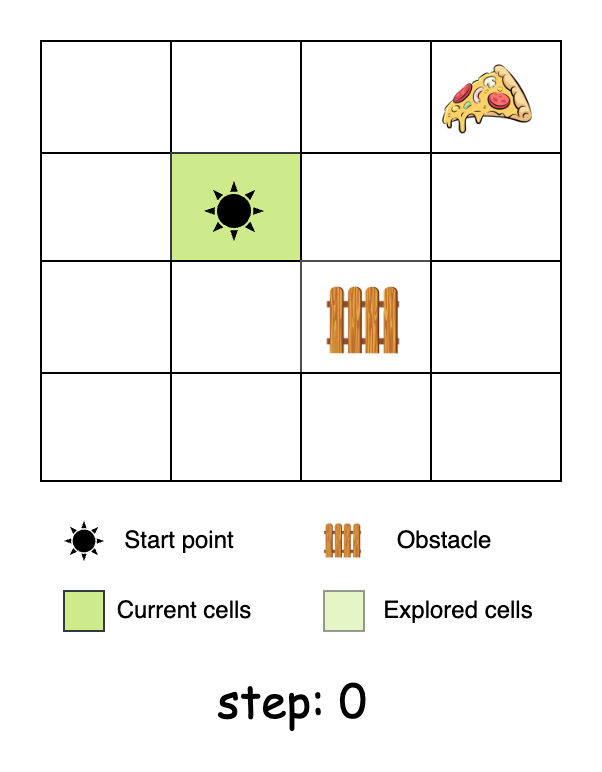
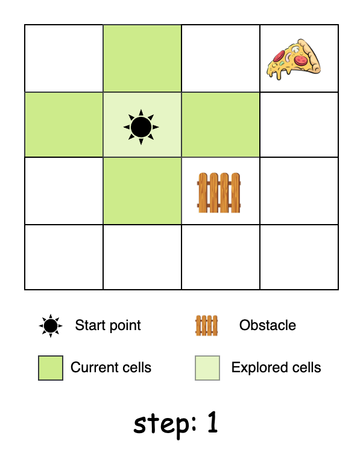
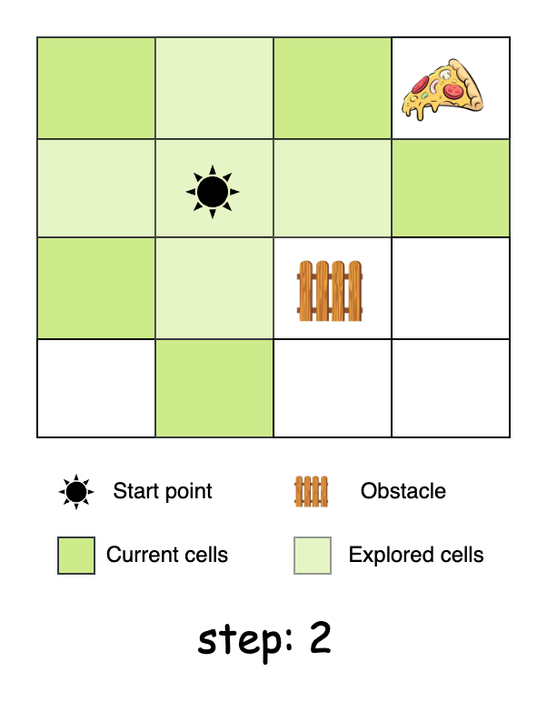
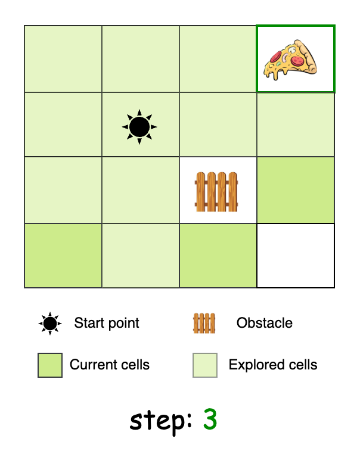

## Solution

---

### Approach 1: Breadth-First Search (BFS)

#### Intuition

Our task is to find the distance to the closest food cell from the starting cell among all the food cells present in the grid. Imagine the starting cell as the origin point, with "explorers" sent out to neighboring cells in all four directions: up, down, left, and right. This exploration happens in layers, where each layer represents a step farther from the starting point:
1. Layer 0: The starting cell.
2. Layer 1: The cells adjacent to the starting cell.
3. Layer 2: The cells two steps away, and so on.

This systematic exploration is called Breadth-First Search (BFS). BFS explores cells layer by layer, so when a food cell is found, it is guaranteed to be the closest one because all cells at shorter distances are processed first. This property makes BFS optimal for finding the shortest path in an unweighted grid. Think of it like ripples spreading out from a stone dropped in water - each ripple represents how far we've searched from the starting point.

Here's a short slideshow to visualize what this looks like:









To implement BFS, we use a queue which keeps track of the cells yet to be explored. We initialize the queue with the starting cell and proceed to run a loop while the queue is not empty (there are cells left to be explored). Inside the loop, we first get the size of the queue. This equates to the number of cells to be explored at this current level. We'll increment a step counter when all the cells in the current level are explored.

Now, we'll poll out the cell at the front of the queue and attempt to explore its neighbors. If a neighbor is valid (within the boundaries of the grid) and not blocked, we'll check if it contains a food cell. If it does, we've found the closest food cell and we can return the step counter as our answer. Otherwise, we'll mark the cell as visited and add it to the queue for future exploration.

If the BFS loop is completed, it means we have completed our exploration and could not find a single food cell. In that case, we return -1.

A natural question arises here: Why can't we use Depth-First Search (DFS) to find the shortest path?

DFS is not a good choice for this problem because of how it explores paths. It focuses on going as far as possible down one path before backtracking, which can lead to inefficiencies. For example, if food is just one cell away, DFS might explore a long, far-off path first, wasting time. Additionally, even when DFS finds a path to food, there's no guarantee it's the shortest one, as it might have missed a more direct route in another direction. In contrast, Breadth-First Search (BFS) checks all nearby paths level by level, making it more reliable for finding the shortest path.

> For a more comprehensive understanding of the Breadth-First Search algorithm, check out the [BFS Explore Card 🔗](https://leetcode.com/explore/learn/card/queue-stack/231/practical-application-queue/1376/). This resource provides an in-depth look at BFS, explaining its key concepts and applications with a variety of problems to solidify understanding of the pattern.

#### Algorithm

- Initialize a constant array of directions `dir` representing the possible moves: right `(0,1)`, left `(0,-1)`, up `(-1,0)`, and down `(1,0)`.

Main method `getFood`:
- Initialize variables `rows` and `cols` to store the dimensions of the input `grid`.
- Create a `start` array with `-1` values to store the coordinates of the starting position.
- Iterate through the `grid` to find the cell marked with `'*'`:
  - When found, store its coordinates in the `start` array.
- Initialize a `queue` data structure to perform BFS traversal.
- Add the `start` position to the `queue`.
- Initialize a variable `steps` to `1` to track the distance traveled.
- Begin the BFS traversal while the `queue` is not empty:
  - Store the current level size of the `queue`.
  - Process all cells at the current level:
- Remove the front position from the `queue`.
- For each of the four directions:
      - Calculate the new coordinates by adding the direction to the current position.
      - Check if the new position is valid (within bounds and not blocked):
- If the new position contains food (`'#'`), return the current steps.
- Otherwise, mark the cell as visited (`'X'`) and add it to the `queue`.
  - Increment the `steps` counter after processing all cells at the current level.
- If no food is found after the BFS completes, return `-1` to indicate no valid path exists.

Helper method `isValid(grid, row, col)`:
- Check if the given position is:
  - Within the grid's row boundaries
  - Within the grid's column boundaries
  - Not an obstacle (`'X'`)
- Return `true` if all conditions are met, `false` otherwise.

> Note: Our algorithm modifies the input matrix to mark cells as visited. However, some interviewers might view modifying the given input as poor practice. In such cases, you would need to create an additional `visited` matrix, which comes with the drawback of using extra space. Discuss the pros and cons of both methods with your interviewer for extra points.

#### Implementation

```python
class Solution:
    def getFood(self, grid: list[list[str]]) -> int:
        # Possible moves: right, left, up, down
        dirs = [(0, 1), (0, -1), (-1, 0), (1, 0)]
        rows, cols = len(grid), len(grid[0])

        # Find starting position marked as '*'
        start = next(
            (i, j)
            for i in range(rows)
            for j in range(cols)
            if grid[i][j] == "*"
        )

        # BFS queue for level-by-level traversal
        queue = deque([start])
        steps = 1

        # BFS traversal
        while queue:
            # Process all cells at current level
            for _ in range(len(queue)):
                row, col = queue.popleft()

                # Try all four directions
                for dx, dy in dirs:
                    new_row, new_col = row + dx, col + dy

                    if self._is_valid(grid, new_row, new_col):
                        # Found food
                        if grid[new_row][new_col] == "#":
                            return steps

                        # Mark as visited and add to queue
                        grid[new_row][new_col] = "X"
                        queue.append((new_row, new_col))
            steps += 1

        # No path found to food
        return -1

    # Check if position is within bounds and not blocked
    def _is_valid(self, grid: list[list[str]], row: int, col: int) -> bool:
        return (
            0 <= row < len(grid)
            and 0 <= col < len(grid[0])
            and grid[row][col] != "X"
        )
```

#### Complexity Analysis

Let $m$ be the number of rows and $n$ be the number of columns in the grid.

- Time complexity: $O(m \cdot n)$

    The BFS traversal visits each cell at most once. For each visited cell, we perform constant time operations (checking neighbors in four directions). Therefore, the time complexity is $O(m \cdot n)$.

- Space complexity: $O(m \cdot n)$

    The queue used for BFS traversal can store at most $m \times n$ cells in the worst case, where all cells are free space (`'O'`) and need to be visited. No additional data structures that grow with the input size are used. Therefore, the space complexity is $O(m \cdot n)$.

---

### Approach 2: A* Path Finding Algorithm

#### Intuition

In the previous approach, Breadth-First Search (BFS) worked as a blind search method, systematically exploring all nearby cells in layers until it found food. While BFS guarantees the shortest path in an unweighted grid, it doesn't differentiate between "promising" and "less promising" paths. A* Path-Finding improves upon this by incorporating a heuristic - a mathematical estimate of how close we are to the target - to prioritize exploration.

This heuristic allows us to focus on paths that are more likely to lead to food quickly, reducing unnecessary exploration and improving efficiency.

The heuristic we use is the Manhattan distance, which calculates the sum of the horizontal and vertical distances between the current cell and the food cell. It estimates how far a food cell is from the current position without considering obstacles.

$$
\begin{aligned}
    \text{Manhattan Distance} = |r_{\text{current}} - r_{\text{food}}| + |c_{\text{current}} - c_{\text{food}}|
\end{aligned}
$$

Each cell has a total cost, which is the sum of the number of steps taken so far (*actual cost*) and the Manhattan distance to the nearest food cell (*heuristic cost*). This total cost represents the estimated effort to reach a food cell starting from the initial position and passing through the current cell.

The exploration process remains similar to BFS, but with one key difference: instead of exploring cells in the order they're discovered, we prioritize the most promising paths. We'll implement this using a priority queue. Each element in the queue will store:
- A heuristic cost based on the Manhattan distance to the nearest food (total cost)
- The number of steps taken so far
- The current cell's coordinates (row and column)

The queue automatically sorts elements based on the lowest estimated cost, ensuring that promising paths are prioritized.

For each cell dequeued, examine its neighbors (north, south, east, and west). When we find a neighbor cell, we first check if it contains food. If it does, we can return the number of steps taken, confident that this is the shortest path since we always explore the most promising paths first. If it's not a food cell, we calculate its Manhattan distance to the nearest food cell and add this information (steps so far + heuristic) to the queue. This ensures that cells closer to food are explored before those farther away.

If we complete our grid exploration without finding a path to food, we return `-1` to indicate that no food cell is reachable from our starting position.

#### Algorithm

- Initialize a constant array of direction vectors `dir` representing the possible movements in four directions (right, left, up, down).

Main method `getFood`:
- Initialize:
  - variables `rows` and `cols` to store the dimensions of the input grid.
  - an array `start` to store the coordinates of the starting position.
  - a list `foods` to store the coordinates of all food cells.
- Iterate through each cell in the grid:
  - If a cell contains `'*'`, store its coordinates in the `start` array.
  - If a cell contains `'#'`, add its coordinates to the `foods` list.
- If the `foods` list is empty, return `-1` as no food cells exist.
- Initialize:
  - a boolean array `seen` to track visited cells and prevent cycles.
  - a priority queue `pq` that orders elements based on their total cost.
- Calculate the initial Manhattan distance from the start position to the nearest food.
- Add the initial state to the priority queue: [total cost, steps taken, row, column].
- While the priority queue is not empty:
  - Extract the current state from the queue.
  - For each possible direction:
- Calculate the new position coordinates.
- If the new position is invalid or already visited, skip it.
- If the new position contains food, return the current steps + 1.
- Otherwise:
      - Mark the current cell as visited.
      - Calculate the Manhattan distance from the new position to the nearest food.
      - Add the new state to the priority queue.
- Return `-1` if no path to food is found.

Helper method `calcDist(r, c, foods)`:
- Initialize `minDist` to the maximum possible integer value.
- For each food location:
  - Calculate the Manhattan distance to the current position.
  - Update `minDist` if the current distance is smaller.
- Return the minimum distance found.

Helper method `isValid(grid, r, c)`:
- Check if the given position is:
  - Within the grid's row boundaries
  - Within the grid's column boundaries
  - Not an obstacle (`'X'`)
- Return `true` if all conditions are met, `false` otherwise.

#### Implementation

```python
class Solution:
    # Direction vectors for up, down, left, right movement
    _DIRS = [(0, 1), (0, -1), (-1, 0), (1, 0)]

    def getFood(self, grid: list[list[str]]) -> int:
        rows, cols = len(grid), len(grid[0])
        start = None
        foods = []

        # Find starting position and all food locations
        for r in range(rows):
            for c in range(cols):
                if grid[r][c] == "*":
                    start = [r, c]
                elif grid[r][c] == "#":
                    foods.append([r, c])

        if not foods:
            return -1

        # Track visited cells to avoid cycles
        seen = set()

        # Priority queue stores: (estimated total cost, steps taken, row, col)
        pq = [
            (self._calc_dist(start[0], start[1], foods), 0, start[0], start[1])
        ]

        while pq:
            est_cost, steps, r, c = heapq.heappop(pq)

            # Try all four directions
            for dr, dc in self._DIRS:
                new_r, new_c = r + dr, c + dc

                if (
                    not self._is_valid(grid, new_r, new_c)
                    or (new_r, new_c) in seen
                ):
                    continue

                # If food found, return total steps taken
                if grid[new_r][new_c] == "#":
                    return steps + 1

                seen.add((new_r, new_c))
                # Calculate new Manhattan distance estimate
                new_est = self._calc_dist(new_r, new_c, foods)
                heapq.heappush(
                    pq, (new_est + steps + 1, steps + 1, new_r, new_c)
                )

        return -1

    # Calculate Manhattan distance to nearest food
    def _calc_dist(self, r: int, c: int, foods: list[list[int]]) -> int:
        return min(abs(food[0] - r) + abs(food[1] - c) for food in foods)

    # Check if position is within grid bounds and not an obstacle
    def _is_valid(self, grid: list[list[str]], r: int, c: int) -> bool:
        return (
            0 <= r < len(grid) and 0 <= c < len(grid[0]) and grid[r][c] != "X"
        )
```

#### Complexity Analysis

Let $m$ be the number of rows and $n$ be the number of columns in the grid.

- Time complexity: $O((m \cdot n)^2)$

    The initial grid traversal to find the start and food positions takes $O(m \cdot n)$ time. In the worst case, we might need to visit all cells in the grid. For each cell, we perform a heap operation which takes $O(\log(m \cdot n))$ time, and calculate the Manhattan distance to the food cells.

    The number of food cells is bounded by the grid size, making each distance calculation $O(m \cdot n)$. Therefore, for each cell visited, we spend $O(m \cdot n + \log(m \cdot n))$ time.

    Thus, the overall time complexity of the algorithm is $O(m \cdot n \cdot (m \cdot n + \log(m \cdot n)))$, which can be simplified to $O((m \cdot n)^2)$.

- Space complexity: $O(m \cdot n)$

    The `seen` array to track visited cells requires $O(m \cdot n)$ space. The priority queue, in the worst case where we need to visit all cells before finding food, will store $O(m \cdot n)$ states. The `foods` list stores coordinates of food cells, requiring at most $O(m \cdot n)$ space. Therefore, the total space complexity is $O(m \cdot n)$.

> Note: While the theoretical worst-case time complexity is large, the actual runtime will be significantly faster in practice. This is because the A* search algorithm with Manhattan distance heuristic guides the search towards food cells, typically exploring far fewer cells than a blind search would. The heuristic ensures that cells closer to food are explored first, often finding a path in near-linear time for typical grid configurations.

---