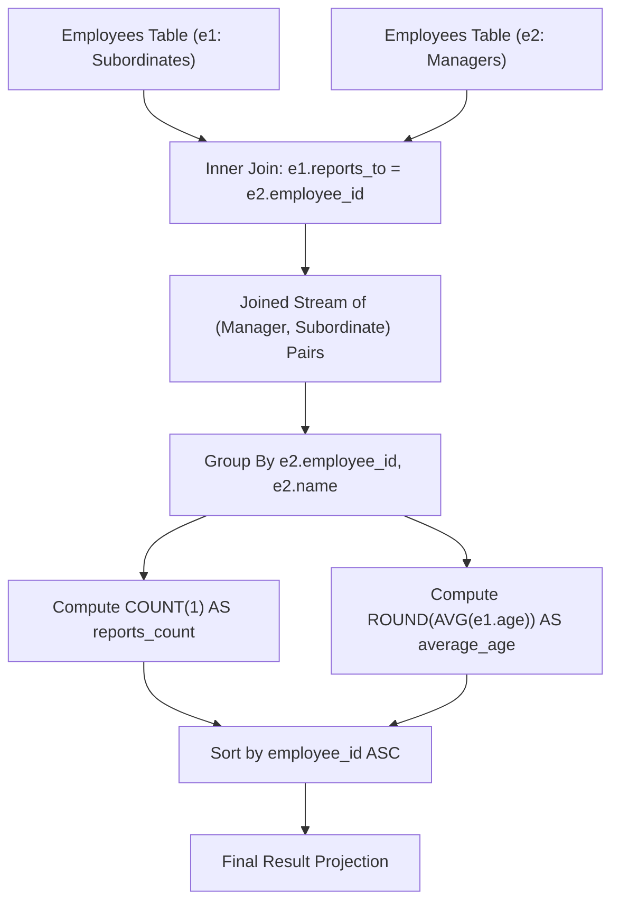

# Guided Example: The Number of Employees Which Report to Each Employee

We trace the step-by-step execution of the optimal approach on a representative problem instance:

- **Input Table (`Employees`):**
  | `employee_id` | `name` | `reports_to` | `age` |
  |---|---|---|---|
  | `9` | `Hercy` | `null` | `43` |
  | `6` | `Alice` | `9` | `41` |
  | `4` | `Bob` | `9` | `36` |
  | `2` | `Winston` | `null` | `37` |
- **Required Output:**
  | `employee_id` | `name` | `reports_count` | `average_age` |
  |---|---|---|---|
  | `9` | `Hercy` | `2` | `39` |

This instance contains root managers, reporting subordinates, and standalone individual contributors, demonstrating how self-joins isolate managerial relationships and aggregate subordinate attributes.

---

## 1. Instance & Teaching Goal

We are given an `Employees` table with attributes:
$$(\text{employee\_id} : \text{INT}, \text{name} : \text{VARCHAR}, \text{reports\_to} : \text{INT}, \text{age} : \text{INT})$$
where `employee_id` is the primary key. An employee is formally classified as a **manager** if and only if at least one other employee directly reports to them ($\text{reports\_to} = \text{manager's employee\_id}$).

The goal is to report:
1. `employee_id` and `name` of each manager
2. `reports_count`: total count of direct subordinates
3. `average_age`: mean age of direct subordinates rounded to the nearest integer
4. Ordered ascending by `employee_id`

An inner self-join between reporting employees ($e_1$) and their corresponding manager ($e_2$) on $e_1.\text{reports\_to} = e_2.\text{employee\_id}$ naturally filters out non-managers, while grouping by manager ID computes both required aggregates directly.

---

## 2. Conceptual Foundation & Invariants

### State Representation

| Relational Role | Table Alias | Primary Key Match | Target Attributes Extracted |
|---|---|---|---|
| Subordinate (Report) | $e_1$ | Foreign key: $e_1.\text{reports\_to}$ | $e_1.\text{age}$ for counting and averaging |
| Manager (Supervisor) | $e_2$ | Primary key: $e_2.\text{employee\_id}$ | $e_2.\text{employee\_id}, e_2.\text{name}$ for grouping and projection |

### Mathematical Invariants

> **Inner Join Manager Filtering Theorem.**
> Let $E$ be the set of all employee tuples. The inner equijoin:
> $$J = E_{e_1} \bowtie_{e_1.\text{reports\_to} = e_2.\text{employee\_id}} E_{e_2}$$
> satisfies:
> 1. If an employee $m \in E$ has zero subordinates, no tuple in $E_{e_1}$ has $e_1.\text{reports\_to} = m.\text{employee\_id}$. Hence $m$ produces zero joined rows and is excluded automatically.
> 2. If an employee has $k \ge 1$ subordinates, exactly $k$ joined rows exist with manager $e_2 = m$.
> 3. Subordinates with $\text{reports\_to} = \text{NULL}$ evaluate to false under the join equality, discarding unmanaged root nodes from the report role.

---

## 3. Step-by-Step Worked Execution

Given the 4 employee records:
- $E_1: (9, \text{Hercy}, \text{null}, 43)$
- $E_2: (6, \text{Alice}, 9, 41)$
- $E_3: (4, \text{Bob}, 9, 36)$
- $E_4: (2, \text{Winston}, \text{null}, 37)$

### Step 1: Execute Equijoin $e_1.\text{reports\_to} = e_2.\text{employee\_id}$

We inspect each potential subordinate row $e_1$:
1. $e_1 = (9, \text{Hercy})$: $\text{reports\_to} = \text{null} \implies$ No match in $e_2$.
2. $e_1 = (6, \text{Alice})$: $\text{reports\_to} = 9 \implies$ Matches $e_2 = (9, \text{Hercy})$.
   - Joined Tuple: $(e_2.\text{id}=9, e_2.\text{name}=\text{Hercy}, e_1.\text{id}=6, e_1.\text{age}=41)$
3. $e_1 = (4, \text{Bob})$: $\text{reports\_to} = 9 \implies$ Matches $e_2 = (9, \text{Hercy})$.
   - Joined Tuple: $(e_2.\text{id}=9, e_2.\text{name}=\text{Hercy}, e_1.\text{id}=4, e_1.\text{age}=36)$
4. $e_1 = (2, \text{Winston})$: $\text{reports\_to} = \text{null} \implies$ No match in $e_2$.

Intermediate joined relation $J$:
| $e_2.\text{employee\_id}$ | $e_2.\text{name}$ | $e_1.\text{employee\_id}$ | $e_1.\text{age}$ |
|---|---|---|---|
| $9$ | `Hercy` | $6$ | $41$ |
| $9$ | `Hercy` | $4$ | $36$ |

---

### Step 2: Group By Manager and Compute Aggregates

Grouping by $(e_2.\text{employee\_id}, e_2.\text{name})$ isolates a single partition:
- Key: $(9, \text{Hercy})$
- Subordinate ages: $\{41, 36\}$

1. **Subordinate Count:**
   $$\text{reports\_count} = \text{COUNT}(1) = 2$$
2. **Mean Age Calculation:**
   $$\text{AVG}(e_1.\text{age}) = \frac{41 + 36}{2} = \frac{77}{2} = 38.5$$
3. **Nearest Integer Rounding:**
   $$\text{ROUND}(38.5) = 39$$

---

### Step 3: Project and Order

With only one manager group present, sorting by $\text{employee\_id} = 9$ trivially maintains order.
Final tuple: `(9, "Hercy", 2, 39)`.

---

## 4. Complete Execution Trace

| Stage | Operation | Input / Condition | Resulting Tuples | Status |
|---|---|---|---|---|
| Join Filter | Scan $e_1$ | Evaluate $e_1.\text{reports\_to} \text{ IS NOT NULL}$ | Rows for Alice and Bob retained | Filter applied |
| Join Match | Match $e_2$ | $e_1.\text{reports\_to} = e_2.\text{employee\_id}$ | $(9, \text{Hercy}, 6, 41)$, $(9, \text{Hercy}, 4, 36)$ | $2$ joined records |
| Grouping | Group by Manager | Key: $(9, \text{Hercy})$ | 1 group formed | Group formed |
| Aggregation | $\text{COUNT}$ & $\text{ROUND}(\text{AVG})$ | $\text{count} = 2, \text{round}(38.5) = 39$ | $(9, \text{Hercy}, 2, 39)$ | Aggregates computed |
| Finalization | Sort by `employee_id` ASC | Single record with ID $9$ | Output table produced | Complete |

---

## 5. Algorithmic Mastery & Edge Surfacing

### Boundary and Edge Cases

| Scenario | Input Feature | Expected Behavior | Strategic Handling |
|---|---|---|---|
| No Managers in Company | All employees have $\text{reports\_to} = \text{null}$ | Empty result set | Equijoin yields 0 rows; returns empty table cleanly. |
| Multi-Level Hierarchy | Employee A manages B, B manages C | Both A and B appear in output | A appears with report B; B appears with report C; distinct group per manager. |
| Half-Integer Rounding | Average age evaluates to $X.5$ | Rounds to nearest integer ($X + 1$) | Relational $\text{ROUND}(\dots)$ standard round-half-up handles fractional age correctly. |
| Single Subordinate | Manager has exactly 1 direct report | Count is $1$, average is report's age | $\text{AVG}(a) = a$, $\text{ROUND}(a) = a$, $\text{COUNT} = 1$. |

### Invariant Maintenance & Why It Works

1. **Why Outer Join is Not Used:**
   Using a `LEFT JOIN` on $e_2 \bowtie e_1$ would keep employees who have 0 reports (producing NULLs for reports). The definition explicitly defines a manager as having at least 1 direct report. The inner join naturally enforces this restriction at zero extra cost.
2. **Subordinate Age Integrity:**
   The average is computed strictly over $e_1.\text{age}$ (the reporting employees' ages), completely excluding the manager's own age ($e_2.\text{age}$), fulfilling the contract requirement.

### Complexity Analysis

- **Time Complexity:** $\mathcal{O}(N \log N)$ where $N$ is the number of rows in `Employees`. Building the hash index for the equijoin takes $\mathcal{O}(N)$ time. Aggregation takes $\mathcal{O}(N)$ time, and sorting $M \le N$ managers by ID takes $\mathcal{O}(M \log M)$ time.
- **Space Complexity:** $\mathcal{O}(N)$ auxiliary working memory required by the query planner for hash join buckets and group accumulation tables.
