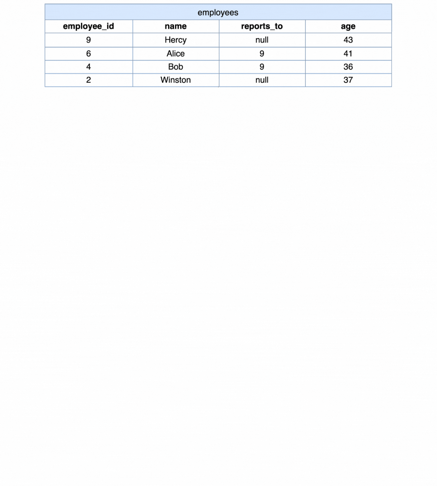

[TOC]

# Solution

---

## pandas

### Approach: Aggregation-Merge Rounding Strategy

Initially, this approach involves aggregating employee data to identify managerial roles and compute key metrics, such as the count of direct reports and their average age. This aggregation phase allows for the extraction of insightful summaries about the workforce distribution and demographics. Following this, the strategy employs a merge operation to reintegrate these summaries with the broader dataset, thereby appending meaningful context like manager names to the aggregated statistics. A critical aspect of this strategy is the implementation of a custom rounding technique designed to circumvent the limitations of banker's rounding. Banker's rounding, also known as round half to even, is a method where half values (e.g., 0.5) are rounded to the nearest even number to reduce bias in the sum of many rounded numbers. This technique minimizes cumulative rounding errors in statistical operations but may not always align with common rounding expectations, where 0.5 is traditionally rounded up. By adjusting the rounding method, it ensures that the average age calculations align more closely with intuitive expectations.

 **Visualization of Approach:**



#### Intuition

Let's review the intuition behind each step given the following input DataFrames:

Employees DataFrame (`employees`):

| employee_id | name    | reports_to | age |
| ----------- | ------- | ---------- | --- |
| 9           | Hercy   | null       | 43  |
| 6           | Alice   | 9          | 41  |
| 4           | Bob     | 9          | 36  |
| 2           | Winston | null       | 37  |
<br>

1. **Aggregation for Average Age**

- The first step involves grouping the data by the $\text{reports}_{to}$ field, which represents the manager each employee reports to. The goal here is to calculate two key metrics for each manager: the total number of direct reports ($\text{reports}_{count}$) and the average age of these reports ($\text{average}_{age}$). This aggregation is crucial for understanding the composition and demographics of teams within the organization.

```python
by_manager = employees.groupby('reports_to', as_index=False).agg(
    reports_count=('employee_id', 'size'),
    average_age=('age', 'mean')
)
```
- This step allows us to identify which employees are managers (those who have others reporting to them) and summarize the average age of their teams, laying the groundwork for further analysis.

$\text{by}_{manager}$:

| reports_to | reports_count | average_age |
|------------|---------------|-------------|
| 9          | 2             | 38.5        |
<br>

2. **Custom Rounding to Overcome Banker's Rounding**

- Banker's rounding can lead to counterintuitive results, especially when the average age is exactly halfway between two integers. To ensure the average age rounds in a way that aligns with common expectations (up from .5), we adjust the rounding process.

```python
by_manager['average_age'] = (by_manager['average_age'] + 1e-12).round(0)
```
- Adding a minuscule value before rounding ensures that values exactly at the half mark are always rounded up, thus addressing the potential issue of banker's rounding where such values might otherwise round to the nearest even number.

$\text{by}_{manager}$:

| reports_to | reports_count | average_age |
|------------|---------------|-------------|
| 9          | 2             | 39.0        |
<br>

3. **Merging Aggregated Data with Manager Names**

- Having aggregated the data, we now need to link each manager's ID back to their name for a more intuitive and informative output. This is achieved by merging the aggregated data with the original dataset based on the $\text{employee}_{id}$.

```python
merged = by_manager.merge(
    employees[['employee_id', 'name']],
    how='left',
    left_on='reports_to',
    right_on='employee_id'
)
```
- This step enriches the average age with human-readable information, specifically the names of the managers, making the final output more accessible and actionable for decision-making or reporting purposes.

`merged`:

| reports_to | reports_count | average_age | employee_id | name  |
|------------|---------------|-------------|-------------|-------|
| 9          | 2             | 39.0        | 9           | Hercy |
<br>

4. **Final Output Preparation**

- Finally, we need to prepare the output in a clear and structured format, selecting only the relevant columns and renaming them as necessary to match the expected output schema.

```python
merged.rename(
    columns={
        'employee_id_y': 'employee_id',  # This is the actual manager's ID
    },
    inplace=True
)
final_output = merged[['employee_id', 'name', 'reports_count', 'average_age']]
```
- The final step ensures that the output is presented in a user-friendly format, with each column clearly labeled to reflect its content—manager IDs, manager names, counts of direct reports, and their average age.

`merged`:

| employee_id | name  | reports_count | average_age |
| ----------- | ----- | ------------- | ----------- |
| 9           | Hercy | 2             | 39          |
<br>

#### Implementation

```python
import pandas as pd

def count_employees(employees: pd.DataFrame) -> pd.DataFrame:
    # Group employees by their manager to calculate the count of reports and the average age
    by_manager = employees.groupby("reports_to", as_index=False).agg(
        reports_count=("employee_id", "size"),  # Count of reports per manager
        average_age=("age", "mean"),  # Average age of reports
    )

    # Adjust for banker's rounding by adding a very small number before rounding
    by_manager["average_age"] = (by_manager["average_age"] + 1e-12).round(0)

    # Merge the aggregated data with the original employees DataFrame to get the names of managers
    merged = by_manager.merge(
        employees[["employee_id", "name"]],
        how="left",
        left_on="reports_to",
        right_on="employee_id",
    )

    # Since the merge introduces '_x' and '_y' suffixes for overlapping column names, correct this
    # Also, directly rename columns to match expected output format without intermediate steps
    merged.rename(
        columns={
            "employee_id_y": "employee_id",  # This is the actual manager's ID
        },
        inplace=True,
    )

    # Select the columns in the order that matches the expected output
    final_output = merged[["employee_id", "name", "reports_count", "average_age"]]

    return final_output

```

---

## Database

### Approach 1: Self Join

This SQL query is designed to identify managers within an organization, count how many employees report directly to each manager, and calculate the average age of these direct reports. The query operates on a single table, `employees`, which contains records of all employees, including their $\text{employee}_{id}$, `name`, age, and the $\text{employee}_{id}$ of their manager ($\text{reports}_{to}$).

The query effectively utilizes SQL's capabilities to perform a self-join on the `employees` table, enabling the identification of managers and the aggregation of direct report counts and average ages.

#### Intuition

Let's break down the SQL query step by step and explain the intuition behind each part:

1. **Join Operation**

- This step creates a self-join on the `employees` table. It essentially pairs each employee (`emp`) with their respective manager (`mgr`) by matching the $emp.\text{reports}_{to}$ field with $mgr.\text{employee}_{id}$. This join is necessary because both employee and manager information resides within the same table, and we need to link employees to their managers to compute the required statistics.

```sql
FROM employees emp JOIN employees mgr ON emp.reports_to = mgr.employee_id
```

- The self-join enables us to work with employee-manager pairs in the subsequent steps, facilitating the aggregation of data based on manager.

2. **Aggregation and Calculation**

- This part of the query selects the manager's $\text{employee}_{id}$ and `name`, counts the number of direct reports for each manager ($COUNT(emp.\text{employee}_{id}) AS \text{reports}_{count}$), and calculates the average age of these reports ($ROUND(AVG(\text{emp.age})) AS \text{average}_{age}$).

```sql
SELECT
  mgr.employee_id,
  mgr.name,
  COUNT(emp.employee_id) AS reports_count,
  ROUND(AVG(emp.age)) AS average_age
```

- **Manager Identification**: By selecting $mgr.\text{employee}_{id}$ and `mgr.name`, we ensure that the output will list managers, not all employees.
- **Reports Count**: $COUNT(emp.\text{employee}_{id})$ counts how many times each manager appears in employee-manager pairs, effectively counting the number of direct reports.
- **Average Age Calculation**: `ROUND(AVG(emp.age))` calculates the average age of the direct reports for each manager, rounding it to the nearest whole number for simplicity and readability.

3. **Grouping**

- This clause groups the results by the manager's $\text{employee}_{id}$. It ensures that the aggregation functions (`COUNT` and `AVG`) operate within each group, that is, for each manager, rather than on the entire dataset.

```sql
GROUP BY employee_id
```

- Without grouping by $\text{employee}_{id}$, we wouldn't be able to calculate the $\text{reports}_{count}$ and $\text{average}_{age}$ per manager. This step is crucial for performing the per-manager calculations required by the query.

4. **Ordering**

- Orders the final result set by the manager's $\text{employee}_{id}$. This is likely for presentation purposes, to make the data easier to read and to follow a logical sequence (usually ascending order by ID).

```sql
ORDER BY employee_id
```

- This is required by the problem statement, but also ordering the results makes the output systematic and easier to navigate, especially useful in scenarios where the dataset includes a large number of managers.

#### Implementation

```mysql []
SELECT
  mgr.employee_id,
  mgr.name,
  COUNT(emp.employee_id) AS reports_count,
  ROUND(
    AVG(emp.age)
  ) AS average_age
FROM
  employees emp
  JOIN employees mgr ON emp.reports_to = mgr.employee_id
GROUP BY
  employee_id
ORDER BY
  employee_id
```

### Approach 2: Correlated Sub-Query

This alternative SQL query also aims to list managers within an organization, the number of employees who report directly to each manager, and the average age of these reports. Unlike the previous approach that used a self-join, this solution employs a correlated subquery to fetch the manager's name and utilizes `GROUP BY` and `HAVING` clauses to aggregate and filter the data.

This alternative query leverages a mix of grouping, a correlated subquery for enhanced data retrieval, and conditional filtering to achieve its goal. By doing so, it provides a clear and efficient way to identify managers, count their direct reports, and calculate the average age of these reports, all while ensuring the output is neatly organized and focused only on those employees who are indeed managers.

#### Intuition

Let's break down the SQL query step by step and explain the intuition behind each part:

1. **Grouping by Manager**

- The query starts by selecting from the `employees` table (aliased as `e`) and groups the results by the `reports_to` column. This column indicates the manager each employee reports to, effectively grouping employees by their manager.

```sql
FROM employees e GROUP BY reports_to
```

- Grouping by `reports_to` is essential for calculating the count of direct reports and their average age for each manager. It organizes the data such that each group corresponds to a manager's direct reports.

2. **Selecting Manager ID and Name**

- This part of the query selects two pieces of information for each manager: their `employee_id` (using the `reports_to` column from the grouped data) and their name (using a correlated subquery).

```sql
SELECT
  reports_to AS employee_id,
  (
    SELECT name FROM employees e1 WHERE e.reports_to = e1.employee_id
  ) AS name,
```

- **Manager ID**: The `reports_to` column directly maps to the `employee_id` of the manager, so it's used to identify the manager.
- **Manager Name**: A correlated subquery fetches the name of each manager from the `employees` table by matching `e.reports_to` with `e1.employee_id`. This approach allows fetching related data without performing a join operation, which can be advantageous in terms of readability or performance.

3. **Calculating Reports Count and Average Age**

- For each group (i.e., each manager), this calculates the number of direct reports (`COUNT(reports_to)`) and the average age of these reports (`ROUND(AVG(age))`).

```sql
COUNT(reports_to) AS reports_count,
ROUND(AVG(age)) AS average_age
```

- **Reports Count**: Counting the `reports_to` occurrences within each group gives the number of employees reporting to each manager.
- **Average Age Calculation**: Calculating the average of `age` and rounding it provides a simple, readable metric of the average age of each manager's direct reports.

4. **Calculating Reports Count and Average Age**

- This clause filters the grouped results to include only those entries where the `reports_count` is greater than 0.

```sql
HAVING reports_count > 0
```

- This ensures that the query only returns records for actual managers (employees who have at least one direct report), excluding employees who do not manage anyone.

5. **Ordering Results**

- Orders the resulting records by `employee_id` (which, in this context, is the `reports_to` field renamed), ensuring a structured and predictable output.

```sql
ORDER BY employee_id
```

- This is required by the problem statement but also makes the results easier to read and understand, particularly useful when dealing with a large dataset.

#### Implementation

```mysql []
SELECT
  reports_to AS employee_id,
  (
    SELECT
      name
    FROM
      employees e1
    WHERE
      e.reports_to = e1.employee_id
  ) AS name,
  COUNT(reports_to) AS reports_count,
  ROUND(
    AVG(age)
  ) AS average_age
FROM
  employees e
GROUP BY
  reports_to
HAVING
  reports_count > 0
ORDER BY
  employee_id
```