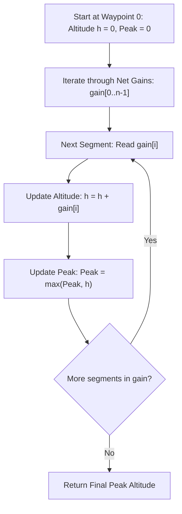

# Guided Example: Find the Highest Altitude

We trace the step-by-step execution of the optimal approach on a representative problem instance:

- **Input:** `gain = [-5, 1, 5, 0, -7]`
- **Required Output:** `1`

This instance features negative, positive, and zero altitude gains across multiple consecutive legs, illustrating how running prefix sum evaluation tracks elevation profiles and identifies the peak altitude in linear time and constant auxiliary space.

---

## 1. Instance & Teaching Goal

A cyclist starts a journey at point $0$ with an initial altitude of $h_0 = 0$. The road trip spans $n$ consecutive road segments connecting $n + 1$ waypoints. For each segment $i$ ($0 \le i < n$), `gain[i]` represents the net vertical change in altitude between waypoint $i$ and waypoint $i + 1$.

We are tasked with determining the highest altitude reached among all $n + 1$ waypoints:
$$\max_{0 \le k \le n} h_k$$

A naive approach might materialize the entire array of $n + 1$ altitudes in memory before scanning for the maximum. The optimal single-pass method computes the prefix sum on the fly while dynamically maintaining the running maximum, achieving optimal $\mathcal{O}(n)$ time and $\mathcal{O}(1)$ space.

---

## 2. Conceptual Foundation & Invariants

### State Representation

| Component | Definition | Initial Value |
|---|---|---|
| Current Altitude $h_k$ | Absolute elevation at waypoint $k$: $h_k = h_{k-1} + \text{gain}[k-1]$ | $h_0 = 0$ |
| Peak Altitude $h^*$ | Maximum elevation observed so far: $\max_{0 \le i \le k} h_i$ | $0$ |

### Mathematical Invariants

> **Prefix Sum Telescoping Recurrence.**
> The altitude at waypoint $k \in \{1, \dots, n\}$ is given by the discrete telescoping summation of gains:
> $$h_k = h_0 + \sum_{j=0}^{k-1} \text{gain}[j] = \sum_{j=0}^{k-1} \text{gain}[j]$$
> The recurrence satisfies:
> $$h_k = h_{k-1} + \text{gain}[k-1]$$

> **Running Extremum Invariant.**
> At step $k$, the candidate maximum satisfies:
> $$h^*(k) = \max \left( h^*(k-1), h_k \right)$$
> Upon completing all $n$ transitions, $h^*(n) = \max_{0 \le k \le n} h_k$, which is guaranteed to be globally maximal.

---

## 3. Step-by-Step Worked Execution

We process `gain = [-5, 1, 5, 0, -7]` of length $n = 5$, tracing $n + 1 = 6$ waypoints:

### Initial Waypoint $0$
- Point Index: $0$
- Current Altitude $h_0 = 0$
- Peak Altitude $h^* = 0$

---

### Segment $0$: $\text{gain}[0] = -5$
- Transition: $h_1 = h_0 + \text{gain}[0] = 0 + (-5) = -5$
- Peak Update: $h^* = \max(0, -5) = 0$
- Status: Below sea level; peak remains $0$ at start point.

---

### Segment $1$: $\text{gain}[1] = 1$
- Transition: $h_2 = h_1 + \text{gain}[1] = -5 + 1 = -4$
- Peak Update: $h^* = \max(0, -4) = 0$
- Status: Climbing upward, but still below initial start altitude.

---

### Segment $2$: $\text{gain}[2] = 5$
- Transition: $h_3 = h_2 + \text{gain}[2] = -4 + 5 = 1$
- Peak Update: $h^* = \max(0, 1) = 1$
- Status: New record elevation reached at waypoint $3$ ($h_3 = 1$).

---

### Segment $3$: $\text{gain}[3] = 0$
- Transition: $h_4 = h_3 + \text{gain}[3] = 1 + 0 = 1$
- Peak Update: $h^* = \max(1, 1) = 1$
- Status: Flat plateau; altitude and peak remain $1$.

---

### Segment $4$: $\text{gain}[4] = -7$
- Transition: $h_5 = h_4 + \text{gain}[4] = 1 + (-7) = -6$
- Peak Update: $h^* = \max(1, -6) = 1$
- Status: Steep descent; peak remains locked at $1$.

---

## 4. Complete Execution Trace

| Waypoint $k$ | Net Gain Applied | Current Altitude $h_k$ | Running Peak $\max_{0 \le j \le k} h_j$ | New Peak Established? |
|---|---|---|---|---|
| $0$ | None (Start) | $0$ | $0$ | Initial Baseline |
| $1$ | $-5$ | $-5$ | $0$ | No |
| $2$ | $+1$ | $-4$ | $0$ | No |
| $3$ | $+5$ | $+1$ | $+1$ | **Yes (New Peak: 1)** |
| $4$ | $0$ | $+1$ | $+1$ | No (Ties Peak) |
| $5$ | $-7$ | $-6$ | $+1$ | No |

Final maximum altitude across all waypoints is $\mathbf{1}$.

---

## 5. Algorithmic Mastery & Edge Surfacing

### Boundary and Edge Cases

| Scenario | Input Example | Expected Output | Strategic Handling |
|---|---|---|---|
| Strictly Negative Gains | `[-4, -3, -2, -1]` | `0` | Every subsequent point is negative; the starting point altitude $0$ remains optimal. |
| Strictly Positive Gains | `[2, 3, 5]` | $10$ | Running altitude increases monotonically; peak is reached at the terminal waypoint. |
| Minimal Input ($n = 1$) | `[-10]` | `0` | Points are $0$ and $-10$; max is $0$. |
| Zero Gain Loop | `[0, 0, 0]` | `0` | Altitude stays flat at $0$ across all points. |

### Invariant Maintenance & Why It Works

1. **Inclusion of Waypoint $0$:**
   The start point elevation ($0$) is always a valid waypoint. Initializing the peak accumulator to $0$ guarantees that even if all gains are negative, the answer correctly defaults to $0$.
2. **Single-Pass Streamability:**
   Because each waypoint altitude depends solely on the immediate previous altitude and the current gain ($h_k = h_{k-1} + \Delta$), there is no need to store intermediate elevations.

### Complexity Analysis

- **Time Complexity:** $\mathcal{O}(n)$ where $n$ is the length of `gain`. We perform exactly one addition and one comparison per gain element.
- **Space Complexity:** $\mathcal{O}(1)$ auxiliary space, requiring only two numeric registers to track the current altitude and the maximum altitude.
