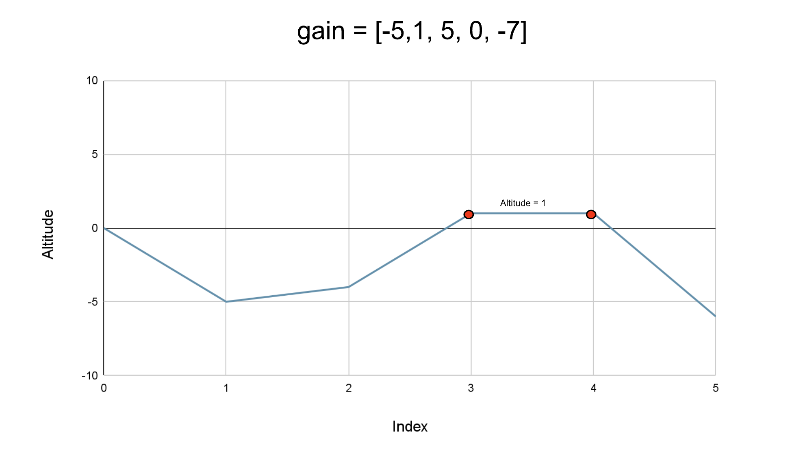

## Solution

---

### Approach: Prefix Sum

**Intuition**

We start from the altitude `0` and we have a list of $N$ integers, where each integer represents the gain in altitude at each step (it could be negative as well, which implies a fall in altitude) a biker takes. We need to return the highest altitude of the biker in the complete journey, including the starting point at `0`.

This can be solved by taking the maximum altitudes at each step in the journey. The altitude at a step can be determined as the altitude at the previous step plus the gain at the current step. Hence, we will start from `0` and keep adding the gain in altitude to it at each step, and after each addition, we will update the maximum altitude we have seen so far.



If we observe closely, the altitude at a point is the sum of gains on the left of it, which is nothing but the prefix sum at this index. Therefore, we can find the prefix sum and return the maximum as the highest reached altitude.

**Algorithm**

1. Initialize the variable `currentAltitude` to `0`; this is the current altitude of the biker.
2. Initialize the variable `highestPoint` to `currentAltitude`, as the highest altitude we have seen is `0`.
3. Iterate over the gain in altitude in the list `gain` and add the current gain `altitudeGain` to the variable `currentAltitude`.
4. Update the variable `highestPoint` as necessary.
5. Return `highestPoint`.

**Implementation**

```python
class Solution:
    def largestAltitude(self, gain: List[int]) -> int:
        current_altitude = 0
        # Highest altitude currently is 0.
        highest_point = current_altitude

        for altitude_gain in gain:
            # Adding the gain in altitude to the current altitude.
            current_altitude += altitude_gain
            # Update the highest altitude.
            highest_point = max(highest_point, current_altitude)

        return highest_point
```

**Complexity Analysis**

Here, $N$ is the number of integers in the list `gain`.

* Time complexity: $O(N)$.

  We iterate over every integer in the list `gain` only once, and hence the total time complexity is equal to $O(N)$.

* Space complexity: $O(1)$.

  We only need two variables, `currentAltitude` and`highestPoint`; hence the space complexity is constant.
  <br/>

---