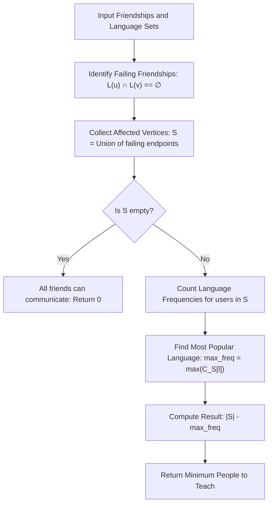

# Guided Example: Minimum Number of People to Teach

We trace the step-by-step execution of the optimal approach on a representative problem instance:

- **Input:**
  - Total Languages: $n = 2$
  - Language Sets: `languages = [[1], [2], [1, 2]]` (1-indexed people $1, 2, 3$)
  - Friendship Graph: `friendships = [[1, 2], [1, 3], [2, 3]]`
- **Required Output:** `1`

This instance contains a triad of friendships where one pair cannot communicate while the other two pairs share languages, demonstrating how isolating the failing friendship subgraph reduces the global teaching decision to a single frequency maximization.

---

## 1. Instance & Teaching Goal

In a community of $m$ users and $n$ available languages, each user $i$ speaks a set of languages $L(i)$. Two users $u$ and $v$ can communicate if and only if they share at least one language:
$$L(u) \cap L(v) \neq \emptyset$$

We are permitted to select exactly **one** global target language $\ell^* \in \{1, \dots, n\}$ and teach it to any subset of users. After teaching, every pair of friends $(u, v) \in \text{friendships}$ must be able to communicate. The goal is to minimize the total number of people taught.

A brute-force simulation tests teaching subsets across all people, resulting in an intractable exponential search space. The optimal insight recognizes two structural properties:
1. Friendships that already communicate never break, regardless of what is taught.
2. For every friendship that currently cannot communicate, **both** endpoints must speak the selected language $\ell^*$.

---

## 2. Conceptual Foundation & Invariants

### State Representation

| Component | Definition | Initial State |
|---|---|---|
| Failing Friendships $E_{\text{fail}}$ | Pairs $(u, v) \in \text{friendships}$ where $L(u) \cap L(v) = \emptyset$ | Identified via intersection scan |
| Affected People Set $S$ | Union of vertices in $E_{\text{fail}}$: $\bigcup_{(u, v) \in E_{\text{fail}}} \{u, v\}$ | Collected unique user IDs |
| Language Frequencies $C[\ell]$ | Count of users in $S$ who already speak language $\ell$ | Frequency map across $\ell \in \{1, \dots, n\}$ |

### Mathematical Invariants

> **Failing Friendship Vertex Union Theorem.**
> Let $(u, v) \in \text{friendships}$ be a pair that cannot currently communicate ($L(u) \cap L(v) = \emptyset$). To establish communication between $u$ and $v$ using a single chosen language $\ell^*$, both $u$ and $v$ must possess $\ell^*$ in their spoken repertoire.
> Therefore, every user in:
> $$S = \bigcup_{(u, v) \in E_{\text{fail}}} \{u, v\}$$
> must know language $\ell^*$. Any person outside $S$ is already able to communicate across all their friendships and does not require teaching.

> **Complementary Majority Language Invariant.**
> If language $\ell$ is chosen as the universal teaching language, every person in $S$ who does not already speak $\ell$ must be taught. The number of people to teach for a fixed $\ell$ is:
> $$\text{Cost}(\ell) = |S| - |\{ p \in S : \ell \in L(p) \}|$$
> Minimizing $\text{Cost}(\ell)$ is equivalent to maximizing the existing knowledge of $\ell$ within $S$:
> $$\text{MinCost} = |S| - \max_{1 \le \ell \le n} C_S[\ell]$$
> where $C_S[\ell]$ is the number of individuals in $S$ who already speak language $\ell$.

---

## 3. Step-by-Step Worked Execution

Given $n = 2$, 3 people, and 3 friendships:
- Person 1: $L(1) = \{1\}$
- Person 2: $L(2) = \{2\}$
- Person 3: $L(3) = \{1, 2\}$
- Friendships: $(1, 2)$, $(1, 3)$, $(2, 3)$

### Step 1: Filter Friendships by Existing Communication

We test each friendship pair for common languages:

| Friendship $(u, v)$ | Language Set $L(u)$ | Language Set $L(v)$ | Intersection $L(u) \cap L(v)$ | Can Communicate? | Action |
|---|---|---|---|---|---|
| $(1, 2)$ | $\{1\}$ | $\{2\}$ | $\emptyset$ | **No** | Add $1$ and $2$ to $S$ |
| $(1, 3)$ | $\{1\}$ | $\{1, 2\}$ | $\{1\} \neq \emptyset$ | Yes | Disregard |
| $(2, 3)$ | $\{2\}$ | $\{1, 2\}$ | $\{2\} \neq \emptyset$ | Yes | Disregard |

Result of Phase 1:
- Failing friendships: $E_{\text{fail}} = \{(1, 2)\}$
- Set of affected users: $S = \{1, 2\}$
- Cardinality: $|S| = 2$

---

### Step 2: Tally Language Proficiencies Within Affected Set $S$

We inspect the languages spoken by each person in $S = \{1, 2\}$:

| Person $p \in S$ | Spoken Languages | Contributions to Frequencies |
|---|---|---|
| Person $1$ | $\{1\}$ | Language $1$ count $+1$ |
| Person $2$ | $\{2\}$ | Language $2$ count $+1$ |

Resulting language counts in $S$:
- Language $1$: $C_S[1] = 1$ (Person 1)
- Language $2$: $C_S[2] = 1$ (Person 2)

---

### Step 3: Evaluate Optimal Language Selection

We compare teaching costs for each candidate language $\ell \in \{1, 2\}$:

1. **Option A: Teach Language $1$:**
   - Person 1 already speaks language $1$.
   - Person 2 must be taught language $1$.
   - Total people taught: $|S| - C_S[1] = 2 - 1 = 1$.
   - Outcome: Person 2 learns 1. Friendships $(1, 2)$ now share language 1; existing friendships remain intact.

2. **Option B: Teach Language $2$:**
   - Person 1 must be taught language $2$.
   - Person 2 already speaks language $2$.
   - Total people taught: $|S| - C_S[2] = 2 - 1 = 1$.
   - Outcome: Person 1 learns 2. Friendships $(1, 2)$ now share language 2.

Both options yield cost $1$. The minimum number of people to teach is $\mathbf{1}$.

---

## 4. Complete Execution Trace

| Phase | Evaluation | Details / Values | State Summary |
|---|---|---|---|
| Pre-check | Pair $(1, 2)$ | $\{1\} \cap \{2\} = \emptyset$ | $S \leftarrow \{1, 2\}$ |
| Pre-check | Pair $(1, 3)$ | $\{1\} \cap \{1, 2\} = \{1\}$ | Already communicating |
| Pre-check | Pair $(2, 3)$ | $\{2\} \cap \{1, 2\} = \{2\}$ | Already communicating |
| Tally | Person 1 languages | Knows $\{1\}$ | $C_S[1] = 1$ |
| Tally | Person 2 languages | Knows $\{2\}$ | $C_S[2] = 1$ |
| Optimization | $\max C_S[\ell]$ | $\max(C_S[1], C_S[2]) = 1$ | Peak overlap = 1 |
| Conclusion | Subtract from $\|S\|$ | $|S| - \max C_S = 2 - 1 = 1$ | Result: 1 |

---

## 5. Algorithmic Mastery & Edge Surfacing

### Boundary and Edge Cases

| Scenario | Input Characteristic | Expected Result | Strategic Handling |
|---|---|---|---|
| All Friends Communicate Initially | Every pair shares $\ge 1$ language | `0` | $S = \emptyset$; $|S| = 0$, immediately returns $0$. |
| No Friends Communicate | Disjoint languages across all pairs | $|S| - \text{max\_freq}$ | All connected endpoints collected; selects globally most frequent language. |
| Single Friendship | One pair with no common language | `1` | Pair has size $2$; each person knows $\ge 1$ language, max frequency is at least $1 \implies 2 - 1 = 1$. |
| Completely Isolated Component | People with no friendships | Not in $S$ | Isolated people never participate in failing friendships and are never taught. |

### Invariant Maintenance & Why It Works

1. **Why Unaffected People Are Excluded:**
   People not in $S$ are already capable of communicating across all of their listed friendships. Even if an unaffected person does not know the chosen language $\ell^*$, their existing friendships remain valid via whatever mutual language they already shared.
2. **Monotonic Non-Deleterious Teaching:**
   Teaching a language to a user expands their language set: $L'(u) = L(u) \cup \{\ell^*\}$. Since $L(u) \subseteq L'(u)$, any pre-existing intersection $L(u) \cap L(w)$ is preserved ($L(u) \cap L(w) \subseteq L'(u) \cap L'(w)$). Therefore, teaching can never break previously working communications.

### Complexity Analysis

- **Time Complexity:** $\mathcal{O}(F \cdot L_{\max}^2 + |S| \cdot L_{\max} + n)$ where $F$ is the number of friendships, $|S| \le m$ is the number of affected users, and $L_{\max} \le n$ is the maximum number of languages spoken by any single person. Checking pairwise intersections takes $\mathcal{O}(F \cdot L_{\max}^2)$. Tallying frequencies in $S$ takes $\mathcal{O}(|S| \cdot L_{\max})$.
- **Space Complexity:** $\mathcal{O}(m + n)$ auxiliary space to store the set $S$ of affected users and the language frequency array $C_S$.
