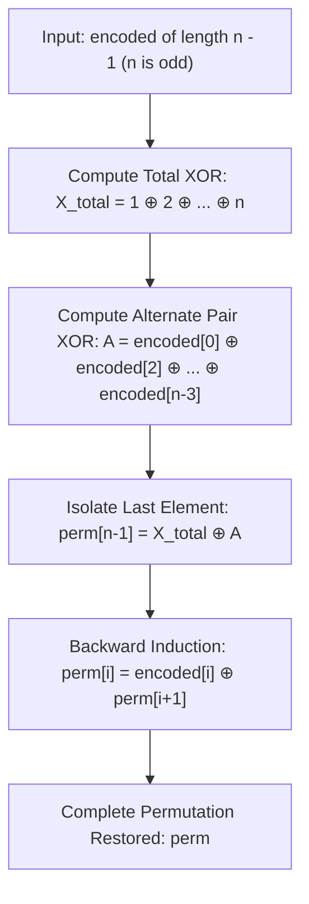

# Guided Example: Decode XORed Permutation

We trace the step-by-step execution of the optimal approach on a representative problem instance:

- **Input:** `encoded = [6, 5, 4, 6]`
- **Required Output:** `[2, 4, 1, 5, 3]`

This instance features an odd permutation of length $n = 5$ with non-trivial bitwise interactions across multiple pairs, demonstrating how global permutation properties isolate a boundary value and enable linear-time backward reconstruction.

---

## 1. Instance & Teaching Goal

We are given an integer array `encoded` of length $n - 1$, where `encoded[i] = perm[i] XOR perm[i + 1]`. The original array `perm` is known to be a permutation of the first $n$ positive integers $\{1, 2, \dots, n\}$, and $n$ is guaranteed to be **odd**.

Our goal is to reconstruct the exact permutation `perm`.

A naive attempt to guess `perm[0]` and simulate forward requires testing $n$ candidates, which costs $\mathcal{O}(n^2)$ time. The optimal method leverages two mathematical insights:
1. Since `perm` is a permutation of $\{1, \dots, n\}$, the total XOR sum $X_{\text{total}} = \bigoplus_{k=1}^n k$ is directly known.
2. Because $n$ is odd, $n - 1$ is even. Grouping consecutive disjoint pairs of adjacent elements in `encoded` covers all elements of `perm` except one terminal element, isolating that element in a single step.

---

## 2. Conceptual Foundation & Invariants

### State Representation

| Component | Mathematical Definition | Role |
|---|---|---|
| Total Permutation XOR $X_{\text{total}}$ | $\bigoplus_{k=1}^n k$ | XOR sum of all numbers in $\{1, \dots, n\}$ |
| Disjoint Pair XOR Sum $A$ | $\bigoplus_{j=0, 2, 4, \dots}^{n-3} \text{encoded}[j]$ | XOR sum of the prefix of $n - 1$ elements: $\bigoplus_{i=0}^{n-2} \text{perm}[i]$ |
| Terminal Value $\text{perm}[n - 1]$ | $X_{\text{total}} \oplus A$ | Isolated boundary element |
| Decoded Array $\text{perm}$ | Array of length $n$ | Final restored permutation |

### Mathematical Invariants

> **Alternating Pairwise XOR Sum Theorem.**
> For any odd integer $n$, the length of `encoded` is an even integer $n - 1$. Summing the alternate entries at even indices yields:
> $$A = \text{encoded}[0] \oplus \text{encoded}[2] \oplus \dots \oplus \text{encoded}[n-3]$$
> Expanding each term using $\text{encoded}[j] = \text{perm}[j] \oplus \text{perm}[j+1]$ gives:
> $$A = (\text{perm}[0] \oplus \text{perm}[1]) \oplus (\text{perm}[2] \oplus \text{perm}[3]) \oplus \dots \oplus (\text{perm}[n-3] \oplus \text{perm}[n-2])$$
> This sum contains every element of `perm` from index $0$ through $n-2$ exactly once, leaving only $\text{perm}[n-1]$ missing.

> **Boundary Value Isolation Invariant.**
> Because $x \oplus x = 0$ for all integers $x$:
> $$X_{\text{total}} \oplus A = \left( \bigoplus_{i=0}^{n-1} \text{perm}[i] \right) \oplus \left( \bigoplus_{i=0}^{n-2} \text{perm}[i] \right) = \text{perm}[n-1]$$
> Once $\text{perm}[n-1]$ is known, every preceding element is uniquely determined by the backward recurrence:
> $$\text{perm}[i] = \text{encoded}[i] \oplus \text{perm}[i+1] \quad \text{for } i = n-2, n-3, \dots, 0$$

---

## 3. Step-by-Step Worked Execution

For `encoded = [6, 5, 4, 6]`:
- Length of `encoded` is $4 \implies n = 4 + 1 = 5$ (odd).
- Permutation elements are $\{1, 2, 3, 4, 5\}$.

### Step 1: Compute Total Permutation XOR ($X_{\text{total}}$)

We XOR all numbers in $\{1, 2, 3, 4, 5\}$:
- $1 \oplus 2 = 3$
- $3 \oplus 3 = 0$
- $0 \oplus 4 = 4$
- $4 \oplus 5 = 1$

$$X_{\text{total}} = 1$$

---

### Step 2: Compute Disjoint Pair XOR Sum ($A$)

We take even-indexed entries of `encoded` (indices $0$ and $2$):
- $\text{encoded}[0] = 6 = \text{perm}[0] \oplus \text{perm}[1]$
- $\text{encoded}[2] = 4 = \text{perm}[2] \oplus \text{perm}[3]$

$$A = \text{encoded}[0] \oplus \text{encoded}[2] = 6 \oplus 4 = 2$$

Notice that $A = \text{perm}[0] \oplus \text{perm}[1] \oplus \text{perm}[2] \oplus \text{perm}[3]$.

---

### Step 3: Isolate Terminal Element $\text{perm}[4]$

Using the Boundary Isolation Invariant:
$$\text{perm}[4] = X_{\text{total}} \oplus A = 1 \oplus 2 = 3$$

The terminal element is confirmed: $\text{perm}[4] = 3$.

---

### Step 4: Backward Propagation

Using $\text{perm}[i] = \text{encoded}[i] \oplus \text{perm}[i+1]$:

1. **For $i = 3$:**
   $$\text{perm}[3] = \text{encoded}[3] \oplus \text{perm}[4] = 6 \oplus 3 = 5$$
2. **For $i = 2$:**
   $$\text{perm}[2] = \text{encoded}[2] \oplus \text{perm}[3] = 4 \oplus 5 = 1$$
3. **For $i = 1$:**
   $$\text{perm}[1] = \text{encoded}[1] \oplus \text{perm}[2] = 5 \oplus 1 = 4$$
4. **For $i = 0$:**
   $$\text{perm}[0] = \text{encoded}[0] \oplus \text{perm}[1] = 6 \oplus 4 = 2$$

Assembled array: $\text{perm} = [2, 4, 1, 5, 3]$.

---

## 4. Complete Execution Trace

| Step | Target Expression | Bitwise Operation | Resulting Value | Verification |
|---|---|---|---|---|
| $1$ | $X_{\text{total}}$ | $1 \oplus 2 \oplus 3 \oplus 4 \oplus 5$ | $1$ | Complete set XOR |
| $2$ | $A$ | $\text{encoded}[0] \oplus \text{encoded}[2] = 6 \oplus 4$ | $2$ | Covers indices $0, 1, 2, 3$ |
| $3$ | $\text{perm}[4]$ | $X_{\text{total}} \oplus A = 1 \oplus 2$ | $3$ | Terminal element |
| $4$ | $\text{perm}[3]$ | $\text{encoded}[3] \oplus \text{perm}[4] = 6 \oplus 3$ | $5$ | Valid element $\in [1, 5]$ |
| $5$ | $\text{perm}[2]$ | $\text{encoded}[2] \oplus \text{perm}[3] = 4 \oplus 5$ | $1$ | Valid element $\in [1, 5]$ |
| $6$ | $\text{perm}[1]$ | $\text{encoded}[1] \oplus \text{perm}[2] = 5 \oplus 1$ | $4$ | Valid element $\in [1, 5]$ |
| $7$ | $\text{perm}[0]$ | $\text{encoded}[0] \oplus \text{perm}[1] = 6 \oplus 4$ | $2$ | All elements unique |

Result: `[2, 4, 1, 5, 3]`.

---

## 5. Algorithmic Mastery & Edge Surfacing

### Boundary and Edge Cases

| Scenario | Input Feature | Expected Output | Strategic Handling |
|---|---|---|---|
| Minimal Odd Length ($n = 3$) | `encoded = [3, 1]` | `[1, 2, 3]` | Alternate sum uses only `encoded[0]`; $X_{\text{total}} = 0$, $\text{perm}[2] = 0 \oplus 3 = 3$. |
| Identity Permutation | `perm = [1, 2, 3, 4, 5]` | `encoded = [3, 1, 7, 1]` | Decodes properly back to sequential numbers. |
| Large $n$ ($n \le 10^5$) | $n$ up to $10^5$ | Linear reconstruction | Standard $\mathcal{O}(1)$ cycle formula for $\bigoplus_{k=1}^n k$ can be used if desired. |

### Invariant Maintenance & Why It Works

1. **Why $n$ Must Be Odd:**
   If $n$ were even, $n - 1$ would be odd. An odd number of adjacent XOR terms cannot be partitioned into disjoint pairs covering all but one element. The parity of $n$ guarantees that $(n - 1) / 2$ non-overlapping pairs cleanly consume $n - 1$ elements of the permutation.
2. **Uniqueness Guarantee:**
   Because each step is an exact XOR inversion with zero free parameters, the solution is uniquely determined from the algebraic identity.

### Complexity Analysis

- **Time Complexity:** $\mathcal{O}(n)$ where $n$ is the length of `perm` ($n = \text{len}(\text{encoded}) + 1$). Computing $X_{\text{total}}$ takes $\mathcal{O}(n)$ steps, computing $A$ takes $\mathcal{O}(n)$ steps, and the backward pass performs $n - 1$ operations.
- **Space Complexity:** $\mathcal{O}(n)$ auxiliary space to allocate the reconstructed output array `perm`.
