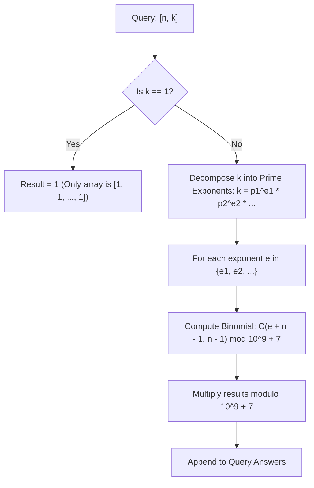

# Guided Example: Count Ways to Make Array With Product

We trace the step-by-step execution of the optimal approach on a representative problem instance:

- **Input:** `queries = [[2, 6], [5, 1], [73, 660]]`
- **Required Output:** `[4, 1, 50734910]`

This instance spans unit products ($k = 1$), small composite numbers ($k = 6$), and multi-prime factorizations with high multiplicities and larger array lengths ($n = 73, k = 660$), demonstrating how prime exponent decomposition and Stars-and-Bars combinatorics solve each query in time proportional to the number of prime factors.

---

## 1. Instance & Teaching Goal

We are given multiple independent queries of the form $[n, k]$. For each query, we must find the number of distinct positive integer arrays $[a_1, a_2, \dots, a_n]$ of length $n$ whose total product equals $k$:
$$\prod_{i=1}^n a_i = k \quad (a_i \ge 1)$$
All results must be computed modulo $10^9 + 7$.

A naive recursive search that partitions $k$ into divisors branches exponentially $\mathcal{O}(k^n)$. The optimal number-theoretic approach uses the Fundamental Theorem of Arithmetic:
- Each positive integer $k$ has a unique canonical prime factorization $k = \prod p_j^{e_j}$.
- Because distinct primes cannot divide or combine into one another, distributing the exponents of each prime across the $n$ array slots is completely independent.
- For each prime factor $p_j$ with multiplicity $e_j$, distributing $e_j$ identical prime copies across $n$ distinct positions is equivalent to the classical **Stars and Bars** multichoose problem: $\binom{e_j + n - 1}{n - 1}$.

---

## 2. Conceptual Foundation & Invariants

### State Representation

| Mathematical Component | Definition | Role |
|---|---|---|
| Factorial Tables $F[m], G[m]$ | $m! \pmod{10^9 + 7}$ and $(m!)^{-1} \pmod{10^9 + 7}$ | $\mathcal{O}(1)$ computation of $\binom{N}{K}$ |
| Prime Exponent Multiset $E(k)$ | Multiplicities $\{e_1, e_2, \dots, e_m\}$ in $k = \prod p_j^{e_j}$ | Precomputed or factored per query |
| Query Answer | $\prod_{e \in E(k)} \binom{e + n - 1}{n - 1} \pmod{10^9 + 7}$ | Independent product combination |

### Mathematical Invariants

> **Prime Exponent Orthogonality Theorem.**
> Let $k = p_1^{e_1} p_2^{e_2} \cdots p_m^{e_m}$ be the unique prime factorization of $k$. Every valid array of positive integers $a_1, \dots, a_n$ satisfying $\prod_{i=1}^n a_i = k$ corresponds uniquely to expressing each element as:
> $$a_i = p_1^{c_{i, 1}} p_2^{c_{i, 2}} \cdots p_m^{c_{i, m}}$$
> where each exponent $c_{i, j}$ is a non-negative integer. The product constraint $\prod_{i=1}^n a_i = k$ is equivalent to $m$ decoupled linear Diophantine systems:
> $$\sum_{i=1}^n c_{i, j} = e_j \quad \text{for each prime } p_j \ (1 \le j \le m)$$
> Since these equations share no variables across different primes $j$, the total number of solutions is the product of the solutions to each individual equation:
> $$\text{Total Ways} = \prod_{j=1}^m \mathcal{N}(e_j, n)$$

> **Stars and Bars Multichoose Invariant.**
> The number of non-negative integer solutions to $\sum_{i=1}^n c_i = e$ corresponds to placing $e$ identical items into $n$ distinct bins, given by the binomial coefficient:
> $$\mathcal{N}(e, n) = \binom{e + n - 1}{n - 1} = \binom{e + n - 1}{e}$$
> For $k = 1$, the exponent set is empty, and the empty product evaluates to $1$.

---

## 3. Step-by-Step Worked Execution

We process `queries = [[2, 6], [5, 1], [73, 660]]`:

### Query 1: $[n = 2, k = 6]$

1. **Prime Factorization:**
   $$6 = 2^1 \times 3^1$$
   - Prime $2$: exponent $e_1 = 1$
   - Prime $3$: exponent $e_2 = 1$

2. **Stars-and-Bars Binomial Evaluation:**
   - For prime $2$ ($e_1 = 1, n = 2$):
     $$\binom{1 + 2 - 1}{2 - 1} = \binom{2}{1} = 2$$
     (Possible exponent distributions across $(a_1, a_2)$: $(1, 0)$ or $(0, 1)$)
   - For prime $3$ ($e_2 = 1, n = 2$):
     $$\binom{1 + 2 - 1}{2 - 1} = \binom{2}{1} = 2$$
     (Possible exponent distributions across $(a_1, a_2)$: $(1, 0)$ or $(0, 1)$)

3. **Total Ways:**
   $$2 \times 2 = 4$$
   The $4$ explicit arrays are:
   - $(2^1 \cdot 3^1, 2^0 \cdot 3^0) = (6, 1)$
   - $(2^1 \cdot 3^0, 2^0 \cdot 3^1) = (2, 3)$
   - $(2^0 \cdot 3^1, 2^1 \cdot 3^0) = (3, 2)$
   - $(2^0 \cdot 3^0, 2^1 \cdot 3^1) = (1, 6)$

---

### Query 2: $[n = 5, k = 1]$

1. **Prime Factorization:**
   $k = 1$ has no prime factors; exponent set $E(1) = \emptyset$.
2. **Evaluation:**
   The empty product evaluates to $1$.
   The unique valid array is $[1, 1, 1, 1, 1]$.
   Total ways: $\mathbf{1}$.

---

### Query 3: $[n = 73, k = 660]$

1. **Prime Factorization of $660$:**
   $$660 = 2^2 \times 3^1 \times 5^1 \times 11^1$$
   Exponents:
   - $e = 2$ for prime $2$
   - $e = 1$ for prime $3$
   - $e = 1$ for prime $5$
   - $e = 1$ for prime $11$

2. **Evaluate Individual Prime Binomial Factors with $n = 73$:**
   - **For prime $2$ ($e = 2$):**
     $$\binom{2 + 73 - 1}{73 - 1} = \binom{74}{72} = \binom{74}{2} = \frac{74 \times 73}{2} = 37 \times 73 = 2701$$
   - **For prime $3$ ($e = 1$):**
     $$\binom{1 + 73 - 1}{73 - 1} = \binom{73}{72} = \binom{73}{1} = 73$$
   - **For prime $5$ ($e = 1$):**
     $$\binom{1 + 73 - 1}{73 - 1} = \binom{73}{1} = 73$$
   - **For prime $11$ ($e = 1$):**
     $$\binom{1 + 73 - 1}{73 - 1} = \binom{73}{1} = 73$$

3. **Composite Product Modulo $10^9 + 7$:**
   $$\text{Total} = 2701 \times 73 \times 73 \times 73 = 2701 \times 389017 = 1050734917$$
   $$\text{Total} \pmod{10^9 + 7} = 1050734917 - 1000000007 = \mathbf{50734910}$$

---

## 4. Complete Execution Trace

| Query | Parameters $(n, k)$ | Prime Exponent Decomposition | Combinatorial Factors $\binom{e + n - 1}{n - 1}$ | Product Modulo $10^9 + 7$ |
|---|---|---|---|---|
| $1$ | $(2, 6)$ | $\{2^1, 3^1\}$ | $\binom{2}{1} \times \binom{2}{1} = 2 \times 2$ | $4$ |
| $2$ | $(5, 1)$ | $\emptyset$ | Empty product | $1$ |
| $3$ | $(73, 660)$ | $\{2^2, 3^1, 5^1, 11^1\}$ | $\binom{74}{2} \times \binom{73}{1}^3 = 2701 \times 389017$ | $50734910$ |

Final Output: `[4, 1, 50734910]`.

---

## 5. Algorithmic Mastery & Edge Surfacing

### Boundary and Edge Cases

| Scenario | Input Feature | Expected Output | Strategic Handling |
|---|---|---|---|
| Unit Target ($k = 1$) | Any $n \ge 1, k = 1$ | $1$ | All array entries must equal $1$; empty exponent set yields $1$. |
| Unit Array Length ($n = 1$) | Any $k \ge 1, n = 1$ | $1$ | $\binom{e + 1 - 1}{1 - 1} = \binom{e}{0} = 1$ for all exponents; the only valid array is $[k]$. |
| Prime Power ($k = p^e$) | $k = 2^{10}$ | $\binom{e + n - 1}{n - 1}$ | Single binomial factor evaluated. |
| Maximum Bound Constraints | $n \le 10^4, k \le 10^4$ | Handled in $\mathcal{O}(1)$ per query | Since $k \le 10^4$, total prime factors $\le \lfloor \log_2 10^4 \rfloor = 13$; max combination index $\le 10013$. |

### Invariant Maintenance & Why It Works

1. **Why Prime Factors Are Decoupled:**
   By unique prime factorization, any integer $a_i$ is uniquely specified by the tuple of exponents on the prime factors of $k$. Multiplying integers sums their respective exponents on each prime independently. No constraint bridges prime $p_a$ to prime $p_b$.
2. **Precomputed Factorials:**
   Precomputing factorials and inverse factorials up to $M = 10020$ allows evaluating $\binom{e + n - 1}{e}$ in $\mathcal{O}(1)$ time using Fermat's Little Theorem.

### Complexity Analysis

- **Time Complexity:** $\mathcal{O}(M + K \log \log K + Q \cdot \omega(k))$ where $M \approx 10020$, $K \le 10^4$, $Q$ is the number of queries, and $\omega(k) \le 13$ is the number of prime factors of $k$.
  - Precomputing factorials and sieve/prime factorization up to $10^4$ takes $\mathcal{O}(K \log \log K)$.
  - Answering each query requires at most $13$ modular multiplications, taking $\mathcal{O}(\omega(k))$ time per query.
- **Space Complexity:** $\mathcal{O}(M + K)$ auxiliary space for factorial tables and precomputed prime exponent lists.
