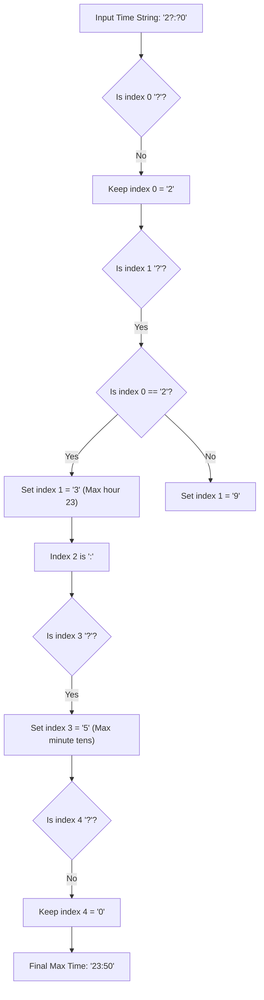

# Guided Example: Latest Time by Replacing Hidden Digits

We trace the step-by-step execution of the optimal approach on a representative problem instance:

- **Input:** `time = "2?:?0"`
- **Required Output:** `"23:50"`

This instance features hidden digits across both the hour and minute blocks under conditional range constraints (hour tens fixed to `2`, limiting hour units to at most `3`), illustrating how positional greedy dominance resolves masked characters in deterministic linear time.

---

## 1. Instance & Teaching Goal

We are given a 5-character string `time` in the 24-hour format `"HH:MM"`, where some digits may be replaced by the wildcard character `'?'`. The valid time domain requires:
- Hours: $\text{HH} \in [00, 23]$
- Minutes: $\text{MM} \in [00, 59]$

Our objective is to find the latest valid 24-hour time by replacing each `'?'` with an optimal digit $d \in [0, 9]$.

Because numbers in standard positional base-10 systems satisfy $10 \cdot d_1 + d_0 > 10 \cdot d_1' + d_0'$ whenever $d_1 > d_1'$, maximizing the more significant digits takes absolute precedence over less significant digits. A greedy position-by-position assignment from left to right yields the provably maximal time.

---

## 2. Conceptual Foundation & Invariants

### State Representation

| Index | Component | Valid Domain | Dependency / Constraint |
|---|---|---|---|
| $0$ | Hour Tens ($H_1$) | $\{0, 1, 2\}$ | Dependent on $H_0$: cannot be $2$ if $H_0 \in [4, 9]$ |
| $1$ | Hour Units ($H_0$) | $\{0, \dots, 9\}$ | Dependent on $H_1$: bounded by $3$ if $H_1 = 2$; bounded by $9$ if $H_1 \in \{0, 1\}$ |
| $2$ | Separator | $\{':'\}$ | Constant delimiter |
| $3$ | Minute Tens ($M_1$) | $\{0, \dots, 5\}$ | Independent: bounded by $5$ |
| $4$ | Minute Units ($M_0$) | $\{0, \dots, 9\}$ | Independent: bounded by $9$ |

### Mathematical Invariants

> **Positional Digit Dominance Theorem.**
> Let $T_1 = 60 \cdot H_1 + M_1$ and $T_2 = 60 \cdot H_2 + M_2$ be two times in minutes since midnight. The total time function is strictly monotonically increasing with respect to lexicographical digit comparisons from most significant to least significant. Therefore, independently selecting the maximum valid digit at each position from left to right maximizes the overall numerical timestamp.

> **Coupled Hour Digit Constraints.**
> Unlike the minute block where $M_1$ and $M_0$ are completely decoupled, the hour digits $H_1$ and $H_0$ must jointly satisfy $10 \cdot H_1 + H_0 \le 23$:
> - If $H_1 = '?'$: $H_1 \leftarrow 2$ if $H_0 \in \{'?', 0, 1, 2, 3\}$, else $H_1 \leftarrow 1$ (if $H_0 \in [4, 9]$).
> - If $H_0 = '?'$: $H_0 \leftarrow 3$ if $H_1 = 2$, else $H_0 \leftarrow 9$ (if $H_1 \in \{0, 1\}$).

---

## 3. Step-by-Step Worked Execution

We trace `time = "2?:?0"`:

### Step 1: Evaluate Hour Tens (Index 0)
- Observed Character: `'2'`
- Action: Already explicitly specified; retained as `'2'`.

---

### Step 2: Evaluate Hour Units (Index 1)
- Observed Character: `'?'`
- Rule: Look at resolved hour tens ($H_1 = '2'$).
- Boundary Check: Since $H_1 = '2'$, a digit $\ge 4$ would form hours $\ge 24$ (invalid).
- Optimal Assignment: $H_0 \leftarrow '3'$.
- Resolved Hour: `"23"`.

---

### Step 3: Delimiter (Index 2)
- Observed Character: `':'`
- Retained unchanged.

---

### Step 4: Evaluate Minute Tens (Index 3)
- Observed Character: `'?'`
- Rule: Valid minutes span $00$ to $59$, so tens digit cannot exceed $5$.
- Optimal Assignment: $M_1 \leftarrow '5'$.

---

### Step 5: Evaluate Minute Units (Index 4)
- Observed Character: `'0'`
- Action: Explicitly specified; retained as `'0'`.
- Resolved Minute: `"50"`.

---

## 4. Complete Execution Trace

| Position Index | Component | Initial Value | Applicable Constraint | Maximized Assignment | Running Form |
|---|---|---|---|---|---|
| $0$ | Hour Tens | `'2'` | Given constant | `'2'` | `"2"` |
| $1$ | Hour Units | `'?'` | $H_1 = '2' \implies \max \text{digit} = 3$ | `'3'` | `"23"` |
| $2$ | Delimiter | `':'` | Fixed syntax | `':'` | `"23:"` |
| $3$ | Minute Tens | `'?'` | $\max \text{digit} = 5$ | `'5'` | `"23:5"` |
| $4$ | Minute Units | `'0'` | Given constant | `'0'` | `"23:50"` |

Final output string: `"23:50"`.

---

## 5. Algorithmic Mastery & Edge Surfacing

### Boundary and Edge Cases

| Scenario | Input Example | Expected Output | Strategic Handling |
|---|---|---|---|
| Both Hour Digits Hidden | `"??"` (e.g. `"??:30"`) | `"23:30"` | $H_1$ sees $H_0 = '?' \implies H_1 \leftarrow 2$; then $H_0$ sees $H_1 = 2 \implies H_0 \leftarrow 3$. |
| Hour Units $\ge 4$ Hidden Tens | `"?4:00"` | `"14:00"` | Tens digit cannot be $2$ (24 is invalid); must be capped at $1$. |
| Completely Masked Time | `"??:??"` | `"23:59"` | Generates the global maximum 24-hour timestamp. |
| Fully Known Time | `"12:34"` | `"12:34"` | No wildcards encountered; returns original string unmodified. |

### Invariant Maintenance & Why It Works

1. **Order of Hour Resolution:**
   Resolving $H_1$ before $H_0$ allows $H_1$ to peek at $H_0$. If $H_0$ is already known to be $\ge 4$, $H_1$ is safely assigned $1$ rather than $2$. When $H_0$ is subsequently evaluated, $H_1$ is already finalized, allowing $H_0$ to choose either $3$ or $9$ unambiguously.
2. **Independence of Minutes:**
   Because any minute in $[00, 59]$ is valid regardless of the hour, minute digits are completely uncoupled from hour digits and can always take their absolute maximum theoretical values ($5$ and $9$).

### Complexity Analysis

- **Time Complexity:** $\mathcal{O}(1)$. The input string has a fixed length of $5$ characters. Checking each condition requires a constant number of elementary operations.
- **Space Complexity:** $\mathcal{O}(1)$ auxiliary space, operating within a fixed 5-character buffer.
