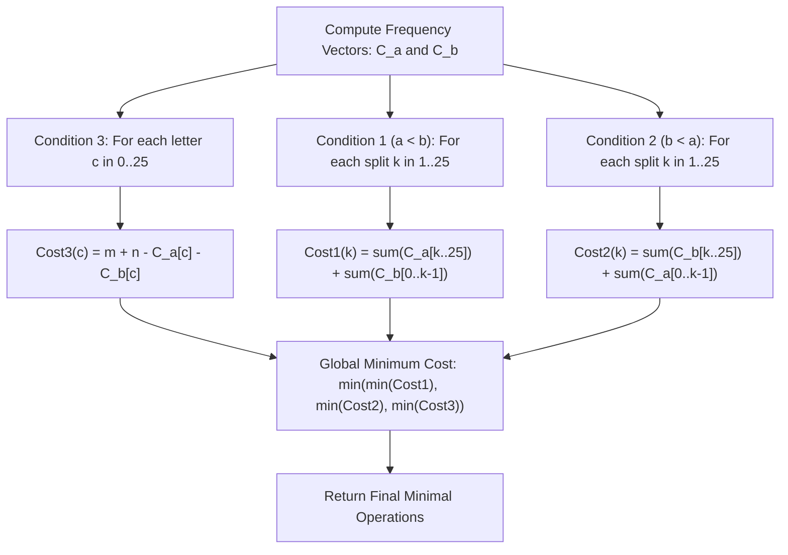

# Guided Example: Change Minimum Characters to Satisfy One of Three Conditions

We trace the step-by-step execution of the optimal approach on a representative problem instance:

- **Input:** `a = "aba"`, `b = "caa"`
- **Required Output:** `2`

This instance features non-uniform character distributions across two strings where both condition 1 (making all characters of `a` strictly less than `b`) and condition 3 (unifying all characters to a single letter) yield viable minimal configurations, illustrating how frequency reduction and boundary prefix testing evaluate all three target states in linear time.

---

## 1. Instance & Teaching Goal

Given two lowercase alphabetical strings `a` (length $m$) and `b` (length $n$), we can perform arbitrary single-character substitutions. We must find the minimum number of character modifications to achieve at least **one** of the following three objectives:
1. **Strictly Less ($a < b$):** Every character in `a` is strictly less than every character in `b` in the alphabet.
2. **Strictly Greater ($b < a$):** Every character in `b` is strictly less than every character in `a` in the alphabet.
3. **Uniformity ($a = b = c$):** Both `a` and `b` consist of only one distinct letter, and that letter is identical across both strings.

A brute-force approach iterating over all combinations of character changes across length $m + n$ results in an intractable exponential search. Because the operation cost is purely determined by character identity regardless of character position in the string, the optimal method aggregates both strings into 26-element letter frequency vectors and evaluates all $25 + 25 + 26 = 76$ possible partition boundaries in $\mathcal{O}(m + n + |\Sigma|)$ time.

---

## 2. Conceptual Foundation & Invariants

### State Representation

| Component | Definition | Dimensions / Range |
|---|---|---|
| Frequency Vector $C_a$ | Occurrences of each letter in `a`: $C_a[0 \dots 25]$ | Size $26$, indexed $0 \equiv \text{'a'}$ to $25 \equiv \text{'z'}$ |
| Frequency Vector $C_b$ | Occurrences of each letter in `b`: $C_b[0 \dots 25]$ | Size $26$ |
| Partition Boundary $k$ | Alphabet split threshold between $k - 1$ and $k$ | $k \in \{1, \dots, 25\}$ |
| Minimal Cost Variable | Running minimum across all evaluated configurations | Initialized to $m + n$ |

### Mathematical Invariants

> **Alphabet Boundary Threshold Partitioning Theorem.**
> To satisfy Condition 1 (every letter in $a$ is strictly less than every letter in $b$), there must exist an alphabet split point $k \in \{1, \dots, 25\}$ such that all letters in $a$ belong to $\{0, \dots, k-1\}$ and all letters in $b$ belong to $\{k, \dots, 25\}$.
> The minimum operations required for a fixed split $k$ is:
> $$\text{Cost}_1(k) = \sum_{j=k}^{25} C_a[j] + \sum_{j=0}^{k-1} C_b[j]$$
> Similarly, for Condition 2 ($b < a$):
> $$\text{Cost}_2(k) = \sum_{j=k}^{25} C_b[j] + \sum_{j=0}^{k-1} C_a[j]$$
> Split points $k = 0$ and $k = 26$ are strictly disallowed because no letter can be strictly less than `'a'` or strictly greater than `'z'`.

> **Single-Letter Unification Invariant.**
> To satisfy Condition 3 (both strings consist exclusively of a single identical character $c \in \{0, \dots, 25\}$), every character not equal to $c$ must be transformed into $c$:
> $$\text{Cost}_3(c) = (m - C_a[c]) + (n - C_b[c]) = m + n - C_a[c] - C_b[c]$$
> Minimizing $\text{Cost}_3$ is equivalent to choosing the character $c$ that maximizes the joint frequency $C_a[c] + C_b[c]$.

---

## 3. Step-by-Step Worked Execution

Given `a = "aba"` ($m = 3$) and `b = "caa"` ($n = 3$):
- Character counts for `a`: $C_a[\text{'a'}] = 2$, $C_a[\text{'b'}] = 1$, all other letters $0$.
- Character counts for `b`: $C_b[\text{'a'}] = 2$, $C_b[\text{'c'}] = 1$, all other letters $0$.
- Total characters: $m + n = 6$.

---

### Step 1: Evaluate Condition 3 (Uniformity to a Single Character)

We compute $\text{Cost}_3(c) = 6 - C_a[c] - C_b[c]$ for every lowercase letter:

| Target Letter $c$ | $C_a[c]$ | $C_b[c]$ | Total Retained $C_a[c] + C_b[c]$ | Operations Required ($6 - \text{Retained}$) |
|---|---|---|---|---|
| `'a'` | $2$ | $2$ | $4$ | $6 - 4 = \mathbf{2}$ |
| `'b'` | $1$ | $0$ | $1$ | $6 - 1 = 5$ |
| `'c'` | $0$ | $1$ | $1$ | $6 - 1 = 5$ |
| Others (`'d'`–`'z'`) | $0$ | $0$ | $0$ | $6 - 0 = 6$ |

- Optimal choice for Condition 3: Select `'a'`. Change `'b'` in string $a$ to `'a'` (1 operation); change `'c'` in string $b$ to `'a'` (1 operation).
- Best cost for Condition 3: $\mathbf{2}$.

---

### Step 2: Evaluate Condition 1 ($a < b$)

All letters in $a$ must be $< k$; all letters in $b$ must be $\ge k$.
Testing key boundary candidates $k \in \{1, \dots, 25\}$:

- **Threshold $k = 1$ (letters in $a < \text{'b'}$, letters in $b \ge \text{'b'}$):**
  - Letters in $a \ge \text{'b'}$: $C_a[\text{'b'}] = 1$. Must be changed.
  - Letters in $b < \text{'b'}$: $C_b[\text{'a'}] = 2$. Must be changed.
  - Cost: $1 + 2 = 3$.

- **Threshold $k = 2$ (letters in $a < \text{'c'}$, letters in $b \ge \text{'c'}$):**
  - Letters in $a \ge \text{'c'}$: $0$. (All of $a$ is `'a'` and `'b'`, already $< \text{'c'}$).
  - Letters in $b < \text{'c'}$: $C_b[\text{'a'}] + C_b[\text{'b'}] = 2 + 0 = 2$.
  - Cost: $0 + 2 = \mathbf{2}$.

- **Threshold $k = 3$ (letters in $a < \text{'d'}$, letters in $b \ge \text{'d'}$):**
  - Letters in $a \ge \text{'d'}$: $0$.
  - Letters in $b < \text{'d'}$: $C_b[\text{'a'}] + C_b[\text{'c'}] = 2 + 1 = 3$.
  - Cost: $0 + 3 = 3$.

- Best cost for Condition 1: $\mathbf{2}$ (achieved at threshold $k = 2$).

---

### Step 3: Evaluate Condition 2 ($b < a$)

All letters in $b$ must be $< k$; all letters in $a$ must be $\ge k$:

- **Threshold $k = 1$ (letters in $b < \text{'b'}$, letters in $a \ge \text{'b'}$):**
  - Letters in $b \ge \text{'b'}$: $C_b[\text{'c'}] = 1$.
  - Letters in $a < \text{'b'}$: $C_a[\text{'a'}] = 2$.
  - Cost: $1 + 2 = 3$.

- **Threshold $k = 2$ (letters in $b < \text{'c'}$, letters in $a \ge \text{'c'}$):**
  - Letters in $b \ge \text{'c'}$: $C_b[\text{'c'}] = 1$.
  - Letters in $a < \text{'c'}$: $C_a[\text{'a'}] + C_a[\text{'b'}] = 2 + 1 = 3$.
  - Cost: $1 + 3 = 4$.

- Best cost for Condition 2: $3$.

---

### Step 4: Determine Global Minimum

$$\min \Big( \text{Cost}_1^* = 2, \; \text{Cost}_2^* = 3, \; \text{Cost}_3^* = 2 \Big) = \mathbf{2}$$

---

## 4. Complete Execution Trace

| Category | Evaluation Target | Calculation Breakdown | Operations | Status |
|---|---|---|---|---|
| Condition 3 | Target Letter `'a'` | Change $1$ char in $a$ (`'b'` $\to$ `'a'`), $1$ char in $b$ (`'c'` $\to$ `'a'`) | $2$ | Candidate best |
| Condition 3 | Target Letter `'b'` | $6 - 1 = 5$ | $5$ | Suboptimal |
| Condition 1 | Split $k = 1$ (`'b'`) | $1$ char in $a$ $\ge \text{'b'}$, $2$ chars in $b$ $< \text{'b'}$ | $3$ | Suboptimal |
| Condition 1 | Split $k = 2$ (`'c'`) | $0$ chars in $a$ $\ge \text{'c'}$, $2$ chars in $b$ $< \text{'c'}$ | $2$ | Candidate best |
| Condition 2 | Split $k = 1$ (`'b'`) | $1$ char in $b$ $\ge \text{'b'}$, $2$ chars in $a$ $< \text{'b'}$ | $3$ | Suboptimal |
| Global Selection | $\min(2, 3, 2)$ | Minimal across all branches | $2$ | Final Answer |

---

## 5. Algorithmic Mastery & Edge Surfacing

### Boundary and Edge Cases

| Scenario | Configuration | Expected Outcome | Strategic Handling |
|---|---|---|---|
| Already Satisfied ($a < b$) | $a = \text{"aaa"}, b = \text{"bbb"}$ | `0` | Split $k = 1$ gives $0 + 0 = 0$ operations. |
| Single-Letter Identical Strings | $a = \text{"z"}, b = \text{"z"}$ | `0` | Condition 3 with $c = \text{'z'}$ yields $1 + 1 - 1 - 1 = 0$. |
| Extreme Alphabet Letters | Strings containing only `'a'` or `'z'` | Handled correctly | Boundary splits $k \in [1, 25]$ prevent creating invalid characters below `'a'` or above `'z'`. |
| Disjoint Long Strings | Strings of length $10^5$ | Efficient execution | Frequency arrays reduce string scan to $\mathcal{O}(m + n)$; checking $76$ splits takes $\mathcal{O}(1)$. |

### Invariant Maintenance & Why It Works

1. **Why Boundary $k$ Excludes 0 and 26:**
   For $a < b$, every letter in $a$ must be strictly less than every letter in $b$. If all letters in $a$ were $< \text{'a'}$, no lowercase letters could satisfy it. Similarly, no letter in $b$ can be $> \text{'z'}$. Hence, valid boundary splits are strictly confined to $\{1, \dots, 25\}$.
2. **Prefix Sum Optimization:**
   Prefix and suffix sums over the 26-element frequency arrays compute each split cost in $\mathcal{O}(1)$ time, guaranteeing optimal efficiency.

### Complexity Analysis

- **Time Complexity:** $\mathcal{O}(m + n + |\Sigma|)$ where $m = |a|$, $n = |b|$, and $|\Sigma| = 26$. Populating $C_a$ and $C_b$ takes linear time $\mathcal{O}(m + n)$. Evaluating all 76 candidate conditions takes $\mathcal{O}(|\Sigma|)$ time.
- **Space Complexity:** $\mathcal{O}(|\Sigma|) = \mathcal{O}(1)$ auxiliary space to store the fixed 26-element frequency vectors.
