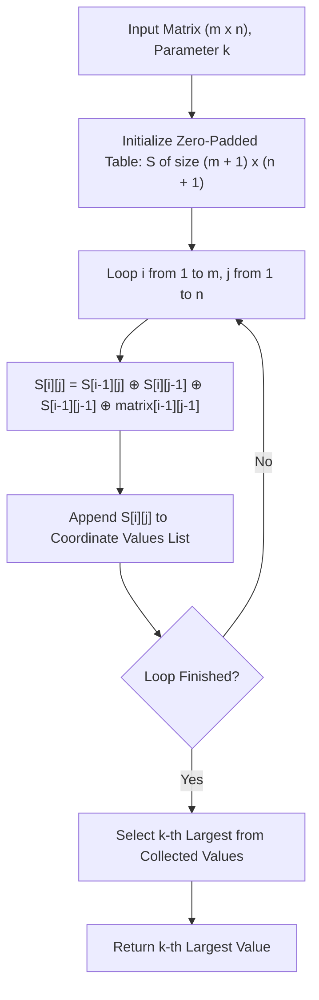

# Guided Example: Find Kth Largest XOR Coordinate Value

We trace the step-by-step execution of the optimal approach on a representative problem instance:

- **Input:** `matrix = [[5, 2], [1, 6]]`, `k = 1`
- **Required Output:** `7`

This instance features non-uniform bit patterns across a $2 \times 2$ grid where multiple overlapping prefix rectangles must be evaluated and ranked, demonstrating how 2D bitwise inclusion-exclusion computes coordinate values in linear time.

---

## 1. Instance & Teaching Goal

We are given an $m \times n$ matrix of non-negative integers and an integer $k$ ($1 \le k \le m \cdot n$). The coordinate value at $(a, b)$ is defined as the bitwise XOR sum of all elements in the submatrix spanning rows $0 \dots a$ and columns $0 \dots b$:
$$V(a, b) = \bigoplus_{i=0}^a \bigoplus_{j=0}^b \text{matrix}[i][j]$$
We seek the $k$-th largest value among all $m \cdot n$ coordinate values.

Recomputing each submatrix independently requires $\mathcal{O}(a \cdot b)$ operations per cell, leading to an impractical $\mathcal{O}(m^2 n^2)$ overall time. The optimal approach establishes a 2D dynamic programming recurrence that computes each coordinate value in $\mathcal{O}(1)$ time, followed by top-$k$ selection.

---

## 2. Conceptual Foundation & Invariants

### State Representation

| Component | Definition | Shape / Bounds |
|---|---|---|
| Prefix XOR Table $S[i][j]$ | XOR sum of submatrix spanning $[0 \dots i-1] \times [0 \dots j-1]$ | $(m + 1) \times (n + 1)$, zero-padded |
| Coordinate Value Collection | List of all $m \cdot n$ computed values $V(a, b) = S[a+1][b+1]$ | Size $m \cdot n$ |
| Order Statistic Selection | The $k$-th largest element in the collected values | Scalar |

### Mathematical Invariants

> **2D Bitwise Inclusion-Exclusion Recurrence.**
> Let $S[i][j]$ denote the cumulative XOR sum of the prefix rectangle with $i$ rows and $j$ columns. The region can be partitioned into:
> - The upper rectangle: $S[i-1][j]$
> - The left rectangle: $S[i][j-1]$
>
> In their XOR sum $S[i-1][j] \oplus S[i][j-1]$, the diagonal intersection $S[i-1][j-1]$ appears twice. Because $x \oplus x = 0$ for all bitwise operands, the intersection cancels out completely. To ensure the intersection is included exactly once in the union, we must XOR $S[i-1][j-1]$ back in, and finally incorporate the current cell value:
> $$S[i][j] = S[i-1][j] \oplus S[i][j-1] \oplus S[i-1][j-1] \oplus \text{matrix}[i-1][j-1]$$
> Zero-padding the $0$-th row and $0$-th column ($S[0][*] = 0, S[*][0] = 0$) guarantees uniform recurrence evaluation without special boundary branches.

---

## 3. Step-by-Step Worked Execution

For `matrix = [[5, 2], [1, 6]]` ($m = 2, n = 2$) and $k = 1$:

### Initialization
Zero-padded DP table of dimension $3 \times 3$:
$$S = \begin{pmatrix} 0 & 0 & 0 \\ 0 & 0 & 0 \\ 0 & 0 & 0 \end{pmatrix}$$

---

### Row $i = 1$ (Corresponding to `matrix` row index $0$)

1. **Cell $(0, 0)$ $\implies S[1][1]$:**
   $$S[1][1] = S[0][1] \oplus S[1][0] \oplus S[0][0] \oplus \text{matrix}[0][0] = 0 \oplus 0 \oplus 0 \oplus 5 = \mathbf{5}$$
   Value appended: $5$.

2. **Cell $(0, 1)$ $\implies S[1][2]$:**
   $$S[1][2] = S[0][2] \oplus S[1][1] \oplus S[0][1] \oplus \text{matrix}[0][1] = 0 \oplus 5 \oplus 0 \oplus 2 = 5 \oplus 2 = \mathbf{7}$$
   (In binary: $101_2 \oplus 010_2 = 111_2 = 7$).
   Value appended: $7$.

---

### Row $i = 2$ (Corresponding to `matrix` row index $1$)

1. **Cell $(1, 0)$ $\implies S[2][1]$:**
   $$S[2][1] = S[1][1] \oplus S[2][0] \oplus S[1][0] \oplus \text{matrix}[1][0] = 5 \oplus 0 \oplus 0 \oplus 1 = 5 \oplus 1 = \mathbf{4}$$
   (In binary: $101_2 \oplus 001_2 = 100_2 = 4$).
   Value appended: $4$.

2. **Cell $(1, 1)$ $\implies S[2][2]$:**
   $$\begin{aligned}
   S[2][2] &= S[1][2] \oplus S[2][1] \oplus S[1][1] \oplus \text{matrix}[1][1] \\
   &= 7 \oplus 4 \oplus 5 \oplus 6
   \end{aligned}$$
   Step-by-step XOR evaluation:
   - $7 \oplus 4 = 111_2 \oplus 100_2 = 011_2 = 3$
   - $3 \oplus 5 = 011_2 \oplus 101_2 = 110_2 = 6$
   - $6 \oplus 6 = 0$
   $$S[2][2] = \mathbf{0}$$
   Value appended: $0$.

---

### Step 3: Top-$k$ Selection

The full set of coordinate XOR values is:
$$\mathcal{V} = [5, 7, 4, 0]$$

Sorted in descending order:
$$[7, 5, 4, 0]$$

For $k = 1$, the $1$-st largest element is $\mathbf{7}$.

---

## 4. Complete Execution Trace

| Coordinate $(a, b)$ | Table Cell | Neighbor Values $S[a][b+1] \oplus S[a+1][b] \oplus S[a][b]$ | $\text{matrix}[a][b]$ | Computed XOR | Running Values |
|---|---|---|---|---|---|
| $(0, 0)$ | $S[1][1]$ | $0 \oplus 0 \oplus 0 = 0$ | $5$ | $0 \oplus 5 = 5$ | $[5]$ |
| $(0, 1)$ | $S[1][2]$ | $0 \oplus 5 \oplus 0 = 5$ | $2$ | $5 \oplus 2 = 7$ | $[5, 7]$ |
| $(1, 0)$ | $S[2][1]$ | $5 \oplus 0 \oplus 0 = 5$ | $1$ | $5 \oplus 1 = 4$ | $[5, 7, 4]$ |
| $(1, 1)$ | $S[2][2]$ | $7 \oplus 4 \oplus 5 = 6$ | $6$ | $6 \oplus 6 = 0$ | $[5, 7, 4, 0]$ |

Selection: $k = 1 \implies \text{Order}(1) = \mathbf{7}$.

---

## 5. Algorithmic Mastery & Edge Surfacing

### Boundary and Edge Cases

| Scenario | Input Feature | Expected Output | Strategic Handling |
|---|---|---|---|
| Single Cell ($1 \times 1$) | `[[x]], k = 1` | `x` | Only coordinate is $(0, 0)$; returns `matrix[0][0]`. |
| Complete Annihilation | All elements identical bitwise | Multiple $0$s | Parity cancellations evaluate naturally. |
| Maximal $k = m \cdot n$ | Smallest coordinate value requested | $\min \mathcal{V}$ | Top-$k$ selection with $k = m \cdot n$ returns the minimum element. |
| Large Dimensions ($1000 \times 1000$) | $10^6$ elements | Handled in $\mathcal{O}(mn)$ | Quickselect or min-heap of size $k$ avoids full $\mathcal{O}(N \log N)$ sorting. |

### Invariant Maintenance & Why It Works

1. **Self-Inverse XOR Cancellation:**
   Unlike standard arithmetic where the intersection is subtracted ($A + B - A \cap B$), in XOR algebra $x \oplus x = 0$. Because the intersection $S[i-1][j-1]$ is included in both $S[i-1][j]$ and $S[i][j-1]$, taking their XOR cancels the intersection entirely ($1 \oplus 1 = 0$). Adding $S[i-1][j-1]$ back once restores it cleanly ($0 \oplus 1 = 1$).
2. **Boundary Padding:**
   The $(m + 1) \times (n + 1)$ dimensions ensure that row $0$ and col $0$ serve as neutral identities ($0$), avoiding any conditional checks on borders.

### Complexity Analysis

- **Time Complexity:** $\mathcal{O}(m \cdot n + m \cdot n \log k)$ using a min-heap of size $k$, or $\mathcal{O}(m \cdot n)$ using Quickselect (Hoare's selection algorithm). Populating the DP table takes $\mathcal{O}(m \cdot n)$ operations.
- **Space Complexity:** $\mathcal{O}(m \cdot n)$ auxiliary space to maintain the 2D prefix XOR table and store coordinate values.
