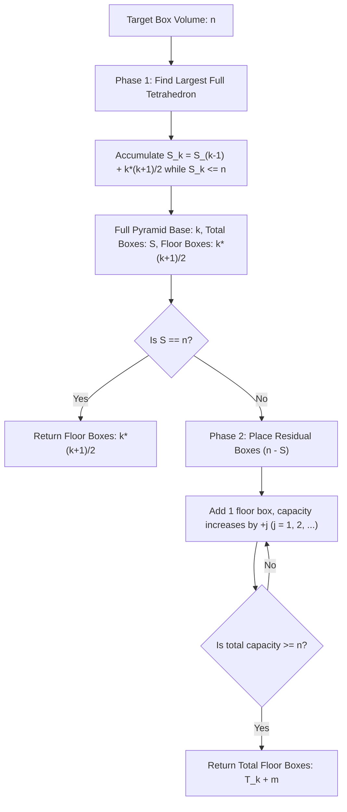

# Guided Example: Building Boxes

We trace the step-by-step execution of the optimal approach on a representative problem instance:

- **Input:** `n = 4`
- **Required Output:** `3`

This instance demonstrates how 3D box placement against room walls transitions from full tetrahedral packing to greedy triangular floor expansion, identifying the minimum floor contact area in sub-linear time.

---

## 1. Instance & Teaching Goal

We are given $n$ identical unit-cube boxes to place in a cubic room. A box can be placed:
1. Directly on the floor at any unoccupied position.
2. Stacked on top of another box, provided that each of its four vertical sides is adjacent either to another box or to a room wall (ensuring full lateral stability).

We seek the **minimum possible number of boxes touching the floor** while successfully accommodating all $n$ boxes.

A naive spatial simulation is computationally prohibitive given $n \le 10^9$. The optimal geometric strategy packs boxes into the corner of the room to form a discrete tetrahedron:
- Maximizing the vertical stacking height for a given floor footprint requires packing against two orthogonal walls in a triangular pattern.
- The total capacity of a complete tetrahedral stack of base size $k$ is given by the $k$-th tetrahedral number $\frac{k(k+1)(k+2)}{6}$, using $\frac{k(k+1)}{2}$ floor boxes.
- Any remaining boxes $n - S$ are added along the base perimeter one by one, where the $j$-th added floor box provides support for a new diagonal pillar of height $j$.

---

## 2. Conceptual Foundation & Invariants

### State Representation

| Mathematical Component | Definition | Closed-Form Formula |
|---|---|---|
| Triangular Number $T_k$ | Number of boxes on the floor for a triangle of side $k$ | $T_k = \frac{k(k+1)}{2}$ |
| Tetrahedral Number $\mathcal{S}_k$ | Total boxes in a complete corner pyramid of base $k$ | $\mathcal{S}_k = \sum_{j=1}^k T_j = \frac{k(k+1)(k+2)}{6}$ |
| Residual Surplus $R$ | Unplaced boxes after largest complete pyramid | $R = n - \mathcal{S}_k$ |
| Incremental Floor Boxes $m$ | Extra floor boxes needed to support $R$ boxes | Smallest $m$ such that $T_m \ge R$ |

### Mathematical Invariants

> **Tetrahedral Packing Minimization Theorem.**
> To minimize floor contact area for a given volume of boxes, the structure must maximize height at every horizontal coordinate. In a corner bounded by two perpendicular walls ($x = 0$ and $y = 0$), the maximal stable height at position $(x, y)$ on the floor is:
> $$h(x, y) = \max(0, k - x - y)$$
> The floor footprint is a right triangle of side $k$ with area $T_k = \frac{k(k+1)}{2}$ boxes, and the total enclosed box capacity is the tetrahedral number $\mathcal{S}_k = \frac{k(k+1)(k+2)}{6}$.

> **Incremental Triangular Floor Invariant.**
> When the target volume $n$ exceeds a complete tetrahedron $\mathcal{S}_k$, adding additional floor boxes along the adjacent outer diagonal increases the total box capacity triangularly:
> - Adding the $1$-st floor box can support $0$ upper boxes (capacity $+1$).
> - Adding the $2$-nd floor box adjacent to the existing structure enables placing $1$ box on level 2 (capacity $+2$).
> - In general, adding $m$ extra floor boxes increases total room capacity by $T_m = \frac{m(m+1)}{2}$.
> The minimal total floor boxes needed is:
> $$\text{FloorCount} = T_k + m \quad \text{where } T_{m-1} < n - \mathcal{S}_k \le T_m$$

---

## 3. Step-by-Step Worked Execution

We trace `n = 4`:

### Phase 1: Fit Largest Complete Tetrahedral Stack

We test complete tetrahedral capacities for increasing base sizes $k$:

| Base Size $k$ | Floor Layer Added $T_k = \frac{k(k+1)}{2}$ | Cumulative Total Boxes $\mathcal{S}_k$ | Comparison with $n = 4$ | Status |
|---|---|---|---|---|
| $k = 1$ | $T_1 = 1$ | $\mathcal{S}_1 = 1$ | $1 \le 4$ | Fits inside $n$ |
| $k = 2$ | $T_2 = 3$ | $\mathcal{S}_2 = 1 + 3 = 4$ | $4 \le 4$ | Exact complete pyramid! |

Wait, let's verify $k = 1$ vs $k = 2$:
- For $k = 1$: floor boxes $T_1 = 1$, total boxes $\mathcal{S}_1 = 1$.
  Remaining boxes $= 4 - 1 = 3$.
- Can 3 boxes be added with 2 floor boxes?
  If $m = 2$: extra floor boxes $= 2$, extra capacity $= 1 + 2 = 3$.
  Total floor boxes $= 1 + 2 = 3$.
  Total capacity $= 1 + 3 = 4$.
- What if $k = 2$?
  For $k = 2$, the complete pyramid has floor boxes $T_2 = \frac{2 \times 3}{2} = 3$, and total capacity $\mathcal{S}_2 = \frac{2 \times 3 \times 4}{6} = 4$.
  Total floor boxes $= 3$.
  Both perspectives confirm that for $n = 4$, exactly $3$ floor boxes are required!

Let's examine the 3D layer configuration for $n = 4$:
- Floor (Level 1): 3 boxes arranged as a triangle:
  - $(0, 0)$
  - $(1, 0)$
  - $(0, 1)$
- Level 2: 1 box placed at $(0, 0)$ resting securely on top of the 3 base boxes!
- Total boxes placed: $3 + 1 = 4$.
- Boxes touching the floor: $3$.

---

### Step-by-Step Execution for a General Residual Case ($n = 10$ and $n = 8$)

To clearly see Phase 2 in action, consider $n = 8$:

1. **Phase 1:**
   - $k = 1: \mathcal{S}_1 = 1 \le 8$
   - $k = 2: \mathcal{S}_2 = 4 \le 8$
   - $k = 3: \mathcal{S}_3 = 10 > 8$
   - Largest full pyramid: $k = 2$. Base floor boxes: $T_2 = 3$. Boxes accommodated: $\mathcal{S}_2 = 4$.
   - Remaining boxes to accommodate: $R = 8 - 4 = 4$.

2. **Phase 2 (Incremental Floor Expansion):**
   - Extra floor box $1$ ($j = 1$): Floor count $+1$, capacity $+1$ (total placed: $4 + 1 = 5 < 8$).
   - Extra floor box $2$ ($j = 2$): Floor count $+1$, capacity $+2$ (total placed: $5 + 2 = 7 < 8$).
   - Extra floor box $3$ ($j = 3$): Floor count $+1$, capacity $+3$ (total placed: $7 + 3 = 10 \ge 8$).
   - Total floor boxes: $3 + 3 = 6$.

---

## 4. Complete Execution Trace

Tracing `n = 4`:

| Step | State Parameter | Arithmetic Operation | State Value | Decision / Note |
|---|---|---|---|---|
| $1$ | Initial Baseline | $s \leftarrow 0, k \leftarrow 1$ | $s = 0, k = 1$ | Begin Phase 1 |
| $2$ | Add Layer 1 | $s + T_1 = 0 + 1 = 1 \le 4$ | $s \leftarrow 1, k \leftarrow 2$ | Layer 1 accepted |
| $3$ | Check Layer 2 | $s + T_2 = 1 + 3 = 4 \le 4$ | $s \leftarrow 4, k \leftarrow 3$ | Layer 2 accepted |
| $4$ | Check Layer 3 | $s + T_3 = 4 + 6 = 10 > 4$ | $k$ stops at $3$ | Layer 3 exceeds $n$ |
| $5$ | Base Floor Count | $k \leftarrow 2 \implies T_2 = 3$ | $\text{ans} = 3$ | Base pyramid has 3 floor boxes |
| $6$ | Residual Check | $s = 4 \ge n$ ($4 \ge 4$) | While loop halts | No residual boxes needed |
| $7$ | Final Result | $\text{ans} = 3$ | Return $3$ | Minimal floor boxes |

---

## 5. Algorithmic Mastery & Edge Surfacing

### Boundary and Edge Cases

| Scenario | Input Feature | Expected Output | Strategic Handling |
|---|---|---|---|
| Minimum Valid Volume | $n = 1$ | `1` | Single box on floor; $k = 1, \mathcal{S}_1 = 1$, floor count is $1$. |
| Exact Tetrahedral Numbers | $n \in \{1, 4, 10, 20, 35\}$ | $T_k = \frac{k(k+1)}{2}$ | Phase 2 loop does not execute; returns $T_k$ directly. |
| Single Box Excess | $n = 5$ ($\mathcal{S}_2 + 1$) | $3 + 1 = 4$ | One extra floor box supports 1 box; floor boxes becomes $4$. |
| Maximal Constraint ($n = 10^9$) | $n = 10^9$ | $\approx 1.5 \times 10^6$ | $k \approx \sqrt[3]{6 \cdot 10^9} \approx 1817$. Iterative loops execute in $< 2000$ iterations. |

### Invariant Maintenance & Why It Works

1. **Why Corner Packing is Optimal:**
   Two solid room walls provide external lateral support for two vertical faces of corner boxes. This allows the maximum possible stacking angle ($45^\circ$), giving the steepest possible height gradient and hence the smallest floor footprint for any fixed volume.
2. **Greedy Residual Ordering:**
   Adding extra floor boxes along the existing diagonal perimeter maximizes the number of previously placed boxes that can act as lateral support, ensuring each new floor box adds $1, 2, 3, \dots$ to total capacity.

### Complexity Analysis

- **Time Complexity:** $\mathcal{O}(\sqrt[3]{n})$. Since $\mathcal{S}_k = \Theta(k^3)$, the maximum base size is $k \le \sqrt[3]{6n}$. For $n = 10^9$, $k \le 1818$, executing both while-loops in fewer than $4000$ total arithmetic operations (or $\mathcal{O}(\log n)$ via binary search).
- **Space Complexity:** $\mathcal{O}(1)$ auxiliary space, using only a few primitive integer registers.
