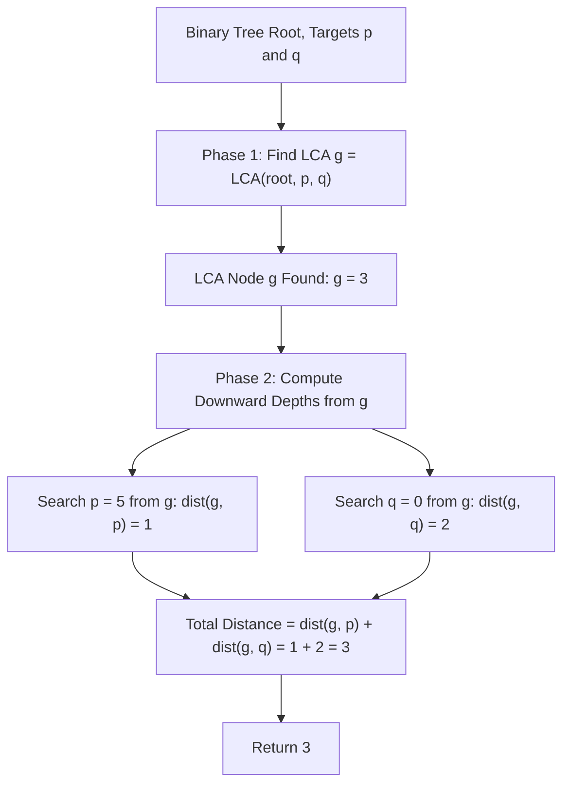

# Guided Example: Find Distance in a Binary Tree

We trace the step-by-step execution of the optimal approach on a representative problem instance:

- **Input:** `root = [3, 5, 1, 6, 2, 0, 8, null, null, 7, 4]`, `p = 5`, `q = 0`
- **Required Output:** `3`

This instance features targets located in opposing subtrees across the global root, demonstrating how Lowest Common Ancestor (LCA) identification and single-source tree depth evaluation compute the exact geodesic graph distance between two arbitrary tree vertices in linear time.

---

## 1. Instance & Teaching Goal

Given the root of a binary tree with unique values and two target node values $p$ and $q$, we seek the distance between nodes $p$ and $q$. The distance is defined as the number of edges on the unique simple path connecting them.

In a general undirected graph, shortest path queries require BFS or Dijkstra search. In a tree:
- There exists exactly one simple path between any two vertices.
- The path from $p$ to $q$ ascends from $p$ up to their Lowest Common Ancestor $g = \text{LCA}(p, q)$, and then descends down from $g$ to $q$.
- Therefore, the total path length decomposes into the sum of downward distances:
  $$\text{dist}(p, q) = \text{dist}(g, p) + \text{dist}(g, q)$$

---

## 2. Conceptual Foundation & Invariants

### State Representation

| Component | Mathematical Definition | Role |
|---|---|---|
| Lowest Common Ancestor $g$ | $\text{LCA}(p, q)$ | Deepest node that has both $p$ and $q$ as descendants |
| Downward Depth $d(u, v)$ | Edges along the descending path from $u$ to $v$ ($v$ in subtree of $u$) | $d(u, u) = 0$; $d(u, \text{child}) = 1 + d(\text{child}, v)$ |
| Tree Metric Distance | $d(g, p) + d(g, q)$ | Final edge count between $p$ and $q$ |

### Mathematical Invariants

> **Lowest Common Ancestor Geodesic Decomposition Theorem.**
> In any connected acyclic undirected graph (tree) $T = (V, E)$, the unique simple path between two nodes $p, q \in V$ passes through their Lowest Common Ancestor $g = \text{LCA}(p, q)$ with respect to any chosen root $r$:
> $$\text{Path}(p, q) = \text{Path}(p, g) \cup \text{Path}(g, q)$$
> Because the paths are edge-disjoint, the tree metric satisfies:
> $$\text{dist}(p, q) = \text{dist}(g, p) + \text{dist}(g, q)$$
> where each individual component is simply the depth of the target within the subtree rooted at $g$.

> **LCA Structural Recurrence.**
> For any node $u$:
> - If $u$ is null or $u.\text{val} \in \{p, q\}$, return $u$.
> - Recursively query left child $L$ and right child $R$.
> - If both $L$ and $R$ return non-null pointers, $p$ and $q$ reside in opposing branches of $u$, identifying $u$ as the unique LCA.
> - If only one branch returns non-null, the LCA lies entirely within that branch.



---

## 3. Step-by-Step Worked Execution

For `root = [3, 5, 1, 6, 2, 0, 8, null, null, 7, 4]`, $p = 5$, and $q = 0$:

Tree Topology:
```text
          3
        /   \
       5     1
      / \   / \
     6   2 0   8
        / \
       7   4
```

### Phase 1: Locate Lowest Common Ancestor $g = \text{LCA}(3, 5, 0)$

We traverse the tree from root $3$:
1. **At Node $3$:**
   - Evaluates left subtree rooted at $5$.
   - Evaluates right subtree rooted at $1$.
2. **Left Branch at Node $5$:**
   - Value matches target $p = 5$.
   - Immediately returns node $5$ to parent $3$.
3. **Right Branch at Node $1$:**
   - Evaluates left child $0$: value matches target $q = 0$, returns node $0$.
   - Evaluates right child $8$: returns null.
   - Right branch of node $3$ returns node $0$.
4. **Aggregation at Node $3$:**
   - Left branch returned node $5$ (contains $p$).
   - Right branch returned node $0$ (contains $q$).
   - Since both child branches returned non-null nodes, node $3$ is the **Lowest Common Ancestor**:
     $$g = \text{node } 3$$

---

### Phase 2: Compute Depths from LCA $g = 3$

We calculate downward distances from $g = 3$ to $p = 5$ and $q = 0$:

#### Distance to $p = 5$:
- From node $3$, inspect left child: node $5$.
- Node $5$ has value equal to $p = 5$.
- Distance from $3$ to $5$:
  $$\text{dist}(3, 5) = 1$$

#### Distance to $q = 0$:
- From node $3$, left branch does not lead to $0$. Inspect right child: node $1$ (step 1).
- From node $1$, left child is node $0$ (step 2).
- Node $0$ has value equal to $q = 0$.
- Distance from $3$ to $0$:
  $$\text{dist}(3, 0) = 1 + 1 = 2$$

---

### Phase 3: Synthesize Total Tree Geodesic Distance

$$\text{dist}(5, 0) = \text{dist}(3, 5) + \text{dist}(3, 0) = 1 + 2 = \mathbf{3}$$

The simple path in the tree is:
$$5 \longleftrightarrow 3 \longleftrightarrow 1 \longleftrightarrow 0$$
which contains exactly $3$ edges.

---

## 4. Complete Execution Trace

| Phase | Tree Node Inspected | Event / Check | Return Pointer / Depth | Status |
|---|---|---|---|---|
| LCA Search | Node $5$ | Node value matches $p = 5$ | Returns Pointer($5$) | Target $p$ found |
| LCA Search | Node $0$ | Node value matches $q = 0$ | Returns Pointer($0$) | Target $q$ found |
| LCA Search | Node $1$ | Left child returned $0$, right null | Returns Pointer($0$) | Bubbles up |
| LCA Search | Node $3$ | Both left ($5$) and right ($0$) non-null | $g \leftarrow \text{Node}(3)$ | **LCA confirmed** |
| Depth DFS | From $g = 3$ to $p = 5$ | Node $5$ is immediate left child | $\text{dist}(3, 5) = 1$ | First leg |
| Depth DFS | From $g = 3$ to $q = 0$ | $3 \to 1 \to 0$ | $\text{dist}(3, 0) = 2$ | Second leg |
| Combine | Sum legs | $1 + 2 = 3$ | Result: $3$ | Complete |

---

## 5. Algorithmic Mastery & Edge Surfacing

### Boundary and Edge Cases

| Scenario | Input Example | Expected Output | Strategic Handling |
|---|---|---|---|
| Target is Ancestor of Other | $p = 5, q = 7$ | `2` | LCA is $5$ itself. $\text{dist}(5, 5) = 0, \text{dist}(5, 7) = 2 \implies 0 + 2 = 2$. |
| Target Nodes Identical | $p = 5, q = 5$ | `0` | LCA is $5$. Both depths are $0 \implies 0 + 0 = 0$. |
| Target Nodes are Direct Siblings | $p = 6, q = 2$ | `2` | LCA is parent $5$. Depths are $1 + 1 = 2$. |
| Degenerate Linked List Tree | Skewed line of $N$ nodes | Depth difference | Traverses line in $\mathcal{O}(N)$ depth; computes standard distance. |

### Invariant Maintenance & Why It Works

1. **Why LCA is Guaranteed on Simple Path:**
   In any tree, all simple paths between a node in the left subtree of $u$ and a node in the right subtree of $u$ must pass through $u$. Since $p$ and $q$ are in separate subtrees of $g$, $g$ is necessarily an internal vertex on the path between them.
2. **Independence of Depths:**
   Once the LCA $g$ is identified, searching for $p$ and $q$ in the subtree of $g$ operates on disjoint subtrees (unless $g = p$ or $g = q$), avoiding any redundant visits outside the relevant branch.

### Complexity Analysis

- **Time Complexity:** $\mathcal{O}(N)$ where $N$ is the number of nodes in the binary tree. Finding the LCA visits each node at most once in $\mathcal{O}(N)$ time. The depth DFS searches subtrees rooted at $g$, visiting at most $N$ nodes in $\mathcal{O}(N)$ time. Total time is strictly $\mathcal{O}(N)$.
- **Space Complexity:** $\mathcal{O}(H)$ auxiliary space for recursive call stacks, where $H$ is the tree height ($\mathcal{O}(\log N)$ for balanced trees, $\mathcal{O}(N)$ in the worst skewed case).