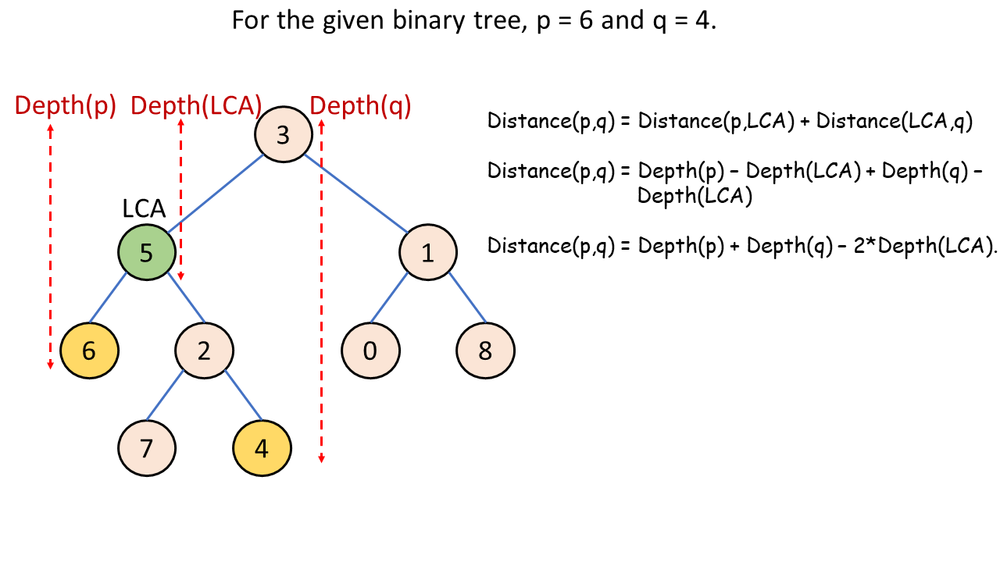

[TOC]

## Solution

---

### Overview

We need to find the distance between two nodes with values `p` and `q` in a binary tree with unique values. Let's say that you need to find the path between any two nodes in a binary tree. The path will always be hill-shaped with exactly one peak. There will be a single low if one of the nodes is the parent of another, otherwise, there will be two lows in this graph (one at the beginning, and a second at the end).

Observe that this topmost node on the path is the lowest common ancestor of both nodes.
> Important note: According to the definition of [LCA on Wikipedia](https://en.wikipedia.org/wiki/Lowest_common_ancestor): The LCA is defined between two nodes `p` and `q` as the lowest node in the tree that has both `p` and `q` as descendants (where we allow a node to be a descendant of itself). Check out this [problem](https://leetcode.com/problems/lowest-common-ancestor-of-a-binary-tree/description/) for a better understanding of the approach.

In each step, we move one unit of depth upwards until reaching the LCA, and downwards until reaching the target node. The left or right movements in the path don't affect the distance. The distance from the source to the target is the sum of the depth differences from the source to the LCA and from the LCA to the target. Therefore, we need to calculate the depths of these three nodes.

---

### Approach 1: Brute Force (Lowest Common Ancestor and Depth-First Search)

#### Intuition

While calculating the depth of these nodes, observe that the depth calculation from the root node to the LCA is redundant in all the 3 calculations. Therefore, we can assume LCA as the root node at depth 0 and start the depth calculation process from this node.

To calculate the depth of nodes, one could use either Depth-First Search (DFS) or Breadth-First Search (BFS). We will use DFS, starting from the LCA node and recursively calling child nodes while incrementing the depth by 1. When a node with the target value is encountered, we return the current depth. Calculate these depths for both `p` and `q`; their sum gives the distance.

#### Algorithm

**Main function - `findDistance(root, p, q)`**

1. Find LCA of `p` and `q` by making a call to the function `findLCA(root,p,q)` and store it in `lca`.
2. Return the sum of `depth(lca,p)` and `depth(lca,q)`.

**`findLCA(root, p, q)`**

1. If the `root` is `null` or root's current value is `p` or `q`, return `root`.
2. Store `findLCA(root->left,p,q)` in `left` and `findLCA(root->right,p,q)` in `right`.
3. If both `left` and `right` are not `null`, return `root`.
4. Return the non-null node from either `left` or `right`.

**$depth(root, target, currentDepth = 0)$**

1. If the `root` is `null`, return -1.
2. If value of `root` is `target`, return current depth.
3. Check the left subtree by making a call to `depth(root->left, target, currentDepth+1)`.
4. If a non-negative value is returned, return this depth. Otherwise, target is in the `right` subtree.
5. Return `depth(root->right,target,currentDepth+1)`.

#### Implementation

```python
class Solution:
    def findDistance(self, root, p, q):
        # Find the lowest common ancestor of p and q.
        lca = self.__find_LCA(root, p, q)
        return self.__depth(lca, p) + self.__depth(lca, q)

    # Function to find the LCA of the given nodes.
    def __find_LCA(self, root, p, q):
        if root is None or root.val == p or root.val == q:
            return root
        left = self.__find_LCA(root.left, p, q)
        right = self.__find_LCA(root.right, p, q)
        if left is not None and right is not None:
            return root
        return left if left is not None else right

    # Function to find the depth of the node with respect to LCA.
    def __depth(self, root, target, current_depth=0):
        # Node not found
        if root is None:
            return -1
        if root.val == target:
            return current_depth

        # Check left subtree
        left_depth = self.__depth(root.left, target, current_depth + 1)
        if left_depth != -1:
            return left_depth

        # If not in left subtree, it is guaranteed to be in right subtree
        return self.__depth(root.right, target, current_depth + 1)
```

#### Complexity Analysis

Let $n$ be the number of nodes in the tree.

- Time complexity: $O(n)$

   The `findLCA(root)` function takes $O(n)$ time because all the nodes are visited exactly once. Similarly, the `depth(root)` function also takes $O(n)$ time, resulting in a net time complexity of $O(n)$.

- Space complexity: $O(n)$

   The extra space comes from implicit stack space due to recursion in both `findLCA` and `depth` functions. The recursion could go up to $n$ levels deep. Therefore, the total space complexity is given by $O(n)$.

---

### Approach 2: Lowest Common Ancestor and Breadth-First Search

#### Intuition

In this approach, we use breadth-first search (BFS) to determine the depth of nodes with values `p` and `q` from their lowest common ancestor (LCA). Unlike the previous depth-first approach, BFS iterates level by level, using a queue for FIFO (first in, first out) traversal. This method allows us to explore all nodes at each level before descending further into the tree.

We initialize the queue with the LCA of `p` and `q`. Then, we perform a level-order traversal using BFS on the tree. To understand this approach better, consider solving a similar problem ['Binary Tree Level Order Traversal'](https://leetcode.com/problems/binary-tree-level-order-traversal/description/).

Start by initializing the initial `depth` to 0. After each level iteration, increment `depth` by 1. Whenever we encounter a node with a value of `p` or `q`, we add this `depth` value to the `distance`. Iterations stop either when the queue is empty or when we've found both `p` and `q`.

Using BFS to find the depth of a node offers key benefits over DFS. It is more memory and time efficient as it explores the tree level by level. This approach guarantees the shortest path once the target node is found, avoiding unnecessary exploration of deeper levels.

#### Algorithm

**Main function - `findDistance(root, p, q)`**

1. Find LCA of `p` and `q` by making a call to the function `findLCA(root,p,q)` and store it in `lca`.
2. Initialize a queue `bfs` with `lca`.
3. Initialize a few variables `distance` and `depth` with 0, and `foundp` and `foundq` with `false`.
4. Iterate until the queue isn't empty or both `foundp` and `foundq` aren't true:
- Initialize `size` with the size of the queue.
- Iterate for all `size` elements in the current queue:
      - Store the front of `bfs` in `front` and pop it.
      - If value of `front` is `p`:
- Increment `distance` with `depth` and set `foundp` as `true`.
      - If value of `front` is `q`:
- Increment `distance` with `depth` and set `foundq` as `true`.
      - Push the non-null children of `front` at the end of `bfs`.
- Increment `depth` by 1.
5. Return `distance`.

**`findLCA(root, p, q)`**

1. If the `root` is `null` or root's current value is `p` or `q`, return `root`.
2. Store `findLCA(root->left,p,q)` in `left` and `findLCA(root->right,p,q)` in `right`.
3. If both `left` and `right` are not `null`, return `root`.
4. Return the non-null node from either `left` or `right`.

#### Implementation

```python
class Solution:
    def findDistance(self, root, p, q):
        lca = self._find_LCA(root, p, q)
        bfs = deque([lca])
        distance = 0
        depth = 0
        foundp = False
        foundq = False
        while bfs and (not foundp or not foundq):
            size = len(bfs)
            for i in range(size):
                node = bfs.popleft()  # Dequeue the node
                if node.val == p:
                    distance += depth
                    foundp = True
                if node.val == q:
                    distance += depth
                    foundq = True
                if node.left:
                    bfs.append(node.left)  # Enqueue left child
                if node.right:
                    bfs.append(node.right)  # Enqueue right child
            depth += 1
        return distance

    def _find_LCA(self, root, p, q):
        if root is None or root.val == p or root.val == q:
            return root
        left = self._find_LCA(root.left, p, q)
        right = self._find_LCA(root.right, p, q)
        if left and right:
            return root
        return left if left else right
```

#### Complexity Analysis

Let $n$ be the number of nodes in the tree.

- Time complexity: $O(n)$

   The `findLCA(root)` function takes $O(n)$ time because all the nodes are visited exactly once. Similarly, the breadth-first search also takes $O(n)$ time.

   The net time complexity is given by $O(n)$.

- Space complexity: $O(n)$

   The extra space comes from the `bfs` queue and the implicit stack space due to recursion in the `depth` function. The size of the `bfs` queue in the worst case could go up to $O(n)$. Therefore, the total space complexity is given by $O(n)$.

---

### Approach 3: One pass (Based on Lowest Common Ancestor)

#### Intuition

In Approach 1, we created two separate functions to calculate the LCA and the depth of nodes. To streamline this into a single function, we can introduce an additional parameter in the LCA function to maintain depth information. Upon reaching the LCA of nodes `p` and `q`, we can compute the distance between them by subtracting twice the current depth from the sum of their depths. This concept is illustrated in the example below:



Let's understand the recursive implementation behind this. We'll create a post-order traversal function that calculates the LCA while tracking depth. Instead of returning a node, this function returns an integer, `retDistance`. When `p` or `q` is encountered during traversal, their depths stored in `retDistance` are returned to the parent nodes. Upon reaching the LCA, we compute the distance between `p` and `q` by subtracting twice the current depth from their sum of depths.

#### Algorithm

**Main function - `findDistance(root, p, q)`**

1. Return `distance(root, p, q, 0)`.

**`distance(root, p, q, depth)`**

1. If `root` is null or `p` equals `q`, return 0.
2. If `root->val` is `p` or `q`:
- Store `distance(root->left, p, q, 1)` as `left` and `distance(root->right, p, q, 1)` as `right`.
- If `left` or `right` is positive, return `max(left, right)`.
- Otherwise, return `depth`.
3. Store $distance(root->left, p, q, depth + 1)$ as `left` and $distance(root->right, p, q, depth + 1)$ as `right`.
4. Store `retDistance` as the sum of `left` and `right`.
5. If `left` and `right` are not 0, subtract $2 * depth$ from `retDistance`.
6. Return `retDistance`.

!?!../Documents/1740/slideshow1.json:960,540!?!

#### Implementation

```python
class Solution:
    def findDistance(self, root, p, q):
        return self.__distance(root, p, q, 0)

    # Private helper function
    def __distance(self, root, p, q, depth):
        if root is None or p == q:
            return 0

        # If either p or q is found, calculate the ret_distance as the maximum
        # of depth and ret_distance value for left and right subtrees.
        if root.val == p or root.val == q:
            left = self.__distance(root.left, p, q, 1)
            right = self.__distance(root.right, p, q, 1)

            return max(left, right) if left > 0 or right > 0 else depth

        # Otherwise, calculate the ret_distance as sum of ret_distance of left
        # and right subtree.
        left = self.__distance(root.left, p, q, depth + 1)
        right = self.__distance(root.right, p, q, depth + 1)
        ret_distance = left + right

        # If current node is the LCA, subtract twice of depth.
        if left != 0 and right != 0:
            ret_distance -= 2 * depth

        return ret_distance
```

#### Complexity Analysis

Let $n$ be the number of nodes in the tree.

- Time complexity: $O(n)$

   The `distance` function takes $O(n)$ time because all the nodes are visited exactly once. The time complexity is given by $O(n)$.

- Space complexity: $O(n)$

   The extra space comes from implicit stack space due to recursion in the `distance` function. The recursion could go up to $n$ levels deep. Therefore, the total space complexity is given by $O(n)$.

---