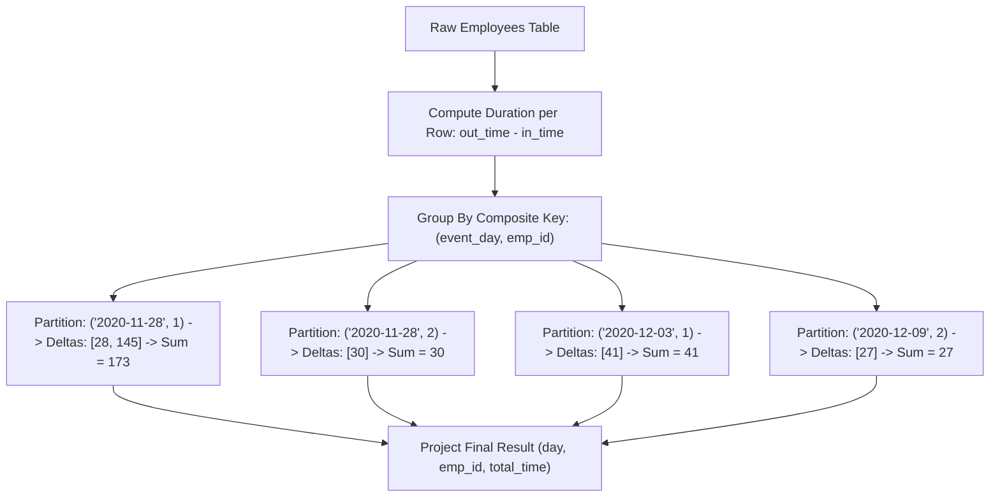

# Guided Example: Find Total Time Spent by Each Employee

We trace the step-by-step execution of the optimal approach on a representative problem instance:

- **Input Table (`Employees`):**
  | `emp_id` | `event_day` | `in_time` | `out_time` |
  |---|---|---|---|
  | `1` | `2020-11-28` | `4` | `32` |
  | `1` | `2020-11-28` | `55` | `200` |
  | `1` | `2020-12-03` | `1` | `42` |
  | `2` | `2020-11-28` | `3` | `33` |
  | `2` | `2020-12-09` | `47` | `74` |
- **Required Output:**
  | `day` | `emp_id` | `total_time` |
  |---|---|---|
  | `2020-11-28` | `1` | `173` |
  | `2020-11-28` | `2` | `30` |
  | `2020-12-03` | `1` | `41` |
  | `2020-12-09` | `2` | `27` |

This instance contains multiple visits by the same employee on a single day as well as visits across multiple dates and employees, demonstrating how composite key grouping and session delta summation aggregate activity logs in relational databases.

---

## 1. Instance & Teaching Goal

We are given an `Employees` table with schema:
$$(\text{emp\_id} : \text{INT}, \text{event\_day} : \text{DATE}, \text{in\_time} : \text{INT}, \text{out\_time} : \text{INT})$$
where $(\text{emp\_id}, \text{event\_day}, \text{in\_time})$ forms the primary key. Each entry represents a single office session starting at minute `in_time` and concluding at minute `out_time` on date `event_day`, with $0 < \text{in\_time} < \text{out\_time} \le 1440$.

We seek to calculate the total time in minutes spent by each employee on each calendar day.

An employee may enter and exit the office multiple times on the same date. A simple row-by-row inspection is insufficient; we must partition the dataset by the composite key $(\text{event\_day}, \text{emp\_id})$ and aggregate the elapsed durations $(\text{out\_time} - \text{in\_time})$ for each partition.

---

## 2. Conceptual Foundation & Invariants

### State Representation

| Relational Operator | Expression | Target Output Attribute |
|---|---|---|
| Projection & Renaming | $\text{event\_day} \to \text{day}$ | `day` |
| Grouping Key | Equivalence relation on $(\text{event\_day}, \text{emp\_id})$ | Partition Key |
| Session Duration | $\Delta t = \text{out\_time} - \text{in\_time}$ | Row-level delta |
| Aggregation | $\sum \Delta t \to \text{total\_time}$ | `total_time` |

### Mathematical Invariants

> **Composite Partition Aggregation Theorem.**
> Let $\mathcal{R}$ be the set of session records. The partition of $\mathcal{R}$ into equivalence classes under the relation:
> $$(d_1, e_1) \sim (d_2, e_2) \iff (d_1 = d_2) \land (e_1 = e_2)$$
> forms disjoint subsets $\mathcal{R}_{(d, e)}$.
> Because sessions for a single employee on a given day are disjoint ($in_i < out_i \le in_{i+1}$), the total active duration is strictly additive:
> $$\text{TotalTime}(d, e) = \sum_{r \in \mathcal{R}_{(d, e)}} (\text{out\_time}_r - \text{in\_time}_r)$$

---

## 3. Step-by-Step Worked Execution

We process the 5 input tuples:
- $r_1: (\text{emp } 1, 2020-11-28, 4, 32)$
- $r_2: (\text{emp } 1, 2020-11-28, 55, 200)$
- $r_3: (\text{emp } 1, 2020-12-03, 1, 42)$
- $r_4: (\text{emp } 2, 2020-11-28, 3, 33)$
- $r_5: (\text{emp } 2, 2020-12-09, 47, 74)$

### Step 1: Calculate Individual Session Durations

For each row, we subtract `in_time` from `out_time`:
- $r_1: 32 - 4 = 28$ minutes
- $r_2: 200 - 55 = 145$ minutes
- $r_3: 42 - 1 = 41$ minutes
- $r_4: 33 - 3 = 30$ minutes
- $r_5: 74 - 47 = 27$ minutes

---

### Step 2: Form Composite Partitions by $(\text{event\_day}, \text{emp\_id})$

1. **Partition $P_1$: $(\text{day} = 2020-11-28, \text{emp\_id} = 1)$:**
   - Sessions included: $r_1$ and $r_2$
   - Durations: $[28, 145]$
   - Sum: $28 + 145 = \mathbf{173}$

2. **Partition $P_2$: $(\text{day} = 2020-11-28, \text{emp\_id} = 2)$:**
   - Sessions included: $r_4$
   - Durations: $[30]$
   - Sum: $\mathbf{30}$

3. **Partition $P_3$: $(\text{day} = 2020-12-03, \text{emp\_id} = 1)$:**
   - Sessions included: $r_3$
   - Durations: $[41]$
   - Sum: $\mathbf{41}$

4. **Partition $P_4$: $(\text{day} = 2020-12-09, \text{emp\_id} = 2)$:**
   - Sessions included: $r_5$
   - Durations: $[27]$
   - Sum: $\mathbf{27}$

---

### Step 3: Projection of Result Table

The resulting 4 partitions are projected into the output schema:
1. `("2020-11-28", 1, 173)`
2. `("2020-11-28", 2, 30)`
3. `("2020-12-03", 1, 41)`
4. `("2020-12-09", 2, 27)`

---

## 4. Complete Execution Trace

| Record ID | Date | Employee | Interval $[in, out]$ | Row Duration | Assigned Partition $(day, emp)$ | Partition Cumulative Sum |
|---|---|---|---|---|---|---|
| $r_1$ | `2020-11-28` | $1$ | $[4, 32]$ | $28$ | $(2020-11-28, 1)$ | $28$ |
| $r_2$ | `2020-11-28` | $1$ | $[55, 200]$ | $145$ | $(2020-11-28, 1)$ | $28 + 145 = \mathbf{173}$ |
| $r_3$ | `2020-12-03` | $1$ | $[1, 42]$ | $41$ | $(2020-12-03, 1)$ | $\mathbf{41}$ |
| $r_4$ | `2020-11-28` | $2$ | $[3, 33]$ | $30$ | $(2020-11-28, 2)$ | $\mathbf{30}$ |
| $r_5$ | `2020-12-09` | $2$ | $[47, 74]$ | $27$ | $(2020-12-09, 2)$ | $\mathbf{27}$ |

---

## 5. Algorithmic Mastery & Edge Surfacing

### Boundary and Edge Cases

| Scenario | Input Feature | Expected Output | Strategic Handling |
|---|---|---|---|
| Single Visit per Day | Every employee visits once | Total time equals that single session duration | Partition has size 1; $\text{SUM}(\Delta t) = \Delta t$. |
| Many Short Visits | Same employee enters and leaves 10 times | Accurate aggregate sum | Hash aggregation accumulates all 10 deltas cleanly. |
| Boundary Times | Session starts at minute 1 and ends at 1440 | $1439$ minutes | Valid range: $1440 - 1 = 1439$. |
| Disordered Input Rows | Rows sorted arbitrarily | Identical grouped sums | Hash-based grouping is independent of input physical row order. |

### Invariant Maintenance & Why It Works

1. **Composite Key Integrity:**
   Grouping by both `event_day` and `emp_id` prevents cross-day accumulation or cross-employee conflation.
2. **Column Aliasing:**
   Selecting `event_day AS day` renames the attribute to match the specification without altering underlying data values.

### Complexity Analysis

- **Time Complexity:** $\mathcal{O}(N)$ where $N$ is the number of rows in `Employees`. A single linear table scan hashes tuples into an in-memory hash aggregation table in $\mathcal{O}(1)$ average time per record.
- **Space Complexity:** $\mathcal{O}(P)$ auxiliary memory, where $P \le N$ is the number of unique $(\text{event\_day}, \text{emp\_id})$ pairs.
