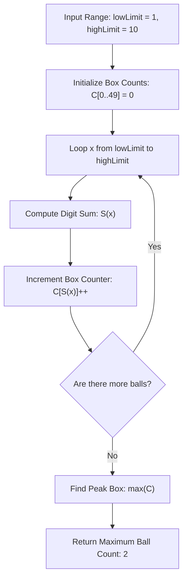

# Guided Example: Maximum Number of Balls in a Box

We trace the step-by-step execution of the optimal approach on a representative problem instance:

- **Input:** `lowLimit = 1`, `highLimit = 10`
- **Required Output:** `2`

This instance spans single-digit and multi-digit decimal representations across a decade boundary, demonstrating how base-10 digit sum hashing distributes elements across bounded bins and determines the peak occupancy in linear time.

---

## 1. Instance & Teaching Goal

We are given two positive integers `lowLimit` and `highLimit`. There are $N = \text{highLimit} - \text{lowLimit} + 1$ numbered balls, with indices running from `lowLimit` to `highLimit` inclusive. Each ball $x$ is placed into a box whose index equals the sum of its decimal digits:
$$\text{box}(x) = \sum_{k=0}^{\lfloor \log_{10} x \rfloor} d_k \quad \text{where } x = \sum d_k 10^k$$

We seek the maximum number of balls contained within any single box.

Since numbers are bounded by $10^5$, the maximum possible digit sum occurs at $99999$:
$$9 + 9 + 9 + 9 + 9 = 45 < 50$$
Rather than dynamically maintaining unbounded hash structures, a compact direct-mapped array of size $50$ handles all possible box allocations in $\mathcal{O}(1)$ space, transforming the problem into a fast single-pass histogram tally.

---

## 2. Conceptual Foundation & Invariants

### State Representation

| Component | Definition | Range |
|---|---|---|
| Ball Index $x$ | Current ball being processed | $\text{lowLimit} \le x \le \text{highLimit}$ |
| Digit Sum $S(x)$ | Sum of base-10 digits of $x$ | $1 \le S(x) \le 45$ |
| Box Occupancy Table $C[s]$ | Count of balls assigned to box number $s$ | Size $50$, initialized to all zeros |
| Peak Count | $\max_s C[s]$ across all active boxes | Running maximum |

### Mathematical Invariants

> **Bounded Digital Sum Partitioning Theorem.**
> For any positive integer $x \le 10^5$, its base-10 representation has at most $5$ digits (excluding $100000$ which has digit sum $1$). The maximum possible digit sum is:
> $$S_{\max} = \max_{1 \le x \le 10^5} S(x) = S(99999) = 45$$
> Thus, the image of the digit-sum mapping $\text{box} : [\text{lowLimit}, \text{highLimit}] \to \mathbb{Z}^+$ is strictly contained within $\{1, 2, \dots, 45\}$.
> A fixed table of $50$ entries is guaranteed never to suffer from out-of-bounds indexing.

> **Single-Pass Histogram Invariant.**
> Processing each ball $x$ independently by computing $s = S(x)$ and incrementing $C[s]$ preserves the exact count of balls in every box. After visiting all balls in $[\text{lowLimit}, \text{highLimit}]$, the global maximum occupancy is simply $\max_{1 \le s \le 45} C[s]$.

---

## 3. Step-by-Step Worked Execution

For `lowLimit = 1` and `highLimit = 10`, there are $10 - 1 + 1 = 10$ balls:

### Digit Sum Evaluation and Box Assignment

| Ball $x$ | Digit Decomposition | Digit Sum $S(x)$ | Target Box | Box Count After Insertion $C[S(x)]$ |
|---|---|---|---|---|
| $1$ | $1$ | $1$ | Box $1$ | $C[1] = 1$ |
| $2$ | $2$ | $2$ | Box $2$ | $C[2] = 1$ |
| $3$ | $3$ | $3$ | Box $3$ | $C[3] = 1$ |
| $4$ | $4$ | $4$ | Box $4$ | $C[4] = 1$ |
| $5$ | $5$ | $5$ | Box $5$ | $C[5] = 1$ |
| $6$ | $6$ | $6$ | Box $6$ | $C[6] = 1$ |
| $7$ | $7$ | $7$ | Box $7$ | $C[7] = 1$ |
| $8$ | $8$ | $8$ | Box $8$ | $C[8] = 1$ |
| $9$ | $9$ | $9$ | Box $9$ | $C[9] = 1$ |
| $10$ | $1 + 0 = 1$ | $1$ | Box $1$ | $C[1] = 1 + 1 = \mathbf{2}$ |

---

### Step 2: Final Histogram Analysis

Examining the occupancy of all non-empty boxes:
- Box $1$: Contains balls $\{1, 10\} \implies \text{count} = 2$
- Box $2$: Contains ball $\{2\} \implies \text{count} = 1$
- Box $3$: Contains ball $\{3\} \implies \text{count} = 1$
- Box $4$: Contains ball $\{4\} \implies \text{count} = 1$
- Box $5$: Contains ball $\{5\} \implies \text{count} = 1$
- Box $6$: Contains ball $\{6\} \implies \text{count} = 1$
- Box $7$: Contains ball $\{7\} \implies \text{count} = 1$
- Box $8$: Contains ball $\{8\} \implies \text{count} = 1$
- Box $9$: Contains ball $\{9\} \implies \text{count} = 1$

The maximum count across all boxes is $\mathbf{2}$ (achieved in Box $1$).

---

## 4. Complete Execution Trace

| Ball Number | Extracted Digits | Derived Box | Active Counts Summary | Current Max Occupancy |
|---|---|---|---|---|
| $1$ | $[1]$ | $1$ | $\{1: 1\}$ | $1$ |
| $2$ | $[2]$ | $2$ | $\{1: 1, 2: 1\}$ | $1$ |
| $3$ | $[3]$ | $3$ | $\{1: 1, 2: 1, 3: 1\}$ | $1$ |
| $4$ | $[4]$ | $4$ | $\{1: 1, 2: 1, 3: 1, 4: 1\}$ | $1$ |
| $5$ | $[5]$ | $5$ | $\{1 \dots 5: 1\}$ | $1$ |
| $6$ | $[6]$ | $6$ | $\{1 \dots 6: 1\}$ | $1$ |
| $7$ | $[7]$ | $7$ | $\{1 \dots 7: 1\}$ | $1$ |
| $8$ | $[8]$ | $8$ | $\{1 \dots 8: 1\}$ | $1$ |
| $9$ | $[9]$ | $9$ | $\{1 \dots 9: 1\}$ | $1$ |
| $10$ | $[1, 0]$ | $1$ | $\{1: 2, 2 \dots 9: 1\}$ | **$2$ (New Record)** |

Final Result: $2$.

---

## 5. Algorithmic Mastery & Edge Surfacing

### Boundary and Edge Cases

| Scenario | Input Feature | Expected Output | Strategic Handling |
|---|---|---|---|
| Single Ball Range | $\text{lowLimit} = \text{highLimit} = 99$ | `1` | One ball processed; digit sum is $18$; max occupancy is $1$. |
| Consecutive Multi-Digit Boundary | `lowLimit = 19, highLimit = 28` | Multi-ball collision | $19 \to 10$, $28 \to 10$; both map to Box $10$. |
| Powers of Ten | $x = 1, 10, 100, 1000$ | All collide in Box $1$ | Digit sum is strictly $1$ for all powers of 10. |
| Maximum Constraint ($10^5$) | $x = 100000$ | Box $1$ | $1 + 0 + 0 + 0 + 0 + 0 = 1$; falls within standard bounds. |

### Invariant Maintenance & Why It Works

1. **Why Box 0 Remains Empty:**
   Because ball numbers are strictly positive integers ($\ge 1$), every ball has at least one non-zero digit, ensuring $S(x) \ge 1$. Box $0$ is safely initialized and ignored.
2. **Fixed-Size Direct Mapping:**
   Using a fixed array of size $50$ eliminates dynamic hashing overhead and hash table reallocations, providing cache-local, deterministic $\mathcal{O}(1)$ counter increments.

### Complexity Analysis

- **Time Complexity:** $\mathcal{O}(N \log_{10} M)$ where $N = \text{highLimit} - \text{lowLimit} + 1$ and $M \le 10^5$. For each ball, extracting digits requires at most $5$ division and modulo steps. Total operations are bounded by $5 \times 10^5 \approx 5 \times 10^5$, executing in a few milliseconds.
- **Space Complexity:** $\mathcal{O}(1)$ auxiliary space, requiring only a constant 50-element integer array.
