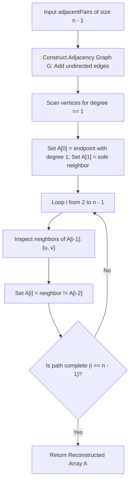

# Guided Example: Restore the Array From Adjacent Pairs

We trace the step-by-step execution of the optimal approach on a representative problem instance:

- **Input:** `adjacentPairs = [[2, 1], [3, 4], [3, 2]]`
- **Required Output:** `[1, 2, 3, 4]`

This instance features unordered pairs from an underlying 4-element permutation with internal and boundary vertices, illustrating how graph degree classification isolates path endpoints and enables deterministic linear-time chain traversal.

---

## 1. Instance & Teaching Goal

We are given $n - 1$ unordered adjacent pairs from a hidden array `nums` of $n$ strictly distinct elements. The pairs are presented in an arbitrary order, and each individual pair $[u, v]$ may have its endpoints flipped. We must reconstruct and return the original array `nums` (either forward or reversed).

A naive permutation search inspects $n!$ candidates, which is entirely infeasible for $n \le 10^5$.
By interpreting each adjacent pair as an undirected edge in a graph:
- A linear array of $n$ distinct elements forms a simple path graph $P_n$.
- Exactly two vertices have degree $1$ (the two terminal endpoints of the array).
- Every internal vertex has degree exactly $2$ (connected to its immediate left and right neighbors).
- Starting from either degree-1 vertex, we can walk the unique path from neighbor to neighbor, choosing at each step the neighbor that has not just been visited.

---

## 2. Conceptual Foundation & Invariants

### State Representation

| Component | Definition | Property |
|---|---|---|
| Adjacency Graph $G$ | Mapping $u \mapsto \text{neighbors}(u)$ | Degrees: $\deg(u) \in \{1, 2\}$ |
| Array Length $n$ | Total vertices: $|E| + 1 = \text{len}(\text{adjacentPairs}) + 1$ | Target output size |
| Reconstructed Array $A$ | Output sequence of vertices $[A_0, A_1, \dots, A_{n-1}]$ | Simple path traversal |

### Mathematical Invariants

> **Path Graph Endpoint Identification Theorem.**
> In any connected simple path graph $P_n = (V, E)$ with $|V| = n \ge 2$ and $|E| = n - 1$:
> $$\sum_{v \in V} \deg(v) = 2(n - 1) = 2n - 2$$
> Since the graph is connected, $\deg(v) \ge 1$ for all $v$. To satisfy the degree sum, exactly two vertices have $\deg(v) = 1$, and all remaining $n - 2$ vertices have $\deg(v) = 2$.
> The two vertices with $\deg(v) = 1$ are the unique endpoints of the path ($A_0$ and $A_{n-1}$).

> **Degree-2 Linear Propagation Invariant.**
> For any step $i \in \{2, \dots, n-1\}$, the current vertex $A_{i-1}$ has degree $2$. Its two neighbors in $G$ are its predecessor $A_{i-2}$ and its successor $A_i$:
> $$\mathcal{N}(A_{i-1}) = \{A_{i-2}, A_i\}$$
> The next vertex is uniquely determined by set difference:
> $$A_i = \mathcal{N}(A_{i-1}) \setminus \{A_{i-2}\}$$

---

## 3. Step-by-Step Worked Execution

For `adjacentPairs = [[2, 1], [3, 4], [3, 2]]`:
- Number of edges: $3 \implies n = 3 + 1 = 4$.

### Step 1: Construct Adjacency Graph

We insert both directions for each pair:
- Pair $[2, 1]$: add edge $2 \leftrightarrow 1$
- Pair $[3, 4]$: add edge $3 \leftrightarrow 4$
- Pair $[3, 2]$: add edge $3 \leftrightarrow 2$

Graph Adjacency Lists:
- $1: [2]$ (Degree $1$)
- $2: [1, 3]$ (Degree $2$)
- $3: [4, 2]$ (Degree $2$)
- $4: [3]$ (Degree $1$)

---

### Step 2: Identify Starting Endpoint

We scan the graph for any vertex with degree $1$:
- Vertex $1$ has $|\mathcal{N}(1)| = 1$.
- Vertex $1$ is chosen as the array head:
  $$A_0 = 1$$
- Its sole neighbor is $2$:
  $$A_1 = 2$$

---

### Step 3: Sequential Path Traversal

We fill indices $i = 2$ and $i = 3$:

1. **For index $i = 2$ (predecessors: $A_0 = 1, A_1 = 2$):**
   - Inspect neighbors of $A_1 = 2$: $\mathcal{N}(2) = [1, 3]$.
   - Neighbor $1$ is $A_0$ (already visited).
   - Therefore, the unvisited successor is $3$:
     $$A_2 = 3$$

2. **For index $i = 3$ (predecessors: $A_1 = 2, A_2 = 3$):**
   - Inspect neighbors of $A_2 = 3$: $\mathcal{N}(3) = [4, 2]$.
   - Neighbor $2$ is $A_1$ (already visited).
   - Therefore, the unvisited successor is $4$:
     $$A_3 = 4$$

The traversal reaches the terminal vertex (degree 1).
Reconstructed array: $[1, 2, 3, 4]$.

---

## 4. Complete Execution Trace

| Step | Current Position | Predecessor $A_{i-2}$ | Active Vertex $A_{i-1}$ | Neighbors Examined | Selected Successor $A_i$ | Running Array |
|---|---|---|---|---|---|---|
| Initialization | Head Selection | None | None | Scan for degree $1$ | $A_0 \leftarrow 1$ | $[1]$ |
| Base Neighbor | Head's Sole Link | None | $1$ | $\mathcal{N}(1) = [2]$ | $A_1 \leftarrow 2$ | $[1, 2]$ |
| Step $i = 2$ | Interior Walk | $1$ | $2$ | $\mathcal{N}(2) = [1, 3]$ | $A_2 \leftarrow 3$ | $[1, 2, 3]$ |
| Step $i = 3$ | Terminal Walk | $2$ | $3$ | $\mathcal{N}(3) = [4, 2]$ | $A_3 \leftarrow 4$ | $[1, 2, 3, 4]$ |

Output: `[1, 2, 3, 4]`.

---

## 5. Algorithmic Mastery & Edge Surfacing

### Boundary and Edge Cases

| Scenario | Input Example | Expected Output | Strategic Handling |
|---|---|---|---|
| Minimal Array ($n = 2$) | `[[1, 2]]` | `[1, 2]` (or `[2, 1]`) | Both vertices have degree 1; $A_0 = 1, A_1 = 2$. |
| Reversed Valid Sequence | Same pairs, picked other endpoint | `[4, 3, 2, 1]` | Both forward and backward orientations are fully valid. |
| Negative Element Values | `[[-1, -2], [-2, 3]]` | `[-1, -2, 3]` | Hash map naturally supports arbitrary integer keys without indexing offsets. |
| Large Input ($n = 10^5$) | $10^5$ elements | Single linear pass | Graph construction and traversal execute in $\mathcal{O}(n)$ time. |

### Invariant Maintenance & Why It Works

1. **Why No Visited Set Is Needed During Traversal:**
   Because the graph is an acyclic simple path, the only visited neighbor of $A_{i-1}$ is its immediate predecessor $A_{i-2}$. Checking `neighbor != A[i-2]` is necessary and sufficient to prevent backtracking, eliminating the memory and hashing overhead of a visited hash set.
2. **Deterministic Uniqueness:**
   A degree-1 start ensures that the path begins at a boundary. Since each interior vertex has degree $2$, there is always exactly one forward direction, guaranteeing no dead ends or branching conflicts.

### Complexity Analysis

- **Time Complexity:** $\mathcal{O}(n)$ where $n$ is the number of elements in the restored array. Building the adjacency list from $n - 1$ edges takes $\mathcal{O}(n)$ time. Finding a degree-1 node takes $\mathcal{O}(n)$ time, and walking the path visits each vertex once in $\mathcal{O}(1)$ time per step. Total time is strictly $\mathcal{O}(n)$.
- **Space Complexity:** $\mathcal{O}(n)$ auxiliary space to store the adjacency list mapping each vertex to its 1 or 2 neighbors, plus the output array.
