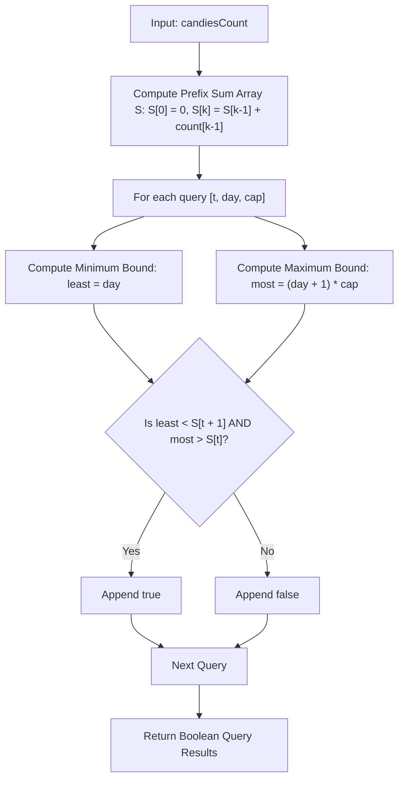

# Guided Example: Can You Eat Your Favorite Candy on Your Favorite Day?

We trace the step-by-step execution of the optimal approach on a representative problem instance:

- **Input:**
  - `candiesCount = [7, 4, 5, 3, 8]`
  - `queries = [[0, 2, 2], [4, 2, 4], [2, 13, 1000000000]]`
- **Required Output:** `[true, false, true]`

This instance features multiple query scenarios—early accessible candy types, unreachable distant candy types under tight consumption caps, and deep day targets under high caps—illustrating how prefix sum interval intersection solves each query in constant time.

---

## 1. Instance & Teaching Goal

We are given an array `candiesCount` where `candiesCount[i]` represents the quantity of candies of type $i$ (0-indexed). Candies must be consumed in strict type order: all candies of type $0$ must be finished before eating type $1$, and so on.

Each query provides three parameters: $[t, d, c]$:
- $t$: Target candy type (`favoriteType`)
- $d$: Target day (`favoriteDay`, 0-indexed, where day $0$ is the first day)
- $c$: Maximum candies allowed per day (`dailyCap`)

Every day, we must eat at least $1$ candy and at most $c$ candies. We must decide if there exists any valid eating schedule such that we eat at least one candy of type $t$ on day $d$.

A simulation of daily eating choices branches into an intractable state space. Because the eating order is strictly linear, the candies of type $t$ occupy a fixed 1-indexed contiguous interval of candy numbers $[S[t] + 1, S[t+1]]$. The problem reduces to testing whether the interval of attainable candy counts on day $d$ overlaps with the interval of type $t$ candies.

---

## 2. Conceptual Foundation & Invariants

### State Representation

| Component | Definition | Mathematical Formula |
|---|---|---|
| Prefix Sum Array $S$ | Total candies in types strictly preceding type $k$ | $S[k] = \sum_{j=0}^{k-1} \text{candiesCount}[j]$ |
| Target Type Range | 1-indexed interval of candy numbers belonging to type $t$ | $[S[t] + 1, S[t+1]]$ |
| Minimum Eaten by Day $d$ | Lowest possible cumulative candies eaten through day $d$ | $\text{least} = d + 1$ (eating 1 per day) |
| Maximum Eaten by Day $d$ | Highest possible cumulative candies eaten through day $d$ | $\text{most} = (d + 1) \cdot c$ (eating $c$ per day) |

### Mathematical Invariants

> **Prefix Sum Interval Overlap Theorem.**
> Let all candies be numbered sequentially from $1$ to $\sum \text{candiesCount}[i]$. Candies of type $t$ occupy the exact integer positions:
> $$\mathcal{I}_{\text{target}} = [S[t] + 1, S[t+1]]$$
> On day $d$ (after $d + 1$ active days), the cumulative number of candies consumed by the end of day $d$ lies within:
> $$\mathcal{I}_{\text{day}} = [d + 1, (d + 1) \cdot c]$$
> A candy of type $t$ can be eaten on day $d$ if and only if there is a valid schedule where the candy consumed falls within $\mathcal{I}_{\text{target}}$. This holds if and only if the day's attainable interval overlaps with the target type's span:
> 1. We must not have exhausted all type $t$ candies before day $d$:
>    $$\text{candies eaten before day } d < S[t+1] \iff d < S[t+1]$$
> 2. We must be able to reach beyond all preceding candy types by day $d$:
>    $$\text{maximum candies eaten through day } d > S[t] \iff (d + 1) \cdot c > S[t]$$

---

## 3. Step-by-Step Worked Execution

For `candiesCount = [7, 4, 5, 3, 8]`:

### Phase 1: Precompute Cumulative Prefix Sums ($S$)

- $S[0] = 0$
- $S[1] = S[0] + 7 = 7$ (candies of type 0: $1 \dots 7$)
- $S[2] = S[1] + 4 = 11$ (candies of type 1: $8 \dots 11$)
- $S[3] = S[2] + 5 = 16$ (candies of type 2: $12 \dots 16$)
- $S[4] = S[3] + 3 = 19$ (candies of type 3: $17 \dots 19$)
- $S[5] = S[4] + 8 = 27$ (candies of type 4: $20 \dots 27$)

Prefix array: $S = [0, 7, 11, 16, 19, 27]$.

---

### Phase 2: Process Queries

#### Query 0: `[t = 0, d = 2, c = 2]`
- Target type $0$: Candies span $[S[0] + 1, S[1]] = [1, 7]$.
- Bound 1 (Not exhausted before day 2):
  $$\text{least} = d = 2 < S[1] = 7 \quad (\text{Valid}: 2 < 7)$$
  Eating $1$ candy on day $0$ and $1$ candy on day $1$ consumes $2$ candies, leaving candy $3 \le 7$ available on day $2$.
- Bound 2 (Reaching type 0):
  $$\text{most} = (d + 1) \cdot c = (2 + 1) \cdot 2 = 6 > S[0] = 0 \quad (\text{Valid}: 6 > 0)$$
- Outcome: Both inequalities hold $\implies \mathbf{true}$.

#### Query 1: `[t = 4, d = 2, c = 4]`
- Target type $4$: Candies span $[S[4] + 1, S[5]] = [20, 27]$.
- Candies before type 4: $S[4] = 19$.
- Maximum reachable candies by day 2:
  $$\text{most} = (d + 1) \cdot c = (2 + 1) \cdot 4 = 12$$
- Bound 2 Check:
  $$\text{most} > S[4] \iff 12 > 19 \quad (\mathbf{False})$$
- Analysis: Even eating the maximum allowed $4$ candies on each of days $0, 1, 2$ consumes only $12$ candies, which cannot even finish type $1$ (requiring $11$) and type $2$ (requiring $16$). Type $4$ is unreachable.
- Outcome: $\mathbf{false}$.

#### Query 2: `[t = 2, d = 13, c = 10^9]`
- Target type $2$: Candies span $[S[2] + 1, S[3]] = [12, 16]$.
- Bound 1 Check:
  $$\text{least} = d = 13 < S[3] = 16 \quad (\text{Valid}: 13 < 16)$$
  Eating $1$ candy per day on days $0 \dots 12$ consumes $13$ candies. Since $13 < 16$, type 2 candies ($14, 15, 16$) remain unconsumed on day $13$.
- Bound 2 Check:
  $$\text{most} = (13 + 1) \cdot 10^9 = 1.4 \times 10^{10} > S[2] = 11 \quad (\text{Valid})$$
- Outcome: Both inequalities hold $\implies \mathbf{true}$.

Final result: `[true, false, true]`.

---

## 4. Complete Execution Trace

| Query Index | Query $[t, d, c]$ | Target Interval $[S[t]+1, S[t+1]]$ | Cumulative Bounds $[\text{least}, \text{most}]$ | Evaluation Check | Output |
|---|---|---|---|---|---|
| $0$ | $[0, 2, 2]$ | $[1, 7]$ | $\text{least}=2, \text{most}=6$ | $2 < 7 \land 6 > 0$ | `true` |
| $1$ | $[4, 2, 4]$ | $[20, 27]$ | $\text{least}=2, \text{most}=12$ | $2 < 27 \land 12 > 19$ (Fails) | `false` |
| $2$ | $[2, 13, 10^9]$ | $[12, 16]$ | $\text{least}=13, \text{most}=1.4 \cdot 10^{10}$ | $13 < 16 \land 1.4 \cdot 10^{10} > 11$ | `true` |

---

## 5. Algorithmic Mastery & Edge Surfacing

### Boundary and Edge Cases

| Scenario | Feature | Expected Behavior | Strategic Handling |
|---|---|---|---|
| Target on Day 0 | $d = 0$ | Checks if reachable on initial day | $\text{least} = 0 < S[t+1]$, $\text{most} = c > S[t]$. |
| Cap = 1 (Deterministic) | $c = 1$ | Exactly $d + 1$ candies eaten | $\text{least} = \text{most} = d + 1$; checks if $d + 1 \in [S[t]+1, S[t+1]]$. |
| Huge Day ($d \ge \text{TotalCandies}$) | $d \ge S[\text{last}]$ | `false` | $\text{least} = d \ge S[t+1]$; candies run out before day $d$. |
| Large Products ($d \cdot c$) | $d = 10^5, c = 10^9$ | No 64-bit overflow | $(d + 1) \cdot c \approx 10^{14}$, safely fitting within standard 64-bit integer types. |

### Invariant Maintenance & Why It Works

1. **Strict Day Offsets:**
   Because at least 1 candy must be eaten each day, by day $d$ (after $d$ days have passed, days $0 \dots d-1$), at least $d$ candies have been consumed. Thus, if $d \ge S[t+1]$, all type $t$ candies were already eaten on or before day $d-1$, making it impossible to eat type $t$ on day $d$.
2. **Attainability of Intermediate Counts:**
   Because each day's consumption can be chosen freely as any integer in $[1, c]$, the set of reachable cumulative candy totals at the end of day $d$ forms a complete contiguous range of integers $[d + 1, (d + 1) \cdot c]$.

### Complexity Analysis

- **Time Complexity:** $\mathcal{O}(C + Q)$ where $C$ is the length of `candiesCount` and $Q$ is the number of queries. Precomputing the prefix sum array $S$ takes $\mathcal{O}(C)$ time. Each query evaluates two arithmetic comparisons in $\mathcal{O}(1)$ time.
- **Space Complexity:** $\mathcal{O}(C)$ auxiliary space to store the prefix sum array $S$.
