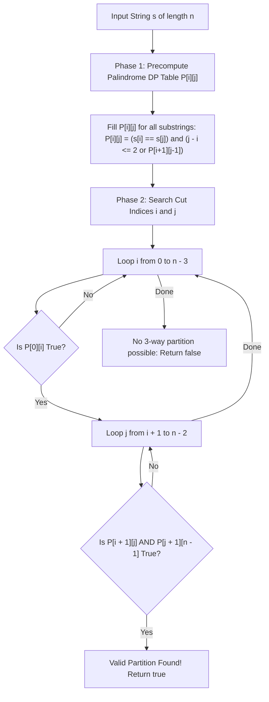

# Guided Example: Palindrome Partitioning IV

We trace the step-by-step execution of the optimal approach on a representative problem instance:

- **Input:** `s = "abcbdd"`
- **Required Output:** `true`

This instance features non-uniform character patterns containing both odd-length and even-length palindromic substrings, demonstrating how 2D interval dynamic programming precomputes palindrome predicates to validate a 3-part partition in quadratic time.

---

## 1. Instance & Teaching Goal

Given a string `s` of length $n$, we must determine whether `s` can be partitioned into **three non-empty palindromic substrings**. That is, we seek two cut indices $i$ and $j$ such that $0 \le i < j < n - 1$ where:
1. The prefix $s[0 \dots i]$ is a palindrome.
2. The middle substring $s[i + 1 \dots j]$ is a palindrome.
3. The suffix $s[j + 1 \dots n - 1]$ is a palindrome.

A naive check tests all $\binom{n-1}{2} = \mathcal{O}(n^2)$ cut pairs, and verifies each of the three substrings in $\mathcal{O}(n)$ time, leading to an inefficient $\mathcal{O}(n^3)$ approach. The optimal method decouples substring verification from cut search:
- Precompute an $n \times n$ table $P[i][j]$ indicating whether $s[i \dots j]$ is a palindrome using $\mathcal{O}(n^2)$ interval dynamic programming.
- Iterate over all valid split pairs $(i, j)$ in $\mathcal{O}(n^2)$ time, checking $P[0][i] \land P[i+1][j] \land P[j+1][n-1]$ in $\mathcal{O}(1)$ time per pair.

---

## 2. Conceptual Foundation & Invariants

### State Representation

| Component | Mathematical Definition | Property |
|---|---|---|
| Palindrome Matrix $P[i][j]$ | Boolean indicator: is $s[i \dots j]$ a palindrome? | True $\iff s[i \dots j] = s[i \dots j]^R$ |
| Cut Indices $(i, j)$ | Two cut points dividing string into 3 non-empty pieces | $0 \le i < j < n - 1$ |
| Tripartite Validity Condition | $P[0][i] \land P[i + 1][j] \land P[j + 1][n - 1]$ | Boolean truth of complete partition |

### Mathematical Invariants

> **Palindromic Interval Recurrence.**
> A substring $s[i \dots j]$ is a palindrome if and only if its endpoint characters match ($s[i] = s[j]$) and the interior substring $s[i+1 \dots j-1]$ is either empty/singleton ($j - i \le 2$) or also a palindrome:
> $$P[i][j] = (s[i] = s[j]) \land (j - i \le 2 \lor P[i + 1][j - 1])$$
> Evaluating this recurrence with $i$ descending from $n - 1$ down to $0$ guarantees that the state $P[i+1][j-1]$ has already been resolved before $P[i][j]$ is computed.

> **Tripartite Partition Exhaustion Invariant.**
> Any valid 3-palindrome partition must have non-empty pieces. Thus:
> - Part 1: ends at index $i \in \{0, \dots, n-3\}$.
> - Part 2: ends at index $j \in \{i+1, \dots, n-2\}$.
> - Part 3: spans $j+1 \dots n-1$, with length $\ge 1$.
> If any pair $(i, j)$ yields true for all three segments, the function immediately terminates with `true`. If no pair satisfies the condition after exhaustive search, `false` is returned.

---

## 3. Step-by-Step Worked Execution

Given `s = "abcbdd"` of length $n = 6$:
- Indexed characters: $s[0]=\text{'a'}, s[1]=\text{'b'}, s[2]=\text{'c'}, s[3]=\text{'b'}, s[4]=\text{'d'}, s[5]=\text{'d'}$.

### Phase 1: Precompute Palindrome Table $P[i][j]$

All single letters $P[k][k]$ are true.
Evaluating key multi-character substrings:
- $s[0 \dots 0] = \text{"a"}$: Palindrome $\implies P[0][0] = \text{True}$.
- $s[1 \dots 3] = \text{"bcb"}$: $s[1] = s[3] = \text{'b'}$, inner $s[2 \dots 2] = \text{"c"}$ is true $\implies P[1][3] = \text{True}$.
- $s[4 \dots 5] = \text{"dd"}$: $s[4] = s[5] = \text{'d'}$, length $2 \implies P[4][5] = \text{True}$.
- $s[0 \dots 2] = \text{"abc"}$: $s[0] \neq s[2] \implies P[0][2] = \text{False}$.
- $s[1 \dots 4] = \text{"bcbd"}$: $s[1] \neq s[4] \implies P[1][4] = \text{False}$.

---

### Phase 2: Search Candidate Cut Points $(i, j)$

Constraints: $0 \le i \le 3$, $i + 1 \le j \le 4$.

#### Candidate $i = 0$ (Part 1: $s[0 \dots 0] = \text{"a"}$)
- Check $P[0][0]$: $\text{"a"}$ is a palindrome (True).
- Now test possible values for $j \in \{1, 2, 3, 4\}$:

1. **Test $j = 1$:**
   - Part 2: $s[1 \dots 1] = \text{"b"}$ (Palindrome, True).
   - Part 3: $s[2 \dots 5] = \text{"cbdd"}$. Is $s[2 \dots 5]$ a palindrome?
     - $s[2]=\text{'c'} \neq s[5]=\text{'d'} \implies P[2][5] = \text{False}$.
   - Result: Failed.

2. **Test $j = 2$:**
   - Part 2: $s[1 \dots 2] = \text{"bc"}$.
     - $s[1] \neq s[2] \implies P[1][2] = \text{False}$.
   - Result: Failed.

3. **Test $j = 3$:**
   - Part 2: $s[1 \dots 3] = \text{"bcb"}$.
     - $s[1] = s[3] = \text{'b'}$, center $\text{'c'} \implies P[1][3] = \text{True}$!
   - Part 3: $s[4 \dots 5] = \text{"dd"}$.
     - $s[4] = s[5] = \text{'d'} \implies P[4][5] = \text{True}$!
   - Verification of all 3 parts:
     - Part 1: $P[0][0] = \text{True}$ (`"a"`)
     - Part 2: $P[1][3] = \text{True}$ (`"bcb"`)
     - Part 3: $P[4][5] = \text{True}$ (`"dd"`)

All three parts are valid non-empty palindromes!
The search immediately terminates with result $\mathbf{true}$.

---

## 4. Complete Execution Trace

| Cut Pair $(i, j)$ | Part 1 $s[0 \dots i]$ | $P[0][i]$ | Part 2 $s[i+1 \dots j]$ | $P[i+1][j]$ | Part 3 $s[j+1 \dots 5]$ | $P[j+1][5]$ | All Valid? |
|---|---|---|---|---|---|---|---|
| $(0, 1)$ | `"a"` | True | `"b"` | True | `"cbdd"` | False | No |
| $(0, 2)$ | `"a"` | True | `"bc"` | False | `"bdd"` | False | No |
| **$(0, 3)$** | **`"a"`** | **True** | **`"bcb"`** | **True** | **`"dd"`** | **True** | **Yes (Halts)** |

Output: `true`.

---

## 5. Algorithmic Mastery & Edge Surfacing

### Boundary and Edge Cases

| Scenario | Input Example | Expected Output | Strategic Handling |
|---|---|---|---|
| Minimum Length ($n = 3$) | `s = "abc"` | `true` | Each part has length 1: `"a"`, `"b"`, `"c"`, each trivially a palindrome. |
| Monotonous String | `s = "aaaaa"` | `true` | Any partition produces palindromes. Discovered at $(0, 1)$. |
| Impossible Partition | `s = "bcbddxy"` | `false` | No valid cut pair produces three palindromes; loop completes and returns `false`. |
| Single Long Palindrome | `s = "abacaba"` | `true` | Can be split into `"a"`, `"bacab"`, `"a"`. |

### Invariant Maintenance & Why It Works

1. **Order of DP Computation:**
   Evaluating $i$ in descending order ($n-1$ down to $0$) and $j$ in ascending order ($i+1$ up to $n-1$) ensures that whenever $P[i][j]$ references $P[i+1][j-1]$, that smaller internal subproblem has already been computed.
2. **Early Termination:**
   The algorithm halts on the very first valid pair $(i, j)$ discovered, avoiding unnecessary iterations when a feasible split is located early.

### Complexity Analysis

- **Time Complexity:** $\mathcal{O}(n^2)$ where $n$ is the length of string `s`.
  - Filling the 2D boolean DP table takes $\frac{n(n+1)}{2}$ steps, each $\mathcal{O}(1)$.
  - The nested loops for cuts test at most $\frac{(n-2)(n-1)}{2}$ pairs, each requiring $\mathcal{O}(1)$ table lookups.
  - For $n \le 2000$, $\mathcal{O}(n^2) \approx 4 \times 10^6$ operations, executing comfortably within time limits.
- **Space Complexity:** $\mathcal{O}(n^2)$ auxiliary space to store the $n \times n$ boolean palindrome table $P$.