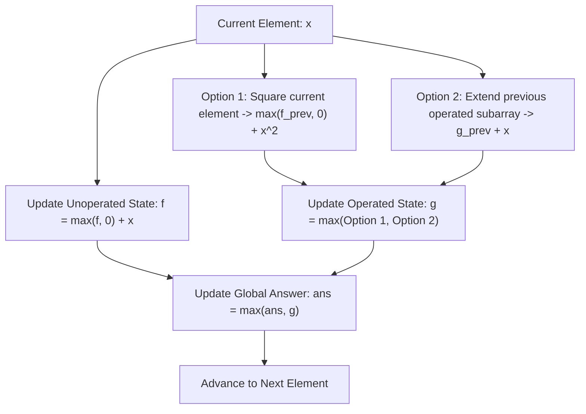

# Guided Example: Maximum Subarray Sum After One Operation

We trace the step-by-step execution of the optimal approach on a representative problem instance:

- **Input:** `nums = [2, -1, -4, -3]`
- **Required Output:** `17`

This instance features negative elements where squaring a large negative value converts a penalty into a massive positive boost, illustrating how dual-state Kadane dynamic programming tracks zero-operation and one-operation maximum subarray sums in linear time and constant space.

---

## 1. Instance & Teaching Goal

Given an integer array `nums`, we must perform **exactly one** operation: select an element `nums[i]` and replace it with `nums[i] * nums[i]`. We seek the maximum possible contiguous subarray sum after this substitution.

In classical Kadane's algorithm, we maintain a single running maximum subarray sum ending at each index. Here:
- The subarray may optionally extend before the squared element, include the squared element, and continue after it.
- Since squaring an integer yields $x^2 \ge x$ (and $x^2 \ge 0$), the optimal subarray will naturally encompass the squared element itself.
- We decompose the state into two mutually exclusive tracks: whether the single squaring operation has **not yet** been applied, or has **already** been applied.

---

## 2. Conceptual Foundation & Invariants

### State Representation

At each step $k$, we maintain two state variables for subarrays ending at index $k$:

| State Variable | Definition | Allowed Transitions |
|---|---|---|
| $f_k$ | Maximum subarray sum ending at $k$ with **0 operations** applied | Extend $f_{k-1}$ or start fresh at $x$: $\max(f_{k-1}, 0) + x$ |
| $g_k$ | Maximum subarray sum ending at $k$ with **exactly 1 operation** applied | 1) Apply operation now to $x$: $\max(f_{k-1}, 0) + x^2$ 2) Operation used earlier: $g_{k-1} + x$ |
| Global Maximum $M$ | Best subarray sum across all indices using 1 operation | Running maximum over all $g_k$ (and $f_k$) |

### Mathematical Invariants

> **Dual-State Kadane Recurrence.**
> For each element $x = \text{nums}[k]$:
> 1. **Unmodified Track:**
>    $$f_k = \max(f_{k-1}, 0) + x$$
> 2. **Modified Track:**
>    $$g_k = \max \Big( \max(f_{k-1}, 0) + x^2, \; g_{k-1} + x \Big)$$
> The first option in $g_k$ consumes the operation at the current element $x$, using the best zero-operation prefix $\max(f_{k-1}, 0)$. The second option extends a previously modified subarray by adding the unmodified value $x$.

> **Global Optimality Invariant.**
> Because exactly one operation must be performed, the global optimum is achieved at the peak of the modified state:
> $$M^* = \max_{0 \le k < n} g_k$$
> Each candidate subarray represented by $g_k$ contains strictly one squared term.

---

## 3. Step-by-Step Worked Execution

We trace `nums = [2, -1, -4, -3]` with $n = 4$:
- Initial values: $f = 0, g = 0$, running answer $M = -\infty$.

---

### Step 1: Process $x = 2$ (Index 0)
- Previous states: $f = 0, g = 0$.
- Unoperated update:
  $$f \leftarrow \max(0, 0) + 2 = 2$$
- Operated update ($x^2 = 2^2 = 4$):
  - Option 1 (square current): $\max(0, 0) + 4 = 4$
  - Option 2 (extend previous): $0 + 2 = 2$
  $$g \leftarrow \max(4, 2) = 4$$
- Running Maximum: $M = \max(-\infty, 4) = \mathbf{4}$.
- Subarray for $g$: $[2^2] = [4]$.

---

### Step 2: Process $x = -1$ (Index 1)
- Previous states: $f = 2, g = 4$.
- Unoperated update:
  $$f \leftarrow \max(2, 0) + (-1) = 2 - 1 = 1$$
- Operated update ($x^2 = (-1)^2 = 1$):
  - Option 1 (square current): $\max(2, 0) + 1 = 2 + 1 = 3$ (subarray $[2, (-1)^2] = 3$)
  - Option 2 (extend previous): $g + x = 4 + (-1) = 3$ (subarray $[2^2, -1] = 3$)
  $$g \leftarrow \max(3, 3) = 3$$
- Running Maximum: $M = \max(4, 3) = \mathbf{4}$.

---

### Step 3: Process $x = -4$ (Index 2)
- Previous states: $f = 1, g = 3$.
- Unoperated update:
  $$f \leftarrow \max(1, 0) + (-4) = 1 - 4 = -3$$
- Operated update ($x^2 = (-4)^2 = 16$):
  - Option 1 (square current): $\max(1, 0) + 16 = 1 + 16 = \mathbf{17}$
    (Corresponds to prefix $[2, -1]$ with sum $1$, followed by $(-4)^2 = 16$, total sum $1 + 16 = 17$)
  - Option 2 (extend previous): $g + x = 3 + (-4) = -1$
  $$g \leftarrow \max(17, -1) = 17$$
- Running Maximum: $M = \max(4, 17) = \mathbf{17}$.
- Subarray for $g$: $[2, -1, (-4)^2] \implies 2 - 1 + 16 = 17$.

---

### Step 4: Process $x = -3$ (Index 3)
- Previous states: $f = -3, g = 17$.
- Unoperated update:
  $$f \leftarrow \max(-3, 0) + (-3) = 0 - 3 = -3$$
- Operated update ($x^2 = (-3)^2 = 9$):
  - Option 1 (square current): $\max(-3, 0) + 9 = 0 + 9 = 9$
  - Option 2 (extend previous): $g + x = 17 + (-3) = 14$
  $$g \leftarrow \max(9, 14) = 14$$
- Running Maximum: $M = \max(17, 14) = \mathbf{17}$.

---

## 4. Complete Execution Trace

| Index | Element $x$ | $x^2$ | $f = \max(f_{\text{prev}}, 0) + x$ | $g = \max(f_{\text{prev}}^+ + x^2, g_{\text{prev}} + x)$ | Running Answer $M$ | Best Subarray Found |
|---|---|---|---|---|---|---|
| $0$ | $2$ | $4$ | $2$ | $\max(4, 2) = 4$ | $4$ | $[2^2]$ |
| $1$ | $-1$ | $1$ | $1$ | $\max(3, 3) = 3$ | $4$ | $[2^2]$ |
| $2$ | $-4$ | $16$ | $-3$ | $\max(1 + 16, 3 - 4) = 17$ | **$17$** | $[2, -1, (-4)^2]$ |
| $3$ | $-3$ | $9$ | $-3$ | $\max(0 + 9, 17 - 3) = 14$ | $17$ | $[2, -1, (-4)^2]$ |

Final Result: $17$.

---

## 5. Algorithmic Mastery & Edge Surfacing

### Boundary and Edge Cases

| Scenario | Input Example | Expected Output | Strategic Handling |
|---|---|---|---|
| All Negative Elements | `[-2, -3, -1]` | $1$ | Squaring $-1$ yields $(-1)^2 = 1$; best subarray is $[(-1)^2]$. |
| Single Element Array | `[-5]` | $25$ | Only option is $(-5)^2 = 25$. |
| All Positive Elements | `[1, 2, 3]` | $11$ | Square the largest element $3 \implies [1, 2, 3^2] = 1 + 2 + 9 = 12$. |
| Element Equals Zero | `[0, 0, 0]` | $0$ | Squaring $0$ yields $0$; max subarray sum is $0$. |

### Invariant Maintenance & Why It Works

1. **Strictly One Operation:**
   The state $g$ can only be entered from $f$ (which has zero operations). Once inside $g$, further steps can only use the second transition ($g + x$), ensuring no second squaring operation is ever executed.
2. **Space Invariance:**
   Because each step depends solely on the values $f_{k-1}$ and $g_{k-1}$ from the immediately preceding element, state can be updated using two scalar registers, eliminating the need for an $\mathcal{O}(n)$ table.

### Complexity Analysis

- **Time Complexity:** $\mathcal{O}(n)$ where $n$ is the length of `nums`. The algorithm visits each element exactly once, performing a constant number of arithmetic operations per element.
- **Space Complexity:** $\mathcal{O}(1)$ auxiliary space, maintaining only scalar accumulators.