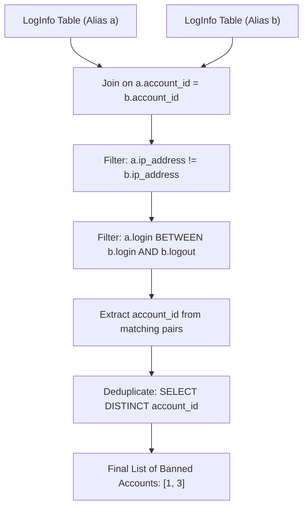

# Guided Example: Leetflex Banned Accounts

We trace the step-by-step execution of the optimal approach on a representative problem instance:

- **Input Table (`LogInfo`):**
  | `account_id` | `ip_address` | `login` | `logout` |
  |---|---|---|---|
  | `1` | `1` | `2021-02-01 09:00:00` | `2021-02-01 09:30:00` |
  | `1` | `2` | `2021-02-01 08:00:00` | `2021-02-01 11:30:00` |
  | `2` | `6` | `2021-02-01 20:30:00` | `2021-02-01 22:00:00` |
  | `2` | `6` | `2021-02-01 20:30:00` | `2021-02-01 22:00:00` |
  | `3` | `7` | `2021-02-01 10:00:00` | `2021-02-01 11:00:00` |
  | `3` | `3` | `2021-02-01 11:00:00` | `2021-02-01 12:00:00` |
  | `4` | `10` | `2021-02-01 16:00:00` | `2021-02-01 17:00:00` |
  | `4` | `11` | `2021-02-01 17:00:01` | `2021-02-01 17:05:00` |
- **Required Output:**
  | `account_id` |
  |---|
  | `1` |
  | `3` |

This instance spans genuine concurrent sessions from distinct IPs, concurrent sessions from identical IPs, boundary-touching timestamps, and non-overlapping sequential logins, demonstrating how theta self-joins detect temporal concurrency violations.

---

## 1. Instance & Teaching Goal

We are given a log table `LogInfo` containing user session records with attributes:
$$(\text{account\_id} : \text{INT}, \text{ip\_address} : \text{INT}, \text{login} : \text{TIMESTAMP}, \text{logout} : \text{TIMESTAMP})$$
An account must be banned if and only if it was used to log in from **two different IP addresses** at the **same time** (temporal overlap between intervals $[\text{login}_a, \text{logout}_a]$ and $[\text{login}_b, \text{logout}_b]$ with $\text{ip}_a \neq \text{ip}_b$).

Our goal is to return the distinct set of banned `account_id` values in any order.

A naive conceptual loop compares all pairs of rows across the entire database. In relational algebra, an equijoin on $\text{account\_id}$ restricts comparisons to sessions within the same user account, while theta-join filters enforce differing IP addresses and temporal interval collision.

---

## 2. Conceptual Foundation & Invariants

### State Representation

| Relational Step | Predicate / Operation | Purpose |
|---|---|---|
| Self-Join Matching | $a.\text{account\_id} = b.\text{account\_id}$ | Restricts comparisons strictly to the same account |
| IP Inequality | $a.\text{ip\_address} \neq b.\text{ip\_address}$ | Disallows single-device or same-network multi-tab collisions |
| Temporal Overlap | $a.\text{login} \text{ BETWEEN } b.\text{login} \text{ AND } b.\text{logout}$ | Validates interval collision at point $a.\text{login}$ |
| Distinct Projection | $\pi_{\text{DISTINCT } a.\text{account\_id}}$ | Deduplicates multiple witnessing overlaps |

### Mathematical Invariants

> **Concurrent Interval Intersection Theorem.**
> Let $I_a = [s_a, e_a]$ and $I_b = [s_b, e_b]$ be two closed continuous time intervals with $s_a \le e_a$ and $s_b \le e_b$.
> The intervals have non-empty intersection ($I_a \cap I_b \neq \emptyset$) if and only if:
> $$\max(s_a, s_b) \le \min(e_a, e_b)$$
> Without loss of generality, let $s_a \ge s_b$. Then $s_a \le e_b$, which is precisely the relational statement:
> $$s_a \in [s_b, e_b] \iff s_a \text{ BETWEEN } s_b \text{ AND } e_b$$
> In an exhaustive self-join checking all ordered pairs $(a, b)$, the pair ordered such that $a$ starts later or at the same time as $b$ will satisfy $a.\text{login} \text{ BETWEEN } b.\text{login} \text{ AND } b.\text{logout}$.

---

## 3. Step-by-Step Worked Execution

We evaluate candidates per account:

### Account 1 Analysis
- Session $a$: IP $1$, $[09:00:00, 09:30:00]$
- Session $b$: IP $2$, $[08:00:00, 11:30:00]$
1. **Account Match:** $a.\text{account\_id} = b.\text{account\_id} = 1$ (Passed).
2. **IP Difference:** $\text{IP } 1 \neq \text{IP } 2$ (Passed).
3. **Temporal Intersection:**
   - $a.\text{login} = 09:00:00$
   - $b.\text{login} = 08:00:00 \le 09:00:00 \le 11:30:00 = b.\text{logout}$
   - $a.\text{login} \text{ BETWEEN } b.\text{login} \text{ AND } b.\text{logout}$ is **True**!
- Conclusion: Account $1$ logged in from two distinct IPs concurrently. **Account 1 is banned**.

---

### Account 2 Analysis
- Session $a$: IP $6$, $[20:30:00, 22:00:00]$
- Session $b$: IP $6$, $[20:30:00, 22:00:00]$
1. **Account Match:** $a.\text{account\_id} = b.\text{account\_id} = 2$ (Passed).
2. **IP Difference:** $a.\text{ip} = 6, b.\text{ip} = 6 \implies 6 \neq 6$ is **False**!
- Conclusion: Both sessions originate from the same IP address. **Account 2 is not banned**.

---

### Account 3 Analysis
- Session $a$: IP $7$, $[10:00:00, 11:00:00]$
- Session $b$: IP $3$, $[11:00:00, 12:00:00]$
1. **Account Match:** $a.\text{account\_id} = b.\text{account\_id} = 3$ (Passed).
2. **IP Difference:** $\text{IP } 7 \neq \text{IP } 3$ (Passed).
3. **Temporal Intersection:**
   - Take $b$ as the probe session: $b.\text{login} = 11:00:00$.
   - Interval for session $a$: $[10:00:00, 11:00:00]$.
   - $10:00:00 \le 11:00:00 \le 11:00:00$ is **True**!
- Conclusion: At exactly $11:00:00$, both IPs were simultaneously active on Account 3. **Account 3 is banned**.

---

### Account 4 Analysis
- Session $a$: IP $10$, $[16:00:00, 17:00:00]$
- Session $b$: IP $11$, $[17:00:01, 17:05:00]$
1. **Temporal Intersection:**
   - Session $a$ concludes at $17:00:00$.
   - Session $b$ begins at $17:00:01$.
   - Gap between sessions is $1$ second ($17:00:01 > 17:00:00$).
   - Neither login falls between the other's interval.
- Conclusion: Strictly sequential logins; no simultaneous presence. **Account 4 is not banned**.

---

## 4. Complete Execution Trace

| Account ID | Tested Pair $(a, b)$ | IP Inequality | Overlap Condition Evaluated | Banned Status |
|---|---|---|---|---|
| $1$ | $(a: \text{IP } 1, b: \text{IP } 2)$ | $1 \neq 2$ (True) | $09:00:00 \in [08:00:00, 11:30:00]$ (True) | **Banned** |
| $2$ | $(a: \text{IP } 6, b: \text{IP } 6)$ | $6 \neq 6$ (False) | Not evaluated | Safe |
| $3$ | $(b: \text{IP } 3, a: \text{IP } 7)$ | $3 \neq 7$ (True) | $11:00:00 \in [10:00:00, 11:00:00]$ (True) | **Banned** |
| $4$ | $(a: \text{IP } 10, b: \text{IP } 11)$ | $10 \neq 11$ (True) | $17:00:01 \notin [16:00:00, 17:00:00]$ (False) | Safe |

Final output relation:
| `account_id` |
|---|
| `1` |
| `3` |

---

## 5. Algorithmic Mastery & Edge Surfacing

### Boundary and Edge Cases

| Scenario | Detail | Expected Behavior | Strategic Handling |
|---|---|---|---|
| Instantaneous Overlap | Session 1 ends at $T$, Session 2 starts at $T$ from another IP | Account Banned | SQL `BETWEEN` is inclusive, detecting simultaneous active status at boundary second $T$. |
| Identical IP Re-login | User opens two tabs on same Wi-Fi | Account Not Banned | $a.\text{ip} \neq b.\text{ip}$ filter discards identical IP pairs. |
| Nested Sessions | Session 1 strictly inside Session 2 | Account Banned | $a.\text{login}$ falls inside $b$'s interval. |
| Zero Banned Accounts | All accounts follow strict single-session policies | Empty result set | Zero joined pairs survive the filters. |

### Invariant Maintenance & Why It Works

1. **Symmetry of Self-Join:**
   Because all permutations $(a, b)$ and $(b, a)$ are generated, the later session $a$ will naturally test its start time against the earlier session $b$. Thus, $a.\text{login} \text{ BETWEEN } b.\text{login} \text{ AND } b.\text{logout}$ is mathematically guaranteed to capture every possible interval overlap.
2. **`DISTINCT` Clause:**
   If an account has 3 concurrent sessions from different IPs, it will produce multiple matching pairs. The `DISTINCT` keyword ensures each account ID is returned exactly once.

### Complexity Analysis

- **Time Complexity:** $\mathcal{O}(A \cdot K^2)$ where $A$ is the number of distinct accounts and $K$ is the maximum number of log entries per account. In practice, partitioning by `account_id` reduces the Cartesian product from $\mathcal{O}(N^2)$ to intra-account pairs.
- **Space Complexity:** $\mathcal{O}(N)$ auxiliary memory for hash join and deduplication hash sets.
