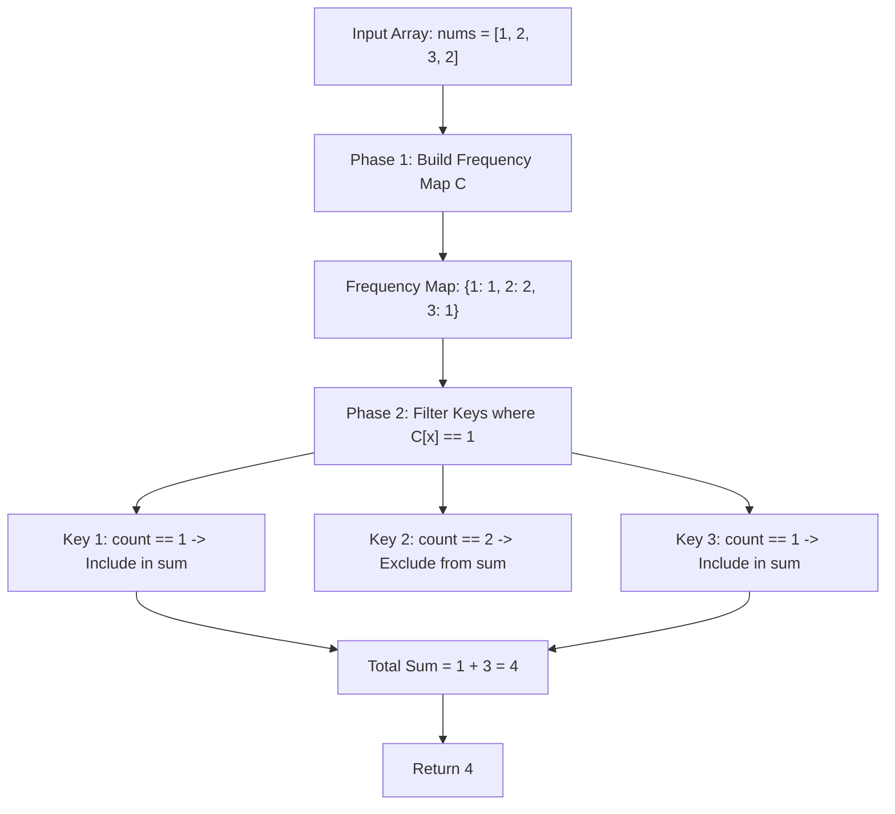

# Guided Example: Sum of Unique Elements

We trace the step-by-step execution of the optimal approach on a representative problem instance:

- **Input:** `nums = [1, 2, 3, 2]`
- **Required Output:** `4`

This instance contains both singletons and duplicates ($2$ appears twice, while $1$ and $3$ appear once), demonstrating how frequency histogram construction cleanly separates strictly unique elements from repeated values in linear time.

---

## 1. Instance & Teaching Goal

Given an integer array `nums`, we define a **unique element** as an element that appears **exactly once** in `nums`. We must return the sum of all unique elements.

A naive approach might greedily add an element to a running sum upon first encountering it. However, if that element appears again later, it is no longer unique, requiring retroactively deducting it (and its duplicates). The optimal two-phase approach:
1. First builds a frequency histogram $C[x]$ recording the exact multiplicity of every number.
2. Sums all keys $x$ whose multiplicity satisfies $C[x] = 1$.

---

## 2. Conceptual Foundation & Invariants

### State Representation

| Component | Definition | Mathematical Invariant |
|---|---|---|
| Multiplicity Map $C$ | $x \mapsto \lvert \{i : \text{nums}[i] = x\} \rvert$ | Frequency of each integer in `nums` |
| Unique Element Subset $\mathcal{U}$ | $\{x \in \text{nums} : C[x] = 1\}$ | Elements appearing with unit multiplicity |
| Unique Sum $S$ | $\sum_{x \in \mathcal{U}} x$ | Target scalar sum |

### Mathematical Invariants

> **Frequency Cardinality Projection Theorem.**
> Let $M$ be the multiset of elements in `nums`. The set of unique elements is the projection:
> $$\mathcal{U} = \{x : \text{count}(x, M) = 1\}$$
> Because distinct keys in a hash map are pairwise disjoint, summing over $\{x : C[x] = 1\}$ guarantees:
> - Elements with count $0$ contribute nothing.
> - Elements with count $1$ contribute their value exactly once.
> - Elements with count $\ge 2$ are completely excluded.

---

## 3. Step-by-Step Worked Execution

For `nums = [1, 2, 3, 2]`:

### Phase 1: Frequency Histogram Construction

We scan `nums` element by element:

| Step $k$ | Element $x$ | Operation on Hash Map | Resulting Multiplicity Map $C$ |
|---|---|---|---|
| $1$ | $1$ | First occurrence of $1$ | $\{1: 1\}$ |
| $2$ | $2$ | First occurrence of $2$ | $\{1: 1, 2: 1\}$ |
| $3$ | $3$ | First occurrence of $3$ | $\{1: 1, 2: 1, 3: 1\}$ |
| $4$ | $2$ | Increment occurrence of $2$ | $\{1: 1, 2: 2, 3: 1\}$ |

Final Frequency Histogram:
- $C[1] = 1$
- $C[2] = 2$
- $C[3] = 1$

---

### Phase 2: Filter and Aggregate

We iterate through the keys of $C$:

1. **Key $x = 1$:**
   - Multiplicity: $C[1] = 1$.
   - Unit multiplicity condition ($C[1] = 1$) holds.
   - Contribution: $+1$. Running Sum $= 1$.

2. **Key $x = 2$:**
   - Multiplicity: $C[2] = 2$.
   - Unit multiplicity condition ($C[2] = 1$) is **violated** ($2 \ge 2$).
   - Contribution: $+0$ (Excluded). Running Sum $= 1$.

3. **Key $x = 3$:**
   - Multiplicity: $C[3] = 1$.
   - Unit multiplicity condition ($C[3] = 1$) holds.
   - Contribution: $+3$. Running Sum $= 1 + 3 = \mathbf{4}$.

Final total sum: $\mathbf{4}$.

---

## 4. Complete Execution Trace

| Phase | Target Key | Frequency $C[x]$ | Decision Rule | Included in Sum? | Accumulated Total |
|---|---|---|---|---|---|
| Tally | Ingestion | — | Tally all elements | — | Map built |
| Filter | $1$ | $1$ | $C[x] == 1$ | **Yes (+1)** | $1$ |
| Filter | $2$ | $2$ | $C[x] > 1$ | No (0) | $1$ |
| Filter | $3$ | $1$ | $C[x] == 1$ | **Yes (+3)** | $4$ |
| Result | Final Output | — | Return accumulated total | — | **4** |

---

## 5. Algorithmic Mastery & Edge Surfacing

### Boundary and Edge Cases

| Scenario | Input Feature | Expected Output | Strategic Handling |
|---|---|---|---|
| All Elements Identical | `[1, 1, 1, 1]` | `0` | Key $1$ has $C[1] = 4 \neq 1$; sum is $0$. |
| All Elements Unique | `[1, 2, 3, 4, 5]` | $\sum x = 15$ | All keys have $C[x] = 1$; sums entire array. |
| Single Element Array | `[42]` | `42` | Single key with frequency 1; returns $42$. |
| Large Values ($x \le 100$) | Bounded inputs | Array counter alternative | Can use fixed 101-element array instead of hash table if desired. |

### Invariant Maintenance & Why It Works

1. **Global Frequency Finality:**
   By separating the counting pass from the summing pass, eligibility decisions are made only after all occurrences have been permanently observed, avoiding false positives from provisional unique elements.
2. **Key-Space Iteration:**
   Iterating over unique keys rather than the original array bounds the second pass by the number of distinct elements $U \le n$, ensuring exactly one evaluation per unique value.

### Complexity Analysis

- **Time Complexity:** $\mathcal{O}(n)$ where $n$ is the length of `nums`. Populating the frequency hash map takes $\mathcal{O}(n)$ time. Scanning the distinct keys takes $\mathcal{O}(U)$ time where $U \le n$. Total time is strictly $\mathcal{O}(n)$.
- **Space Complexity:** $\mathcal{O}(U) \le \mathcal{O}(n)$ auxiliary space to store counts of all distinct elements in the hash map.
