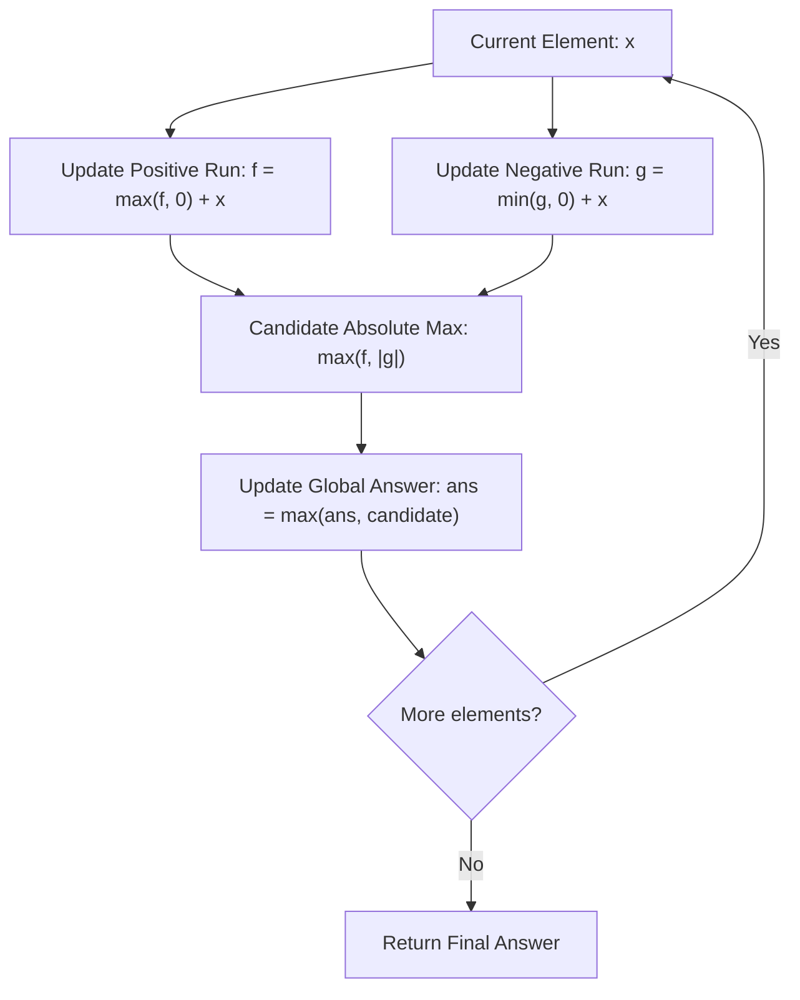

# Guided Example: Maximum Absolute Sum of Any Subarray

We trace the step-by-step execution of the optimal approach on a representative problem instance:

- **Input:** `nums = [1, -3, 2, 3, -4]`
- **Required Output:** `5`

This instance features alternating positive and negative values where both positive accumulations and negative valleys compete, demonstrating how dual Kadane tracking and prefix sum extrema duality find the maximal absolute sum in linear time and constant space.

---

## 1. Instance & Teaching Goal

Given an integer array `nums`, we seek the maximum absolute sum of any contiguous (possibly empty) subarray:
$$\max_{0 \le l \le r < n} \left| \sum_{k=l}^r \text{nums}[k] \right|$$
An empty subarray contributes sum $0$, ensuring the result is non-negative.

Testing all $\mathcal{O}(n^2)$ subarrays is redundant. The absolute value function $|x| = \max(x, -x)$ implies that the maximum absolute sum is simply the maximum between the largest positive subarray sum and the absolute value of the most negative subarray sum:
$$\max_{\text{subarrays}} |S| = \max \left( \max_{\text{subarrays}} S, \; -\min_{\text{subarrays}} S \right)$$
Alternatively, in prefix sum space, any subarray sum is the difference of two prefix sums $P[r+1] - P[l]$, meaning the maximum absolute difference is directly given by $\max P - \min P$.

---

## 2. Conceptual Foundation & Invariants

### State Representation

| Component | Mathematical Definition | Role |
|---|---|---|
| Positive Kadane State $f_k$ | $\max(f_{k-1}, 0) + \text{nums}[k]$ | Maximum subarray sum ending at index $k$ |
| Negative Kadane State $g_k$ | $\min(g_{k-1}, 0) + \text{nums}[k]$ | Minimum subarray sum ending at index $k$ |
| Running Max Absolute Sum $M$ | $\max(M, f_k, \lvert g_k \rvert)$ | Global best absolute sum observed |

### Mathematical Invariants

> **Prefix Extrema Range Theorem.**
> Let $P[0 \dots n]$ be the prefix sum array with $P[0] = 0$ and $P[i] = \sum_{k=0}^{i-1} \text{nums}[k]$. Every subarray sum from index $l$ to $r$ equals $P[r+1] - P[l]$. The maximum absolute difference between any two prefix sums across the entire array is:
> $$\max_{0 \le l \le r < n} |P[r+1] - P[l]| = \max_{0 \le i \le n} P[i] - \min_{0 \le j \le n} P[j]$$
> Because the indices $i$ and $j$ can occur in either order (if $i > j$, $P[i] - P[j] > 0$; if $i < j$, $P[j] - P[i] > 0$), the absolute difference between global prefix maximum and global prefix minimum is always attainable as a valid subarray sum.

> **Dual-Sign Kadane Equivalence Invariant.**
> Simultaneously tracking the maximum subarray sum $f$ and minimum subarray sum $g$ at each element updates:
> $$f \leftarrow \max(f, 0) + x, \quad g \leftarrow \min(g, 0) + x$$
> At each step, $f \ge 0$ represents the best positive run, while $g \le 0$ represents the deepest negative valley. The running absolute peak $\max(f, |g|)$ converges to the exact optimum.

---

## 3. Step-by-Step Worked Execution

For `nums = [1, -3, 2, 3, -4]`:
- Initial registers: $f = 0, g = 0$, global answer $M = 0$.

### Step 1: Process $x = 1$ (Index 0)
- $f \leftarrow \max(0, 0) + 1 = 1$
- $g \leftarrow \min(0, 0) + 1 = 1$
- Candidate: $\max(f, |g|) = \max(1, 1) = 1$
- Global Peak: $M = \max(0, 1) = \mathbf{1}$.

---

### Step 2: Process $x = -3$ (Index 1)
- $f \leftarrow \max(1, 0) + (-3) = 1 - 3 = -2$
- $g \leftarrow \min(1, 0) + (-3) = 0 - 3 = -3$
- Candidate: $\max(-2, |-3|) = 3$
- Global Peak: $M = \max(1, 3) = \mathbf{3}$ (Subarray $[-3]$ has absolute sum $3$).

---

### Step 3: Process $x = 2$ (Index 2)
- $f \leftarrow \max(-2, 0) + 2 = 0 + 2 = 2$
- $g \leftarrow \min(-3, 0) + 2 = -3 + 2 = -1$
- Candidate: $\max(2, |-1|) = 2$
- Global Peak: $M = \max(3, 2) = \mathbf{3}$.

---

### Step 4: Process $x = 3$ (Index 3)
- $f \leftarrow \max(2, 0) + 3 = 2 + 3 = 5$
- $g \leftarrow \min(-1, 0) + 3 = -1 + 3 = 2$
- Candidate: $\max(5, |2|) = 5$
- Global Peak: $M = \max(3, 5) = \mathbf{5}$ (Subarray $[2, 3]$ has sum $5$).

---

### Step 5: Process $x = -4$ (Index 4)
- $f \leftarrow \max(5, 0) + (-4) = 5 - 4 = 1$
- $g \leftarrow \min(2, 0) + (-4) = 0 - 4 = -4$
- Candidate: $\max(1, |-4|) = 4$
- Global Peak: $M = \max(5, 4) = \mathbf{5}$.

---

### Dual Perspective: Prefix Sum Verification

Prefix sums $P$ starting with $P[0] = 0$:
$$P = [0, \; 1, \; -2, \; 0, \; 3, \; -1]$$
- Maximum prefix sum: $\max P = 3$ (at prefix of length 4: $1 - 3 + 2 + 3 = 3$)
- Minimum prefix sum: $\min P = -2$ (at prefix of length 2: $1 - 3 = -2$)
- Difference:
  $$\max P - \min P = 3 - (-2) = \mathbf{5}$$
Subarray spanning indices $2 \dots 3$ ($nums[2] + nums[3] = 2 + 3 = 5$) matches the theoretical range bound.

---

## 4. Complete Execution Trace

| Index | Element $x$ | Positive Run $f$ | Negative Run $g$ | Step Candidate $\max(f, \lvert g \rvert)$ | Global Record $M$ | Best Subarray Identified |
|---|---|---|---|---|---|---|
| $0$ | $1$ | $1$ | $1$ | $1$ | $1$ | $[1]$ |
| $1$ | $-3$ | $-2$ | $-3$ | $3$ | $3$ | $[-3]$ |
| $2$ | $2$ | $2$ | $-1$ | $2$ | $3$ | $[-3]$ |
| $3$ | $3$ | $5$ | $2$ | $5$ | **$5$** | $[2, 3]$ |
| $4$ | $-4$ | $1$ | $-4$ | $4$ | $5$ | $[2, 3]$ |

Final Result: $5$.

---

## 5. Algorithmic Mastery & Edge Surfacing

### Boundary and Edge Cases

| Scenario | Input Example | Expected Output | Strategic Handling |
|---|---|---|---|
| All Positive Elements | `[2, 3, 5]` | $10$ | $f$ accumulates sum of all elements; $g$ stays positive/neutral; returns sum. |
| All Negative Elements | `[-2, -5, -3]` | $10$ | Subarray $[-2, -5, -3] = -10 \implies \lvert -10 \rvert = 10$; $g$ reaches $-10$. |
| Array of Zeros | `[0, 0, 0]` | $0$ | $f = g = 0$; returns $0$. |
| Mixed Extremes | `[2, -5, 1, -4, 3, -2]` | $8$ | Subarray $[-5, 1, -4] = -8 \implies 8$; correctly captured by $\lvert g \rvert$. |

### Invariant Maintenance & Why It Works

1. **Simultaneous Extremum Tracking:**
   By evaluating both positive Kadane and negative Kadane concurrently in the same loop, both positive peaks and deep negative troughs are captured without needing two separate passes or prefix arrays.
2. **Empty Subarray Safety:**
   Initializing $M = 0$ guarantees that if an array consists only of elements that do not exceed $0$ in absolute sum, the valid empty subarray sum of $0$ is preserved.

### Complexity Analysis

- **Time Complexity:** $\mathcal{O}(n)$ where $n$ is the length of `nums`. Exactly one pass over the array with constant-time scalar additions and comparisons.
- **Space Complexity:** $\mathcal{O}(1)$ auxiliary space, requiring only three numeric registers ($f, g, M$).
