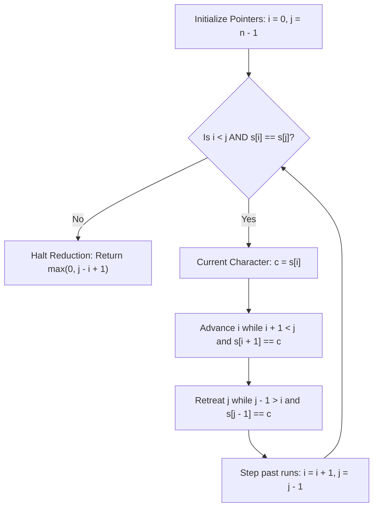

# Guided Example: Minimum Length of String After Deleting Similar Ends

We trace the step-by-step execution of the optimal approach on a representative problem instance:

- **Input:** `s = "aabccabba"`
- **Required Output:** `3`

This instance features multiple rounds of deletions with differing prefix and suffix run-lengths, followed by a non-matching boundary termination, illustrating how greedy two-pointer convergence trims identical extremities in linear time and constant auxiliary space.

---

## 1. Instance & Teaching Goal

Given a string `s` composed exclusively of characters `'a'`, `'b'`, and `'c'`, we can repeatedly perform the following operation:
1. Select a non-empty prefix of identical characters.
2. Select a non-empty suffix of identical characters matching the prefix character.
3. The prefix and suffix must be disjoint (they cannot overlap or share indices).
4. Delete both the prefix and suffix from the string.

We seek the **minimum possible length** of the string after performing this reduction zero or more times.

Because any prefix begins at index $0$ and any suffix ends at index $n - 1$, the operation is possible if and only if the outermost boundary characters match: $s[\text{start}] = s[\text{end}]$. Furthermore, greedily consuming the entire maximal run of matching characters at each end exposes new interior characters as quickly as possible without sacrificing any opportunities for future deletions.

---

## 2. Conceptual Foundation & Invariants

### State Representation

| Pointer / Register | Role | Initial Value |
|---|---|---|
| Left Boundary $i$ | Start of active remaining substring | $0$ |
| Right Boundary $j$ | End of active remaining substring | $n - 1$ |
| Active Target Character $c$ | Identity of current matching boundary run | $s[i]$ when $s[i] = s[j]$ |
| Remaining Length | Distance between boundaries: $\max(0, j - i + 1)$ | $n$ |

### Mathematical Invariants

> **Greedy Homogeneous Extremity Shrinkage Theorem.**
> Let $s[i \dots j]$ be the active substring with $i < j$ and $s[i] = s[j] = c$.
> Suppose the maximal contiguous run of $c$ at the prefix spans $[i, i']$ and at the suffix spans $[j', j]$.
> Consuming the entire runs $[i, i']$ and $[j', j]$ is strictly dominant over leaving partial runs of $c$:
> - Retaining any copy of $c$ at either end leaves $c$ as the boundary character of the resulting substring.
> - No new character can be exposed until all copies of $c$ at that extremity are eliminated.
> - Therefore, greedily expanding $i$ across all contiguous occurrences of $c$ and retreating $j$ across all contiguous occurrences of $c$ never reduces the set of viable future reductions.

> **Boundary Collision Invariant.**
> The reduction loop runs as long as $i < j$ and $s[i] = s[j]$:
> - If $i > j$, the entire string was consumed by the final reduction $\implies \text{length} = 0$.
> - If $i = j$, exactly one character remains. Since the rule requires non-intersecting prefix and suffix, a single character cannot be deleted $\implies \text{length} = 1$.
> - If $s[i] \neq s[j]$, no further deletions are legal $\implies \text{length} = j - i + 1$.



---

## 3. Step-by-Step Worked Execution

For `s = "aabccabba"` with length $n = 9$:
Indices:
```text
Index:  0 1 2 3 4 5 6 7 8
Char:   a a b c c a b b a
```

### Initial State
- $i = 0$, $j = 8$
- Active substring: `"aabccabba"`
- Boundary characters: $s[0] = \text{'a'}$, $s[8] = \text{'a'}$.
- Since $i < j$ and $s[i] = s[j] = \text{'a'}$, reduction begins.

---

### Round 1: Target Character $c = \text{'a'}$
1. **Expand Prefix $i$:**
   - $s[0] = \text{'a'}$
   - $s[1] = \text{'a'}$
   - $s[2] = \text{'b'} \neq \text{'a'}$
   - Prefix run of `'a'` spans indices $[0, 1]$. Advanced to $i = 1$.
2. **Retreat Suffix $j$:**
   - $s[8] = \text{'a'}$
   - $s[7] = \text{'b'} \neq \text{'a'}$
   - Suffix run of `'a'` spans index $[8]$.
3. **Trim Boundaries:**
   - Delete prefix $s[0 \dots 1] = \text{"aa"}$ and suffix $s[8 \dots 8] = \text{"a"}$.
   - Pointers update: $i \leftarrow 1 + 1 = 2$, $j \leftarrow 8 - 1 = 7$.
- Remaining substring: $s[2 \dots 7] = \text{"bccabb"}$. Length $= 7 - 2 + 1 = 6$.

---

### Round 2: Target Character $c = \text{'b'}$
- Boundary characters: $s[2] = \text{'b'}$, $s[7] = \text{'b'}$.
- $i = 2 < j = 7$ and $s[i] = s[j] = \text{'b'}$.
1. **Expand Prefix $i$:**
   - $s[2] = \text{'b'}$
   - $s[3] = \text{'c'} \neq \text{'b'}$
   - Prefix run spans index $[2]$.
2. **Retreat Suffix $j$:**
   - $s[7] = \text{'b'}$
   - $s[6] = \text{'b'}$
   - $s[5] = \text{'a'} \neq \text{'b'}$
   - Suffix run spans indices $[6, 7]$ ($\text{"bb"}$). Retreats to $j = 6$.
3. **Trim Boundaries:**
   - Delete prefix $s[2 \dots 2] = \text{"b"}$ and suffix $s[6 \dots 7] = \text{"bb"}$.
   - Pointers update: $i \leftarrow 2 + 1 = 3$, $j \leftarrow 6 - 1 = 5$.
- Remaining substring: $s[3 \dots 5] = \text{"cca"}$. Length $= 5 - 3 + 1 = 3$.

---

### Round 3: Check Boundaries on $s[3 \dots 5]$
- Boundary characters:
  - $s[3] = \text{'c'}$
  - $s[5] = \text{'a'}$
- Comparison: $s[3] \neq s[5]$ (`'c'` $\neq$ `'a'`).
- The condition $s[i] == s[j]$ fails. No legal prefix and suffix of matching characters can be formed.
- The loop terminates.

---

### Final Length Extraction
The remaining window is $[i, j] = [3, 5]$, corresponding to substring `"cca"`.
$$\text{Final Length} = j - i + 1 = 5 - 3 + 1 = \mathbf{3}$$

---

## 4. Complete Execution Trace

| Round | Left Pointer $i$ | Right Pointer $j$ | Boundary Characters | Runs Removed | Updated Substring Window | Remaining Length |
|---|---|---|---|---|---|---|
| Start | $0$ | $8$ | $s[0]=\text{'a'}, s[8]=\text{'a'}$ | — | $[0, 8]$ (`"aabccabba"`) | $9$ |
| $1$ | $0 \to 1$ | $8 \to 8$ | $c = \text{'a'}$ | Prefix: $[0, 1]$, Suffix: $[8]$ | $[2, 7]$ (`"bccabb"`) | $6$ |
| $2$ | $2 \to 2$ | $7 \to 6$ | $c = \text{'b'}$ | Prefix: $[2]$, Suffix: $[6, 7]$ | $[3, 5]$ (`"cca"`) | $3$ |
| Stop | $3$ | $5$ | $s[3]=\text{'c'} \neq s[5]=\text{'a'}$ | Mismatch: loop halts | $[3, 5]$ (`"cca"`) | **$3$** |

---

## 5. Algorithmic Mastery & Edge Surfacing

### Boundary and Edge Cases

| Scenario | Input Example | Expected Output | Strategic Handling |
|---|---|---|---|
| Immediate Boundary Mismatch | `s = "ca"` | `2` | $s[0] \neq s[1]$; loop never enters, returns $2$. |
| Complete Annihilation | `s = "cabaabac"` | `0` | Pointers cross ($i > j$) after final run removal; returns $\max(0, j - i + 1) = 0$. |
| Single Center Survivor | `s = "aabaa"` | `1` | Suffix and prefix consume all `'a'`s; single `'b'` remains at $i = j = 2 \implies 1$. |
| Monotonous String | `s = "aaaa"` | `0` | All identical characters; prefix and suffix consume entire string without intersection. |

### Invariant Maintenance & Why It Works

1. **Non-Overlapping Prefix and Suffix:**
   Inner pointer advances strictly respect $i < j$. The prefix and suffix runs never step past each other during the same round, guaranteeing that removed segments are strictly disjoint.
2. **In-Place Index Manipulation:**
   By adjusting pointer indices $i$ and $j$ directly, string slicing or copying is completely avoided, maintaining an $\mathcal{O}(1)$ auxiliary memory footprint throughout.

### Complexity Analysis

- **Time Complexity:** $\mathcal{O}(n)$ where $n$ is the length of string `s`. In each step, pointer $i$ moves strictly right or pointer $j$ moves strictly left. Every character index is visited at most twice across the entire execution.
- **Space Complexity:** $\mathcal{O}(1)$ auxiliary space, maintaining only pointer indices $i$ and $j$.
