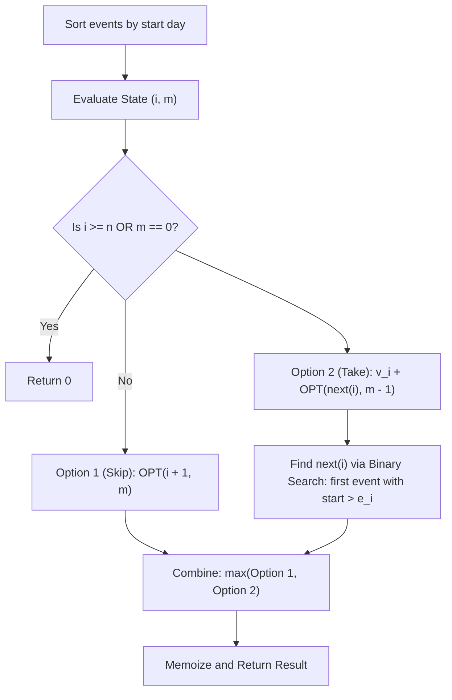

# Guided Example: Maximum Number of Events That Can Be Attended II

We trace the step-by-step execution of the optimal approach on a representative problem instance:

- **Input:** `events = [[1, 2, 4], [3, 4, 3], [2, 3, 1]]`, `k = 2`
- **Required Output:** `7`

This instance features conflicting and non-conflicting intervals with non-uniform reward values, demonstrating how interval sorting combined with binary-search-accelerated dynamic programming optimizes multi-event attendance under cardinality limits.

---

## 1. Instance & Teaching Goal

We are given an array of events where each event is defined by $[s_i, e_i, v_i]$:
- $s_i$: Start day
- $e_i$: End day
- $v_i$: Reward value

We can attend at most $k$ non-overlapping events. If we attend an event that ends on day $e$, any subsequent event we attend must start on day $s' > e$. The goal is to maximize the sum of values of the attended events.

A brute-force combination search checks $\binom{n}{k}$ subsets, which is exponential $\mathcal{O}(n^k)$. Sorting events by start day allows formulating a clean dynamic programming recurrence:
- At event $i$, we either skip it (advancing to $i + 1$ with $k$ unchanged) or attend it (gaining $v_i$ and decrementing $k$ by $1$).
- If event $i$ is attended, the next compatible event must start at a day $> e_i$. Because start days are sorted, binary search identifies the earliest compatible successor index $j$ in $\mathcal{O}(\log n)$ time.

---

## 2. Conceptual Foundation & Invariants

### State Representation

| State Parameter | Definition | Bounds |
|---|---|---|
| Event Index $i$ | Current event candidate in sorted list | $0 \le i \le n$ |
| Remaining Capacity $m$ | Number of additional events permitted to attend | $0 \le m \le k$ |
| DP Value $\text{OPT}(i, m)$ | Maximum value obtainable from events $i \dots n-1$ with budget $m$ | Non-negative integer |

### Mathematical Invariants

> **Interval Scheduling Dynamic Programming Theorem.**
> Let events be sorted in ascending order of start days: $s_0 \le s_1 \le \dots \le s_{n-1}$.
> The optimal value function satisfies the Bellman recurrence:
> $$\text{OPT}(i, m) = \begin{cases} 0 & \text{if } i \ge n \lor m = 0 \\ \max \Big( \text{OPT}(i + 1, m), \; v_i + \text{OPT}(\text{next}(i), m - 1) \Big) & \text{otherwise} \end{cases}$$
> where $\text{next}(i)$ is the smallest index $j > i$ such that $s_j > e_i$.
> If no such successor exists, $\text{next}(i) = n$.

> **Bisection Frontier Invariant.**
> Because start days $s_j$ are sorted monotonically, the predicate $P(j) \equiv (s_j > e_i)$ is monotonic with respect to index $j$. Thus, $\text{next}(i)$ is uniquely located via binary search (specifically `bisect_right` on the end day) in $\mathcal{O}(\log n)$ time without scanning intermediate conflicting events.

---

## 3. Step-by-Step Worked Execution

For `events = [[1, 2, 4], [3, 4, 3], [2, 3, 1]]` and $k = 2$:

### Step 1: Sort Events by Start Day

Sorted array of events:
- Event $0$: $[1, 2, 4]$ ($s = 1, e = 2, v = 4$)
- Event $1$: $[2, 3, 1]$ ($s = 2, e = 3, v = 1$)
- Event $2$: $[3, 4, 3]$ ($s = 3, e = 4, v = 3$)
Total events: $n = 3$.

---

### Step 2: Precompute Successor Transitions via Binary Search

For each event, find the first event with start day strictly greater than its end day:
- **Event 0 ($e = 2$):** First event with $s > 2$ is Event 2 ($s = 3$).
  $$\text{next}(0) = 2$$
- **Event 1 ($e = 3$):** First event with $s > 3$ is none.
  $$\text{next}(1) = 3 \quad (\text{End of list})$$
- **Event 2 ($e = 4$):** No event with $s > 4$.
  $$\text{next}(2) = 3 \quad (\text{End of list})$$

---

### Step 3: Evaluate DP States (Bottom-Up or Memoized Top-Down)

We evaluate $\text{OPT}(i, m)$ for relevant subproblems:

#### Subproblems at Event 2 ($[3, 4, 3]$):
- $\text{OPT}(2, 1) = \max(\text{OPT}(3, 1), v_2 + \text{OPT}(3, 0)) = \max(0, 3 + 0) = \mathbf{3}$.
- $\text{OPT}(2, 2) = \max(\text{OPT}(3, 2), v_2 + \text{OPT}(3, 1)) = \max(0, 3 + 0) = \mathbf{3}$.

#### Subproblems at Event 1 ($[2, 3, 1]$):
- $\text{OPT}(1, 1) = \max(\text{OPT}(2, 1), v_1 + \text{OPT}(3, 0)) = \max(3, 1 + 0) = \mathbf{3}$.
- $\text{OPT}(1, 2) = \max(\text{OPT}(2, 2), v_1 + \text{OPT}(3, 1)) = \max(3, 1 + 0) = \mathbf{3}$.

#### Subproblem at Event 0 ($[1, 2, 4]$) with $m = 2$:
- **Option 1 (Skip Event 0):**
  $$\text{OPT}(1, 2) = 3$$
- **Option 2 (Take Event 0):**
  - Reward gained: $v_0 = 4$.
  - Remaining capacity: $m - 1 = 2 - 1 = 1$.
  - Successor state: $\text{next}(0) = 2$.
  - Value:
    $$v_0 + \text{OPT}(2, 1) = 4 + 3 = \mathbf{7}$$
- **Optimal Decision:**
  $$\text{OPT}(0, 2) = \max(3, 7) = \mathbf{7}$$

---

## 4. Complete Execution Trace

| State $(i, m)$ | Current Event $[s, e, v]$ | Successor Index $\text{next}(i)$ | Skip Option $\text{OPT}(i+1, m)$ | Take Option $v_i + \text{OPT}(\text{next}(i), m-1)$ | Computed Optimum |
|---|---|---|---|---|---|
| $(2, 1)$ | Event 2 $[3, 4, 3]$ | $3$ (Terminal) | $\text{OPT}(3, 1) = 0$ | $3 + \text{OPT}(3, 0) = 3 + 0 = 3$ | $3$ |
| $(2, 2)$ | Event 2 $[3, 4, 3]$ | $3$ (Terminal) | $\text{OPT}(3, 2) = 0$ | $3 + \text{OPT}(3, 1) = 3 + 0 = 3$ | $3$ |
| $(1, 2)$ | Event 1 $[2, 3, 1]$ | $3$ (Terminal) | $\text{OPT}(2, 2) = 3$ | $1 + \text{OPT}(3, 1) = 1 + 0 = 1$ | $3$ |
| **$(0, 2)$** | **Event 0 $[1, 2, 4]$** | **$2$ (Event 2)** | **$\text{OPT}(1, 2) = 3$** | **$4 + \text{OPT}(2, 1) = 4 + 3 = 7$** | **$7$** |

Attended events: Event $0$ ($[1, 2, 4]$) and Event $2$ ($[3, 4, 3]$).
Total value: $4 + 3 = 7$.

---

## 5. Algorithmic Mastery & Edge Surfacing

### Boundary and Edge Cases

| Scenario | Input Feature | Expected Output | Strategic Handling |
|---|---|---|---|
| Attend at most $k = 1$ | $k = 1$ | Highest single event value | $\text{OPT}(i, 1)$ selects the maximum isolated event value. |
| All Events Overlap | All intervals intersect | $\max_i v_i$ | $\text{next}(i) = n$ for all $i$; only 1 event can be attended. |
| Completely Disjoint Chain | All events separated | Sum of top-$k$ events | Traverses forward cleanly, attending top non-overlapping values. |
| $k \ge n$ | $k$ exceeds total events | Maximum weight independent set | $k$ ceases to be a bottleneck; bounded purely by interval conflicts. |

### Invariant Maintenance & Why It Works

1. **Strict End-Day Independence:**
   Because an event ending on day $e$ requires subsequent events to start strictly on day $s' > e$, `bisect_right` on the end day over start days correctly isolates the earliest possible compatible event without risking interval collision.
2. **Memoization Boundary:**
   There are exactly $n \times (k + 1)$ distinct subproblems $(i, m)$. Memoizing each state upon its first evaluation guarantees each state is computed exactly once.

### Complexity Analysis

- **Time Complexity:** $\mathcal{O}(n \log n + n \cdot k \log n)$. Sorting $n$ events takes $\mathcal{O}(n \log n)$. There are $\mathcal{O}(n \cdot k)$ distinct states in the memoization table, and evaluating each state performs one binary search of cost $\mathcal{O}(\log n)$.
- **Space Complexity:** $\mathcal{O}(n \cdot k)$ auxiliary memory for the memoization cache and recursion call stack.
