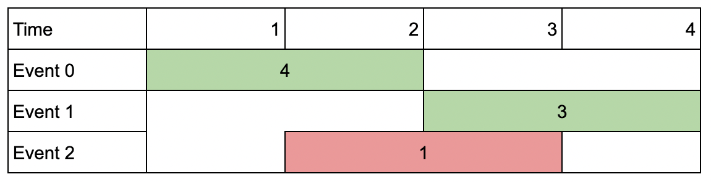
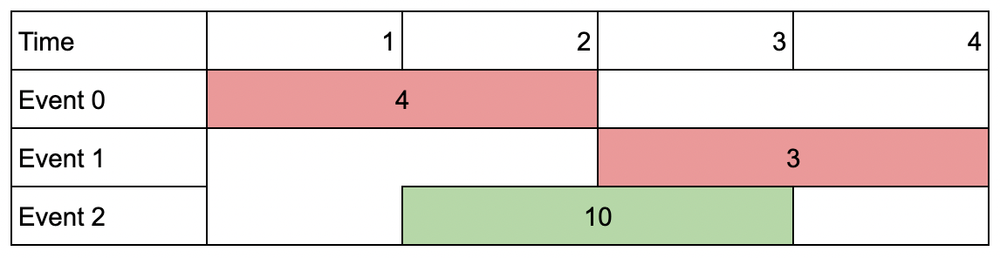
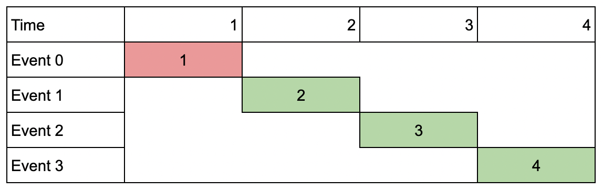

## Description

You are given an array of `events` where $\text{events}[i] = [\text{startDay}_{i}, \text{endDay}_{i}, \text{value}_{i}]$. The $$i^{\text{th}}$$ event starts at $\text{startDay}_{i}$_ and ends at $\text{endDay}_{i}$, and if you attend this event, you will receive a value of $\text{value}_{i}$. You are also given an integer `k` which represents the maximum number of events you can attend.

You can only attend one event at a time. If you choose to attend an event, you must attend the **entire** event. Note that the end day is **inclusive**: that is, you cannot attend two events where one of them starts and the other ends on the same day.

Return *the **maximum sum** of values that you can receive by attending events.*
### Function Contract

- `n`: Input parameter.
- Returns expected result.

### Examples

#### Example 1

- **Input:** $events = [[1,2,4],[3,4,3],[2,3,1]], k = 2$
- **Output:** `7`
- **Explanation:** Choose the green events, 0 and 1 (0-indexed) for a total value of 4 + 3 = 7.
#### Example 2

- **Input:** $events = [[1,2,4],[3,4,3],[2,3,10]], k = 2$
- **Output:** `10`
- **Explanation:** Choose event 2 for a total value of 10.
Notice that you cannot attend any other event as they overlap, and that you do **not** have to attend k events.
#### Example 3

**

**

- **Input:** $events = [[1,1,1],[2,2,2],[3,3,3],[4,4,4]], k = 3$
- **Output:** `9`
- **Explanation:** Although the events do not overlap, you can only attend 3 events. Pick the highest valued three.
### Constraints

- $1 \le k \le \text{events.length}$

- $1 \le k * \text{events.length} \le 10^{6}$

- $1 \le \text{startDay}_{i} \le \text{endDay}_{i} \le 10^{9}$

- $1 \le \text{value}_{i} \le 10^{6}$