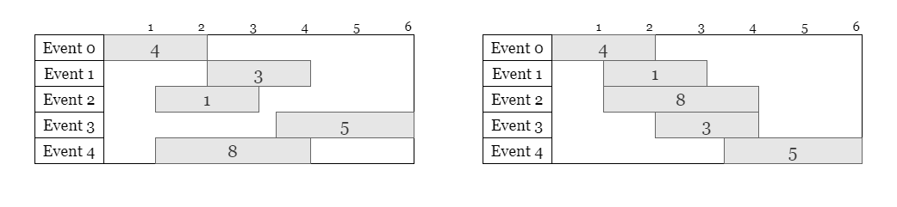
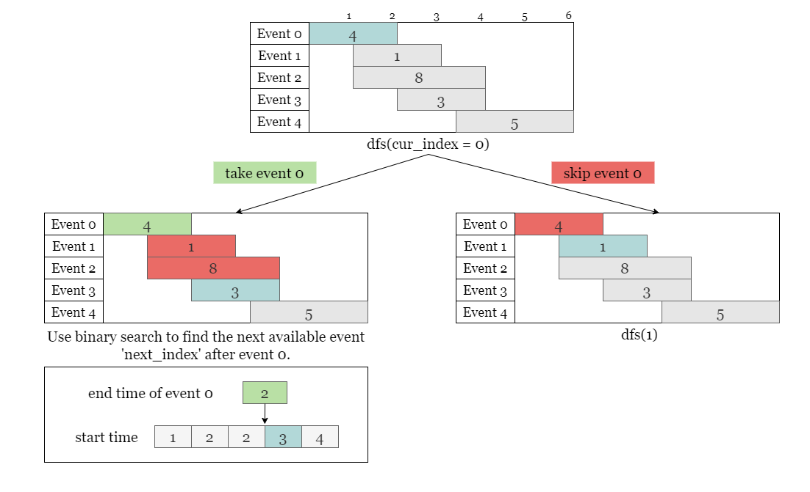
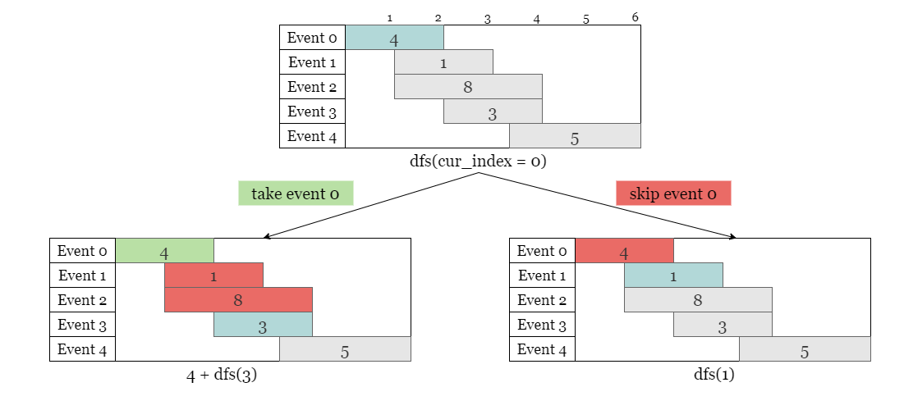
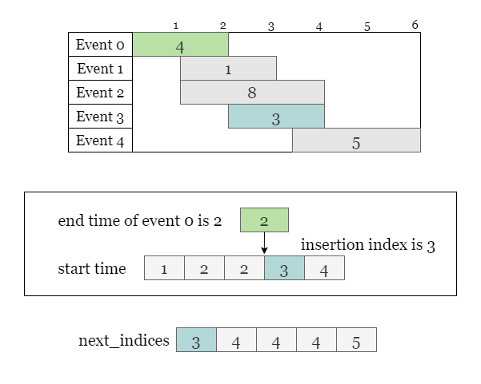
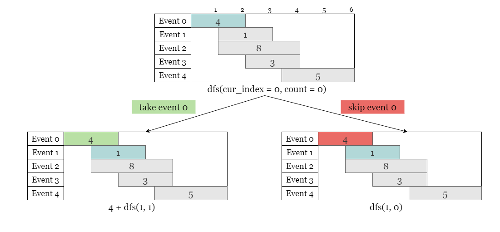
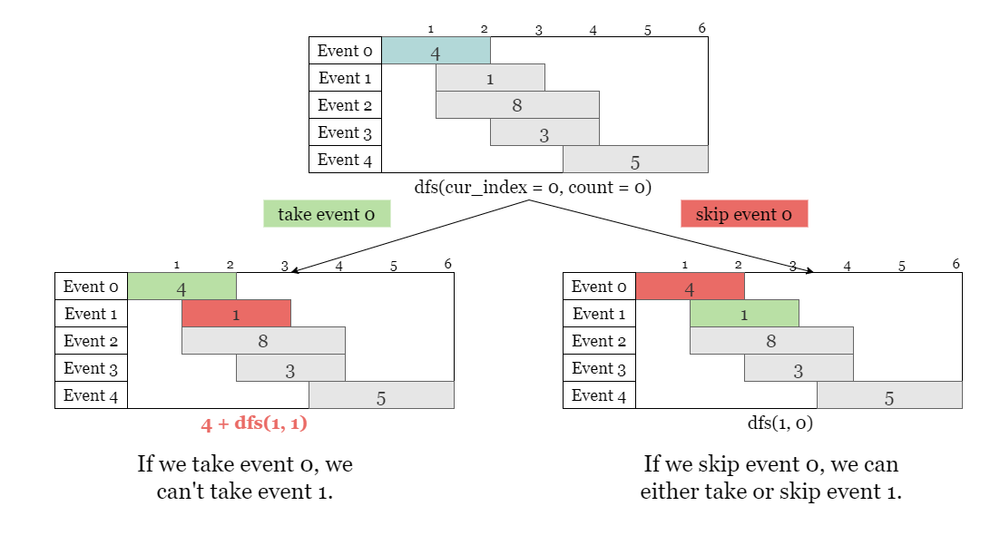
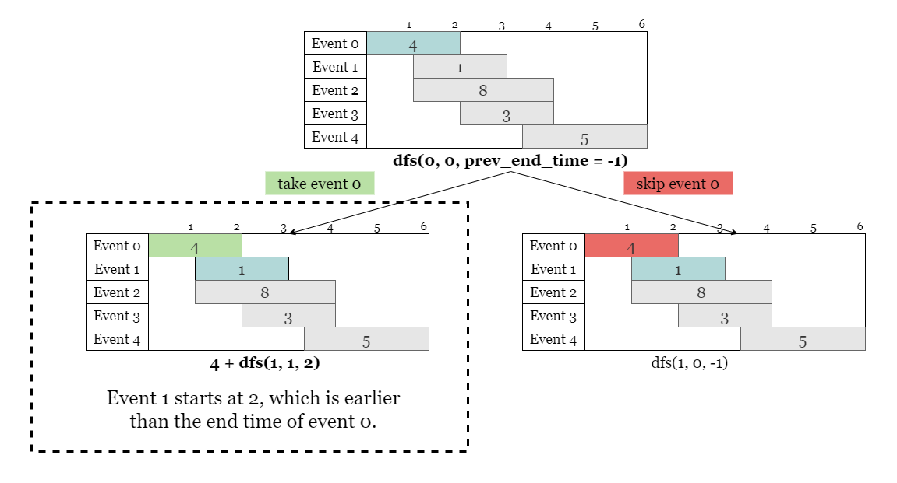
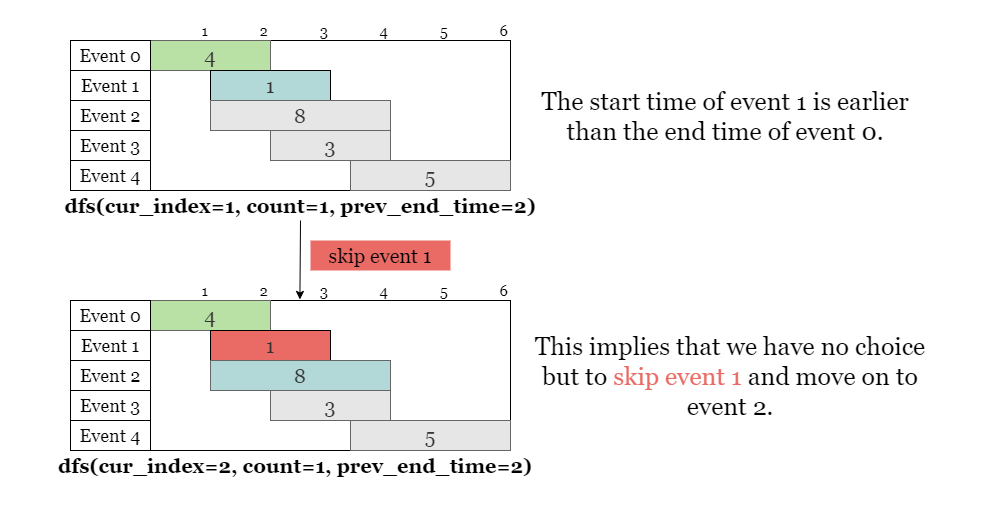
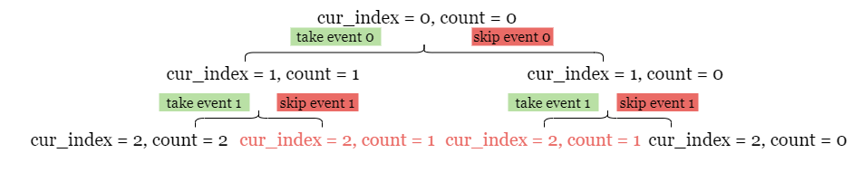

[TOC]

## Solution

---

### Overview

We can only attend an event if the start day of it is greater than the end day of the previously attended event. This implies that we should sort events by their start time. As shown in the following figure, we sort $events = [[1,2,4],[3,4,3],[2,3,1],[4,6,5],[2,4,8]]$ according to the start time of each event.



All subsequent solutions are based on the sorted `events`.

---

### Approach 1: Top-down Dynamic Programming + Binary Search

#### Intuition

> If you are not familiar with dynamic programming, please refer to our explore cards [Dynamic Programming Explore Card](https://leetcode.com/explore/featured/card/dynamic-programming/). We will focus on the usage in this article and not the underlying principles or implementation details.

Let $dfs(\text{cur}_{index})$ represent the maximum value obtained by attending events optimally in the range $events[\text{cur}_{index} ~ n - 1]$

For event $\text{cur}_{index}$, we have two options:

- attend the current event and gain a value of $events[\text{cur}_{index}][2]$. Then we need to find the nearest event that we can attend after event $\text{cur}_{index}$. Recall that we have sorted `events` by start time. We can apply binary search to find the index where we should insert the end time of the current event $\text{cur}_{index}$ in the sorted list of start times. Let's say the nearest one is event $\text{next}_{index}$. Thus $dfs(\text{cur}_{index})$ is the larger value between the two options:

- attend the current event and obtain a value of $events[\text{cur}_{index}][2] + dfs(\text{next}_{index})$.

- skip the current event, move on to the next event, and gain a value of $dfs(\text{cur}_{index} + 1)$.

which is denoted as $dfs(\text{cur}_{index}) = max(dfs(\text{cur}_{index} + 1), dfs(\text{next}_{index}) + events[\text{cur}_{index}][2])$.

<br>

As shown in the picture below, we find the insertion index is `3`, which indicates that the nearest available event after event 0 is event 3.



Therefore, we can update `dfs(0)` as the larger value obtained by attending or skipping event 0.

- attend event 0 and get a value of $\text{events}[0][2] + dfs(3)$.
- skip event 0 and get a value of `dfs(1)`.



Given the restriction that we can attend a maximum of `k` events, we also need to keep track of `count`, the number of events we have attended so far. Therefore, we will redefine this function as $dfs(\text{cur}_{index}, count)$.

Additionally, we use memoization to store the maximum value obtained by each state $(\text{cur}_{index}, count)$. This helps us avoid re-solving the same subproblems multiple times and significantly reduces the time complexity of the algorithm.

<br>

#### Algorithm

1) Sort `events` by start time.

2) Build a 2D array `dp` of size $(k + 1) \times n$ as memory.

3) Define $dfs(\text{cur}_{index}, count)$ as the maximum value obtained by attending a maximum of `count` events in the range $events[\text{cur}_{index} ~ n - 1]$.

- If $(count, \text{cur}_{index})$ is already stored in `dp`, return $\text{dp}[count][\text{cur}_{index}]$.
- Return 0 if $count = 0$ or $\text{cur}_{index} = n$.
- Skip this event and get the value of $dfs(\text{cur}_{index} + 1, count)$.
- Find the index of the nearest available event $\text{next}_{index}$ after the current event $\text{cur}_{index}$ with binary search.

- Attend this event and get the value of $dfs(\text{next}_{index}, count - 1)$ plus the value of this event $events[\text{cur}_{index}][2]$.
- Store the larger one of the two values above in $\text{dp}[count][\text{cur}_{index}]$ and return $\text{dp}[count][\text{cur}_{index}]$.

4) Return `dfs(0, k)`.

#### Implementation

```python
class Solution:
    def maxValue(self, events: List[List[int]], k: int) -> int:
        events.sort()
        n = len(events)
        starts = [start for start, end, value in events]
        dp = [[-1] * n for _ in range(k + 1)]

        def dfs(cur_index, count):
            if count == 0 or cur_index == n:
                return 0
            if dp[count][cur_index] != -1:
                return dp[count][cur_index]

            # Find the nearest available event after attending event 0.

            next_index = bisect_right(starts, events[cur_index][1])
            dp[count][cur_index] = max(dfs(cur_index + 1, count), events[cur_index][2] + dfs(next_index, count - 1))
            return dp[count][cur_index]

        return dfs(0, k)
```

#### Complexity Analysis

Let $n$ be the length of the input string `s`.

* Time complexity: $O(n \cdot k \cdot\log n)$
- Sorting `events` takes $O(n \log n)$ time.
- We build `dp`, a 2D array of size $O(n \times k)$ as memory, equal to the number of possible states. Each state is computed with a binary search over all start times, which takes $O(\log n)$.

* Space complexity: $O(n \cdot k)$

- We build a 2D array of size $O(n \times k)$ as memory.
- In the Python solution, we also create an array with length `n`, which takes $O(n)$ space.
- The space complexity of a recursive call depends on the maximum depth of the recursive call stack, which is $n + k$. As each recursive call either increments $\text{cur}_{index}$ by 1 and/or decrements `count` by 1. Therefore, at most $O(n + k)$ levels of recursion will be created, and each level consumes a constant amount of space.

<br/>

---

### Approach 2: Bottom-up Dynamic Programming + Binary Search

#### Intuition

In the previous approach, we start with the original problem `dfs(0, k)` and recursively break it down into smaller subproblems. We can also use bottom-up DP that starts with the smallest subproblems and works its way up to the original problem.

We can build a 2D array `dp` and let $\text{dp}[count][\text{cur}_{index}]$ represent the maximum value we obtain by attending at most `count` events in the range $events[\text{cur}_{index} ~ n - 1]$ (equivalent to $dfs(\text{cur}_{index}, count)$ in the previous approach). We first solve the smallest subproblems, then use their solutions to solve slightly larger subproblems, and so on until we solve the original problem $\text{dp}[0][k]$.

For the current state $\text{dp}[count][\text{cur}_{index}]$, we have two options:

- attend event $\text{cur}_{index}$ and gain a value of $events[\text{cur}_{index}][2]$. Then we need to find the nearest events that we can attend after this event. Recall that we have sorted `events` according to the start times, so we can apply a binary search to find $\text{next}_{index}$, the inserting index of $events[\text{cur}_{index}][1]$, the end time of this event, on the sorted start times. Thus the value we obtain is $events[\text{cur}_{index}][2] + dp[count - 1][\text{next}_{index}]$.

- skip the event $\text{cur}_{index}$ and move on to the next event, thus the value is equal to $\text{dp}[count][\text{cur}_{index} + 1]$.

Therefore, we have the recurrence relation as $\text{dp}[count][\text{cur}_{index}] = max(\text{dp}[count][\text{cur}_{index} + 1], dp[count - 1][\text{next}_{index}] + events[\text{cur}_{index}][2])$.

<br>

#### Algorithm

1) Sort `events` by start time.

2) Define a dynamic programming table `dp` of size $(k + 1) \cdot (n + 1)$.

3) Iterate starting from the base cases. Iterate over `events` backward from $n - 1$ to `0`. For each event, iterate over the number of events that can be attended from `1` to `k`.

4) Locate `nextIndex`, the index of the first event whose starting time is greater than the end time of the current event `curIndex` using binary search.

5) Update $\text{dp}[count][curIndex]$ as $max(\text{dp}[count][curIndex + 1], dp[count + 1][nextIndex] + \text{events}[curIndex][2])$.

6) Return $\text{dp}[k][0]$ when the iteration is complete.

#### Implementation

```python
class Solution:
    def maxValue(self, events: List[List[int]], k: int) -> int:
        n = len(events)
        dp = [[0] * (n + 1) for _ in range(k + 1)]
        events.sort()
        starts = [start for start, end, value in events]

        for cur_index in range(n - 1, -1, -1):
            for count in range(1, k + 1):
                next_index = bisect_right(starts, events[cur_index][1])
                dp[count][cur_index] = max(dp[count][cur_index + 1], events[cur_index][2] + dp[count - 1][next_index])

        return dp[k][0]
```

#### Complexity Analysis

Let $n$ be the length of the input string `s`.

* Time complexity: $O(n \cdot k \cdot\log n)$
- Sorting `events` takes $O(n \log n)$ time.
- We build a 2D array of size $O(n \times k)$ as memory, equal to the number of possible states. Each state is computed with a binary search over all start times, which takes $O(\log n)$.

* Space complexity: $O(n \cdot k)$

- `dp` takes $O(n \times k)$ space.
- In the Python solution, we create a array `starts` with length `n` which takes $O(n)$ space.

<br/>

---

### Approach 3: Top-down Dynamic Programming + Cached Binary Search

#### Intuition

In the previous approaches, we perform the binary search in each of the $O(n \cdot k)$ states.

However, we observed that the same binary search was being repeated. In fact, there are at most `n` different results. Therefore, we can precompute the results of all possible binary searches of $events[\text{cur}_{index}][0]$ over the array of start times `starts`, and store the results in an array called $\text{next}_{indices}$. As shown in the figure below:.



In the following recursion, we can obtain the insertion index of $events[\text{cur}_{index}][1]$ as $\text{next}_{indices}[\text{cur}_{index}]$.

<br>

#### Algorithm

1) Sort `events` by start time.

2) Build a 2D array `dp` of size $(k + 1) \times n$ as memory.

3) Create an array $\text{next}_{indices}$ to collect the nearest available event `nextIndex` for every event `curIndex`.

3) Define $dfs(\text{cur}_{index}, count)$ as the maximum value obtained by attending a maximum of `count` events in the range $events[\text{cur}_{index} ~ n - 1]$.
- If $(count, \text{cur}_{index})$ is already stored in `dp`, return $\text{dp}[count][\text{cur}_{index}]$.
- Return 0 if $count = 0$ or $\text{cur}_{index} = n$.
- Skip this event and get the value of $dfs(\text{cur}_{index} + 1, count)$.
- Get the index of the nearest available event $\text{next}_{index}$ after the current event $\text{cur}_{index}$ as $\text{next}_{indices}[\text{cur}_{index}]$.
- Attend this event and get the value of $dfs(\text{next}_{index}, count - 1)$ plus the value of this event $events[\text{cur}_{index}][2]$.

- Assign the larger value between the two options mentioned above $\text{dp}[count][\text{cur}_{index}]$ and return $\text{dp}[count][\text{cur}_{index}]$.

4) Return `dfs(0, k)`.

#### Implementation

```python
class Solution:
    def maxValue(self, events: List[List[int]], k: int) -> int:
        events.sort()
        n = len(events)
        starts = [start for start, end, value in events]
        next_indices = [bisect_right(starts, events[cur_index][1]) for cur_index in range(n)]
        dp = [[-1] * n for _ in range(k)]

        def dfs(cur_index, count):
            if count == k or cur_index == n:
                return 0
            if dp[count][cur_index] != -1:
                return dp[count][cur_index]
            next_index = next_indices[cur_index]
            dp[count][cur_index] = max(dfs(cur_index + 1, count), events[cur_index][2] + dfs(next_index, count + 1))
            return dp[count][cur_index]

        return dfs(0, 0)
```

#### Complexity Analysis

Let $n$ be the length of the input array `events`.

* Time complexity: $O(n \cdot (k + \log n))$
- Sorting `events` takes $O(n \log n)$ time.
- We build a 2D array of size $O(n \times k)$ as memory. Each value is computed in $O(1)$ time.
- The pre-computed table $\text{next}_{indices}$ requires $n$ binary search over the start time in `events`, each binary search takes $O(\log n)$ time. Therefore the total time it requires is $O(n \cdot\log n)$.

* Space complexity: $O(n \cdot k)$
- `dp` takes $O(n \times k)$ space.
- $\text{next}_{indices}$ takes $O(n)$ space.
- In the Python solution, we create an array with length `n` which takes $O(n)$ space.

<br/>

---

### Approach 4: Bottom-up Dynamic Programming + Optimized Binary Search

#### Intuition

We can also minimize the number of binary searches in approach 2. As all the binary searches in the inner loop search for the same insertion index of event $\text{cur}_{index}$, we can perform this binary search beforehand, before executing the inner loop.

<br>

#### Algorithm

1) Sort `events` by their start time.

2) Define a dynamic programming table `dp` of size $(k + 1) \cdot (n + 1)$.

3) Iterate from the base cases. Iterate over `events` backward from $n - 1$ to `0`. For each event, find $\text{next}_{index}$, the index of the nearest event whose start time is greater the end time of the current event $\text{cur}_{index}$ using binary search.

4) Iterate over the number of events that can be attended from `1` to `k`.

5) Update $\text{dp}[count][\text{cur}_{index}]$ as $max(\text{dp}[count][\text{cur}_{index} + 1], dp[count + 1][\text{next}_{index}] + events[\text{cur}_{index}][2])$.

6) Return $\text{dp}[k][0]$ when the iteration is complete.

#### Implementation

```python
class Solution:
    def maxValue(self, events: List[List[int]], k: int) -> int:
        n = len(events)
        dp = [[0] * (n + 1) for _ in range(k + 1)]
        events.sort()
        starts = [start for start, end, value in events]

        for cur_index in range(n - 1, -1, -1):
            next_index = bisect_right(starts, events[cur_index][1])
            for count in range(1, k + 1):
                dp[count][cur_index] = max(dp[count][cur_index + 1], events[cur_index][2] + dp[count - 1][next_index])

        return dp[k][0]
```

#### Complexity Analysis

Let $n$ be the length of the input array `events`.

* Time complexity: $O(n \cdot (k + \log n))$
- Sorting `events` takes $O(n \log n)$ time.
- The nested iterations takes $n \cdot k$ steps, each step requires $O(1)$ time.
- Instead of applying binary search in each step, we only have $n$ binary searches, which take $n \cdot\log n$ time.

* Space complexity: $O(n \cdot k)$

- `dp` takes $O(n \times k)$ space.
- In the Python solution, we create a array `starts` with length `n`, which takes $O(n)$ space.

<br/>

---

### Approach 5: Top-down Dynamic Programming Without Binary Search (Time Limit Exceed)

#### Intuition

The reason for using binary search in previous approaches, such as approach 1, is to ensure that the current $dfs(\text{cur}_{index}, count)$ is always valid by finding the nearest event $\text{next}_{index}$ and ensuring that the start time of this following event is strictly greater than the end time of the current event. This is done by finding the insertion position of $events[\text{cur}_{index}][1]$ using binary search. We could avoid using binary search, but we would need to modify the function.

Let's start with the original $dfs(\text{cur}_{index} = 0, count = 0)$, as shown in the figure, we have two options for event 0:
- attend it and gain a value of $\text{events}[0][2]$. As we are not using binary search to locate the nearest available event, we would attempt attending the next event and gain a value of `dfs(1, 1)`. Therefore, the total value gained would be $\text{events}[0][2] + dfs(1, 1)$.
- skip it and gain a value of `dfs(1, 0)`



However, $dfs(0, 0) = max(\text{events}[0][2] + dfs(1, 1), dfs(1, 0))$ creates a problem, as we mentioned earlier: the start time of event 1 is not greater than the end time of event 0, so we cannot attend event 1 after attending event 0. However, the algorithm does not verify this condition and will continue to recursively calculate `dfs(1, 1)`, `dfs(2, 2)`, and so on, leading to incorrect answers.



Therefore, we need to modify the $dfs(\text{cur}_{index}, count)$ function by adding an extra parameter called `prev_ending_time`, which represents the end time of the previous event we attended.



With the added parameter `prev_ending_time`, the function $dfs(\text{cur}_{index} = 1, count, prev_ending_time = 2)$ ensures that we only consider valid events that can be attended after the previous event ends. This is accomplished by checking if `prev_ending_time` is smaller than the start time of the next event. If it is not, we skip the calculation of $dfs(\text{cur}_{index} + 1, count + 1, events[\text{cur}_{index}][1])$ and only consider the option of skipping the current event.



> Let's define the complete function $dfs(\text{cur}_{index}, count, prev_ending_time)$ as the maximum value obtained by attending a maximum of `count` events in the range $events[\text{cur}_{index} ~ n - 1]$, where the previously attended event ends at `prev_ending_time`.

Additionally, We use memoization to store the maximum value obtained by each state $(\text{cur}_{index}, count)$ to avoid re-solving the same subproblems multiple times, which significantly reduces the time complexity.



<br>

#### Algorithm

1) Sort `events` by the start time.

2) Build a 2D array `dp` of size $(k + 1) \times n$ as memory.

3) Define $dfs(\text{cur}_{index}, count, prev_ending_time)$ as the maximum value obtained by attending `count` events in the range $events[\text{cur}_{index} ~ n - 1]$, if the previous attending meeting ends at `prev_ending_time`.
- Return 0 if $count = 0$ or $\text{cur}_{index} = n$.
- If $events[\text{cur}_{index}][0] \le pre_ending_time$, we must skip this event and get a value of $dfs(\text{cur}_{index} + 1, count, prev_ending_time)$.
- If $(count, \text{cur}_{index})$ is already stored in `dp`, return $\text{dp}[count][\text{cur}_{index}]$.
- Otherwise, we can also attend this event and get a value of $dfs(\text{cur}_{index} + 1, count - 1, events[\text{cur}_{index}][2])$ plus a value of this event $events[\text{cur}_{index}][2]$.
- Assign the larger value between the two options mentioned above to $\text{dp}[count][\text{cur}_{index}]$ and return $\text{dp}[count][\text{cur}_{index}]$.

4) Return `dfs(0, k, -1)`.

#### Implementation

```python
class Solution:
    def maxValue(self, events: List[List[int]], k: int) -> int:
        events.sort()
        n = len(events)
        dp = [[-1] * n for _ in range(k + 1)]

        def dfs(cur_index, count, prev_ending_time):
            if cur_index == n or count == k:
                return 0
            if events[cur_index][0] <= prev_ending_time:
                return dfs(cur_index + 1, count, prev_ending_time)

            if dp[count][cur_index] != -1:
                return dp[count][cur_index]

            ans = max(dfs(cur_index + 1, count, prev_ending_time), dfs(cur_index + 1, count + 1, events[cur_index][1]) + events[cur_index][2])
            dp[count][cur_index] = ans
            return ans

        return dfs(0, 0, -1)
```

#### Complexity Analysis

Let $n$ be the length of the input array `events`.

* Time complexity: $O(n \cdot (n\cdot k + \log n))$
- Sorting the array `events` takes $O(n \log n)$ time.
- We build a 2D array `dp` of size $O(n \times k)$ as memory. The extra parameter `prev_ending_time` creates many more states, the value of each state in the `dp` array is computed once but is visited at most $O(n)$ times.

* Space complexity: $O(n \cdot k)$

- `dp` takes $O(n \times k)$ space.

<br/>