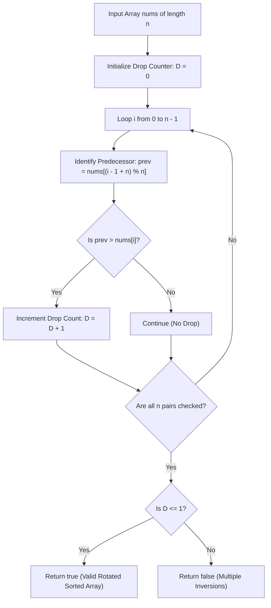

# Guided Example: Check if Array Is Sorted and Rotated

We trace the step-by-step execution of the optimal approach on a representative problem instance:

- **Input:** `nums = [3, 4, 5, 1, 2]`
- **Required Output:** `true`

This instance features a non-trivial cyclic rotation where an array sorted in non-decreasing order ($[1, 2, 3, 4, 5]$) has been rotated by two positions, demonstrating how circular inversion counting verifies sorted-and-rotated properties in a single pass.

---

## 1. Instance & Teaching Goal

Given an integer array `nums` of length $n$, we must determine whether `nums` could have been created by taking an initially sorted non-decreasing array and cyclically shifting (rotating) its elements to the right by some non-negative offset $k \ge 0$.

A naive approach might try all $n$ possible cyclic shift amounts, checking if any resulting configuration is sorted, taking $\mathcal{O}(n^2)$ time.
By considering the array as a closed cycle where index $n - 1$ connects directly back to index $0$:
- In an unrotated sorted array, every adjacent element satisfies $nums[i-1] \le nums[i]$, with at most one circular wrap drop at $nums[n-1] > nums[0]$.
- When rotated by any amount, the cycle remains structurally unchanged; the single point where the maximum element wraps around to the minimum element simply shifts to an interior index.
- Hence, an array is a valid rotated sorted array if and only if the number of adjacent inversions across the closed circle is **at most 1**.

---

## 2. Conceptual Foundation & Invariants

### State Representation

| Component | Mathematical Definition | Property |
|---|---|---|
| Cyclic Predecessor | $\text{prev}(i) = \text{nums}[(i - 1) \pmod n]$ | Wraps around: $\text{prev}(0) = \text{nums}[n - 1]$ |
| Inversion Indicator | $\mathbb{I}(\text{prev}(i) > \text{nums}[i])$ | Evaluates to $1$ if drop occurs, $0$ otherwise |
| Total Inversion Count $D$ | $\sum_{i=0}^{n-1} \mathbb{I}(\text{prev}(i) > \text{nums}[i])$ | Bounded by $1$ for valid instances |

### Mathematical Invariants

> **Cyclic Monotonicity Drop Invariant.**
> Let $A$ be an array of length $n$ that is sorted in non-decreasing order: $A[0] \le A[1] \le \dots \le A[n-1]$.
> - For internal pairs $1 \le i < n$, $A[i-1] \le A[i]$ (0 drops).
> - For the cyclic boundary pair $(A[n-1], A[0])$, either $A[n-1] = A[0]$ (if all elements are identical, 0 drops) or $A[n-1] > A[0]$ (exactly 1 drop).
> Thus, in any circular permutation of a sorted array, the total number of adjacent pairs $(u, v)$ with $u > v$ is at most $1$:
> $$D = \sum_{i=0}^{n-1} \mathbb{I}(\text{nums}[(i-1) \pmod n] > \text{nums}[i]) \le 1$$
> If $D \ge 2$, the array contains multiple local peaks or reversals that cannot be eliminated by any single global rotation.

---

## 3. Step-by-Step Worked Execution

For `nums = [3, 4, 5, 1, 2]` with $n = 5$:
We test all $5$ cyclic pairs $(\text{nums}[(i-1) \pmod 5], \text{nums}[i])$:

### Pair $i = 0$: Boundary Wrap-Around
- Predecessor index: $(0 - 1) \pmod 5 = 4 \implies \text{nums}[4] = 2$.
- Current element: $\text{nums}[0] = 3$.
- Comparison: $\text{nums}[4] \le \text{nums}[0]$ ($2 \le 3$).
- Inversion: False.
- Drop Count $D = 0$.

---

### Pair $i = 1$
- Predecessor: $\text{nums}[0] = 3$.
- Current element: $\text{nums}[1] = 4$.
- Comparison: $3 \le 4$.
- Inversion: False.
- Drop Count $D = 0$.

---

### Pair $i = 2$
- Predecessor: $\text{nums}[1] = 4$.
- Current element: $\text{nums}[2] = 5$.
- Comparison: $4 \le 5$.
- Inversion: False.
- Drop Count $D = 0$.

---

### Pair $i = 3$ (The Rotation Seam)
- Predecessor: $\text{nums}[2] = 5$.
- Current element: $\text{nums}[3] = 1$.
- Comparison: $5 > 1$ (**Drop Detected!**).
- Inversion: True.
- Drop Count $D \leftarrow 0 + 1 = 1$.

---

### Pair $i = 4$
- Predecessor: $\text{nums}[3] = 1$.
- Current element: $\text{nums}[4] = 2$.
- Comparison: $1 \le 2$.
- Inversion: False.
- Drop Count $D = 1$.

---

### Conclusion
Total circular inversions across all 5 transitions:
$$D = 1 \le 1$$
Because $D \le 1$, the array is a valid rotated sorted array.
The algorithm outputs $\mathbf{true}$.

---

## 4. Complete Execution Trace

| Index $i$ | Predecessor $\text{nums}[i-1]$ | Current $\text{nums}[i]$ | Inversion Condition $\text{nums}[i-1] > \text{nums}[i]$ | Evaluation | Running Drop Count $D$ |
|---|---|---|---|---|---|
| $0$ | $\text{nums}[4] = 2$ | $\text{nums}[0] = 3$ | $2 > 3$ | False | $0$ |
| $1$ | $\text{nums}[0] = 3$ | $\text{nums}[1] = 4$ | $3 > 4$ | False | $0$ |
| $2$ | $\text{nums}[1] = 4$ | $\text{nums}[2] = 5$ | $4 > 5$ | False | $0$ |
| $3$ | $\text{nums}[2] = 5$ | $\text{nums}[3] = 1$ | $5 > 1$ | **True** | **$1$** |
| $4$ | $\text{nums}[3] = 1$ | $\text{nums}[4] = 2$ | $1 > 2$ | False | $1$ |

Check: $D \le 1 \implies \mathbf{true}$.

---

## 5. Algorithmic Mastery & Edge Surfacing

### Boundary and Edge Cases

| Scenario | Input Example | Expected Output | Strategic Handling |
|---|---|---|---|
| Already Sorted (Zero Rotation) | `[1, 2, 3]` | `true` | Boundary drop check $3 > 1$ gives $D = 1 \le 1$. |
| All Equal Elements | `[1, 1, 1]` | `true` | No strict drops anywhere; $D = 0 \le 1$. |
| Two Distinct Drops | `[2, 1, 3, 4]` | `false` | $4 > 2$ (drop 1) and $2 > 1$ (drop 2) $\implies D = 2 > 1$, returns `false`. |
| Minimal Array ($n = 1$) | `[10]` | `true` | Boundary comparison $10 > 10$ is false; $D = 0 \le 1$. |

### Invariant Maintenance & Why It Works

1. **Circular Symmetry:**
   By evaluating the wrap-around edge ($i = 0$ comparing $\text{nums}[n-1]$ with $\text{nums}[0]$), the test becomes completely invariant under circular shifts. Any rotation of the same underlying sequence preserves the exact multiset of adjacent directed differences.
2. **Handling Non-Strict Inequality:**
   The check requires strictly greater ($u > v$) rather than greater-or-equal ($u \ge v$), ensuring duplicate equal values (e.g. $[2, 2, 2]$ or $[1, 2, 2, 1, 2]$) do not generate false positive drops.

### Complexity Analysis

- **Time Complexity:** $\mathcal{O}(n)$ where $n$ is the length of `nums`. The algorithm traverses the array in a single linear pass, performing exactly $n$ integer comparisons.
- **Space Complexity:** $\mathcal{O}(1)$ auxiliary space, using only a single integer counter.
