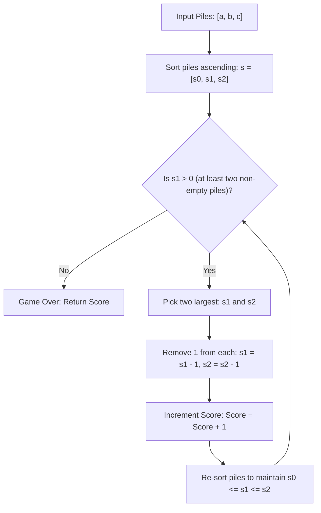

# Guided Example: Maximum Score From Removing Stones

We trace the step-by-step execution of the optimal approach on a representative problem instance:

- **Input:** `a = 2`, `b = 4`, `c = 6`
- **Required Output:** `6`

This instance features non-uniform pile sizes where the largest pile equals the sum of the two smaller piles ($2 + 4 = 6$), demonstrating how balancing the two largest piles guarantees complete pairing without leaving stranded stones.

---

## 1. Instance & Teaching Goal

We are given three piles of stones of sizes $a$, $b$, and $c$. In each turn:
1. We choose two different non-empty piles.
2. We remove one stone from each chosen pile.
3. We add $1$ point to our score.

The game terminates when fewer than two non-empty piles remain (at most one pile contains stones). We seek the maximum possible total score.

A greedy choice must avoid stranding a dominant pile with no opposing stones to match against. By always drawing stones from the two currently largest piles, the two larger piles are brought closer to each other in size, preserving maximum parity and pairing capability until exhaustion.

---

## 2. Conceptual Foundation & Invariants

### State Representation

Let the three pile sizes sorted in ascending order be:
$$s_0 \le s_1 \le s_2$$

| State Component | Role | Game Status |
|---|---|---|
| Pile Trio $[s_0, s_1, s_2]$ | Sorted pile sizes | Active if $s_1 > 0$ |
| Accumulated Score | Points scored so far | Increments by $1$ per turn |
| Termination Criterion | $s_1 = 0$ | At most one non-empty pile remains |

### Mathematical Invariants

> **Triangle Inequality Pile Partitioning Theorem.**
> Let $a \le b \le c$. There are two fundamental regimes:
> 1. **Dominant Heavy Pile ($a + b \le c$):**
>    The largest pile $c$ contains at least as many stones as the other two combined. Every stone in $a$ and $b$ can be paired exclusively against a stone from $c$. When $a$ and $b$ reach $0$, exactly $c - (a + b)$ stones remain in $c$, but no moves remain. The maximum score is:
>    $$\text{Score} = a + b$$
> 2. **Balanced Interlocking Piles ($a + b > c$):**
>    The two smaller piles collectively exceed the largest pile. By pairing stones between $a$ and $b$ to reduce their excess over $c$, all three piles can be diminished in equilibrium until at most $1$ stone remains in the entire game. The maximum score is:
>    $$\text{Score} = \left\lfloor \frac{a + b + c}{2} \right\rfloor$$
> Combining both cases yields the universal closed-form formula:
> $$\text{Score}_{\max} = \min \left( a + b, \; \left\lfloor \frac{a + b + c}{2} \right\rfloor \right)$$

---

## 3. Step-by-Step Worked Execution

For `a = 2`, `b = 4`, `c = 6`:
Initial configuration: $s = [2, 4, 6]$, score $= 0$.

### Turn-by-Turn Trace

#### Turn 1
- Current sorted piles: $[2, 4, 6]$.
- Two largest piles: $s_1 = 4$ and $s_2 = 6$.
- Operation: Decrement $4 \to 3$ and $6 \to 5$.
- Post-turn state: $[2, 3, 5]$.
- Running score: $\mathbf{1}$.

#### Turn 2
- Current sorted piles: $[2, 3, 5]$.
- Two largest piles: $s_1 = 3$ and $s_2 = 5$.
- Operation: Decrement $3 \to 2$ and $5 \to 4$.
- Post-turn state: $[2, 2, 4]$.
- Running score: $\mathbf{2}$.

#### Turn 3
- Current sorted piles: $[2, 2, 4]$.
- Two largest piles: $s_1 = 2$ and $s_2 = 4$.
- Operation: Decrement $2 \to 1$ and $4 \to 3$.
- Post-turn state: $[2, 1, 3] \to \text{re-sorted to } [1, 2, 3]$.
- Running score: $\mathbf{3}$.

#### Turn 4
- Current sorted piles: $[1, 2, 3]$.
- Two largest piles: $s_1 = 2$ and $s_2 = 3$.
- Operation: Decrement $2 \to 1$ and $3 \to 2$.
- Post-turn state: $[1, 1, 2]$.
- Running score: $\mathbf{4}$.

#### Turn 5
- Current sorted piles: $[1, 1, 2]$.
- Two largest piles: $s_1 = 1$ and $s_2 = 2$.
- Operation: Decrement $1 \to 0$ and $2 \to 1$.
- Post-turn state: $[1, 0, 1] \to \text{re-sorted to } [0, 1, 1]$.
- Running score: $\mathbf{5}$.

#### Turn 6
- Current sorted piles: $[0, 1, 1]$.
- Two largest piles: $s_1 = 1$ and $s_2 = 1$.
- Operation: Decrement $1 \to 0$ and $1 \to 0$.
- Post-turn state: $[0, 0, 0]$.
- Running score: $\mathbf{6}$.

#### Termination
- Current sorted piles: $[0, 0, 0]$.
- $s_1 = 0$; fewer than two non-empty piles remain.
- The game concludes. Final score: $\mathbf{6}$.

---

## 4. Complete Execution Trace

| Turn | Starting State $[s_0, s_1, s_2]$ | Chosen Pair | Stones Removed | Resulting State | Re-sorted State | Accumulated Score |
|---|---|---|---|---|---|---|
| $1$ | $[2, 4, 6]$ | $(4, 6)$ | $(s_1, s_2)$ | $[2, 3, 5]$ | $[2, 3, 5]$ | $1$ |
| $2$ | $[2, 3, 5]$ | $(3, 5)$ | $(s_1, s_2)$ | $[2, 2, 4]$ | $[2, 2, 4]$ | $2$ |
| $3$ | $[2, 2, 4]$ | $(2, 4)$ | $(s_1, s_2)$ | $[2, 1, 3]$ | $[1, 2, 3]$ | $3$ |
| $4$ | $[1, 2, 3]$ | $(2, 3)$ | $(s_1, s_2)$ | $[1, 1, 2]$ | $[1, 1, 2]$ | $4$ |
| $5$ | $[1, 1, 2]$ | $(1, 2)$ | $(s_1, s_2)$ | $[1, 0, 1]$ | $[0, 1, 1]$ | $5$ |
| $6$ | $[0, 1, 1]$ | $(1, 1)$ | $(s_1, s_2)$ | $[0, 0, 0]$ | $[0, 0, 0]$ | **$6$** |
| Halts | $[0, 0, 0]$ | None | $s_1 = 0$ | — | — | **$6$** |

---

## 5. Algorithmic Mastery & Edge Surfacing

### Boundary and Edge Cases

| Scenario | Pile Sizes | Expected Score | Strategic Handling |
|---|---|---|---|
| Massive Dominant Pile | `a = 1, b = 1, c = 10` | $1 + 1 = 2$ | $a + b = 2 \le 10$; returns $a + b = 2$, leaving $8$ stranded stones in $c$. |
| Symmetric Balanced Piles | `a = 4, b = 4, c = 4` | $\lfloor 12 / 2 \rfloor = 6$ | Full exhaustion down to $0$ stones across all piles. |
| Two Piles Empty Initially | `a = 0, b = 0, c = 5` | $0$ | $s_1 = 0$ immediately; 0 moves possible. |
| Odd Total Sum | `a = 4, b = 4, c = 5` | $\lfloor 13 / 2 \rfloor = 6$ | Leaves exactly $1$ stone at termination. |

### Invariant Maintenance & Why It Works

1. **Greedy Balance Optimality:**
   By always depleting the two largest piles, the difference $s_2 - s_1$ decreases or remains bounded. This prevents one pile from growing disproportionately large relative to the sum of the other two, ensuring maximum possible pairing.
2. **Equivalence of Closed-Form and Simulation:**
   Because each move decreases total stone count by $2$, the theoretical upper bound is $\lfloor (a+b+c)/2 \rfloor$. The capacity to achieve this bound is constrained solely by the bottleneck condition that no single pile can contribute more than the sum of the other two, proving that $\min(a+b, \lfloor (a+b+c)/2 \rfloor)$ is exact.

### Complexity Analysis

- **Time Complexity:** $\mathcal{O}(a + b + c)$ for direct greedy simulation (at most $1.5 \times 10^5$ turns for standard constraints), or $\mathcal{O}(1)$ closed-form time via formula calculation.
- **Space Complexity:** $\mathcal{O}(1)$ auxiliary space, maintaining only three sorted integer variables.
