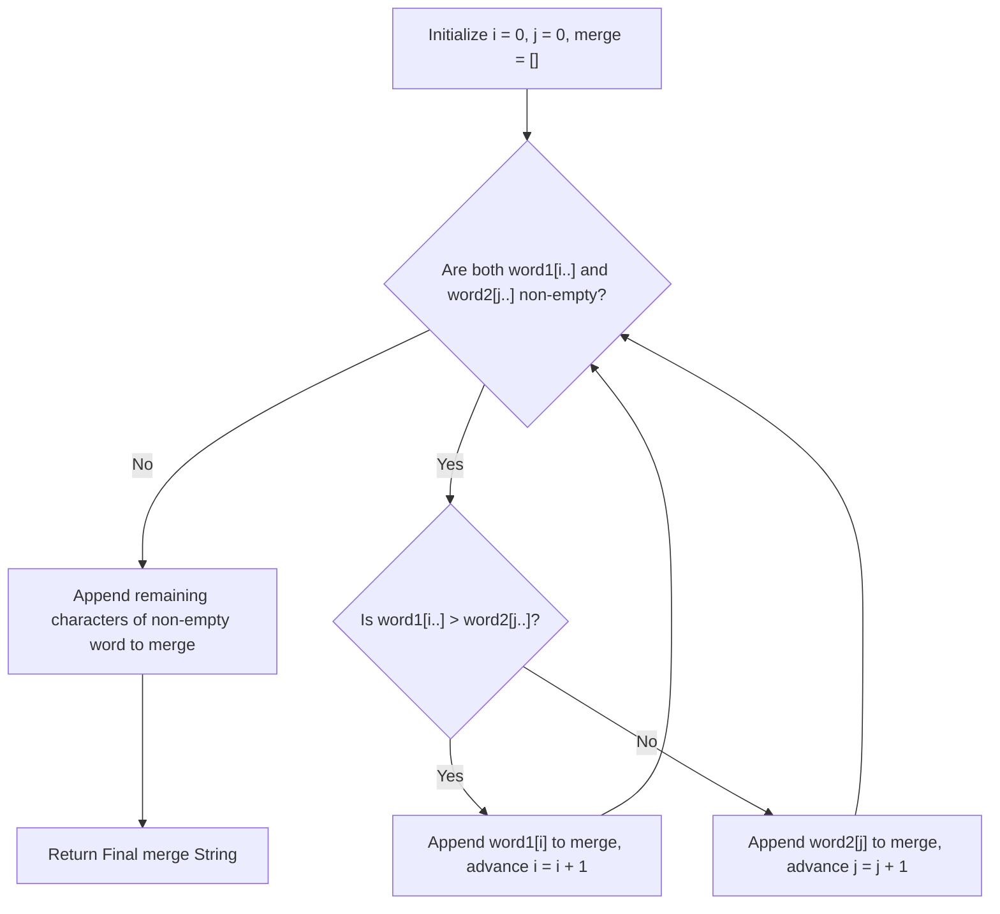

# Guided Example: Largest Merge of Two Strings

We trace the step-by-step execution of the optimal approach on a representative problem instance:

- **Input:** `word1 = "cabaa"`, `word2 = "bcaaa"`
- **Required Output:** `"cbcabaaaaa"`

This instance features non-uniform character sequences with repeated tie-breaking scenarios across equal prefix letters, demonstrating how greedy full-suffix lexicographical comparison determines the optimal extraction sequence.

---

## 1. Instance & Teaching Goal

We are given two non-empty lowercase alphabetical strings `word1` and `word2`. In each step, while either string is non-empty, we choose the leading character from either `word1` or `word2`, append it to our result string `merge`, and remove it from the chosen source string. We seek to construct the **lexicographically largest** string `merge`.

A simple local greedy comparison (checking only the current head characters $word1[i]$ vs $word2[j]$) fails when the head characters are identical. In that scenario, drawing from the wrong word may delay higher-value future characters.
The optimal strategy compares the entire remaining suffixes $word1[i \dots]$ and $word2[j \dots]$:
- If $word1[i \dots] >_{\text{lex}} word2[j \dots]$, we must draw the next character from $word1$.
- Otherwise, we draw from $word2$.
- This guarantees that whichever string possesses the strictly larger character at the earliest point of divergence is prioritized, placing larger characters into `merge` as early as possible.

---

## 2. Conceptual Foundation & Invariants

### State Representation

| Component | Definition | Initial State |
|---|---|---|
| Pointer $i$ | Current unconsumed head index in `word1` | $0$ |
| Pointer $j$ | Current unconsumed head index in `word2` | $0$ |
| Active Suffixes | $S_1 = word1[i \dots]$ and $S_2 = word2[j \dots]$ | Full initial strings |
| Result Buffer | Constructed characters forming `merge` | Empty string |

### Mathematical Invariants

> **Suffix Lexicographical Comparison Dominance Theorem.**
> Let $S_1 = word1[i \dots]$ and $S_2 = word2[j \dots]$ be the remaining suffixes at step $k$.
> 1. If $S_1[0] > S_2[0]$, drawing from $S_1$ immediately yields a strictly larger character at position $k$. No future operations can overcome a difference at an earlier index.
> 2. If $S_1[0] = S_2[0]$, both choices place the same character into `merge[k]`. The character at position $k + 1$ will be determined by the subsequent choices.
>    Suppose $S_1 >_{\text{lex}} S_2$. At the earliest index $d$ where $S_1[d] \neq S_2[d]$, we have $S_1[d] > S_2[d]$. Drawing from $S_1$ advances $S_1$ along this advantageous trajectory, ensuring that the larger character $S_1[d]$ appears sooner in `merge` than if $S_2$ had been consumed first.
> Therefore, the decision rule:
> $$\text{Take from } word1 \iff word1[i \dots] >_{\text{lex}} word2[j \dots]$$
> is provably optimal at every step.

---

## 3. Step-by-Step Worked Execution

For `word1 = "cabaa"` (length 5) and `word2 = "bcaaa"` (length 5):

### Step 1
- $S_1 = \text{"cabaa"}$, $S_2 = \text{"bcaaa"}$
- Comparison: $\text{'c'} > \text{'b'} \implies S_1 > S_2$.
- Action: Take $word1[0] = \text{'c'}$. Advance $i \leftarrow 1$.
- `merge` = `"c"`.

---

### Step 2
- $S_1 = \text{"abaa"}$, $S_2 = \text{"bcaaa"}$
- Comparison: $\text{'a'} < \text{'b'} \implies S_1 < S_2$.
- Action: Take $word2[0] = \text{'b'}$. Advance $j \leftarrow 1$.
- `merge` = `"cb"`.

---

### Step 3
- $S_1 = \text{"abaa"}$, $S_2 = \text{"caaa"}$
- Comparison: $\text{'a'} < \text{'c'} \implies S_1 < S_2$.
- Action: Take $word2[1] = \text{'c'}$. Advance $j \leftarrow 2$.
- `merge` = `"cbc"`.

---

### Step 4 (The Tie-Breaking Suffix Lookahead)
- $S_1 = \text{"abaa"}$, $S_2 = \text{"aaa"}$
- Immediate head characters are identical: $S_1[0] = \text{'a'}$, $S_2[0] = \text{'a'}$.
- Suffix Comparison:
  - At index 0: $\text{'a'} == \text{'a'}$
  - At index 1: $S_1[1] = \text{'b'}$ vs $S_2[1] = \text{'a'}$.
  - Since $\text{'b'} > \text{'a'}$, we have $\text{"abaa"} >_{\text{lex}} \text{"aaa"}$.
- Action: Take from $word1$: $word1[1] = \text{'a'}$. Advance $i \leftarrow 2$.
- `merge` = `"cbca"`.
- *Significance:* Taking `'a'` from $word1$ unblocks `'b'` for the very next turn!

---

### Step 5
- $S_1 = \text{"baa"}$, $S_2 = \text{"aaa"}$
- Comparison: $\text{'b'} > \text{'a'} \implies S_1 > S_2$.
- Action: Take $word1[2] = \text{'b'}$. Advance $i \leftarrow 3$.
- `merge` = `"cbcab"`.

---

### Step 6
- $S_1 = \text{"aa"}$, $S_2 = \text{"aaa"}$
- Suffix Comparison: $\text{"aa"}$ is a strict prefix of $\text{"aaa"}$, so the longer string is lexicographically larger: $\text{"aaa"} >_{\text{lex}} \text{"aa"}$.
- Action: Take from $word2$: $word2[2] = \text{'a'}$. Advance $j \leftarrow 3$.
- `merge` = `"cbcaba"`.

---

### Step 7
- $S_1 = \text{"aa"}$, $S_2 = \text{"aa"}$
- Strings are identical: default to $word2$. Take $word2[3] = \text{'a'}$. Advance $j \leftarrow 4$.
- `merge` = `"cbcabaa"`.

---

### Step 8
- $S_1 = \text{"aa"}$, $S_2 = \text{"a"}$
- Comparison: $\text{"aa"} >_{\text{lex}} \text{"a"}$.
- Action: Take $word1[3] = \text{'a'}$. Advance $i \leftarrow 4$.
- `merge` = `"cbcabaaa"`.

---

### Step 9
- $S_1 = \text{"a"}$, $S_2 = \text{"a"}$
- Equal: take $word2[4] = \text{'a'}$. Advance $j \leftarrow 5$.
- `merge` = `"cbcabaaaa"`.

---

### Step 10: Tail Flush
- $word2$ is exhausted ($j = 5$).
- Remaining suffix in $word1$: $word1[4 \dots] = \text{"a"}$.
- Append `"a"` to `merge`.
- Final string: `"cbcabaaaaa"`.

---

## 4. Complete Execution Trace

| Step | Suffix $word1[i \dots]$ | Suffix $word2[j \dots]$ | Lexicographical Comparison | Source Chosen | Appended Char | Resulting `merge` |
|---|---|---|---|---|---|---|
| $1$ | `"cabaa"` | `"bcaaa"` | $S_1 > S_2$ | $word1$ | `'c'` | `"c"` |
| $2$ | `"abaa"` | `"bcaaa"` | $S_1 < S_2$ | $word2$ | `'b'` | `"cb"` |
| $3$ | `"abaa"` | `"caaa"` | $S_1 < S_2$ | $word2$ | `'c'` | `"cbc"` |
| $4$ | `"abaa"` | `"aaa"` | $S_1 > S_2$ (at index 1: 'b' > 'a') | $word1$ | `'a'` | `"cbca"` |
| $5$ | `"baa"` | `"aaa"` | $S_1 > S_2$ ('b' > 'a') | $word1$ | `'b'` | `"cbcab"` |
| $6$ | `"aa"` | `"aaa"` | $S_1 < S_2$ | $word2$ | `'a'` | `"cbcaba"` |
| $7$ | `"aa"` | `"aa"` | $S_1 \le S_2$ | $word2$ | `'a'` | `"cbcabaa"` |
| $8$ | `"aa"` | `"a"` | $S_1 > S_2$ | $word1$ | `'a'` | `"cbcabaaa"` |
| $9$ | `"a"` | `"a"` | $S_1 \le S_2$ | $word2$ | `'a'` | `"cbcabaaaa"` |
| $10$ | `"a"` | `""` | $word2$ empty | $word1$ | `'a'` | `"cbcabaaaaa"` |

---

## 5. Algorithmic Mastery & Edge Surfacing

### Boundary and Edge Cases

| Scenario | Input Example | Expected Output | Strategic Handling |
|---|---|---|---|
| Prefix Containment | `word1 = "ab", word2 = "ab"` | `"abab"` | Equal strings alternate or drain sequentially; yields identical output. |
| One Empty Initially | `word1 = "", word2 = "abc"` | `"abc"` | Main loop bypassed; flushes remaining non-empty string. |
| Disjoint Alphabets | `word1 = "zzz", word2 = "aaa"` | `"zzzaaa"` | $S_1$ always greater; drains $word1$ completely before $word2$. |
| Highly Repetitive Patterns | `word1 = "a" * 1000, word2 = "a" * 1000` | `"a" * 2000` | Suffix slicing comparisons handle identical prefixes cleanly. |

### Invariant Maintenance & Why It Works

1. **Why Full Suffix Comparison Is Necessary:**
   A fixed lookahead window $k$ is insufficient. For instance, comparing `"a...ab"` and `"a...aa"` requires looking ahead through all identical `'a'`s until reaching the difference at the end. Comparing the full remaining slices guarantees exact correctness.
2. **Terminal Tail Flush:**
   Once one word is exhausted, the other word cannot compete against any other options; appending its entire remaining suffix in one operation preserves linear trailing concatenation.

### Complexity Analysis

- **Time Complexity:** $\mathcal{O}((N + M)^2)$ in the worst case with naive string slicing comparisons, where $N = |word1|$ and $M = |word2|$. For $N, M \le 3000$, $(N + M)^2 \approx 3.6 \times 10^7$ character comparisons, executing in under $0.2$s in standard runtimes. (Suffix automaton or suffix array algorithms can reduce this to $\mathcal{O}(N + M)$ if required).
- **Space Complexity:** $\mathcal{O}(N + M)$ auxiliary space to construct and store the merged character array.
