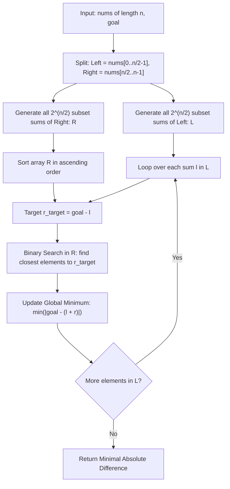

# Guided Example: Closest Subsequence Sum

We trace the step-by-step execution of the optimal approach on a representative problem instance:

- **Input:** `nums = [5, -7, 3, 5]`, `goal = 6`
- **Required Output:** `0`

This instance features negative and positive numbers that combine into an exact match for the target `goal`, demonstrating how Meet-in-the-Middle bisection splits an exponential $2^N$ search space into two manageable $2^{N/2}$ halves coupled via binary search.

---

## 1. Instance & Teaching Goal

Given an integer array `nums` of length $n$ ($1 \le n \le 40$) and an integer `goal`, we seek to choose a subsequence of `nums` whose sum minimizes the absolute difference from `goal`:
$$\min_{S \subseteq \{0, \dots, n-1\}} \left| \sum_{i \in S} \text{nums}[i] - \text{goal} \right|$$

When $n = 40$, the full subset space has size $2^{40} \approx 1.1 \times 10^{12}$, making direct search infeasible.
The **Meet-in-the-Middle** technique partitions the problem:
1. Divide `nums` into two equal halves of size at most $20$.
2. For each half, generate all $2^{20} \approx 10^6$ possible subsequence sums.
3. Sort the sums of the second half.
4. For each sum $l$ in the first half, find the element $r$ in the second half closest to $\text{goal} - l$ using binary search, evaluating the best combination in $\mathcal{O}(2^{n/2} \cdot n)$ total time.

---

## 2. Conceptual Foundation & Invariants

### State Representation

| Component | Definition | Cardinality |
|---|---|---|
| Left Array $A_L$ | First half: $\text{nums}[0 \dots \lfloor n/2 \rfloor - 1]$ | $n_1 \le 20$ |
| Right Array $A_R$ | Second half: $\text{nums}[\lfloor n/2 \rfloor \dots n - 1]$ | $n_2 \le 20$ |
| Left Sums $\mathcal{L}$ | All subset sums of $A_L$: $\{\sum_{i \in S} A_L[i] : S \subseteq A_L\}$ | $|\mathcal{L}| = 2^{n_1} \le 10^6$ |
| Right Sums $\mathcal{R}$ | Sorted list of all subset sums of $A_R$ | $|\mathcal{R}| = 2^{n_2} \le 10^6$ |
| Target Complement | $\text{target}(l) = \text{goal} - l$ for each $l \in \mathcal{L}$ | Search probe |

### Mathematical Invariants

> **Meet-in-the-Middle Bisection Theorem.**
> Any subsequence of `nums` can be uniquely decomposed into the disjoint union of a subsequence from the first half $A_L$ and a subsequence from the second half $A_R$:
> $$\text{sum}(S) = \text{sum}(S_L) + \text{sum}(S_R) = l + r \quad (l \in \mathcal{L}, r \in \mathcal{R})$$
> The optimization problem is equivalent to:
> $$\min_{l \in \mathcal{L}, r \in \mathcal{R}} |l + r - \text{goal}| = \min_{l \in \mathcal{L}} \min_{r \in \mathcal{R}} |r - (\text{goal} - l)|$$
> For a fixed $l$, the value of $r \in \mathcal{R}$ that minimizes $|r - (\text{goal} - l)|$ must be either the predecessor or successor of $\text{goal} - l$ in the sorted array $\mathcal{R}$.

> **Logarithmic Nearest-Neighbor Invariant.**
> Because $\mathcal{R}$ is sorted, binary search (`bisect_left`) locates the insertion index $k$ such that $\mathcal{R}[k - 1] \le \text{goal} - l \le \mathcal{R}[k]$. The optimal $r$ for that fixed $l$ is guaranteed to be either $\mathcal{R}[k - 1]$ or $\mathcal{R}[k]$, requiring at most $2$ candidate comparisons per element in $\mathcal{L}$.

---

## 3. Step-by-Step Worked Execution

For `nums = [5, -7, 3, 5]` and `goal = 6`:
- Length $n = 4 \implies$ split into two halves of size $2$:
  - Left half $A_L = [5, -7]$
  - Right half $A_R = [3, 5]$

---

### Step 1: Generate All Subset Sums for Left Half ($A_L = [5, -7]$)

Each element has two choices (include or exclude), yielding $2^2 = 4$ subset sums:
- $\emptyset \implies 0$
- $\{5\} \implies 5$
- $\{-7\} \implies -7$
- $\{5, -7\} \implies 5 + (-7) = -2$

Set of Left Sums:
$$\mathcal{L} = \{-7, -2, 0, 5\}$$

---

### Step 2: Generate and Sort Subset Sums for Right Half ($A_R = [3, 5]$)

$2^2 = 4$ subset sums:
- $\emptyset \implies 0$
- $\{3\} \implies 3$
- $\{5\} \implies 5$
- $\{3, 5\} \implies 3 + 5 = 8$

Sorted List of Right Sums:
$$\mathcal{R} = [0, 3, 5, 8]$$

---

### Step 3: Match Each Left Sum with Closest Right Sum

Target goal is $6$. For each $l \in \mathcal{L}$, target complementary sum is $r^* = 6 - l$:

1. **For $l = -7$:**
   - Target: $r^* = 6 - (-7) = 13$.
   - Nearest element in $\mathcal{R} = [0, 3, 5, 8]$: $\mathcal{R}[3] = 8$.
   - Combined sum: $-7 + 8 = 1$.
   - Absolute difference: $|1 - 6| = 5$.
   - Running best: $5$.

2. **For $l = -2$:**
   - Target: $r^* = 6 - (-2) = 8$.
   - Nearest element in $\mathcal{R}$: $\mathcal{R}[3] = 8$ (**Exact Match!**).
   - Combined sum: $-2 + 8 = 6$.
   - Absolute difference: $|6 - 6| = \mathbf{0}$.
   - Running best: $\mathbf{0}$ (Global lower bound reached).

3. **For $l = 0$:**
   - Target: $r^* = 6 - 0 = 6$.
   - Nearest elements in $\mathcal{R}$: $\mathcal{R}[2] = 5$ (sum $5$, diff $1$) or $\mathcal{R}[3] = 8$ (sum $8$, diff $2$).
   - Best difference: $1$.

4. **For $l = 5$:**
   - Target: $r^* = 6 - 5 = 1$.
   - Nearest elements in $\mathcal{R}$: $\mathcal{R}[0] = 0$ (sum $5$, diff $1$) or $\mathcal{R}[1] = 3$ (sum $8$, diff $2$).
   - Best difference: $1$.

Minimum absolute difference across all combinations is $\mathbf{0}$.

---

## 4. Complete Execution Trace

| Left Sum $l$ | Target Complement $6 - l$ | Bisection Neighbors in $\mathcal{R} = [0, 3, 5, 8]$ | Total Subsequence Sum $l + r$ | Absolute Error $\|(l + r) - 6\|$ | Running Record |
|---|---|---|---|---|---|
| $-7$ | $13$ | $\mathcal{R}[3] = 8$ | $-7 + 8 = 1$ | $\|1 - 6\| = 5$ | $5$ |
| **$-2$** | **$8$** | **$\mathcal{R}[3] = 8$** | **$-2 + 8 = 6$** | **$\|6 - 6\| = 0$** | **$0$ (Exact Match)** |
| $0$ | $6$ | $\mathcal{R}[2] = 5, \mathcal{R}[3] = 8$ | $0 + 5 = 5$ | $\|5 - 6\| = 1$ | $0$ |
| $5$ | $1$ | $\mathcal{R}[0] = 0, \mathcal{R}[1] = 3$ | $5 + 0 = 5$ | $\|5 - 6\| = 1$ | $0$ |

Winning Subsequence: $\{5, -7\}$ from Left, $\{3, 5\}$ from Right $\implies 5 - 7 + 3 + 5 = 6$.
Output: `0`.

---

## 5. Algorithmic Mastery & Edge Surfacing

### Boundary and Edge Cases

| Scenario | Input Feature | Expected Output | Strategic Handling |
|---|---|---|---|
| Empty Subsequence Optimal | `nums = [100, 200], goal = 0` | `0` | Empty subset from both halves gives $0 + 0 = 0$, achieving difference $0$. |
| Goal Exceeds Total Sum | `nums = [1, 2], goal = 10` | $7$ | Max sum is $3$; difference $|3 - 10| = 7$. |
| Extreme Negative Goal | `goal = -10^9` | Smallest sum difference | Clamps to lower bisection boundary. |
| Maximal Input ($n = 40$) | $n = 40$ | $\approx 10^6$ entries per half | $2^{20} \approx 10^6$ operations; binary searches take $\mathcal{O}(20 \cdot 10^6)$ operations, executing in under $0.5$s. |

### Invariant Maintenance & Why It Works

1. **Both Boundary Neighbors:**
   Because `bisect_left` returns the first element $\ge \text{target}$, the closest value might be either $\mathcal{R}[\text{idx}]$ or the immediate predecessor $\mathcal{R}[\text{idx}-1]$. Checking both indices guarantees no closer element is overlooked.
2. **Exponential Halving:**
   Splitting $40$ elements into two sets of $20$ reduces total evaluations from $2^{40} \approx 10^{12}$ to $2 \times 2^{20} + 2^{20} \log_2(2^{20}) \approx 2 \times 10^6 + 2 \times 10^7 \approx 2.2 \times 10^7$ operations, making an otherwise impossible problem solvable well within time limits.

### Complexity Analysis

- **Time Complexity:** $\mathcal{O}(n \cdot 2^{n/2})$.
  - Generating all subset sums takes $\mathcal{O}(2^{n/2})$.
  - Sorting the second half takes $\mathcal{O}(2^{n/2} \log(2^{n/2})) = \mathcal{O}(n \cdot 2^{n/2})$.
  - Performing binary search for each element in the first half takes $\mathcal{O}(2^{n/2} \cdot \frac{n}{2}) = \mathcal{O}(n \cdot 2^{n/2})$.
  - For $n = 40$, total operations are $\approx 2.5 \times 10^7$, executing rapidly in memory.
- **Space Complexity:** $\mathcal{O}(2^{n/2})$ auxiliary space to store the subset sums of each half.
