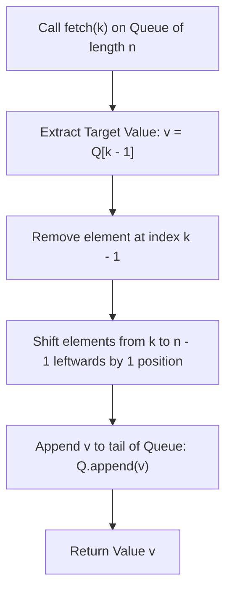

# Guided Example: Design Most Recently Used Queue

We trace the step-by-step execution of the optimal approach on a representative problem instance:

- **Input Operations:**
  `["MRUQueue", "fetch", "fetch", "fetch", "fetch"]`
  `[[8], [3], [5], [2], [8]]`
- **Required Output:**
  `[null, 3, 6, 2, 2]`

This instance features dynamic reordering of elements within an 8-element sequence across repeated queries, demonstrating how dynamic index extraction and tail relocation maintain structural integrity.

---

## 1. Instance & Teaching Goal

We design a specialized queue data structure initialized with $n$ elements $[1, 2, \dots, n]$:
- `MRUQueue(n)`: Initializes an ordered sequence of $n$ elements from $1$ to $n$.
- `fetch(k)`: Moves the $k$-th element (1-indexed) to the very end (tail) of the queue and returns its value.

A fixed linked list permits $\mathcal{O}(1)$ node splicing but requires $\mathcal{O}(k)$ time to traverse to the $k$-th node. An array provides $\mathcal{O}(1)$ random access to the $k$-th element, followed by an $\mathcal{O}(n - k)$ block shift to delete and re-append at the tail. Under constraints ($n, k \le 2000$), direct array slicing operates well within millisecond limits (and square-root bucket decomposition or Fenwick/Treap structures achieve $\mathcal{O}(\sqrt{n})$ or $\mathcal{O}(\log n)$).

---

## 2. Conceptual Foundation & Invariants

### State Representation

| Component | Definition | Length |
|---|---|---|
| Queue Array $Q$ | 0-indexed contiguous sequence of integers $[q_0, q_1, \dots, q_{n-1}]$ | Fixed length $n$ |
| Target Index $k$ | 1-indexed target position for retrieval | $1 \le k \le n$ |
| Retrieved Element $v$ | Value stored at position $k - 1$: $Q[k - 1]$ | $1 \le v \le n$ |

### Mathematical Invariants

> **Rotational Index-Extraction Theorem.**
> Let $Q = [q_0, q_1, \dots, q_{k-1}, q_k, \dots, q_{n-1}]$ be the queue of $n$ elements.
> The operation `fetch(k)` performs a state transition $Q \to Q'$ defined by:
> 1. Extract the scalar $v = q_{k-1}$.
> 2. Shift all subsequent elements $q_k \dots q_{n-1}$ one position to the left:
>    $$q'_j = q_{j+1} \quad \text{for } k - 1 \le j < n - 1$$
> 3. Place $v$ at the terminal tail position:
>    $$q'_{n-1} = v$$
> The multiset of elements in $Q$ is strictly preserved, and total length $n$ remains invariant.

---

## 3. Step-by-Step Worked Execution

We trace the sequence of operations on an 8-element queue ($n = 8$):

### Initialization: `MRUQueue(8)`
- Initial state:
  $$Q = [1, 2, 3, 4, 5, 6, 7, 8]$$
- Output: `null`.

---

### Operation 1: `fetch(3)`
- Target index: $k = 3 \implies 0$-indexed position $k - 1 = 2$.
- Value at index 2: $v = Q[2] = \mathbf{3}$.
- Splicing:
  - Elements before index 2: $[1, 2]$
  - Elements after index 2: $[4, 5, 6, 7, 8]$
  - Concatenation and append: $[1, 2, 4, 5, 6, 7, 8] + [3]$
- Resulting Queue:
  $$Q = [1, 2, 4, 5, 6, 7, 8, 3]$$
- Return value: $\mathbf{3}$.

---

### Operation 2: `fetch(5)`
- Current Queue: $Q = [1, 2, 4, 5, 6, 7, 8, 3]$.
- Target index: $k = 5 \implies 0$-indexed position $k - 1 = 4$.
- Value at index 4: $v = Q[4] = \mathbf{6}$.
- Splicing:
  - Elements before index 4: $[1, 2, 4, 5]$
  - Elements after index 4: $[7, 8, 3]$
  - Concatenation and append: $[1, 2, 4, 5, 7, 8, 3] + [6]$
- Resulting Queue:
  $$Q = [1, 2, 4, 5, 7, 8, 3, 6]$$
- Return value: $\mathbf{6}$.

---

### Operation 3: `fetch(2)`
- Current Queue: $Q = [1, 2, 4, 5, 7, 8, 3, 6]$.
- Target index: $k = 2 \implies 0$-indexed position $k - 1 = 1$.
- Value at index 1: $v = Q[1] = \mathbf{2}$.
- Splicing:
  - Elements before index 1: $[1]$
  - Elements after index 1: $[4, 5, 7, 8, 3, 6]$
  - Concatenation and append: $[1, 4, 5, 7, 8, 3, 6] + [2]$
- Resulting Queue:
  $$Q = [1, 4, 5, 7, 8, 3, 6, 2]$$
- Return value: $\mathbf{2}$.

---

### Operation 4: `fetch(8)`
- Current Queue: $Q = [1, 4, 5, 7, 8, 3, 6, 2]$.
- Target index: $k = 8 \implies 0$-indexed position $k - 1 = 7$.
- Value at index 7: $v = Q[7] = \mathbf{2}$.
- Splicing:
  - The target element is already at the very end of the queue.
  - Splicing removes it and re-appends it to the tail.
- Resulting Queue:
  $$Q = [1, 4, 5, 7, 8, 3, 6, 2]$$
- Return value: $\mathbf{2}$.

---

## 4. Complete Execution Trace

| Call | Parameter $k$ | Target Index ($k-1$) | Value Extracted $v$ | Queue State After Transition | Return |
|---|---|---|---|---|---|
| `MRUQueue(8)` | $n = 8$ | — | — | $[1, 2, 3, 4, 5, 6, 7, 8]$ | `null` |
| `fetch(3)` | $3$ | $2$ | $3$ | $[1, 2, 4, 5, 6, 7, 8, 3]$ | **$3$** |
| `fetch(5)` | $5$ | $4$ | $6$ | $[1, 2, 4, 5, 7, 8, 3, 6]$ | **$6$** |
| `fetch(2)` | $2$ | $1$ | $2$ | $[1, 4, 5, 7, 8, 3, 6, 2]$ | **$2$** |
| `fetch(8)` | $8$ | $7$ | $2$ | $[1, 4, 5, 7, 8, 3, 6, 2]$ | **$2$** |

---

## 5. Algorithmic Mastery & Edge Surfacing

### Boundary and Edge Cases

| Scenario | Input Parameter | Expected Behavior | Strategic Handling |
|---|---|---|---|
| Fetch Head ($k = 1$) | $k = 1$ | Moves front element to back | Prefix is empty; remaining elements shift left by 1. |
| Fetch Tail ($k = n$) | $k = n$ | Element re-appends to tail | Queue array remains unchanged in ordering. |
| Single-Element Queue ($n = 1$) | $n = 1, k = 1$ | Constant return of $1$ | No other elements can shift. |
| Repeated Fetch of Same Element | Successive calls with $k = n$ | Unchanged value returned | Confirms tail idempotency. |

### Invariant Maintenance & Why It Works

1. **Permutation Conservation:**
   Every `fetch` operation removes exactly one element and appends exactly that same element to the end. The total count and multiset of elements remain identical to the original set $\{1, \dots, n\}$.
2. **Relative Ordering Preservation:**
   All elements before index $k - 1$ remain in their exact relative order. All elements after index $k - 1$ shift forward by 1 position while maintaining their internal relative order.

### Complexity Analysis

- **Time Complexity:**
  - `MRUQueue(n)`: $\mathcal{O}(n)$ time to initialize the contiguous array.
  - `fetch(k)`: $\mathcal{O}(n - k)$ time for array deletion and append. Across $Q$ calls, total time is bounded by $\mathcal{O}(Q \cdot n)$. For $n, Q \le 2000$, $Q \cdot n \le 4 \times 10^6$ operations, executing in $< 0.05$s. (A B-Tree or $\sqrt{n}$-bucket layout reduces this to $\mathcal{O}(\sqrt{n})$ per fetch).
- **Space Complexity:** $\mathcal{O}(n)$ auxiliary space to store the $n$-element queue.