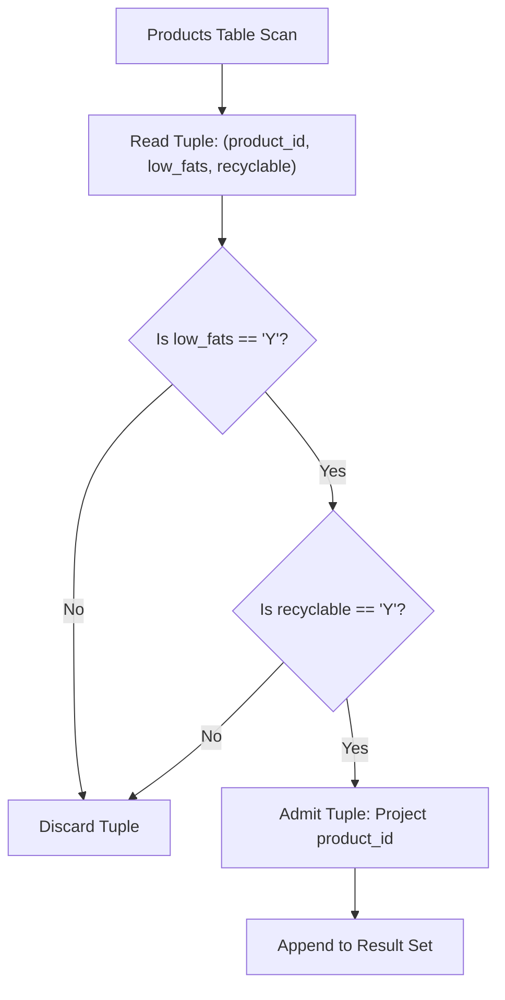

# Guided Example: Recyclable and Low Fat Products

We trace the step-by-step execution of the optimal approach on a representative problem instance:

- **Input Table (`Products`):**
  | `product_id` | `low_fats` | `recyclable` |
  |---|---|---|
  | `0` | `Y` | `N` |
  | `1` | `Y` | `Y` |
  | `2` | `N` | `Y` |
  | `3` | `Y` | `Y` |
  | `4` | `N` | `N` |
- **Required Output:**
  | `product_id` |
  |---|
  | `1` |
  | `3` |

This instance spans all four possible truth assignments for the boolean attributes (True/True, True/False, False/True, False/False), demonstrating how conjunctive selection filters relational tuples in linear scan time.

---

## 1. Instance & Teaching Goal

We are given a `Products` table with attributes:
$$(\text{product\_id} : \text{INT}, \text{low\_fats} : \text{ENUM}('Y', 'N'), \text{recyclable} : \text{ENUM}('Y', 'N'))$$
where `product_id` is the primary key.

Our goal is to find the IDs of all products that satisfy both criteria simultaneously:
1. The product is low fat: $\text{low\_fats} = \text{'Y'}$.
2. The product is recyclable: $\text{recyclable} = \text{'Y'}$.

In relational algebra, this operation is expressed as a conjunctive selection followed by an attribute projection:
$$\pi_{\text{product\_id}} \left( \sigma_{\text{low\_fats} = \text{'Y'} \land \text{recyclable} = \text{'Y'}}(\text{Products}) \right)$$

---

## 2. Conceptual Foundation & Invariants

### State Representation

| Relational Operator | Expression | Target Output |
|---|---|---|
| Selection Predicate | $\sigma_{\text{low\_fats} = \text{'Y'} \land \text{recyclable} = \text{'Y'}}$ | Retains tuples meeting both conditions |
| Projection | $\pi_{\text{product\_id}}$ | Isolates primary key column |
| Output Stream | Filtered tuples matching schema `(product_id)` | Projected set $\{1, 3\}$ |

### Mathematical Invariants

> **Conjunctive Boolean Selection Theorem.**
> Let $t \in \text{Products}$ be a tuple. The selection condition is:
> $$P(t) \equiv (t.\text{low\_fats} = \text{'Y'}) \land (t.\text{recyclable} = \text{'Y'})$$
> By the definition of the logical conjunction $\land$, $P(t) = \text{True}$ if and only if both individual predicates evaluate to True:
> - If $t.\text{low\_fats} = \text{'N'}$, $P(t) = \text{False}$ regardless of $t.\text{recyclable}$.
> - If $t.\text{recyclable} = \text{'N'}$, $P(t) = \text{False}$ regardless of $t.\text{low\_fats}$.
> Only tuples possessing the exact pairing $(\text{'Y'}, \text{'Y'})$ are admitted into the result set.

---

## 3. Step-by-Step Worked Execution

We process the 5 candidate products:

### Tuple 1: `product_id = 0`
- Attributes: $\text{low\_fats} = \text{'Y'}, \text{recyclable} = \text{'N'}$.
- Evaluation: $\text{'Y'} = \text{'Y'}$ (True), but $\text{'N'} = \text{'Y'}$ (False).
- Conjunction: $\text{True} \land \text{False} = \text{False}$.
- Action: Discarded.

---

### Tuple 2: `product_id = 1`
- Attributes: $\text{low\_fats} = \text{'Y'}, \text{recyclable} = \text{'Y'}$.
- Evaluation: $\text{'Y'} = \text{'Y'}$ (True) and $\text{'Y'} = \text{'Y'}$ (True).
- Conjunction: $\text{True} \land \text{True} = \text{True}$.
- Action: **Admitted**. Projected attribute: $\text{product\_id} = 1$.

---

### Tuple 3: `product_id = 2`
- Attributes: $\text{low\_fats} = \text{'N'}, \text{recyclable} = \text{'Y'}$.
- Evaluation: $\text{'N'} = \text{'Y'}$ (False).
- Conjunction: Short-circuits to $\text{False}$.
- Action: Discarded.

---

### Tuple 4: `product_id = 3`
- Attributes: $\text{low\_fats} = \text{'Y'}, \text{recyclable} = \text{'Y'}$.
- Evaluation: $\text{'Y'} = \text{'Y'}$ (True) and $\text{'Y'} = \text{'Y'}$ (True).
- Conjunction: $\text{True} \land \text{True} = \text{True}$.
- Action: **Admitted**. Projected attribute: $\text{product\_id} = 3$.

---

### Tuple 5: `product_id = 4`
- Attributes: $\text{low\_fats} = \text{'N'}, \text{recyclable} = \text{'N'}$.
- Evaluation: $\text{'N'} = \text{'Y'}$ (False).
- Conjunction: $\text{False}$.
- Action: Discarded.

---

## 4. Complete Execution Trace

| Product ID | `low_fats` | `recyclable` | Condition 1 (`low_fats = 'Y'`) | Condition 2 (`recyclable = 'Y'`) | Both Satisfied? | Status |
|---|---|---|---|---|---|---|
| $0$ | `'Y'` | `'N'` | True | False | False | Discarded |
| $1$ | `'Y'` | `'Y'` | True | True | **True** | **Emitted ($1$)** |
| $2$ | `'N'` | `'Y'` | False | True | False | Discarded |
| $3$ | `'Y'` | `'Y'` | True | True | **True** | **Emitted ($3$)** |
| $4$ | `'N'` | `'N'` | False | False | False | Discarded |

Final output relation:
| `product_id` |
|---|
| `1` |
| `3` |

---

## 5. Algorithmic Mastery & Edge Surfacing

### Boundary and Edge Cases

| Scenario | Input Configuration | Expected Output | Strategic Handling |
|---|---|---|---|
| No Matching Products | All products have `'N'` in either column | Empty result set | All rows fail filter; output contains zero rows. |
| All Products Match | All rows have `('Y', 'Y')` | All product IDs | Every row passes filter; projects complete table IDs. |
| Single-Row Table | Single product evaluated | $0$ or $1$ row | Evaluates solitary tuple directly. |
| Ordering | Any arbitrary sequence | Matches specification | Problem permits output in any order; index scan provides natural engine order. |

### Invariant Maintenance & Why It Works

1. **Short-Circuit Filtering:**
   If `low_fats` is `'N'`, query engines need not evaluate the `recyclable` column, optimizing filter throughput during sequential or index scans.
2. **Primary Key Deduplication:**
   Because `product_id` is the primary key of `Products`, each admitted product ID is inherently unique, requiring no expensive `DISTINCT` deduplication pass.

### Complexity Analysis

- **Time Complexity:** $\mathcal{O}(N)$ where $N$ is the number of rows in `Products`. A single sequential scan inspects each row in $\mathcal{O}(1)$ time. (If a composite B-tree index on `(low_fats, recyclable)` exists, time reduces to $\mathcal{O}(K)$ where $K$ is the number of matching records).
- **Space Complexity:** $\mathcal{O}(1)$ auxiliary memory beyond the stream buffer for the result set.
