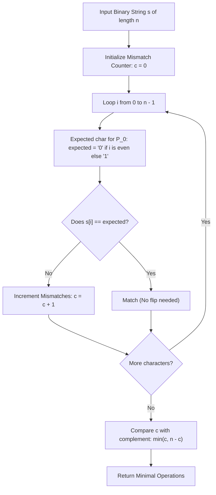

# Guided Example: Minimum Changes to Make Alternating Binary String

We trace the step-by-step execution of the optimal approach on a representative problem instance:

- **Input:** `s = "0100"`
- **Required Output:** `1`

This instance features an almost alternating sequence broken only at the final character, demonstrating how parity-based comparison and bitwise complementarity calculate the minimum editing operations in linear time.

---

## 1. Instance & Teaching Goal

Given a binary string `s` of length $n$, an alternating binary string is defined as one in which no two adjacent characters are equal (i.e. $s[i] \neq s[i+1]$ for all $0 \le i < n - 1$). In one operation, we can flip any character from `'0'` to `'1'` or from `'1'` to `'0'`. We must find the minimum number of operations to make `s` alternating.

A naive search exploring all $2^n$ binary strings branches exponentially. However, for any fixed length $n$, there exist **exactly two** valid alternating binary strings:
1. $P_0$: Starts with `'0'` $\implies "010101\dots"$
2. $P_1$: Starts with `'1'` $\implies "101010\dots"$

Because every character in $P_0$ is the exact bitwise inversion of the corresponding character in $P_1$, the number of flips required to transform $s$ into $P_1$ is simply $n - \text{flips}(s \to P_0)$.

---

## 2. Conceptual Foundation & Invariants

### State Representation

| Component | Mathematical Definition | Property |
|---|---|---|
| Target Pattern $P_0$ | $P_0[i] = (i \pmod 2)$ | Starts with `'0'`: $0, 1, 0, 1 \dots$ |
| Target Pattern $P_1$ | $P_1[i] = 1 - (i \pmod 2)$ | Starts with `'1'`: $1, 0, 1, 0 \dots$ |
| Mismatch Count $c$ | $\sum_{i=0}^{n-1} \mathbb{I}(s[i] \neq P_0[i])$ | Hamming distance $d_H(s, P_0)$ |
| Complementary Cost | $n - c$ | Hamming distance $d_H(s, P_1)$ |

### Mathematical Invariants

> **Complementary Binary Pattern Theorem.**
> For all indices $i \in \{0, \dots, n-1\}$, the two alternating patterns satisfy:
> $$P_0[i] \oplus P_1[i] = 1$$
> Consequently, for any character $s[i] \in \{'0', '1'\}$:
> $$\mathbb{I}(s[i] \neq P_1[i]) = 1 - \mathbb{I}(s[i] \neq P_0[i])$$
> Summing over all $n$ positions yields:
> $$d_H(s, P_1) = \sum_{i=0}^{n-1} \left( 1 - \mathbb{I}(s[i] \neq P_0[i]) \right) = n - d_H(s, P_0)$$
> The global minimum operations across both candidate patterns is:
> $$\text{MinFlips} = \min \Big( c, \; n - c \Big) \quad \text{where } c = d_H(s, P_0)$$

---

## 3. Step-by-Step Worked Execution

For `s = "0100"` with length $n = 4$:

### Step 1: Compare Against Target Pattern $P_0 = \text{"0101"}$

We inspect each character $s[i]$ against its expected parity character:

| Index $i$ | Parity $i \pmod 2$ | Expected Character $P_0[i]$ | Observed Character $s[i]$ | Mismatch Condition $s[i] \neq P_0[i]$ | Running Mismatch Count $c$ |
|---|---|---|---|---|---|
| $0$ | $0$ (Even) | `'0'` | `'0'` | `'0' \neq '0'$ (False) | $0$ |
| $1$ | $1$ (Odd) | `'1'` | `'1'` | `'1' \neq '1'$ (False) | $0$ |
| $2$ | $0$ (Even) | `'0'` | `'0'` | `'0' \neq '0'$ (False) | $0$ |
| $3$ | $1$ (Odd) | `'1'` | `'0'` | `'0' \neq '1'$ (**True**) | **$1$** |

Total mismatches with $P_0$: $c = 1$.

---

### Step 2: Evaluate Complementary Target Pattern $P_1 = \text{"1010"}$

Using the Complementary Binary Pattern Theorem:
$$\text{Cost}(P_1) = n - c = 4 - 1 = 3$$

Verification by direct character inspection:
- $s[0] = '0' \neq P_1[0] = '1'$ (Flip 1)
- $s[1] = '1' \neq P_1[1] = '0'$ (Flip 2)
- $s[2] = '0' \neq P_1[2] = '1'$ (Flip 3)
- $s[3] = '0' == P_1[3] = '0'$ (Match)
Direct count confirms $3$ flips required to reach $P_1$.

---

### Step 3: Select the Optimal Target

$$\text{MinFlips} = \min(\text{Cost}(P_0), \text{Cost}(P_1)) = \min(1, 3) = \mathbf{1}$$

Changing $s[3]$ from `'0'` to `'1'` yields `"0101"`, achieving an alternating string in exactly $1$ operation.

---

## 4. Complete Execution Trace

| Target Candidate | Expected Sequence | Matching Indices | Mismatching Indices | Total Flips |
|---|---|---|---|---|
| Pattern $0$ ($P_0$) | `"0101"` | $\{0, 1, 2\}$ | $\{3\}$ | **$1$ (Optimal)** |
| Pattern $1$ ($P_1$) | `"1010"` | $\{3\}$ | $\{0, 1, 2\}$ | $3$ |

Final Minimum Operations: $\min(1, 3) = \mathbf{1}$.

---

## 5. Algorithmic Mastery & Edge Surfacing

### Boundary and Edge Cases

| Scenario | Input Example | Expected Output | Strategic Handling |
|---|---|---|---|
| Already Alternating | `s = "0101"` | `0` | $c = 0 \implies \min(0, 4) = 0$. |
| Inverted Alternating | `s = "1010"` | `0` | $c = 4 \implies \min(4, 4 - 4) = 0$. |
| Monotonous Characters | `s = "1111"` | `2` | $c = 2 \implies \min(2, 4 - 2) = 2$. |
| Minimal String ($n = 1$) | `s = "0"` or `"1"` | `0` | Any single character is already alternating; $n = 1, c = 0 \implies \min(0, 1) = 0$. |

### Invariant Maintenance & Why It Works

1. **Parity Independence:**
   Because parity $i \pmod 2$ perfectly alternates $0, 1, 0, 1 \dots$, comparing $s[i]$ directly against $i \pmod 2$ avoids materializing or allocating the pattern strings in memory.
2. **Complementary Duality:**
   Counting mismatches against $P_0$ inherently computes mismatches against $P_1$ without requiring a second pass, guaranteeing strict single-pass linear time.

### Complexity Analysis

- **Time Complexity:** $\mathcal{O}(n)$ where $n$ is the length of string `s`. The algorithm scans `s` exactly once, performing one parity calculation and one equality comparison per character.
- **Space Complexity:** $\mathcal{O}(1)$ auxiliary space, using only a single integer accumulator.
