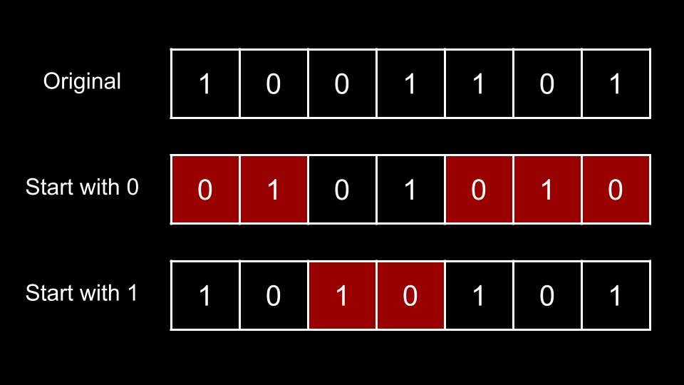
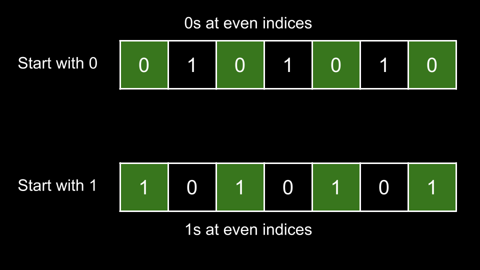
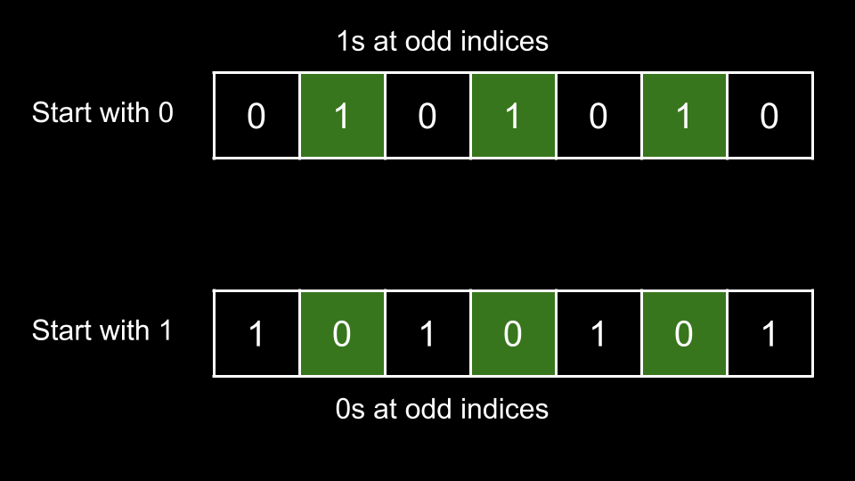

## Solution

---

### Approach 1: Start with Zero or Start with One

**Intuition**

Once we make `s` alternating, there are two possibilities:

1. `s` starts with `0`.
2. `s` starts with `1`.


<br>

In the above image, we have the original `s`, then two alternating strings: one that starts with `0` and one that starts with `1`. We must convert `s` to either of these alternating strings, and the squares in red indicate mismatched positions with the original `s`.

To fix any mismatched position, we require `1` operation. Thus, if we were to convert `s` to an alternating string starting with `0`, we would require `5` operations. If we were to convert `s` to an alternative string starting with `1`, we would require `2` operations. Since we want the minimum, we would have an answer of `2`.

This brings us to our solution. We initialize two integers:

1. `start0` which represents the number of operations we require if we convert `s` to an alternating string starting with `0`.
2. `start1` which represents the number of operations we require if we convert `s` to an alternating string starting with `1`.

We then iterate `i` over the indices of `s`. At each index, we check if `i` is an even index or an odd index. To determine if `i` is an even or odd index, we check the value if `i % 2`. Here, `%` is the modulus operator. If $i \% 2 = 0$, then `i` is even. Otherwise, `i` is odd.

**If `i` is even**

When considering an alternating string that starts with `0`, all even indices should have `0`, as indices `0, 2, 4, ...` will be `0`.

When considering an alternating string that starts with `1`, all even indices should have `1`, as indices `0, 2, 4, ...` will be `1`.

Thus, if $s[i] = '0'$, we will increment `start1` since $s[i]$ is mismatched and we would need an operation to fix it. Otherwise, $s[i] = '1'$ and we increment `start0`.


<br>

**If `i` is odd**

When considering an alternating string that starts with `0`, all odd indices should have `1`, as indices `1, 3, 5, ...` will be `1`.

When considering an alternating string that starts with `1`, all odd indices should have `0`, as indices `1, 3, 5, ...` will be `0`.

Thus, if $s[i] = '1'$, we will increment `start1` since $s[i]$ is mismatched and we would need an operation to fix it. Otherwise, $s[i] = '0'$ and we increment `start0`.


<br>

---

Once we have finished iterating over all characters of `s`, we return the minimum between `start0` and `start1`.

**Algorithm**

1. Initialize $start0 = 0$ and $start1 = 0$.
2. Iterate `i` over the indices of `s`:
- If $i \% 2 = 0$:
- If $s[i] = '0'$, increment `start1`.
- Otherwise, increment `start0`.
- Else:
- If $s[i] = '0'$, increment `start1`.
- Otherwise, increment `start0`.
3. Return the minimum between `start0, start1`.

**Implementation**

```python
class Solution:
    def minOperations(self, s: str) -> int:
        start0 = 0
        start1 = 0

        for i in range(len(s)):
            if i % 2 == 0:
                if s[i] == "0":
                    start1 += 1
                else:
                    start0 += 1
            else:
                if s[i] == "1":
                    start1 += 1
                else:
                    start0 += 1

        return min(start0, start1)
```

**Complexity Analysis**

Given $n$ as the length of `s`,

* Time complexity: $O(n)$

    We iterate over each character of `s` once, performing $O(1)$ work at each iteration.

* Space complexity: $O(1)$

    We aren't using any extra space other than a few integers.

<br/>

---

### Approach 2: Only Check One

**Intuition**

Take a look at the first image again:


<br>

Let `n` be the length of `s`. There are `n` indices. Notice that an index `i` only needs to be fixed for **either** `start0` or `start1`, but never both. In the above image, if we create an alternating string that starts with `0`, we need to perform operations at indices `0, 1, 4, 5, 6`. This means that indices `0, 1, 4, 5, 6` are already correct for the alternating string that starts with `1`.

If we create an alternating string that starts with `0`, indices `2, 3` are already correct. Thus, when considering the alternating string that starts with `1`, we would need to fix indices `2, 3`.

What does this mean? For a given `s`, if we need `start0` operations to create the alternating string that starts with `0`, we will need exactly $n - start0$ operations to create the alternating string that starts with `1`.

Thus, we only need to calculate either `start0` or `start1` (it doesn't matter which one, we'll calculate `start0` in this article). We can then obtain the other value by subtracting from `n`.

**Algorithm**

1. Initialize $start0 = 0$.
2. Iterate `i` over the indices of `s`:
- If $i \% 2 = 0$:
- If $s[i] = '1'$, increment `start0`
- Else:
- If $s[i] = '0'$, increment `start0`.
3. Return the minimum between `start0` and $\text{s.length} - start0$.

**Implementation**

```python
class Solution:
    def minOperations(self, s: str) -> int:
        start0 = 0

        for i in range(len(s)):
            if i % 2 == 0:
                if s[i] == "1":
                    start0 += 1
            else:
                if s[i] == "0":
                    start0 += 1

        return min(start0, len(s) - start0)
```

**Complexity Analysis**

Given $n$ as the length of `s`,

* Time complexity: $O(n)$

    We iterate over each character of `s` once, performing $O(1)$ work at each iteration.

* Space complexity: $O(1)$

    We aren't using any extra space other than a few integers.

<br/>

---