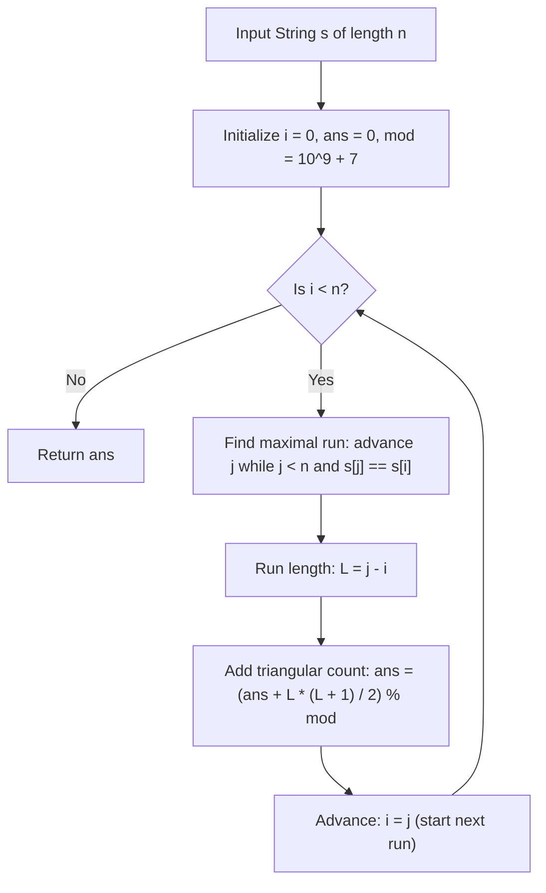

# Guided Example: Count Number of Homogenous Substrings

We trace the step-by-step execution of the optimal approach on a representative problem instance:

- **Input:** `s = "abbcccaa"`
- **Required Output:** `13`

This instance features singleton characters, paired characters, and three-character streaks interspersed across the string, demonstrating how run-length decomposition and triangular summation evaluate homogenous substrings in linear time modulo $10^9 + 7$.

---

## 1. Instance & Teaching Goal

Given a string `s`, a substring is defined as **homogenous** if all of its characters are identical. We must calculate the total number of homogenous substrings of `s`, modulo $10^9 + 7$.

A naive algorithm inspecting all $\mathcal{O}(n^2)$ substrings and checking character uniformity requires $\mathcal{O}(n^3)$ operations.
Because a homogenous substring consists of contiguous identical characters, it can never cross the boundary between two differing characters. Thus:
- Any homogenous substring is strictly contained within exactly one maximal contiguous block (run) of identical characters.
- A maximal run of length $L$ contributes exactly $\frac{L(L + 1)}{2}$ homogenous substrings.
- Decomposing the string into maximal runs via a two-pointer scan counts all valid substrings in a single $\mathcal{O}(n)$ pass.

---

## 2. Conceptual Foundation & Invariants

### State Representation

| Component | Mathematical Definition | Role |
|---|---|---|
| Active Run Interval $[i, j-1]$ | Maximal contiguous segment where $s[k] = s[i]$ for all $k \in [i, j-1]$ | Disjoint decomposition of `s` |
| Run Length $L$ | $j - i$ | Length of current uniform block |
| Triangular Contribution $T(L)$ | $\frac{L(L + 1)}{2} \pmod{10^9 + 7}$ | Homogenous substrings formed by this run |
| Running Modulo Sum | Cumulative total modulo $10^9 + 7$ | Result accumulator |

### Mathematical Invariants

> **Maximal Run Disjoint Partitioning Theorem.**
> Let $s$ be uniquely partitioned into maximal contiguous runs of identical characters:
> $$s = c_1^{L_1} c_2^{L_2} \cdots c_m^{L_m} \quad \text{where } c_k \neq c_{k+1}$$
> Every homogenous substring of $s$ is an interval of identical characters. If an interval were to span characters from distinct runs $c_k$ and $c_{k+1}$, it would contain both $c_k$ and $c_{k+1}$ ($c_k \neq c_{k+1}$), violating homogeneity.
> Therefore, the set of all homogenous substrings is the disjoint union of the sets of homogenous substrings of each maximal run:
> $$\text{Total Homogenous Substrings} = \sum_{k=1}^m \frac{L_k(L_k + 1)}{2} \pmod{10^9 + 7}$$



---

## 3. Step-by-Step Worked Execution

For `s = "abbcccaa"` of length $n = 8$:

### Decomposing into Maximal Contiguous Runs

```text
Indices:  0   1 2   3 4 5   6 7
String:   a   b b   c c c   a a
Runs:    [a] [b b] [c c c] [a a]
Lengths:  1    2      3      2
```

---

### Step 1: Process Run 1 (Character `'a'`)
- Start index: $i = 0$.
- Advance $j$: $s[0] = \text{'a'}, s[1] = \text{'b'} \neq \text{'a'}$. Stops at $j = 1$.
- Run length: $L_1 = 1 - 0 = 1$.
- Homogenous substrings generated:
  $$T(1) = \frac{1 \times 2}{2} = 1 \quad (\text{Substring: } \text{"a"})$$
- Accumulator: $\text{ans} \leftarrow 0 + 1 = \mathbf{1}$.
- Next index: $i \leftarrow j = 1$.

---

### Step 2: Process Run 2 (Character `'b'`)
- Start index: $i = 1$.
- Advance $j$: $s[1] = \text{'b'}, s[2] = \text{'b'}, s[3] = \text{'c'} \neq \text{'b'}$. Stops at $j = 3$.
- Run length: $L_2 = 3 - 1 = 2$.
- Homogenous substrings generated:
  $$T(2) = \frac{2 \times 3}{2} = 3 \quad (\text{Substrings: } \text{"b"}, \text{"b"}, \text{"bb"})$$
- Accumulator: $\text{ans} \leftarrow 1 + 3 = \mathbf{4}$.
- Next index: $i \leftarrow j = 3$.

---

### Step 3: Process Run 3 (Character `'c'`)
- Start index: $i = 3$.
- Advance $j$: $s[3] = \text{'c'}, s[4] = \text{'c'}, s[5] = \text{'c'}, s[6] = \text{'a'} \neq \text{'c'}$. Stops at $j = 6$.
- Run length: $L_3 = 6 - 3 = 3$.
- Homogenous substrings generated:
  $$T(3) = \frac{3 \times 4}{2} = 6 \quad (\text{"c"}, \text{"c"}, \text{"c"}, \text{"cc"}, \text{"cc"}, \text{"ccc"})$$
- Accumulator: $\text{ans} \leftarrow 4 + 6 = \mathbf{10}$.
- Next index: $i \leftarrow j = 6$.

---

### Step 4: Process Run 4 (Character `'a'`)
- Start index: $i = 6$.
- Advance $j$: $s[6] = \text{'a'}, s[7] = \text{'a'}$. Reaches end of string ($j = 8$).
- Run length: $L_4 = 8 - 6 = 2$.
- Homogenous substrings generated:
  $$T(2) = \frac{2 \times 3}{2} = 3 \quad (\text{"a"}, \text{"a"}, \text{"aa"})$$
- Accumulator: $\text{ans} \leftarrow 10 + 3 = \mathbf{13}$.
- Next index: $i \leftarrow j = 8 = n$ (Scan complete).

---

## 4. Complete Execution Trace

| Run | Character | Index Span $[i, j-1]$ | Run Length $L$ | Substrings Contributed $\frac{L(L+1)}{2}$ | Cumulative Sum Modulo $10^9 + 7$ |
|---|---|---|---|---|---|
| $1$ | `'a'` | $[0, 0]$ | $1$ | $\frac{1 \times 2}{2} = 1$ | $1$ |
| $2$ | `'b'` | $[1, 2]$ | $2$ | $\frac{2 \times 3}{2} = 3$ | $4$ |
| $3$ | `'c'` | $[3, 5]$ | $3$ | $\frac{3 \times 4}{2} = 6$ | $10$ |
| $4$ | `'a'` | $[6, 7]$ | $2$ | $\frac{2 \times 3}{2} = 3$ | **$13$** |

Total Homogenous Substrings: $\mathbf{13}$.

---

## 5. Algorithmic Mastery & Edge Surfacing

### Boundary and Edge Cases

| Scenario | Input Example | Expected Output | Strategic Handling |
|---|---|---|---|
| All Characters Identical | `s = "zzzzz"` ($n = 5$) | $\frac{5 \times 6}{2} = 15$ | Single run of length $n$; directly outputs $T(n)$. |
| All Characters Different | `s = "abcdef"` ($n = 6$) | $6$ | $n$ runs of length 1; each contributes 1, sum is $n$. |
| Single Character String | `s = "x"` | $1$ | $T(1) = 1$. |
| Large Input ($n = 10^5$) | `s = "a" * 100000` | $T(10^5) \pmod{10^9+7}$ | $10^5 \times 100001 / 2 = 5000050000 \equiv 5005 \pmod{10^9+7}$. Handled with 64-bit arithmetic. |

### Invariant Maintenance & Why It Works

1. **Disjointness of Runs:**
   Because indices are advanced by setting $i \leftarrow j$, every character of `s` belongs to exactly one run, ensuring no character position is missed and no subsegment is double-counted.
2. **Triangular Closed Form:**
   Inside a run of $L$ identical characters, choosing any start position $a$ and end position $b$ with $i \le a \le b < j$ produces a valid homogenous substring. There are $\binom{L+1}{2} = \frac{L(L+1)}{2}$ such pairs, computed in $\mathcal{O}(1)$ time per run.

### Complexity Analysis

- **Time Complexity:** $\mathcal{O}(n)$ where $n$ is the length of string `s`. The outer pointer $i$ and inner pointer $j$ each move strictly forward from $0$ to $n$. Every character is visited at most twice.
- **Space Complexity:** $\mathcal{O}(1)$ auxiliary space, maintaining only loop indices and an integer accumulator.
