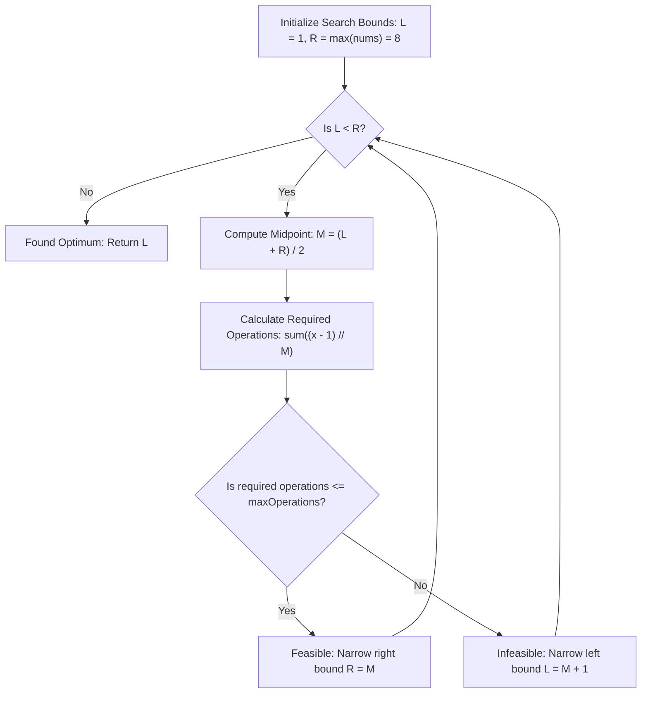

# Guided Example: Minimum Limit of Balls in a Bag

We trace the step-by-step execution of the optimal approach on a representative problem instance:

- **Input:** `nums = [2, 4, 8, 2]`, `maxOperations = 4`
- **Required Output:** `2`

This instance features non-uniform bag capacities requiring varied split operations across multiple bags, demonstrating how monotonicity transforms an optimization problem into binary search on the answer threshold.

---

## 1. Instance & Teaching Goal

We are given an array `nums` where `nums[i]` is the count of balls in the $i$-th bag, and an integer `maxOperations`. In one operation, we can take any bag of balls and divide it into two new bags with positive integer ball counts. The **penalty** of a configuration is defined as the maximum number of balls in any bag. We wish to find the **minimum possible penalty** after at most `maxOperations` operations.

Simulating all possible split combinations branches exponentially. However, inverting the problem provides monotonic structure:
- Instead of trying to construct the optimal splits directly, we ask the decision question: *Can the penalty be at most $M$?*
- To ensure no bag exceeds size $M$, a bag containing $x$ balls must be partitioned into at least $\lceil x / M \rceil$ pieces.
- Creating $P$ pieces from one bag requires exactly $P - 1$ division operations:
  $$\text{ops}(x, M) = \left\lceil \frac{x}{M} \right\rceil - 1 = \left\lfloor \frac{x - 1}{M} \right\rfloor$$
- Summing $\text{ops}(x, M)$ across all bags yields the minimum operations required for target penalty $M$.
- Because $\text{ops}(x, M)$ is monotonically non-increasing with respect to $M$, binary search identifies the minimal feasible $M$ in logarithmic time.

---

## 2. Conceptual Foundation & Invariants

### State Representation

| Component | Definition | Range |
|---|---|---|
| Search Domain $[L, R]$ | Possible values for the minimum penalty $M$ | $1 \le M \le \max(\text{nums})$ |
| Midpoint Probe $M$ | $\lfloor (L + R) / 2 \rfloor$ | Candidate penalty threshold |
| Operation Demand $\mathcal{O}(M)$ | Total splits required across all bags: $\sum \lfloor \frac{x - 1}{M} \rfloor$ | Monotonically decreasing in $M$ |
| Feasibility Predicate | $\mathcal{O}(M) \le \text{maxOperations}$ | Monotonic boolean property |

### Mathematical Invariants

> **Monotonic Penalty Splitting Theorem.**
> To reduce a bag of $x$ balls such that no resulting sub-bag exceeds $M$ balls, the bag must be divided into at least $k$ bags where $k \cdot M \ge x \implies k = \lceil x / M \rceil$.
> Dividing one bag into $k$ non-empty parts requires exactly $k - 1$ binary split operations:
> $$\text{ops}(x, M) = \left\lfloor \frac{x - 1}{M} \right\rfloor$$
> The total operation count over all bags is:
> $$\mathcal{O}(M) = \sum_{x \in \text{nums}} \left\lfloor \frac{x - 1}{M} \right\rfloor$$
> If $M_1 < M_2$, then $\lfloor \frac{x - 1}{M_1} \rfloor \ge \lfloor \frac{x - 1}{M_2} \rfloor$, establishing that $\mathcal{O}(M)$ is monotonically non-increasing.
> Consequently, the predicate $P(M) \equiv (\mathcal{O}(M) \le \text{maxOperations})$ is monotonically non-decreasing (False for small $M$, True for large $M$).

---

## 3. Step-by-Step Worked Execution

For `nums = [2, 4, 8, 2]` and `maxOperations = 4`:
- Maximum initial bag size: $\max(\text{nums}) = 8$.
- Search interval: $[L, R] = [1, 8]$.

---

### Iteration 1: Interval $[1, 8]$
- Midpoint probe: $M = \lfloor (1 + 8) / 2 \rfloor = 4$.
- Evaluate operations for each bag at cap $M = 4$:
  - Bag $2$: $\lfloor (2 - 1) / 4 \rfloor = 0$ operations.
  - Bag $4$: $\lfloor (4 - 1) / 4 \rfloor = 0$ operations.
  - Bag $8$: $\lfloor (8 - 1) / 4 \rfloor = \lfloor 7 / 4 \rfloor = 1$ operation ($8 \to [4, 4]$).
  - Bag $2$: $\lfloor (2 - 1) / 4 \rfloor = 0$ operations.
- Total operations: $0 + 0 + 1 + 0 = 1$.
- Comparison: $1 \le 4$ (**Feasible!**).
- Action: Cap $4$ is achievable; search for smaller values in left half $\implies R \leftarrow M = 4$.
- New interval: $[1, 4]$.

---

### Iteration 2: Interval $[1, 4]$
- Midpoint probe: $M = \lfloor (1 + 4) / 2 \rfloor = 2$.
- Evaluate operations for each bag at cap $M = 2$:
  - Bag $2$: $\lfloor (2 - 1) / 2 \rfloor = 0$ operations.
  - Bag $4$: $\lfloor (4 - 1) / 2 \rfloor = \lfloor 3 / 2 \rfloor = 1$ operation ($4 \to [2, 2]$).
  - Bag $8$: $\lfloor (8 - 1) / 2 \rfloor = \lfloor 7 / 2 \rfloor = 3$ operations ($8 \to [4, 4] \to [2, 2, 4] \to [2, 2, 2, 2]$).
  - Bag $2$: $\lfloor (2 - 1) / 2 \rfloor = 0$ operations.
- Total operations: $0 + 1 + 3 + 0 = 4$.
- Comparison: $4 \le 4$ (**Feasible!** Exactly uses all 4 operations).
- Action: Cap $2$ is achievable $\implies R \leftarrow M = 2$.
- New interval: $[1, 2]$.

---

### Iteration 3: Interval $[1, 2]$
- Midpoint probe: $M = \lfloor (1 + 2) / 2 \rfloor = 1$.
- Evaluate operations for each bag at cap $M = 1$:
  - Bag $2$: $\lfloor (2 - 1) / 1 \rfloor = 1$.
  - Bag $4$: $\lfloor (4 - 1) / 1 \rfloor = 3$.
  - Bag $8$: $\lfloor (8 - 1) / 1 \rfloor = 7$.
  - Bag $2$: $\lfloor (2 - 1) / 1 \rfloor = 1$.
- Total operations: $1 + 3 + 7 + 1 = 12$.
- Comparison: $12 > 4$ (**Infeasible!** Exceeds allowed operation budget of 4).
- Action: Cap $1$ is impossible; lower bound must increase $\implies L \leftarrow M + 1 = 2$.
- New interval: $[2, 2]$.

---

### Termination
- $L = 2, R = 2 \implies L == R$.
- The search interval has converged to $M = \mathbf{2}$.
- Minimum possible penalty: $\mathbf{2}$.

---

## 4. Complete Execution Trace

| Iteration | Search Range $[L, R]$ | Midpoint Probe $M$ | Operations per Bag $\lfloor (x-1)/M \rfloor$ | Total Operations | Budget Check ($\le 4$) | Bound Update |
|---|---|---|---|---|---|---|
| $1$ | $[1, 8]$ | $4$ | $[0, 0, 1, 0]$ | $1$ | True | $R \leftarrow 4$ |
| $2$ | $[1, 4]$ | $2$ | $[0, 1, 3, 0]$ | $4$ | **True** | $R \leftarrow 2$ |
| $3$ | $[1, 2]$ | $1$ | $[1, 3, 7, 1]$ | $12$ | False | $L \leftarrow 2$ |
| Done | $[2, 2]$ | — | — | — | — | **Result: 2** |

---

## 5. Algorithmic Mastery & Edge Surfacing

### Boundary and Edge Cases

| Scenario | Input Feature | Expected Output | Strategic Handling |
|---|---|---|---|
| Zero Operations Allowed | $\text{maxOperations} = 0$ | $\max(\text{nums})$ | Range starts at $[1, \max]$; requires 0 ops, returns max element. |
| Abundant Operations | Operations $\ge \sum (x - 1)$ | $1$ | Every bag can be split into bags of 1 ball; converges to $1$. |
| Single Large Bag | `nums = [9], maxOps = 2` | $3$ | $9 \to [3, 3, 3]$ using 2 splits; minimum penalty is $3$. |
| Huge Values ($10^9$) | $x \le 10^9$ | Fast convergence | Binary search over $10^9$ requires only $\lceil \log_2 10^9 \rceil = 30$ iterations. |

### Invariant Maintenance & Why It Works

1. **Integer Floor Division Formula:**
   Writing $\lfloor (x - 1) / M \rfloor$ correctly evaluates the operations needed without floating-point inaccuracies:
   - For $x = M$, $\lfloor (M - 1) / M \rfloor = 0$ (no split needed).
   - For $x = M + 1$, $\lfloor M / M \rfloor = 1$ (1 split creates bags of $\le M$).
2. **Search Range Correctness:**
   The answer must be an integer between $1$ (minimum possible ball count) and $\max(\text{nums})$ (achieved with 0 operations). Since feasibility is monotonic, the interval halving invariant guarantees that the true optimal threshold is never discarded.

### Complexity Analysis

- **Time Complexity:** $\mathcal{O}(n \log(\max(\text{nums})))$ where $n$ is the number of bags in `nums`. The search range $[1, \max(\text{nums})]$ has size at most $10^9$, requiring at most $30$ bisection steps. In each step, we iterate through all $n$ bags in $\mathcal{O}(n)$ time. Total operations $\approx 30 n$, running in a few milliseconds.
- **Space Complexity:** $\mathcal{O}(1)$ auxiliary space, using only scalar loop registers.