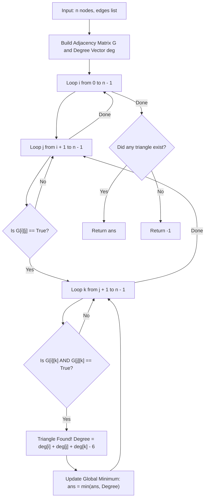

# Guided Example: Minimum Degree of a Connected Trio in a Graph

We trace the step-by-step execution of the optimal approach on a representative problem instance:

- **Input:** `n = 6`, `edges = [[1, 2], [1, 3], [3, 2], [4, 1], [5, 2], [3, 6]]`
- **Required Output:** `3`

This instance features a connected triangle alongside external peripheral nodes with varying degrees, demonstrating how adjacency matrix lookups combined with degree sum inclusion-exclusion determine the minimum external trio degree in polynomial time.

---

## 1. Instance & Teaching Goal

Given an undirected graph with $n$ nodes ($1$-indexed from $1$ to $n$) and a list of undirected edges, a **connected trio** is defined as a subset of three nodes $\{u, v, w\}$ such that every pair among them is directly connected by an edge (a graph 3-clique, or triangle $K_3$).

The **degree of a connected trio** is the number of edges incident to at least one node in the trio whose other endpoint lies strictly outside the trio. We seek the minimum degree over all connected trios in the graph. If no connected trio exists, we must return `-1`.

Instead of explicitly counting external neighbors for every detected triangle, the graph-theoretic sum of the vertex degrees contains the necessary information:
- Each vertex $u$ has degree $\deg(u)$.
- In the sum $\deg(u) + \deg(v) + \deg(w)$, the three internal edges $(u, v), (v, w), (w, u)$ are each counted twice.
- Every edge leading to an external node is counted exactly once.
- Thus, the external degree of trio $\{u, v, w\}$ is given by the algebraic relation:
  $$\deg(\{u, v, w\}) = \deg(u) + \deg(v) + \deg(w) - 6$$

---

## 2. Conceptual Foundation & Invariants

### State Representation

| Component | Mathematical Definition | Dimensions / Bounds |
|---|---|---|
| Adjacency Matrix $G$ | $G[u][v] = \text{True} \iff (u, v) \in E$ | $n \times n$ boolean matrix |
| Vertex Degree Vector | $\deg(u) = \lvert \{v : G[u][v] = \text{True}\} \rvert$ | Array of size $n$ |
| Candidate Triangle | Triplet $(i, j, k)$ with $0 \le i < j < k < n$ and $G[i][j] \land G[j][k] \land G[i][k]$ | Unordered 3-clique |
| Minimal Trio Degree | $\min_{\text{trios}} (\deg(i) + \deg(j) + \deg(k) - 6)$ | Running minimum (initialized to $\infty$) |

### Mathematical Invariants

> **Trio Degree Inclusion-Exclusion Theorem.**
> Let $T = \{u, v, w\} \subseteq V$ be a connected trio in undirected graph $G = (V, E)$.
> The set of incident edges can be partitioned into internal edges $E_{\text{int}} = \{(u, v), (v, w), (w, u)\}$ and external edges $E_{\text{ext}} = \{(x, y) \in E : x \in T, y \notin T\}$.
> Summing the vertex degrees yields:
> $$\sum_{x \in T} \deg(x) = \sum_{x \in T} \left( \sum_{y \in T \setminus \{x\}} \mathbb{I}((x, y) \in E) + \sum_{z \notin T} \mathbb{I}((x, z) \in E) \right)$$
> Since each of the $3$ internal edges connects two vertices within $T$, it contributes $2$ to the sum:
> $$\sum_{x \in T} \deg(x) = 2 |E_{\text{int}}| + |E_{\text{ext}}| = 2(3) + |E_{\text{ext}}| = 6 + |E_{\text{ext}}|$$
> Rearranging yields the exact external degree:
> $$|E_{\text{ext}}| = \deg(u) + \deg(v) + \deg(w) - 6$$

---

## 3. Step-by-Step Worked Execution

For `n = 6` with edges:
$$[[1, 2], [1, 3], [3, 2], [4, 1], [5, 2], [3, 6]]$$
Converting to 0-indexed vertices $\{0, 1, 2, 3, 4, 5\}$:
- Edge $(0, 1)$
- Edge $(0, 2)$
- Edge $(2, 1)$
- Edge $(3, 0)$
- Edge $(4, 1)$
- Edge $(2, 5)$

---

### Step 1: Compute Vertex Degrees

Counting incident edges for each vertex:
- Vertex $0$: neighbors $\{1, 2, 3\} \implies \deg(0) = 3$.
- Vertex $1$: neighbors $\{0, 2, 4\} \implies \deg(1) = 3$.
- Vertex $2$: neighbors $\{0, 1, 5\} \implies \deg(2) = 3$.
- Vertex $3$: neighbors $\{0\} \implies \deg(3) = 1$.
- Vertex $4$: neighbors $\{1\} \implies \deg(4) = 1$.
- Vertex $5$: neighbors $\{2\} \implies \deg(5) = 1$.

Degree Vector: $\text{deg} = [3, 3, 3, 1, 1, 1]$.

---

### Step 2: Enumerate Triplets $(i < j < k)$ and Test Triangles

We scan triplets $(i, j, k)$:

#### Test Triplet $(0, 1, 2)$:
- Check edge $(0, 1)$: $G[0][1]$ is True.
- Check edge $(0, 2)$: $G[0][2]$ is True.
- Check edge $(1, 2)$: $G[1][2]$ is True.
- **Triangle Confirmed!** Nodes $\{0, 1, 2\}$ form a connected trio.

Now compute its trio degree using the algebraic formula:
$$\begin{aligned}
\text{TrioDegree} &= \deg(0) + \deg(1) + \deg(2) - 6 \\
&= 3 + 3 + 3 - 6 \\
&= 9 - 6 = \mathbf{3}
\end{aligned}$$

Direct Verification of External Edges:
- External edge from node $0$: $(0, 3)$ (to node $3$)
- External edge from node $1$: $(1, 4)$ (to node $4$)
- External edge from node $2$: $(2, 5)$ (to node $5$)
There are exactly $3$ external edges, confirming the formula.
Running minimum: $\text{ans} = 3$.

---

#### Remaining Triplets:
- $(0, 1, 3)$: Edge $(1, 3)$ does not exist $\implies$ Not a triangle.
- $(0, 2, 5)$: Edge $(0, 5)$ does not exist $\implies$ Not a triangle.
- No other triplets form a triangle.

---

### Step 3: Conclude Global Result

Only one connected trio $\{0, 1, 2\}$ exists in the graph, with external degree $3$.
Minimum trio degree: $\mathbf{3}$.

---

## 4. Complete Execution Trace

| Triplet $(i, j, k)$ | Edge $(i, j)$ | Edge $(i, k)$ | Edge $(j, k)$ | Triangle Status | External Degree Formula | Running Minimum |
|---|---|---|---|---|---|---|
| $(0, 1, 2)$ | Present | Present | Present | **Valid Triangle** | $3 + 3 + 3 - 6 = 3$ | **$3$** |
| $(0, 1, 3)$ | Present | Present | Absent | Invalid | — | $3$ |
| $(0, 1, 4)$ | Present | Absent | — | Invalid | — | $3$ |
| $(0, 2, 5)$ | Present | Absent | — | Invalid | — | $3$ |
| All other triplets | — | — | — | Invalid | — | $3$ |

Final Output: $3$.

---

## 5. Algorithmic Mastery & Edge Surfacing

### Boundary and Edge Cases

| Scenario | Input Feature | Expected Output | Strategic Handling |
|---|---|---|---|
| No Triangles Exist | Tree or bipartite graph | `-1` | All triplet checks fail; returns `-1`. |
| Isolated Triangle | $K_3$ with no other edges | `0` | $\deg(u) = 2$ for all three; $2 + 2 + 2 - 6 = 0$. |
| Complete Graph ($K_n$) | All pairs connected | $3(n - 3)$ | Every node has degree $n - 1$; degree sum is $3(n-1) - 6 = 3n - 9$. |
| Large Sparse Graph | Many nodes, few edges | Bounded loop checks | Pruning by `if not G[i][j]: continue` skips inner $k$-loop instantly. |

### Invariant Maintenance & Why It Works

1. **Ordering Constraint ($i < j < k$):**
   By enforcing $i < j < k$, each triangle in the graph is examined exactly once, eliminating duplicate evaluations and ensuring unambiguous minimum tracking.
2. **Subtraction Factor of 6:**
   In any triangle $\{u, v, w\}$, exactly 3 edges connect the trio internally. Because each internal edge contributes to the degree of two vertices in the trio, their contribution to $\sum_{v \in T} \deg(v)$ is exactly $2 \times 3 = 6$, guaranteeing mathematical exactness.

### Complexity Analysis

- **Time Complexity:** $\mathcal{O}(n^3)$ in the worst case (or $\mathcal{O}(m \sqrt{m})$ using oriented degree ordering), where $n \le 400$. The triple loop checks $\binom{n}{3} = \frac{400 \times 399 \times 398}{6} \approx 1.06 \times 10^7$ iterations, executing in $< 0.1$s.
- **Space Complexity:** $\mathcal{O}(n^2)$ auxiliary space to store the $n \times n$ boolean adjacency matrix $G$ and the degree array.
