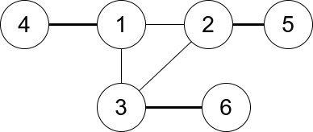
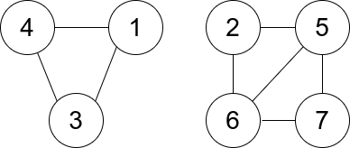

## Description

You are given an undirected graph. You are given an integer `n` which is the number of nodes in the graph and an array `edges`, where each $\text{edges}[i] = [u_{i}, v_{i}]$ indicates that there is an undirected edge between $u_{i}$ and $v_{i}$.

A **connected trio** is a set of **three** nodes where there is an edge between **every** pair of them.

The **degree of a connected trio** is the number of edges where one endpoint is in the trio, and the other is not.

Return *the **minimum** degree of a connected trio in the graph, or* `-1` *if the graph has no connected trios.*
### Function Contract

- `n`: Input parameter.
- Returns expected result.

### Examples
#### Example 1

- **Input:** $n = 6, edges = [[1,2],[1,3],[3,2],[4,1],[5,2],[3,6]]$
- **Output:** `3`
- **Explanation:** There is exactly one trio, which is [1,2,3]. The edges that form its degree are bolded in the figure above.
#### Example 2

- **Input:** $n = 7, edges = [[1,3],[4,1],[4,3],[2,5],[5,6],[6,7],[7,5],[2,6]]$
- **Output:** `0`
- **Explanation:** There are exactly three trios:
1) [1,4,3] with degree 0.
2) [2,5,6] with degree 2.
3) [5,6,7] with degree 2.
### Constraints

- $2 \le n \le 400$

- $\text{edges}[i].length = 2$

- $1 \le \text{edges.length} \le n * (n-1) / 2$

- $1 \le u_{i}, v_{i} \le n$

- $u_{i} \neq v_{i}$

- There are no repeated edges.