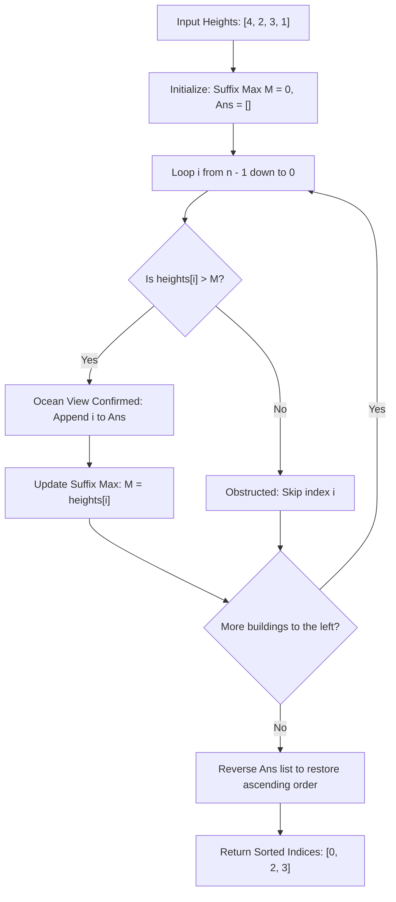

# Guided Example: Buildings With an Ocean View

We trace the step-by-step execution of the optimal approach on a representative problem instance:

- **Input:** `heights = [4, 2, 3, 1]`
- **Required Output:** `[0, 2, 3]`

This instance features alternating building heights where an intermediate taller building ($3$) obstructs an earlier shorter building ($2$) from viewing the eastern ocean, demonstrating how right-to-left suffix maximum tracking identifies unobstructed lines of sight in linear time.

---

## 1. Instance & Teaching Goal

Given an array `heights` of length $n$ where the ocean lies to the right (east) of all buildings, building $i$ has an ocean view if and only if all buildings to its right are strictly shorter:
$$\text{heights}[i] > \max_{j > i} \text{heights}[j]$$
By definition, the rightmost building ($n - 1$) always has an ocean view. We must return the indices of all buildings with an ocean view, sorted in ascending order.

A forward left-to-right scan would require looking ahead into future elements to find the maximum suffix height, taking $\mathcal{O}(n^2)$ time naively or requiring a monotonic stack.
By reversing the perspective and scanning **from right to left** (from the ocean inland):
- The maximum height of all buildings to the right of index $i$ is precisely the running maximum of the elements already visited.
- A building $i$ has an ocean view if and only if its height strictly exceeds this running suffix maximum.
- Appending valid indices and reversing the collected list at the end yields the sorted result in optimal $\mathcal{O}(n)$ time and $\mathcal{O}(1)$ auxiliary space beyond the output.

---

## 2. Conceptual Foundation & Invariants

### State Representation

| Component | Mathematical Definition | Initial Value |
|---|---|---|
| Scan Index $i$ | Current building being evaluated | Starts at $n - 1$, decrements to $0$ |
| Suffix Maximum $M$ | $\max_{j > i} \text{heights}[j]$ | $0$ (since all heights $\ge 1$) |
| Ocean View Collection | Indices meeting the criterion $\text{heights}[i] > M$ | Initially empty list |

### Mathematical Invariants

> **Monotonic Suffix Maximum Dominance Theorem.**
> Let $M_i = \max_{j > i} \text{heights}[j]$ be the maximum height strictly to the right of position $i$.
> 1. If $\text{heights}[i] \le M_i$, there exists at least one building to the right with height $\ge \text{heights}[i]$, which physically obstructs building $i$'s sightline to the ocean.
> 2. If $\text{heights}[i] > M_i$, then $\text{heights}[i] > \text{heights}[j]$ for every $j > i$, confirming an unobstructed ocean view.
> As index $i$ moves from right to left, the suffix maximum updates monotonically:
> $$M_{i-1} = \max(M_i, \text{heights}[i])$$

---

## 3. Step-by-Step Worked Execution

For `heights = [4, 2, 3, 1]` of length $n = 4$:
- Ocean is located to the right of index $3$.
- Initial state: running suffix maximum $M = 0$, collected list $\text{ans} = []$.

---

### Step 1: Evaluate Index $i = 3$ (Height $1$)
- Current Height: $\text{heights}[3] = 1$.
- Comparison: $1 > M = 0$ (True).
- Outcome: Building $3$ directly faces the ocean with zero obstructions.
- Action: Append index $3$. Update $M \leftarrow 1$.
- State: $\text{ans} = [3]$, $M = 1$.

---

### Step 2: Evaluate Index $i = 2$ (Height $3$)
- Current Height: $\text{heights}[2] = 3$.
- Suffix Maximum to the right: $M = 1$ (Building $3$).
- Comparison: $3 > 1$ (True).
- Outcome: Building $2$ towers over Building $3$; ocean view confirmed.
- Action: Append index $2$. Update $M \leftarrow \max(1, 3) = 3$.
- State: $\text{ans} = [3, 2]$, $M = 3$.

---

### Step 3: Evaluate Index $i = 1$ (Height $2$)
- Current Height: $\text{heights}[1] = 2$.
- Suffix Maximum to the right: $M = 3$ (Building $2$).
- Comparison: $2 > 3$ (False).
- Outcome: Building $2$ (height $3$) completely blocks Building $1$'s line of sight.
- Action: Skip index $1$. Suffix maximum remains $M = 3$.
- State: $\text{ans} = [3, 2]$, $M = 3$.

---

### Step 4: Evaluate Index $i = 0$ (Height $4$)
- Current Height: $\text{heights}[0] = 4$.
- Suffix Maximum to the right: $M = 3$.
- Comparison: $4 > 3$ (True).
- Outcome: Building $0$ is taller than all buildings to its right; ocean view confirmed.
- Action: Append index $0$. Update $M \leftarrow \max(3, 4) = 4$.
- State: $\text{ans} = [3, 2, 0]$, $M = 4$.

---

### Step 5: Reverse to Ascending Order
The collected list in right-to-left order is $[3, 2, 0]$.
Reversing the array yields:
$$\text{Sorted Output} = [0, 2, 3]$$

---

## 4. Complete Execution Trace

| Step | Index $i$ | Building Height | Suffix Max $M$ Before Step | Condition $\text{heights}[i] > M$ | View Status | Suffix Max $M$ After Step | Running `ans` |
|---|---|---|---|---|---|---|---|
| $1$ | $3$ | $1$ | $0$ | $1 > 0$ (True) | **Has View** | $1$ | $[3]$ |
| $2$ | $2$ | $3$ | $1$ | $3 > 1$ (True) | **Has View** | $3$ | $[3, 2]$ |
| $3$ | $1$ | $2$ | $3$ | $2 > 3$ (False) | Obstructed | $3$ | $[3, 2]$ |
| $4$ | $0$ | $4$ | $3$ | $4 > 3$ (True) | **Has View** | $4$ | $[3, 2, 0]$ |
| End | Reverse | — | — | — | — | — | **$[0, 2, 3]$** |

---

## 5. Algorithmic Mastery & Edge Surfacing

### Boundary and Edge Cases

| Scenario | Input Heights | Expected Output | Strategic Handling |
|---|---|---|---|
| Strictly Increasing Inland | `[1, 2, 3, 4]` | `[3]` | Every building is shorter than the building to its right; only the rightmost building sees the ocean. |
| Strictly Decreasing Inland | `[4, 3, 2, 1]` | `[0, 1, 2, 3]` | Every building is strictly taller than all buildings to its right; all buildings have ocean views. |
| Equal Height Buildings | `[2, 2, 2, 2]` | `[3]` | Strict inequality $\text{heights}[i] > M$ ensures identical-height buildings to the right count as obstructions. |
| Single Building ($n = 1$) | `[10]` | `[0]` | Single building trivially sees the ocean. |

### Invariant Maintenance & Why It Works

1. **Strict Inequality Rule:**
   The requirement states that all buildings to the right must be strictly smaller ($heights[j] < heights[i]$). Therefore, using `>` against the running maximum correctly rejects equal-height obstructions without additional logic.
2. **Reverse Output Alignment:**
   Scanning right-to-left naturally collects valid indices in descending order. Reversing the output list at the end ensures the required ascending order in $\mathcal{O}(k)$ time, where $k \le n$ is the number of visible buildings.

### Complexity Analysis

- **Time Complexity:** $\mathcal{O}(n)$ where $n$ is the length of `heights`. The algorithm inspects each building exactly once during the backward scan, and reversing the collected list takes $\mathcal{O}(k) \le \mathcal{O}(n)$ time.
- **Space Complexity:** $\mathcal{O}(1)$ auxiliary space beyond the memory needed to store the output array.
