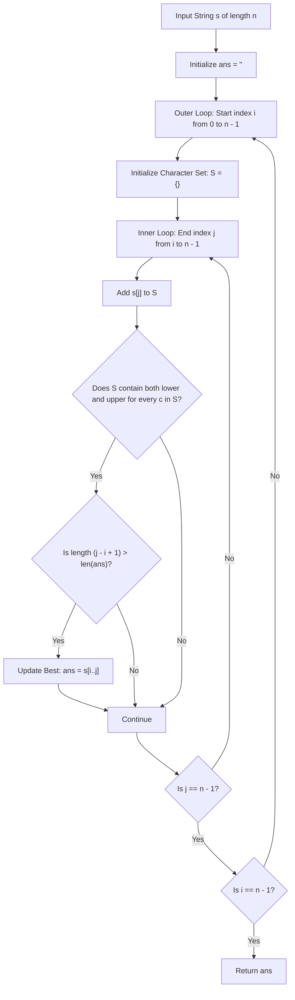

# Guided Example: Longest Nice Substring

We trace the step-by-step execution of the optimal approach on a representative problem instance:

- **Input:** `s = "YazaAay"`
- **Required Output:** `"aAa"`

This instance features isolated case mismatches (`'Y'` without `'y'`, `'z'` without `'Z'`) and nested dual-case substrings of varying lengths, demonstrating how character set validation identifies the longest and earliest valid nice substring.

---

## 1. Instance & Teaching Goal

A string is defined as **nice** if, for every letter of the alphabet present in the string, it appears in both lowercase and uppercase forms (e.g. if `'a'` is present, `'A'` must also be present). Given a string `s`, we must find the longest nice substring. If there are multiple nice substrings of the same maximal length, we must return the one that appears earliest. If none exist, we return the empty string `""`.

Because the maximum length is small ($n \le 100$), testing all $\mathcal{O}(n^2)$ contiguous substrings with character sets is both conceptually transparent and computationally lightweight:
- A substring $s[i \dots j]$ is nice if and only if for all $c \in s[i \dots j]$, both $\text{lower}(c) \in s[i \dots j]$ and $\text{upper}(c) \in s[i \dots j]$.
- By iterating the starting index $i$ from $0$ to $n - 1$ and expanding $j$ to the right, we track the set of characters incrementally.
- Requiring strict length inequality ($\text{length} > \text{max\_len}$) to overwrite the current best result naturally breaks length ties in favor of the earliest occurrence.

---

## 2. Conceptual Foundation & Invariants

### State Representation

| Component | Mathematical Definition | Role |
|---|---|---|
| Substring Window $[i, j]$ | Contiguous slice $s[i \dots j]$ | Candidate substring |
| Active Character Set $S$ | $\{s[k] : i \le k \le j\}$ | Unique characters in current window |
| Niceness Predicate $P(S)$ | $\forall c \in S, \text{lower}(c) \in S \land \text{upper}(c) \in S$ | True if window is nice |
| Best Substring Found | Longest valid substring recorded so far | Initialized to empty string `""` |

### Mathematical Invariants

> **Bilateral Case Pair Invariant.**
> A set of characters $S \subseteq \Sigma$ satisfies the nice property if and only if:
> $$S = \bigcup_{c \in S} \{\text{lower}(c), \text{upper}(c)\}$$
> That is, every letter in $S$ exists as a matched uppercase-lowercase pair. Any character present without its case partner renders the entire substring non-nice.

> **Earliest Longest Substring Selection Theorem.**
> Let substrings be enumerated in lexicographical order of their interval boundaries $(i, j)$ with $i$ increasing and $j$ increasing.
> Updating the global best substring $A$ only when:
> $$\text{length}(s[i \dots j]) > \text{length}(A)$$
> ensures that:
> 1. Any shorter substring is rejected.
> 2. Any subsequent substring with length equal to $\text{length}(A)$ is rejected, preserving the earliest occurrence.



---

## 3. Step-by-Step Worked Execution

For `s = "YazaAay"` with $n = 7$:
Indices:
```text
Index:  0 1 2 3 4 5 6
Char:   Y a z a A a y
```

### Trace of Key Starting Intervals

#### Starting from $i = 0$ (Prefix contains `'Y'`)
- $j = 0$: `"Y"` $\implies S = \{\text{'Y'}\}$. Missing `'y'`. Not nice.
- $j = 1$: `"Ya"` $\implies S = \{\text{'Y'}, \text{'a'}\}$. Missing `'y'`, `'A'`.
- $j = 2$: `"Yaz"` $\implies S = \{\text{'Y'}, \text{'a'}, \text{'z'}\}$. Missing `'y'`, `'A'`, `'Z'`.
- $j = 3$: `"Yaza"` $\implies S = \{\text{'Y'}, \text{'a'}, \text{'z'}\}$. Not nice.
- $j = 4$: `"YazaA"` $\implies S = \{\text{'Y'}, \text{'a'}, \text{'z'}, \text{'A'}\}$. Pair $(\text{'a'}, \text{'A'})$ matches, but `'Y'` and `'z'` lack uppercase/lowercase partners. Not nice.
- $j = 6$: `"YazaAay"` $\implies S = \{\text{'Y'}, \text{'a'}, \text{'z'}, \text{'A'}, \text{'y'}\}$. Pairs $(\text{'a'}, \text{'A'})$ and $(\text{'y'}, \text{'Y'})$ match, but `'z'` lacks `'Z'`. Not nice.
- Result for $i = 0$: No nice substring discovered.

---

#### Starting from $i = 1$ (Prefix `"a"`)
- $j = 1$: `"a"` $\implies S = \{\text{'a'}\}$. Not nice.
- $j = 2$: `"az"` $\implies S = \{\text{'a'}, \text{'z'}\}$. Not nice.
- Substrings extending through $j = 6$ all contain `'z'` without `'Z'`. None are nice.

---

#### Starting from $i = 3$ (Prefix `"aA..."`)
We inspect the suffix `"aAay"`:
- **$j = 3$:** Substring $s[3 \dots 3] = \text{"a"}$.
  - $S = \{\text{'a'}\}$. Missing `'A'`. Not nice.

- **$j = 4$:** Substring $s[3 \dots 4] = \text{"aA"}$.
  - $S = \{\text{'a'}, \text{'A'}\}$.
  - Check characters:
    - For `'a'`: $\text{'a'} \in S$ and $\text{'A'} \in S$ (Valid).
    - For `'A'`: $\text{'a'} \in S$ and $\text{'A'} \in S$ (Valid).
  - Niceness: **True**!
  - Length: $4 - 3 + 1 = 2 > \text{len}(\text{ans}) = 0$.
  - Update: $\text{ans} \leftarrow \text{"aA"}$ (Length 2).

- **$j = 5$:** Substring $s[3 \dots 5] = \text{"aAa"}$.
  - $S = \{\text{'a'}, \text{'A'}\}$.
  - Both cases of `'a'` remain present; no new letters added.
  - Niceness: **True**!
  - Length: $5 - 3 + 1 = 3 > \text{len}(\text{ans}) = 2$.
  - Update: $\text{ans} \leftarrow \text{"aAa"}$ (Length 3).

- **$j = 6$:** Substring $s[3 \dots 6] = \text{"aAay"}$.
  - $S = \{\text{'a'}, \text{'A'}, \text{'y'}\}$.
  - Letter `'y'` has no matching uppercase `'Y'` in this window ($s[0]=\text{'Y'}$ was excluded).
  - Niceness: False.

---

#### Starting from $i = 4, 5, 6$
- $i = 4$: `"Aa"` (length 2, does not exceed 3).
- $i = 5$: `"ay"` (not nice).
- $i = 6$: `"y"` (not nice).

Global longest nice substring found is $\mathbf{"aAa"}$.

---

## 4. Complete Execution Trace

| Start $i$ | End $j$ | Substring | Characters in Set $S$ | Niceness Condition Check | Substring Length | Update Best `ans` |
|---|---|---|---|---|---|---|
| $0$ | $0 \dots 6$ | `"Y"...` | Contains `'z'` or `'Y'` without pairs | Mismatched pairs | $\le 7$ | None |
| $1$ | $1 \dots 6$ | `"az"...` | Contains `'z'` without `'Z'` | Mismatched pairs | $\le 6$ | None |
| $3$ | $3$ | `"a"` | $\{\text{'a'}\}$ | Missing `'A'` | $1$ | None |
| $3$ | $4$ | `"aA"` | $\{\text{'a'}, \text{'A'}\}$ | **All characters paired** | $2$ | `"aA"` (Length 2) |
| **$3$** | **$5$** | **`"aAa"`** | **$\{\text{'a'}, \text{'A'}\}$** | **All characters paired** | **$3$** | **`"aAa"` (Length 3)** |
| $3$ | $6$ | `"aAay"` | $\{\text{'a'}, \text{'A'}, \text{'y'}\}$ | Missing `'Y'` | $4$ | `"aAa"` |
| $4$ | $5$ | `"Aa"` | $\{\text{'a'}, \text{'A'}\}$ | All characters paired | $2 \le 3$ | `"aAa"` |

Final Output: `"aAa"`.

---

## 5. Algorithmic Mastery & Edge Surfacing

### Boundary and Edge Cases

| Scenario | Input Example | Expected Output | Strategic Handling |
|---|---|---|---|
| No Nice Substrings | `s = "abcdef"` | `""` | No lowercase letter has an uppercase partner; returns empty string. |
| Entire String Nice | `s = "Bb"` | `"Bb"` | $S = \{\text{'B'}, \text{'b'}\}$; returns full string. |
| Tie in Length | `s = "BbAa"` | `"Bb"` | Both `"Bb"` and `"Aa"` have length 2; strict greater-than retains first occurrence `"Bb"`. |
| Single Character | `s = "A"` | `""` | Single letter cannot possess both cases. |

### Invariant Maintenance & Why It Works

1. **Incremental Set Population:**
   Fixing $i$ and advancing $j$ allows adding $s[j]$ to set $S$ in $\mathcal{O}(1)$ time per step. Verifying $S$ requires checking at most $26$ unique letters, taking $\mathcal{O}(|\Sigma|) = \mathcal{O}(1)$ time.
2. **Deterministic Tie-Breaking:**
   Because the outer loop scans $i$ from left to right, the first substring of any maximal length is observed before any later substring of that same length, ensuring the earliest occurrence guarantee.

### Complexity Analysis

- **Time Complexity:** $\mathcal{O}(n^2 \cdot |\Sigma|)$ where $n = |s|$ and $|\Sigma| \le 26$. There are $\frac{n(n+1)}{2}$ substrings. Checking niceness requires iterating over the set of size $\le 26$. For $n \le 100$, total operations are $\approx 5000 \times 26 \approx 1.3 \times 10^5$, executing in under $0.01$s.
- **Space Complexity:** $\mathcal{O}(|\Sigma|) = \mathcal{O}(1)$ auxiliary space to store the set of characters for the current window.
