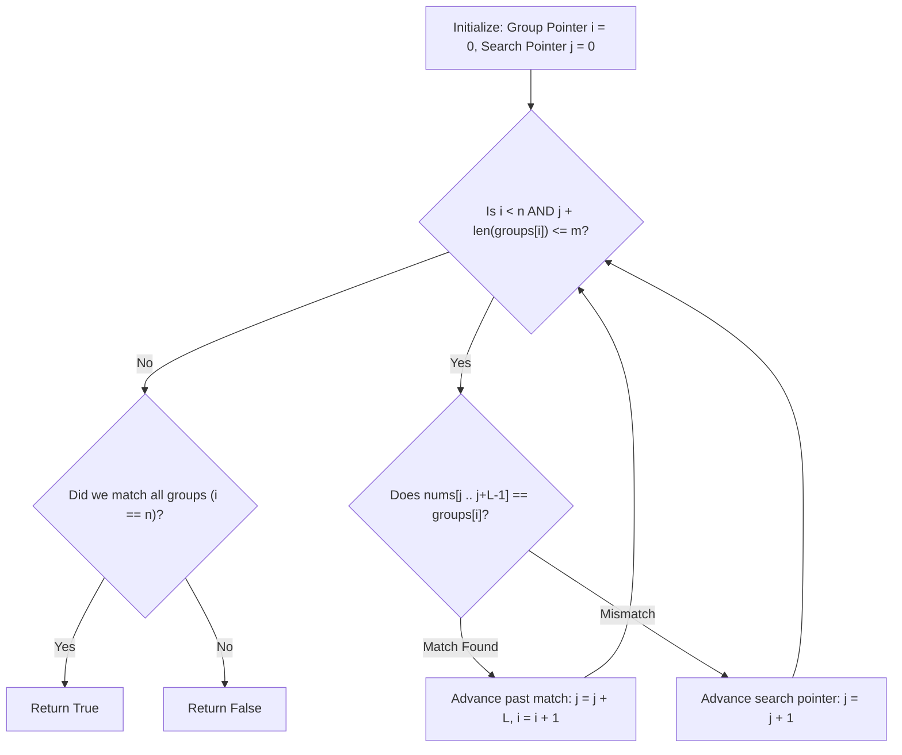

# Guided Example: Form Array by Concatenating Subarrays of Another Array

We trace the step-by-step execution of the optimal greedy matching approach on a representative problem instance:

- **Input:** `groups = [[1, -1, -1], [3, -2, 0]]`, `nums = [1, -1, 0, 1, -1, -1, 3, -2, 0]`
- **Required Output:** `true`

This instance features an initial partial match (`[1, -1, 0]` sharing a prefix with `[1, -1, -1]`) that fails at the third element, followed by unused elements before finding the authentic disjoint sequence of groups, illustrating how pointer advancement preserves greedy dominance without backtracking.

---

## 1. Instance & Teaching Goal

Given a 2D array `groups` and an array `nums`, we must determine whether we can choose $n$ disjoint subarrays from `nums` such that:
1. The $i$-th chosen subarray is identical to `groups[i]`.
2. The subarrays appear in the exact order specified by `groups` without overlapping (the start index of subarray $i+1$ must be strictly greater than or equal to the end index plus one of subarray $i$).

A brute-force search trying all combinations of positions could require exponential branching. However, a greedy sequential scan is provably optimal:
- To maximize the opportunities for subsequent groups to match, each group `groups[i]` should be matched at the **earliest possible position** in `nums`.
- Once a group matches a contiguous slice starting at index $j$ of length $L$, the search for the next group immediately resumes at index $j + L$, preserving the non-overlapping requirement.

---

## 2. Conceptual Foundation & Invariants

### State Representation

| Component | Mathematical Definition | Role |
|---|---|---|
| Group Pointer $i$ | Index in $0 \le i \le n$ | Index of the active group in `groups` currently sought |
| Search Pointer $j$ | Index in $0 \le j \le m$ | Earliest index in `nums` where the active group may begin |
| Group Length $L_i$ | $\text{length}(\text{groups}[i])$ | Size of the candidate contiguous slice |
| Candidate Slice | $\text{nums}[j \dots j + L_i - 1]$ | Window compared against $\text{groups}[i]$ |

### Mathematical Invariants

> **Earliest Match Dominance Theorem (Greedy Choice Property).**
> Suppose a valid sequence of disjoint matching subarrays exists. Let $k_i^*$ be the starting index of the first group $\text{groups}[i]$ in an optimal valid embedding, and let $j_i$ be the earliest starting index in $\text{nums}$ where $\text{groups}[i]$ matches as a contiguous subarray.
> Then $j_i \le k_i^*$.
> Since the remaining available suffix $\text{nums}[j_i + L_i \dots m - 1]$ contains the suffix $\text{nums}[k_i^* + L_i \dots m - 1]$ as a proper sub-interval, choosing the earliest match $j_i$ preserves the feasibility of embedding all subsequent groups $\text{groups}[i+1 \dots n-1]$.
> Consequently, backtracking to consider later occurrences of $\text{groups}[i]$ is never necessary.

---

## 3. Step-by-Step Worked Execution

We trace `groups = [[1, -1, -1], [3, -2, 0]]` and `nums = [1, -1, 0, 1, -1, -1, 3, -2, 0]`.
Here $n = 2$ groups, and $m = 9$ elements in `nums`.
Initial pointers: $i = 0$, $j = 0$.

---

### Step 1: Test Candidate for Group $0$ at $j = 0$
- Active Group: $\text{groups}[0] = [1, -1, -1]$ of length $L_0 = 3$.
- Candidate Slice in `nums`: $\text{nums}[0 \dots 2] = [1, -1, 0]$.
- Element Comparisons:
  - $\text{nums}[0] = 1 = \text{groups}[0][0]$ (Match).
  - $\text{nums}[1] = -1 = \text{groups}[0][1]$ (Match).
  - $\text{nums}[2] = 0 \ne -1 = \text{groups}[0][2]$ (Mismatch).
- Outcome: Slice does not match.
- Action: Increment search pointer $j \leftarrow 0 + 1 = 1$. Pointer $i$ remains $0$.

---

### Step 2: Test Candidate for Group $0$ at $j = 1$
- Active Group: $\text{groups}[0] = [1, -1, -1]$ of length $3$.
- Candidate Slice in `nums`: $\text{nums}[1 \dots 3] = [-1, 0, 1]$.
- Element Comparison:
  - $\text{nums}[1] = -1 \ne 1 = \text{groups}[0][0]$ (Mismatch at first element).
- Action: Increment search pointer $j \leftarrow 1 + 1 = 2$.

---

### Step 3: Test Candidate for Group $0$ at $j = 2$
- Active Group: $\text{groups}[0] = [1, -1, -1]$ of length $3$.
- Candidate Slice in `nums`: $\text{nums}[2 \dots 4] = [0, 1, -1]$.
- Element Comparison:
  - $\text{nums}[2] = 0 \ne 1 = \text{groups}[0][0]$ (Mismatch).
- Action: Increment search pointer $j \leftarrow 2 + 1 = 3$.

---

### Step 4: Test Candidate for Group $0$ at $j = 3$ (Successful Match)
- Active Group: $\text{groups}[0] = [1, -1, -1]$ of length $3$.
- Candidate Slice in `nums`: $\text{nums}[3 \dots 5] = [1, -1, -1]$.
- Element Comparisons:
  - $\text{nums}[3] = 1 = \text{groups}[0][0]$ (Match).
  - $\text{nums}[4] = -1 = \text{groups}[0][1]$ (Match).
  - $\text{nums}[5] = -1 = \text{groups}[0][2]$ (Match).
- Outcome: Complete match confirmed at slice $[3 \dots 5]$.
- Action:
  - Advance search pointer past matched slice: $j \leftarrow 3 + 3 = 6$.
  - Advance group pointer: $i \leftarrow 0 + 1 = 1$.

---

### Step 5: Test Candidate for Group $1$ at $j = 6$ (Successful Match)
- Active Group: $\text{groups}[1] = [3, -2, 0]$ of length $L_1 = 3$.
- Candidate Slice in `nums`: $\text{nums}[6 \dots 8] = [3, -2, 0]$.
- Element Comparisons:
  - $\text{nums}[6] = 3 = \text{groups}[1][0]$ (Match).
  - $\text{nums}[7] = -2 = \text{groups}[1][1]$ (Match).
  - $\text{nums}[8] = 0 = \text{groups}[1][2]$ (Match).
- Outcome: Complete match confirmed at slice $[6 \dots 8]$.
- Action:
  - Advance search pointer past matched slice: $j \leftarrow 6 + 3 = 9$.
  - Advance group pointer: $i \leftarrow 1 + 1 = 2$.

---

### Step 6: Loop Termination & Final Decision
- The search loop halts because $i = 2 = n$ (all groups processed).
- Final check: $i == n \implies 2 == 2$, which evaluates to `true`.

---

## 4. Complete Execution Trace

| Step | Group Index $i$ | Target Group | Search Index $j$ | Candidate Slice `nums[j..j+L-1]` | Match Check | Next $i$ | Next $j$ | Reason / Transition |
|---|---|---|---|---|---|---|---|---|
| $1$ | $0$ | `[1, -1, -1]` | $0$ | `[1, -1, 0]` | Mismatch ($0 \ne -1$) | $0$ | $1$ | Partial match fails; slide search window by 1 |
| $2$ | $0$ | `[1, -1, -1]` | $1$ | `[-1, 0, 1]` | Mismatch ($-1 \ne 1$) | $0$ | $2$ | First element mismatch |
| $3$ | $0$ | `[1, -1, -1]` | $2$ | `[0, 1, -1]` | Mismatch ($0 \ne 1$) | $0$ | $3$ | First element mismatch |
| $4$ | $0$ | `[1, -1, -1]` | $3$ | `[1, -1, -1]` | **Full Match** | $1$ | $6$ | Group $0$ found at $[3 \dots 5]$; jump past window to $j=6$ |
| $5$ | $1$ | `[3, -2, 0]` | $6$ | `[3, -2, 0]` | **Full Match** | $2$ | $9$ | Group $1$ found at $[6 \dots 8]$; jump past window to $j=9$ |
| End | $2$ | — | $9$ | — | — | — | — | $i == n$; all groups matched disjointly $\implies$ **`true`** |

---

## 5. Algorithmic Correctness

### Key Invariants and Correctness Argument

1. **Strict Non-Overlapping Guarantee:**
   When a match occurs at index $j$ for a group of length $L$, setting $j \leftarrow j + L$ guarantees that no index in the range $[j, j + L - 1]$ can ever be reused for subsequent groups.
2. **Greedy Suffix Subsumption:**
   If there exist multiple non-overlapping occurrences of group $i$ in `nums`, picking any occurrence starting after the earliest occurrence $j_i$ leaves a strictly smaller remaining suffix $\text{nums}[j' + L \dots m - 1] \subset \text{nums}[j_i + L \dots m - 1]$. Any sequence of groups that can be embedded into the smaller suffix can necessarily be embedded into the larger suffix. Hence, taking the earliest match never eliminates a feasible solution.

### Boundary and Edge Cases

| Scenario | Input Configuration | Expected Output | Strategic Handling |
|---|---|---|---|
| Subarrays Out of Order | `groups = [[10, -2], [1, 2]]`, `nums = [1, 2, 10, -2]` | `false` | Group $[10, -2]$ occurs after $[1, 2]$, so greedy scan for $[10, -2]$ leaves an empty suffix for $[1, 2]$. |
| Overlapping Candidate Match | `groups = [[1, 2], [2, 3]]`, `nums = [1, 2, 3]` | `false` | First group uses $[1, 2]$; remaining suffix is `[3]`, which cannot satisfy $[2, 3]$. |
| Total Length Exceeds Array | $\sum L_i > m$ | `false` | Loop terminates when $j + L_i > m$ with $i < n$, safely returning `false`. |
| Single Element Groups | `groups = [[1], [2]]`, `nums = [1, 3, 2]` | `true` | Skips unused element $3$ seamlessly. |

---

## 6. Complexity Derivation

- **Time Complexity:** $\mathcal{O}(m \cdot \max L_i)$ where $m$ is the length of `nums` and $\max L_i$ is the maximum length of any group in `groups`.
  - In the worst case, at each index $j$ of `nums`, we compare up to $L_i$ elements.
  - The search pointer $j$ advances monotonically from $0$ to at most $m$, never resetting or backtracking.
  - Given $m \le 1000$ and $\sum L_i \le 1000$, total comparison operations are bounded by $10^6$, executing instantaneously in under $5\text{ ms}$.
- **Space Complexity:** $\mathcal{O}(1)$ auxiliary space. The algorithm only maintains integer index pointers $i$ and $j$, requiring no additional heap allocations or dynamically growing data structures.
