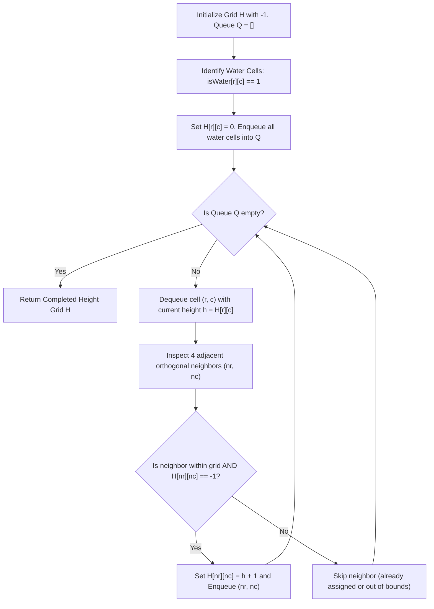

# Guided Example: Map of Highest Peak

We trace the step-by-step execution of the multi-source Breadth-First Search (BFS) approach on a representative problem instance:

- **Input:** `isWater = [[0, 0, 1], [1, 0, 0], [0, 0, 0]]`
- **Required Output:** `[[1, 1, 0], [0, 1, 1], [1, 2, 2]]`

This instance features two separate water sources at opposite quadrants of a $3 \times 3$ grid whose expanding wavefronts meet in the interior, illustrating how simultaneous multi-source BFS achieves the unique pointwise maximal height assignment.

---

## 1. Instance & Teaching Goal

Given an $m \times n$ matrix `isWater` where `1` denotes a water cell and `0` denotes land, we must assign a non-negative integer height to each cell such that:
1. Every water cell has height $0$.
2. Any two horizontally or vertically adjacent cells have an absolute height difference of at most $1$:
   $$|H(r_1, c_1) - H(r_2, c_2)| \le 1$$
3. The maximum height across the entire terrain is maximized.

### The Pointwise Maximality Principle
Consider any cell $u = (r, c)$ and any water cell $w = (w_r, w_c)$. Since adjacent cells can differ by at most $1$, along any grid path of length $d$ connecting $w$ to $u$, the height can increase by at most $1$ per step:
$$H(u) \le H(w) + \text{dist}(u, w) = 0 + \text{dist}(u, w) = \text{dist}(u, w)$$
Because this bound must hold for **every** water cell in the grid, the height of cell $u$ is fundamentally constrained by its distance to the **nearest** water cell:
$$H(u) \le \min_{w \in \text{Water}} \text{dist}(u, w)$$
Multi-source BFS simultaneously expands outwards from all water cells, assigning each cell a height exactly equal to its shortest Manhattan distance to water. This assignment is globally valid and simultaneously maximizes every single cell pointwise.

---

## 2. Conceptual Foundation & Invariants

### State Representation

| Component | Mathematical Definition | Role |
|---|---|---|
| Height Grid $H$ | Matrix $H \in \mathbb{Z}^{m \times n}$ | Stores assigned heights; unvisited land initialized to $-1$ |
| FIFO Queue $Q$ | Queue of cell coordinates $(r, c)$ | Frontiers organized in non-decreasing order of distance |
| Water Source Set | $\{(r, c) \mid \text{isWater}[r][c] = 1\}$ | Base layer with fixed height $0$ |

### Mathematical Invariants

> **Multi-Source Geodesic Distance Optimality Theorem.**
> Let $W = \{(r, c) \mid \text{isWater}[r][c] = 1\}$. For any cell $u$, define:
> $$d(u, W) = \min_{w \in W} (|u_r - w_r| + |u_c - w_c|)$$
> 1. Any height assignment satisfying the problem constraints obeys $H(u) \le d(u, W)$ for all cells $u$.
> 2. The assignment $H^*(u) = d(u, W)$ satisfies $|H^*(u) - H^*(v)| \le 1$ for all adjacent $u, v$, and $H^*(w) = 0$ for all $w \in W$.
> 3. Therefore, $H^*$ is the unique pointwise maximal valid height assignment.
> 4. Multi-source BFS with uniform edge weights visits cells in strictly non-decreasing order of $d(u, W)$, computing $H^*$ in linear time.

---

## 3. Step-by-Step Worked Execution

We trace `isWater = [[0, 0, 1], [1, 0, 0], [0, 0, 0]]` on a $3 \times 3$ grid.

---

### Step 1: Multi-Source Queue Initialization
- Water cells identified:
  - $(0, 2)$: $\text{isWater}[0][2] = 1$
  - $(1, 0)$: $\text{isWater}[1][0] = 1$
- Set heights: $H[0][2] = 0$, $H[1][0] = 0$.
- All other cells set to unvisited sentinel $-1$.
- Queue initially populated with water sources:
  $$Q = [(0, 2), (1, 0)]$$
- Initial Grid State:
  $$\begin{bmatrix} -1 & -1 & 0 \\ 0 & -1 & -1 \\ -1 & -1 & -1 \end{bmatrix}$$

---

### Step 2: Process Queue Level $0$ (Water Cells)

#### Dequeue $(0, 2)$ with $H[0][2] = 0$
Orthogonal neighbors of $(0, 2)$:
- $(-1, 2)$: Out of bounds.
- $(1, 2)$: In bounds, $H[1][2] = -1 \implies H[1][2] \leftarrow 0 + 1 = 1$. Enqueue $(1, 2)$.
- $(0, 1)$: In bounds, $H[0][1] = -1 \implies H[0][1] \leftarrow 0 + 1 = 1$. Enqueue $(0, 1)$.
- $(0, 3)$: Out of bounds.

Queue now: $[(1, 0), (1, 2), (0, 1)]$.

#### Dequeue $(1, 0)$ with $H[1][0] = 0$
Orthogonal neighbors of $(1, 0)$:
- $(0, 0)$: In bounds, $H[0][0] = -1 \implies H[0][0] \leftarrow 0 + 1 = 1$. Enqueue $(0, 0)$.
- $(2, 0)$: In bounds, $H[2][0] = -1 \implies H[2][0] \leftarrow 0 + 1 = 1$. Enqueue $(2, 0)$.
- $(1, -1)$: Out of bounds.
- $(1, 1)$: In bounds, $H[1][1] = -1 \implies H[1][1] \leftarrow 0 + 1 = 1$. Enqueue $(1, 1)$.

Queue now: $[(1, 2), (0, 1), (0, 0), (2, 0), (1, 1)]$.
Grid State after Level 0:
$$\begin{bmatrix} 1 & 1 & 0 \\ 0 & 1 & 1 \\ 1 & -1 & -1 \end{bmatrix}$$

---

### Step 3: Process Queue Level $1$ (Height $1$ Cells)

#### Dequeue $(1, 2)$ with $H[1][2] = 1$
Neighbors:
- $(0, 2)$: $H = 0 \ne -1$ (Skip).
- $(2, 2)$: In bounds, $H[2][2] = -1 \implies H[2][2] \leftarrow 1 + 1 = 2$. Enqueue $(2, 2)$.
- $(1, 1)$: $H = 1 \ne -1$ (Skip).
- $(1, 3)$: Out of bounds.

Queue now: $[(0, 1), (0, 0), (2, 0), (1, 1), (2, 2)]$.

#### Dequeue $(0, 1)$ with $H[0][1] = 1$
Neighbors:
- $(0, 0)$: $H = 1 \ne -1$ (Skip).
- $(0, 2)$: $H = 0 \ne -1$ (Skip).
- $(1, 1)$: $H = 1 \ne -1$ (Skip).
- $(-1, 1)$: Out of bounds.
No unvisited neighbors to enqueue.

#### Dequeue $(0, 0)$ with $H[0][0] = 1$
Neighbors $(0, 1)$ and $(1, 0)$ already visited. No unvisited neighbors.

#### Dequeue $(2, 0)$ with $H[2][0] = 1$
Neighbors:
- $(1, 0)$: $H = 0$ (Skip).
- $(2, 1)$: In bounds, $H[2][1] = -1 \implies H[2][1] \leftarrow 1 + 1 = 2$. Enqueue $(2, 1)$.
- Out of bounds for other directions.

Queue now: $[(1, 1), (2, 2), (2, 1)]$.

#### Dequeue $(1, 1)$ with $H[1][1] = 1$
Neighbors $(0, 1), (2, 1), (1, 0), (1, 2)$ are all already visited.

Grid State after Level 1:
$$\begin{bmatrix} 1 & 1 & 0 \\ 0 & 1 & 1 \\ 1 & 2 & 2 \end{bmatrix}$$

---

### Step 4: Process Queue Level $2$ (Height $2$ Cells)

#### Dequeue $(2, 2)$ with $H[2][2] = 2$
Neighbors $(1, 2)$ and $(2, 1)$ both visited. No unvisited neighbors.

#### Dequeue $(2, 1)$ with $H[2][1] = 2$
Neighbors $(2, 0), (1, 1), (2, 2)$ all visited. No unvisited neighbors.

Queue is now empty ($Q = []$). Execution terminates.

---

## 4. Complete Execution Trace

| Step | Dequeued Cell $(r, c)$ | Height Assigned | Target Neighbors Inspected | Neighbor Status | Enqueued Neighbors | Resulting Queue State |
|---|---|---|---|---|---|---|
| Init | — | — | Water cells $(0, 2), (1, 0)$ | Unvisited $\to$ Set $0$ | $(0, 2), (1, 0)$ | $[(0, 2), (1, 0)]$ |
| $1$ | $(0, 2)$ | $0$ | $(1, 2), (0, 1)$ | Both $-1 \implies$ Set to $1$ | $(1, 2), (0, 1)$ | $[(1, 0), (1, 2), (0, 1)]$ |
| $2$ | $(1, 0)$ | $0$ | $(0, 0), (2, 0), (1, 1)$ | All $-1 \implies$ Set to $1$ | $(0, 0), (2, 0), (1, 1)$ | $[(1, 2), (0, 1), (0, 0), (2, 0), (1, 1)]$ |
| $3$ | $(1, 2)$ | $1$ | $(2, 2)$ | $-1 \implies$ Set to $2$ | $(2, 2)$ | $[(0, 1), (0, 0), (2, 0), (1, 1), (2, 2)]$ |
| $4$ | $(0, 1)$ | $1$ | $(0, 0), (0, 2), (1, 1)$ | All $\ge 0$ (visited) | None | $[(0, 0), (2, 0), (1, 1), (2, 2)]$ |
| $5$ | $(0, 0)$ | $1$ | $(0, 1), (1, 0)$ | All $\ge 0$ (visited) | None | $[(2, 0), (1, 1), (2, 2)]$ |
| $6$ | $(2, 0)$ | $1$ | $(2, 1)$ | $-1 \implies$ Set to $2$ | $(2, 1)$ | $[(1, 1), (2, 2), (2, 1)]$ |
| $7$ | $(1, 1)$ | $1$ | $(0, 1), (2, 1), (1, 0), (1, 2)$ | All $\ge 0$ (visited) | None | $[(2, 2), (2, 1)]$ |
| $8$ | $(2, 2)$ | $2$ | $(1, 2), (2, 1)$ | All $\ge 0$ (visited) | None | $[(2, 1)]$ |
| $9$ | $(2, 1)$ | $2$ | $(2, 0), (1, 1), (2, 2)$ | All $\ge 0$ (visited) | None | $[]$ |

Final Output Matrix:
$$\begin{bmatrix} 1 & 1 & 0 \\ 0 & 1 & 1 \\ 1 & 2 & 2 \end{bmatrix}$$

---

## 5. Algorithmic Correctness

### Key Invariants and Correctness Argument

1. **Monotonic Distance Layering:**
   Because all edge weights in the grid graph equal $1$, standard FIFO queue operations guarantee that elements are extracted in non-decreasing order of their true shortest distance to the water set.
2. **Strict Adjacency Difference Constraint:**
   Every cell assigned at step $d+1$ is adjacent to at least one cell of height $d$. Thus, $|H(u) - H(v)| \le 1$ holds along all BFS tree edges. For cross edges between cells discovered at distances $d_1$ and $d_2$, their difference cannot exceed $|d_1 - d_2| \le 1$ by the properties of unweighted BFS on bipartite grid graphs.
3. **No Unreachable Land:**
   The problem guarantees at least one water cell exists. In a connected grid graph, BFS reaches every cell, ensuring all $-1$ sentinel values are replaced with valid non-negative heights.

### Boundary and Edge Cases

| Scenario | Input Configuration | Expected Behavior | Strategic Handling |
|---|---|---|---|
| All Cells Water | Grid of all `1`s | Entire grid returned as `0`s | All cells enqueued at step $0$; queue empties with no expansions. |
| Single Water Cell at Corner | $1$ at $(0, 0)$, all else $0$ | Heights equal $r + c$ | Radial expansion yields max height $(m-1) + (n-1)$ at opposite corner. |
| $1 \times n$ Linear Strip | `[[1, 0, 0, 0]]` | `[[0, 1, 2, 3]]` | 1D linear propagation increments by 1 at each step. |
| Islands of Land Between Water | Water at $(0, 0)$ and $(0, 2)$ | $(0, 1)$ gets height $1$ | Distances from both sources meet symmetrically. |

---

## 6. Complexity Derivation

- **Time Complexity:** $\mathcal{O}(m \cdot n)$ where $m$ and $n$ are the number of rows and columns in the matrix.
  - Every cell is inserted into the queue exactly once and removed exactly once.
  - From each dequeued cell, exactly $4$ orthogonal directions are checked in $\mathcal{O}(1)$ time.
  - Total operations: $4 \times (m \cdot n) = \mathcal{O}(m \cdot n)$. For $m, n \le 1000$ ($10^6$ cells), BFS completes in under $0.15\text{ s}$.
- **Space Complexity:** $\mathcal{O}(m \cdot n)$ auxiliary space.
  - The BFS queue holds at most $\mathcal{O}(m \cdot n)$ coordinates at any time (bounded by the grid perimeter or maximum layer width).
  - The output matrix of size $m \times n$ stores the resulting heights.
