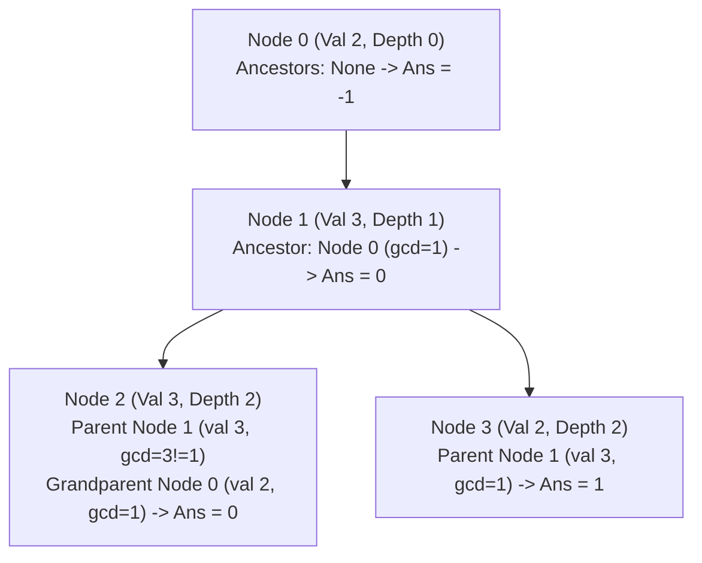

# Guided Example: Tree of Coprimes

We trace the step-by-step execution of the depth-first search (DFS) with value-indexed ancestor stacks on a representative problem instance:

- **Input:** `nums = [2, 3, 3, 2]`, `edges = [[0, 1], [1, 2], [1, 3]]`
- **Required Output:** `[-1, 0, 0, 1]`

This instance features a tree where a child shares a common factor with its immediate parent (Node $2$ with value $3$ under parent Node $1$ with value $3$), forcing the algorithm to skip the direct parent and select an earlier ancestor (Node $0$ with value $2$), illustrating how depth-tagged ancestor stacks identify the closest coprime ancestor in bounded time.

---

## 1. Instance & Teaching Goal

Given a tree of $n$ nodes rooted at node $0$, where node $i$ has value $\text{nums}[i]$, we must find for every node $i$ its closest ancestor $j$ such that:
$$\gcd(\text{nums}[i], \text{nums}[j]) = 1$$
If no such ancestor exists, we report $-1$.

A naive approach that searches upward along the parent chain from each node takes $\mathcal{O}(n)$ time per node, leading to $\mathcal{O}(n^2)$ worst-case time on degenerate trees.
Crucially, the problem specifies that values are bounded:
$$1 \le \text{nums}[i] \le 50$$
Because there are at most $50$ distinct values:
- We can maintain an array of stacks indexed by value $v \in [1, 50]$.
- During a DFS traversal from the root, the stack for value $v$ stores the pair $(\text{node\_id}, \text{depth})$ for all active ancestors on the path from the root possessing value $v$.
- To find the closest coprime ancestor for a node with value $x$, we inspect all values $v \in [1, 50]$ satisfying $\gcd(x, v) = 1$. The top entry of stack $v$ represents the deepest (closest) ancestor having value $v$.
- Among all coprime values, the one with the maximum depth is the globally closest coprime ancestor.

---

## 2. Conceptual Foundation & Invariants

### State Representation

| Component | Mathematical Definition | Role |
|---|---|---|
| Ancestor Stacks $S_v$ | Stack of pairs $(u, d)$ for $v \in [1, 50]$ | Stores active ancestors on current DFS path with value $v$ |
| Coprime Table $C[x]$ | $\{v \in [1, 50] \mid \gcd(x, v) = 1\}$ | Precomputed set of values coprime to $x$ |
| Depth $d$ | Tree distance from root node $0$ | Used to identify the nearest (deepest) ancestor |
| Output Array $\text{ans}$ | $\text{ans}[i] \in \{-1, 0, \dots, n-1\}$ | Nearest coprime ancestor for node $i$ |

### Mathematical Invariants

> **Closest Coprime Ancestor Invariant.**
> For any node $u$ at depth $d_u$, let $\mathcal{A}(u)$ denote the set of all proper ancestors of $u$.
> 1. At the moment DFS visits $u$, the stack $S_v$ contains exactly the ancestors in $\mathcal{A}(u)$ that have value $v$.
> 2. The top of stack $S_v$, denoted $(a_v, d_v)$, is the ancestor with value $v$ having the maximal depth $d_v = \max \{d_w \mid w \in \mathcal{A}(u), \text{nums}[w] = v\}$.
> 3. The closest coprime ancestor of $u$ is the node $a_v$ maximizing $d_v$ across all $v \in C[\text{nums}[u]]$:
>    $$j^* = \arg\max_{v \in C[\text{nums}[u]], S_v \ne \emptyset} d_v$$

---

## 3. Step-by-Step Worked Execution

We trace `nums = [2, 3, 3, 2]` on the tree rooted at $0$.
Values:
- $\text{nums}[0] = 2$
- $\text{nums}[1] = 3$
- $\text{nums}[2] = 3$
- $\text{nums}[3] = 2$

Coprime sets:
- $C[2] = \{1, 3, 5, 7, \dots\}$ (all odd numbers)
- $C[3] = \{1, 2, 4, 5, 7, 8, \dots\}$ (numbers not divisible by 3)

---

### Step 1: Visit Node $0$ (Depth $0$, Value $2$)
- Query coprime ancestors:
  All ancestor stacks $S_v$ are currently empty because Node $0$ is the root.
- Result for Node $0$: $\text{ans}[0] = -1$.
- Stack update: Push Node $0$ onto stack $S_2$:
  $$S_2 = [(0, \text{depth } 0)]$$
- Recurse to child Node $1$.

---

### Step 2: Visit Node $1$ (Depth $1$, Value $3$)
- Current active ancestor stacks:
  - $S_2 = [(0, 0)]$
  - All other $S_v = []$.
- Query coprime values for $\text{nums}[1] = 3$:
  - $v = 2 \in C[3]$: Stack $S_2$ has top $(0, 0)$ at depth $0$.
- Candidate with maximum depth: Node $0$ at depth $0$.
- Result for Node $1$: $\text{ans}[1] = 0$.
- Stack update: Push Node $1$ onto stack $S_3$:
  $$S_3 = [(1, \text{depth } 1)]$$
- Recurse to first child Node $2$.

---

### Step 3: Visit Node $2$ (Depth $2$, Value $3$)
- Current active ancestor stacks:
  - $S_2 = [(0, 0)]$
  - $S_3 = [(1, 1)]$
- Query coprime values for $\text{nums}[2] = 3$:
  - Check $v = 3$: $\gcd(3, 3) = 3 \ne 1$. Not in $C[3]$! Stack $S_3$ is ignored.
  - Check $v = 2$: $\gcd(3, 2) = 1$. In $C[3]$! Top of $S_2$ is $(0, 0)$ at depth $0$.
- Candidate with maximum depth: Node $0$ at depth $0$.
- Result for Node $2$: $\text{ans}[2] = 0$.
- Notice that even though parent Node $1$ is closer (depth 1), its value $3$ is not coprime to $3$, so the algorithm correctly bypasses it to choose grandparent Node $0$.
- Node $2$ has no children.
- Backtrack: Pop Node $2$ from stack (none pushed).
- Active stacks remain $S_2 = [(0, 0)]$ and $S_3 = [(1, 1)]$.

---

### Step 4: Visit Node $3$ (Depth $2$, Value $2$)
- Current active ancestor stacks:
  - $S_2 = [(0, 0)]$
  - $S_3 = [(1, 1)]$
- Query coprime values for $\text{nums}[3] = 2$:
  - Check $v = 2$: $\gcd(2, 2) = 2 \ne 1$. Not in $C[2]$! Stack $S_2$ is ignored.
  - Check $v = 3$: $\gcd(2, 3) = 1$. In $C[2]$! Top of $S_3$ is $(1, 1)$ at depth $1$.
- Candidate with maximum depth: Node $1$ at depth $1$.
- Result for Node $3$: $\text{ans}[3] = 1$.
- Node $3$ has no children.
- Backtrack: Pop from Node $1$ ($S_3$ becomes empty) and Node $0$ ($S_2$ becomes empty).

---

## 4. Complete Execution Trace

| Step / Node | Value | Depth | Active Ancestor Stacks | Coprime Stack Tops Tested | Best Ancestor Selected | Stack Operation After Check |
|---|---|---|---|---|---|---|
| Visit $0$ | $2$ | $0$ | All $S_v = []$ | None | **$-1$** | Push $(0, 0)$ to $S_2$ |
| Visit $1$ | $3$ | $1$ | $S_2: [(0, 0)]$ | $v=2 \implies (0, 0)$ | **$0$** | Push $(1, 1)$ to $S_3$ |
| Visit $2$ | $3$ | $2$ | $S_2: [(0, 0)]$, $S_3: [(1, 1)]$ | $v=2 \implies (0, 0)$ ($v=3$ excluded) | **$0$** | Leaf node |
| Backtrack | — | — | $S_2: [(0, 0)]$, $S_3: [(1, 1)]$ | — | — | Return to Node $1$ |
| Visit $3$ | $2$ | $2$ | $S_2: [(0, 0)]$, $S_3: [(1, 1)]$ | $v=3 \implies (1, 1)$ ($v=2$ excluded) | **$1$** | Leaf node |
| Backtrack | — | — | Pop $(1, 1)$, Pop $(0, 0)$ | — | — | Traversal complete |

Final Output Array:
$$\text{ans} = [-1, 0, 0, 1]$$

---

## 5. Algorithmic Correctness

### Key Invariants and Correctness Argument

1. **Path-Restricted Ancestry:**
   Because each node pushes itself onto stack $S_{\text{nums}[u]}$ before descending into its subtree and pops itself immediately upon returning from its subtree, the contents of the stacks during the visit of node $u$ reflect exclusively the ancestors on the direct root-to-$u$ tree path. Cross-branch interference is strictly impossible.
2. **Deepest Ancestor Maximization:**
   Within any stack $S_v$, depth increases monotonically from bottom to top. Therefore, the top element of $S_v$ is always the deepest active ancestor with value $v$. Testing only the top element of each coprime value stack $S_v$ guarantees finding the overall deepest coprime ancestor in $\mathcal{O}(V)$ checks.

### Boundary and Edge Cases

| Scenario | Configuration | Expected Behavior | Strategic Handling |
|---|---|---|---|
| Root Node | Node $0$ | Always returns $-1$ | Stacks are initially empty; loop finds no ancestors. |
| All Node Values Identical and $> 1$ | All values equal $2$ | All nodes return $-1$ | $\gcd(2, 2) = 2 \ne 1$, no coprime ancestor found. |
| Node with Value $1$ | $\text{nums}[u] = 1$ | Immediate parent chosen (if exists) | $\gcd(1, v) = 1$ for all $v$; parent has maximum depth among ancestors. |
| Deep Linear Chain | Tree is a path of length $10^5$ | Closest coprime ancestor found in $\mathcal{O}(1)$ stack top queries | Avoids $\mathcal{O}(n)$ parent chain traversal per node. |

---

## 6. Complexity Derivation

- **Time Complexity:** $\mathcal{O}(V^2 + n \cdot V)$ where $n$ is the number of tree nodes and $V = \max(\text{nums}[i]) \le 50$.
  - Precomputing the pairwise coprime table for numbers $1 \dots 50$ requires $50 \times 50 = 2500$ GCD computations, taking $\mathcal{O}(V^2 \log V) \approx 0.001\text{ s}$.
  - In the DFS traversal, visiting each of the $n$ nodes checks at most $50$ coprime candidate stacks, performing $\mathcal{O}(1)$ operations per candidate.
  - Total DFS time: $\mathcal{O}(n \cdot V)$. For $n = 10^5$ and $V = 50$, this requires at most $5 \times 10^6$ operations, executing in under $0.05\text{ s}$.
- **Space Complexity:** $\mathcal{O}(n + V \cdot \text{depth})$ auxiliary space.
  - The adjacency list representation of the tree requires $\mathcal{O}(n)$ space.
  - The recursion stack takes $\mathcal{O}(\text{depth}) \le \mathcal{O}(n)$ space.
  - The $50$ ancestor stacks collectively contain at most $\text{depth} \le n$ elements across all stacks combined.
