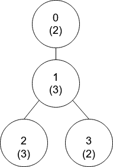
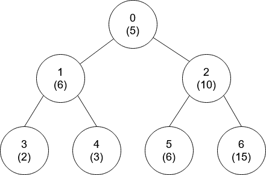

### 1. Description

There is a tree (i.e., a connected, undirected graph that has no cycles) consisting of `n` nodes numbered from `0` to $n - 1$ and exactly $n - 1$ edges. Each node has a value associated with it, and the **root** of the tree is node `0`.

To represent this tree, you are given an integer array `nums` and a 2D array `edges`. Each $\text{nums}[i]$ represents the $i^{\text{th}}$ node's value, and each $\text{edges}[j] = [u_{j}, v_{j}]$ represents an edge between nodes $u_{j}$ and $v_{j}$ in the tree.

Two values `x` and `y` are **coprime** if $gcd(x, y) = 1$ where `gcd(x, y)` is the **greatest common divisor** of `x` and `y`.

An ancestor of a node `i` is any other node on the shortest path from node `i` to the **root**. A node is **not **considered an ancestor of itself.

Return *an array *`ans`* of size *`n`, *where *$\text{ans}[i]$* is the closest ancestor to node *`i`* such that *$\text{nums}[i]$ *and *$nums[\text{ans}[i]]$ are **coprime**, or `-1`* if there is no such ancestor*.

### 2. Function Contract

**Inputs**

- `nums`: Input parameter (`List[int]`).
- `edges`: Input parameter (`List[List[int]]`).

**Return value**

- Returns `List[int]`.

### 3. Examples

#### Example 1

**

**

- **Input:** `nums = [2,3,3,2], edges = [[0,1],[1,2],[1,3]]`
- **Output:** `[-1,0,0,1]`
- **Explanation:** In the above figure, each node's value is in parentheses.
- Node 0 has no coprime ancestors.
- Node 1 has only one ancestor, node 0. Their values are coprime (gcd(2,3) == 1).
- Node 2 has two ancestors, nodes 1 and 0. Node 1's value is not coprime (gcd(3,3) == 3), but node 0's
value is (gcd(2,3) == 1), so node 0 is the closest valid ancestor.
- Node 3 has two ancestors, nodes 1 and 0. It is coprime with node 1 (gcd(3,2) == 1), so node 1 is its
closest valid ancestor.

#### Example 2

- **Input:** `nums = [5,6,10,2,3,6,15], edges = [[0,1],[0,2],[1,3],[1,4],[2,5],[2,6]]`
- **Output:** `[-1,0,-1,0,0,0,-1]`

### 4. Constraints

- $\text{nums.length} = n$

- $1 \le \text{nums}[i] \le 50$

- $1 \le n \le 10^{5}$

- $\text{edges.length} = n - 1$

- $\text{edges}[j].length = 2$

- $0 \le u_{j}, v_{j} < n$

- $u_{j} \neq v_{j}$
