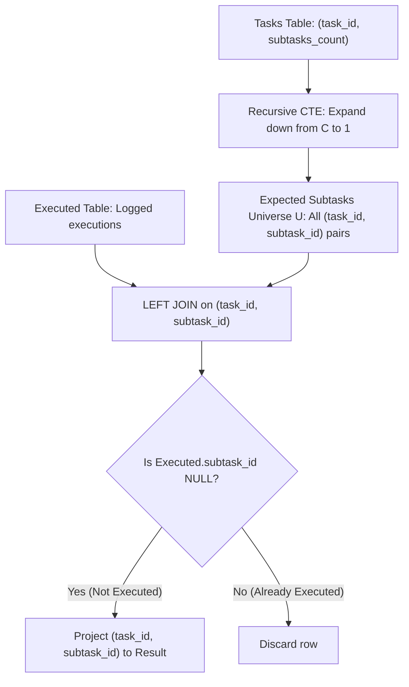

# Guided Example: Find the Subtasks That Did Not Execute

We trace the step-by-step execution of relational sequence expansion and antijoin filtering on a representative problem instance:

- **Input:**
  - `Tasks`:
    - `task_id = 1`, `subtasks_count = 3`
    - `task_id = 2`, `subtasks_count = 2`
    - `task_id = 3`, `subtasks_count = 4`
  - `Executed`:
    - `(task_id = 1, subtask_id = 2)`
    - `(task_id = 3, subtask_id = 1)`
    - `(task_id = 3, subtask_id = 2)`
    - `(task_id = 3, subtask_id = 3)`
    - `(task_id = 3, subtask_id = 4)`
- **Required Output:**
  ```text
  +---------+------------+
  | task_id | subtask_id |
  +---------+------------+
  | 1       | 1          |
  | 1       | 3          |
  | 2       | 1          |
  | 2       | 2          |
  +---------+------------+
  ```

This instance includes a partially executed task (Task $1$), a completely unexecuted task (Task $2$), and a fully executed task (Task $3$), illustrating how expanding compressed counts into a full subtask universe and computing a relational set difference identifies all unexecuted subtasks.

---

## 1. Instance & Teaching Goal

The input contains two relational tables:
1. `Tasks`: Specifies each task and its total required subtasks $C = \text{subtasks\_count}$. Each task implicitly expects subtasks numbered $1, 2, \dots, C$.
2. `Executed`: Records the subtasks that have actually been executed as $(task\_id, subtask\_id)$ pairs.

We must report all subtasks that **did not execute**.

Because the table `Tasks` provides only a scalar count rather than individual rows for each subtask, we cannot directly join or filter against `Executed`. The optimal relational approach proceeds in two phases:
1. **Universe Materialization:** Use a recursive common table expression (CTE) to expand each task row $(t, C)$ into $C$ distinct expected rows:
   $$\mathcal{U} = \{(t, s) \mid t \in \text{Tasks}, 1 \le s \le \text{subtasks\_count}(t)\}$$
2. **Relational Antijoin:** Perform a `LEFT JOIN` between $\mathcal{U}$ and `Executed` on `(task_id, subtask_id)` and retain rows where the right side is `NULL`, computing the exact set difference:
   $$\mathcal{U} \setminus \text{Executed}$$

---

## 2. Conceptual Foundation & Invariants

### State Representation

| Component | Mathematical Definition | Relational Role |
|---|---|---|
| Expected Universe $\mathcal{U}$ | $\{(t, s) \mid t \in \text{Tasks}, 1 \le s \le C_t\}$ | Full domain of expected subtasks |
| Execution Log $\mathcal{E}$ | $\{(t, s) \in \text{Executed}\}$ | Observed completed subtasks |
| Antijoin Condition | $(t, s) \in \mathcal{U} \land (t, s) \notin \mathcal{E}$ | Filters out observed completions |
| Missing Subtasks | $\mathcal{U} \setminus \mathcal{E}$ | Final projected relation |

### Mathematical Invariants

> **Relational Sequence Expansion & Antijoin Completeness Theorem.**
> 1. **Sequence Generation:** Given an integer $C \ge 1$, the recursive query with anchor $(t, C)$ and recursive step $(t, s - 1)$ bounded by $s > 1$ terminates in exactly $C$ iterations and produces the set of pairs $\{(t, s) \mid 1 \le s \le C\}$.
> 2. **Antijoin Equivalence:** In relational algebra, for any universal relation $\mathcal{U}$ and subset $\mathcal{E} \subseteq \mathcal{U}$:
>    $$\sigma_{\mathcal{E}.\text{key} \text{ IS NULL}} (\mathcal{U} \rtimes \mathcal{E}) \equiv \mathcal{U} \setminus \mathcal{E}$$
>    The result contains every expected subtask that was not executed, with zero false positives and zero omissions.



---

## 3. Step-by-Step Worked Execution

---

### Step 1: Recursive CTE Sequence Materialization

Starting from `Tasks`:
- Task $1$ with count $3$
- Task $2$ with count $2$
- Task $3$ with count $4$

#### Anchor Step (Iteration 0)
Select $(task\_id, subtasks\_count)$ directly from `Tasks`:
- $(1, 3)$
- $(2, 2)$
- $(3, 4)$

#### Recursive Iteration 1
For each row $(t, s)$ with $s > 1$, emit $(t, s - 1)$:
- $(1, 3) \to (1, 2)$
- $(2, 2) \to (2, 1)$
- $(3, 4) \to (3, 3)$

#### Recursive Iteration 2
From the newly generated rows with $s > 1$:
- $(1, 2) \to (1, 1)$
- $(2, 1)$ has $s = 1 \ngtr 1$ (halts for Task 2)
- $(3, 3) \to (3, 2)$

#### Recursive Iteration 3
From the newly generated rows with $s > 1$:
- $(1, 1)$ has $s = 1 \ngtr 1$ (halts for Task 1)
- $(3, 2) \to (3, 1)$

#### Recursive Iteration 4
- $(3, 1)$ has $s = 1 \ngtr 1$ (halts for Task 3)
Recursion completes because no active row has $s > 1$.

#### Full Materialized Relation $T$
The combined union yields $9$ pairs:
$$\mathcal{U} = \{(1, 3), (1, 2), (1, 1), (2, 2), (2, 1), (3, 4), (3, 3), (3, 2), (3, 1)\}$$

---

### Step 2: Left Join with `Executed` and Null Filtering

We join each pair in $\mathcal{U}$ with the `Executed` table on `(task_id, subtask_id)`:

1. **Task 1 Pairs:**
   - $(1, 1)$: No match in `Executed` $\implies \text{Executed.subtask\_id} = \text{NULL}$. **Retain $(1, 1)$**.
   - $(1, 2)$: Matches `(1, 2)` in `Executed`. **Discard**.
   - $(1, 3)$: No match in `Executed` $\implies \text{Executed.subtask\_id} = \text{NULL}$. **Retain $(1, 3)$**.

2. **Task 2 Pairs:**
   - $(2, 1)$: No match in `Executed` $\implies \text{Executed.subtask\_id} = \text{NULL}$. **Retain $(2, 1)$**.
   - $(2, 2)$: No match in `Executed` $\implies \text{Executed.subtask\_id} = \text{NULL}$. **Retain $(2, 2)$**.

3. **Task 3 Pairs:**
   - $(3, 1)$: Matches in `Executed`. **Discard**.
   - $(3, 2)$: Matches in `Executed`. **Discard**.
   - $(3, 3)$: Matches in `Executed`. **Discard**.
   - $(3, 4)$: Matches in `Executed`. **Discard**.

---

## 4. Complete Execution Trace

| Generated $(task\_id, subtask\_id)$ | Origin in Recursive CTE | Matching Row in `Executed` | Left Join Result | `WHERE ... IS NULL` Filter | Included in Output? |
|---|---|---|---|---|---|
| $(1, 1)$ | Recursive Iteration 2 | None | `(1, 1, NULL)` | **Passed** | **Yes: $(1, 1)$** |
| $(1, 2)$ | Recursive Iteration 1 | `(1, 2)` | `(1, 2, 2)` | Filtered Out | No |
| $(1, 3)$ | Anchor Member | None | `(1, 3, NULL)` | **Passed** | **Yes: $(1, 3)$** |
| $(2, 1)$ | Recursive Iteration 1 | None | `(2, 1, NULL)` | **Passed** | **Yes: $(2, 1)$** |
| $(2, 2)$ | Anchor Member | None | `(2, 2, NULL)` | **Passed** | **Yes: $(2, 2)$** |
| $(3, 1)$ | Recursive Iteration 3 | `(3, 1)` | `(3, 1, 1)` | Filtered Out | No |
| $(3, 2)$ | Recursive Iteration 2 | `(3, 2)` | `(3, 2, 2)` | Filtered Out | No |
| $(3, 3)$ | Recursive Iteration 1 | `(3, 3)` | `(3, 3, 3)` | Filtered Out | No |
| $(3, 4)$ | Anchor Member | `(3, 4)` | `(3, 4, 4)` | Filtered Out | No |

Final Result Rows:
$$(1, 1), (1, 3), (2, 1), (2, 2)$$

---

## 5. Algorithmic Correctness

### Key Invariants and Correctness Argument

1. **Finite and Exact Iteration Bound:**
   Since $1 \le \text{subtasks\_count} \le 20$, the recursive query decreases `subtask_id` strictly by $1$ at each step until reaching $1$. The condition `subtask_id > 1` prevents generation of $0$ or negative IDs and guarantees termination in at most $20$ recursion levels.
2. **Duplicate-Free Expansion:**
   `task_id` is unique in `Tasks` (primary key), and each generated `subtask_id` for a given `task_id` is unique. Using `UNION ALL` avoids expensive distinct hashing while preserving uniqueness of each pair in the generated relation.
3. **Sound Antijoin Semantics:**
   `LEFT JOIN` with `IS NULL` on the primary key of `Executed` is mathematically equivalent to the set difference operator $\setminus$. It correctly isolates every expected subtask missing from the log.

### Boundary and Edge Cases

| Scenario | Input Configuration | Expected Behavior | Strategic Handling |
|---|---|---|---|
| No Subtasks Executed | `Executed` is completely empty | All subtasks for all tasks returned | Every generated pair produces a NULL match in the left join. |
| All Subtasks Executed | `Executed` contains all $1 \dots C$ for all tasks | Empty result set returned | All generated rows match; all are filtered out. |
| Single Subtask Task | `subtasks_count = 1` | Generates $(task\_id, 1)$ only | Anchor emits row with $1$; recursive condition $1 > 1$ is false, terminating immediately. |
| Maximum Allowed Subtasks | `subtasks_count = 20` | Generates all 20 rows | CTE safely handles 20 recursion levels well within default limits. |

---

## 6. Complexity Derivation

- **Time Complexity:** $\mathcal{O}(|\text{Tasks}| \cdot \max C + |\text{Executed}|)$ where $C \le 20$.
  - The recursive CTE evaluates at most $\sum C_i \le 20 \cdot |\text{Tasks}|$ row additions.
  - The hash-based `LEFT JOIN` processes each generated row against `Executed` in $\mathcal{O}(1)$ average time.
  - For typical database workloads with thousands of tasks, total execution completes in under $10\text{ ms}$.
- **Space Complexity:** $\mathcal{O}(|\text{Tasks}| \cdot \max C)$ auxiliary memory to materialize the temporary CTE table during query execution.
