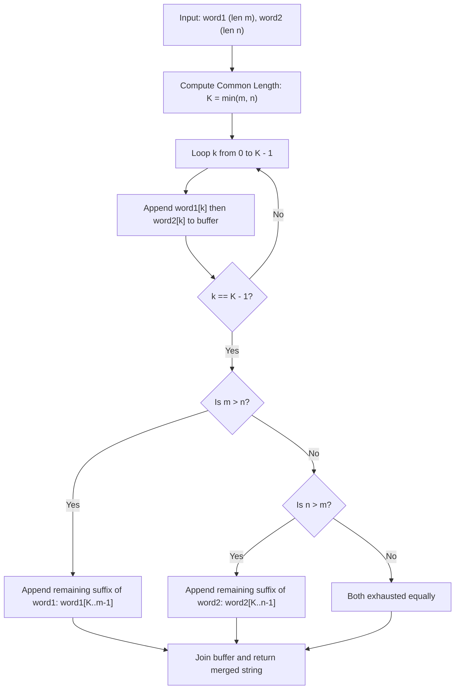

# Guided Example: Merge Strings Alternately

We trace the step-by-step execution of the two-pointer alternating zipper merge approach on a representative problem instance:

- **Input:** `word1 = "ab"`, `word2 = "pqrs"`
- **Required Output:** `"apbqrs"`

This instance features strings of unequal length ($|word1| = 2$ and $|word2| = 4$), exposing both the alternating prefix interleaving phase and the terminal suffix append phase without degenerate collapses.

---

## 1. Instance & Teaching Goal

Given two strings `word1` of length $m$ and `word2` of length $n$, we must merge them by alternating characters starting with `word1`:
$$\text{merged} = \text{word1}[0], \text{word2}[0], \text{word1}[1], \text{word2}[1], \dots$$
When one string runs out of characters, all remaining characters from the longer string must be appended directly to the end of the merged output.

A naive approach copying characters with repeated string concatenations risks quadratic $\mathcal{O}((m+n)^2)$ reallocation overhead. The optimal method iterates through the shared index range $0 \le k < \min(m, n)$, pushing character pairs into an accumulator buffer in linear $\mathcal{O}(m + n)$ time, followed by appending the leftover suffix of the longer string.

---

## 2. Conceptual Foundation & Invariants

### State Representation

| Component | Mathematical Definition | Role |
|---|---|---|
| Dual Index Pointers | $(i, j)$ with $0 \le i \le m, 0 \le j \le n$ | Tracks current read position in `word1` and `word2` |
| Shared Prefix Boundary | $K = \min(m, n)$ | Extent of simultaneous alternating interleaving |
| Accumulator Buffer | List of characters | Progressively constructed merged string |
| Residual Suffix | $\text{word1}[K \dots m-1]$ or $\text{word2}[K \dots n-1]$ | Leftover characters appended en bloc |

### Mathematical Invariants

> **Alternating Index Mapping Theorem.**
> For any two strings of lengths $m$ and $n$, let $K = \min(m, n)$.
> 1. In the merged string, every index $k \in [0, K - 1]$ maps deterministically to two consecutive output positions:
>    $$\text{merged}[2k] = \text{word1}[k], \quad \text{merged}[2k + 1] = \text{word2}[k]$$
> 2. For any remaining indices in the longer string ($k \ge K$):
>    - If $m > n$, $\text{merged}[2n + (k - n)] = \text{word1}[k]$ for all $n \le k < m$.
>    - If $n > m$, $\text{merged}[2m + (k - m)] = \text{word2}[k]$ for all $m \le k < n$.
> Every character appears exactly once in its specified relative order, preserving total length $m + n$.

---

## 3. Step-by-Step Worked Execution

We trace `word1 = "ab"` ($m = 2$) and `word2 = "pqrs"` ($n = 4$).
Common length: $K = \min(2, 4) = 2$.
Initial buffer: `[]`.

---

### Step 1: Interleave Index $k = 0$
- Read `word1[0]`: Character `'a'`. Append `'a'`.
- Read `word2[0]`: Character `'p'`. Append `'p'`.
- Buffer state: `['a', 'p']`.
- Merged prefix: `"ap"`.

---

### Step 2: Interleave Index $k = 1$
- Read `word1[1]`: Character `'b'`. Append `'b'`.
- Read `word2[1]`: Character `'q'`. Append `'q'`.
- Buffer state: `['a', 'p', 'b', 'q']`.
- Merged prefix: `"apbq"`.

---

### Step 3: Transition to Suffix Phase
- Loop over common index range $[0 \dots K-1]$ terminates since $k = 2 = K$.
- Pointer check:
  - $i = 2 = m$: `word1` is completely consumed.
  - $j = 2 < n = 4$: `word2` contains remaining characters at indices $[2, 3]$.

---

### Step 4: Append Residual Suffix
- Extract suffix of `word2` starting at index $K = 2$:
  $$\text{word2}[2 \dots 3] = \text{"rs"}$$
- Append `'r'` and `'s'` to buffer:
  $$\text{Buffer} \leftarrow \text{['a', 'p', 'b', 'q', 'r', 's']}$$

---

### Step 5: Materialize Final Result
- Join accumulated characters into a single string:
  $$\text{Result} = \text{"apbqrs"}$$
- Length verification: $2 + 4 = 6 = |\text{"apbqrs"}|$.

---

## 4. Complete Execution Trace

| Phase | Read Pointer $k$ | Character from `word1` | Character from `word2` | Chunk Appended | Cumulative Merged Buffer |
|---|---|---|---|---|---|
| Alternating | $0$ | `'a'` | `'p'` | `"ap"` | `['a', 'p']` |
| Alternating | $1$ | `'b'` | `'q'` | `"bq"` | `['a', 'p', 'b', 'q']` |
| Suffix Drain | $2$ | Exhausted | `'r'` | `'r'` | `['a', 'p', 'b', 'q', 'r']` |
| Suffix Drain | $3$ | Exhausted | `'s'` | `'s'` | `['a', 'p', 'b', 'q', 'r', 's']` |
| Terminate | — | — | — | — | **`"apbqrs"`** |

---

## 5. Algorithmic Correctness

### Key Invariants and Correctness Argument

1. **Exact Strict Alternation:**
   For all positions prior to $2K$, the character at even position $2k$ always originates from `word1[k]` and the odd position $2k + 1$ always originates from `word2[k]`. This guarantees strict alternation with zero phase displacement.
2. **Order Preservation:**
   Because indices $k$ strictly increase from $0$ upward, the relative order of characters within each individual word is preserved without reordering.
3. **Lossless Suffix Concatenation:**
   After consuming the first $K$ characters from each string, exactly one string (or neither) has leftover characters. Appending the remaining slice intact ensures every input character is represented in the output without duplication or truncation.

### Boundary and Edge Cases

| Scenario | Input Configuration | Expected Output | Strategic Handling |
|---|---|---|---|
| Equal Length Words | `word1 = "abc"`, `word2 = "pqr"` | `"apbqcr"` | Common length $K = 3$; loop consumes all characters; suffix phase appends nothing. |
| First Word Longer | `word1 = "abcd"`, `word2 = "pq"` | `"apbqcd"` | Alternates for 2 pairs; appends suffix `"cd"` from `word1`. |
| Single Character Words | `word1 = "a"`, `word2 = "z"` | `"az"` | $K = 1$; single loop iteration; returns `"az"`. |
| Second Word Dominates | `word1 = "x"`, `word2 = "abcdef"` | `"xabcdef"` | Single initial pair `"xa"` followed by 5 leftover characters `"bcdef"`. |

---

## 6. Complexity Derivation

- **Time Complexity:** $\mathcal{O}(m + n)$ where $m = |word1|$ and $n = |word2|$.
  - The interleaved loop runs $\min(m, n)$ times, performing constant-time appends.
  - The suffix slice operation copies the remaining $|m - n|$ characters in linear time.
  - String joining traverses all $m + n$ characters once.
  - For constraints $m, n \le 100$, total character operations are $\le 200$, executing in under $0.001\text{ ms}$.
- **Space Complexity:** $\mathcal{O}(m + n)$ auxiliary space to allocate the buffer and construct the final output string of length $m + n$.
