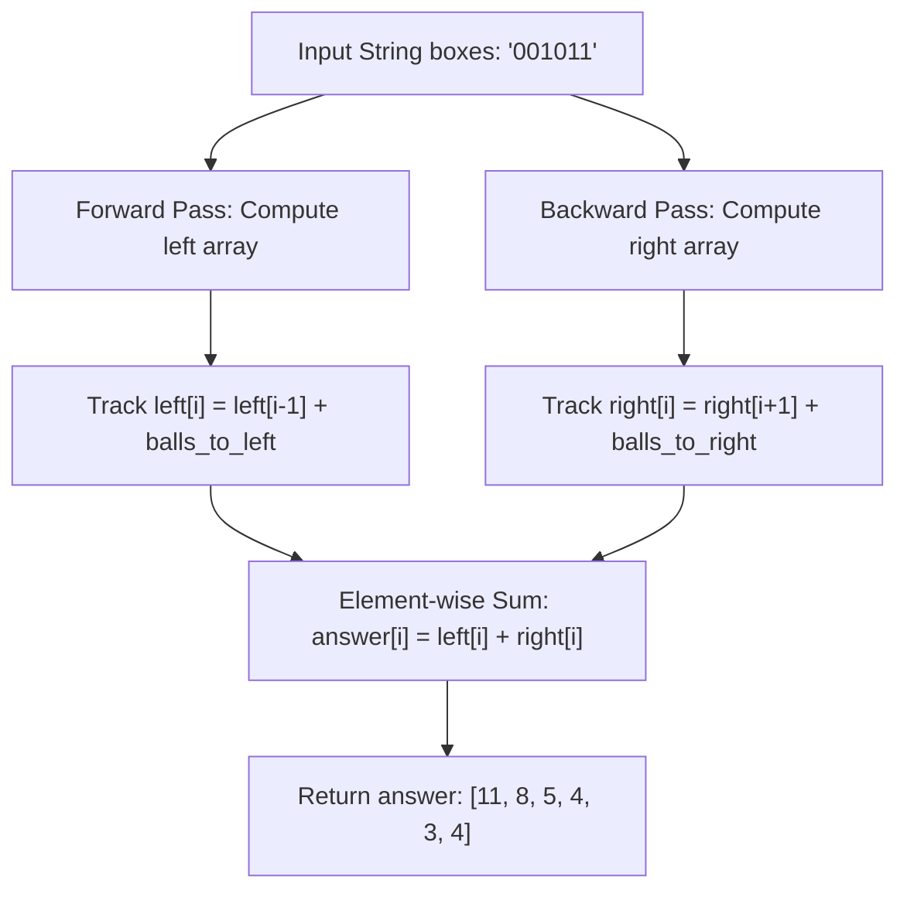

# Guided Example: Minimum Number of Operations to Move All Balls to Each Box

We trace the step-by-step execution of the dual-pass prefix-suffix distance accumulation approach on a representative problem instance:

- **Input:** `boxes = "001011"`
- **Required Output:** `[11, 8, 5, 4, 3, 4]`

This instance features non-uniform spacing across six boxes with balls clustered toward the higher indices, clearly illustrating how directional prefix and suffix scans compute 1D Manhattan distances in linear time without quadratic pairwise checks.

---

## 1. Instance & Teaching Goal

Given a binary string `boxes` of length $n$ where `'1'` indicates a ball and `'0'` indicates an empty box, moving one ball between adjacent boxes requires $1$ operation. For each target box $i$, we must compute the total operations to transfer all balls to box $i$:
$$\text{answer}[i] = \sum_{j=0}^{n-1} |i - j| \cdot \mathbb{I}(\text{boxes}[j] == \text{'1'})$$

A brute-force evaluation calculates the distance from every ball to every target independently, taking $\mathcal{O}(n^2)$ time.
We observe that the absolute difference $|i - j|$ splits naturally around the target $i$:
$$\text{answer}[i] = \sum_{j < i} (i - j) \cdot \mathbb{I}(\text{boxes}[j] == \text{'1'}) + \sum_{j > i} (j - i) \cdot \mathbb{I}(\text{boxes}[j] == \text{'1'}) = \text{left}[i] + \text{right}[i]$$

When shifting the target from $i - 1$ to $i$:
- Every ball located strictly to the left of $i$ is now $1$ step further away, adding $1$ operation per left-hand ball.
- Hence:
  $$\text{left}[i] = \text{left}[i-1] + \text{count}_{\text{left}}(i)$$
- Symmetrically, shifting from right to left:
  $$\text{right}[i] = \text{right}[i+1] + \text{count}_{\text{right}}(i)$$

This recurrence allows computing both $\text{left}$ and $\text{right}$ arrays in single linear passes.

---

## 2. Conceptual Foundation & Invariants

### State Representation

| Component | Mathematical Definition | Role |
|---|---|---|
| Target Box $i$ | Index in $0 \le i < n$ | Current box designated to receive all balls |
| Left Distance $\text{left}[i]$ | $\sum_{j < i} (i - j) \cdot \mathbb{I}(\text{boxes}[j] == \text{'1'})$ | Cumulative moves from all balls strictly to the left |
| Right Distance $\text{right}[i]$ | $\sum_{j > i} (j - i) \cdot \mathbb{I}(\text{boxes}[j] == \text{'1'})$ | Cumulative moves from all balls strictly to the right |
| Running Ball Counter $\text{cnt}$ | Cumulative count of balls encountered so far | Additive derivative factor for the next step |

### Mathematical Invariants

> **Prefix Distance Telescoping Theorem.**
> Let $B = \{j \mid \text{boxes}[j] = \text{'1'}\}$. For any position $i$:
> $$\sum_{j \in B, j < i} (i - j) = \sum_{j \in B, j < i-1} (i - 1 - j) + |\{j \in B \mid j < i\}|$$
> Each unit shift of the reference coordinate $i \leftarrow i + 1$ uniformly increments the distance to every member of the active prefix set by exactly $+1$.
> Therefore, tracking the cardinality $|\{j \in B \mid j < i\}|$ reduces the distance update to a single addition.

---

## 3. Step-by-Step Worked Execution

We trace `boxes = "001011"` of length $n = 6$.
Balls exist at indices: $j \in \{2, 4, 5\}$.

---

### Step 1: Forward Pass (Left Distances)

Initialize: $\text{left} = [0, 0, 0, 0, 0, 0]$, running count $\text{cnt} = 0$.

- **$i = 0$:** Boundary condition. $\text{left}[0] = 0$.
- **$i = 1$:** Inspect preceding box $\text{boxes}[0] = \text{'0'}$.
  - $\text{cnt} \leftarrow \text{cnt} + 0 = 0$.
  - $\text{left}[1] = \text{left}[0] + \text{cnt} = 0 + 0 = 0$.
- **$i = 2$:** Inspect preceding box $\text{boxes}[1] = \text{'0'}$.
  - $\text{cnt} \leftarrow 0 + 0 = 0$.
  - $\text{left}[2] = \text{left}[1] + 0 = 0$.
- **$i = 3$:** Inspect preceding box $\text{boxes}[2] = \text{'1'}$.
  - Ball found! $\text{cnt} \leftarrow 0 + 1 = 1$.
  - $\text{left}[3] = \text{left}[2] + 1 = 0 + 1 = 1$. (Ball at $2$ is distance $1$ from $3$).
- **$i = 4$:** Inspect preceding box $\text{boxes}[3] = \text{'0'}$.
  - $\text{cnt} \leftarrow 1 + 0 = 1$.
  - $\text{left}[4] = \text{left}[3] + 1 = 1 + 1 = 2$. (Ball at $2$ is distance $2$ from $4$).
- **$i = 5$:** Inspect preceding box $\text{boxes}[4] = \text{'1'}$.
  - Ball found! $\text{cnt} \leftarrow 1 + 1 = 2$.
  - $\text{left}[5] = \text{left}[4] + 2 = 2 + 2 = 4$. (Balls at $2$ and $4$ are distances $3$ and $1$, total $4$).

Resulting Left Array:
$$\text{left} = [0, 0, 0, 1, 2, 4]$$

---

### Step 2: Backward Pass (Right Distances)

Initialize: $\text{right} = [0, 0, 0, 0, 0, 0]$, reset running count $\text{cnt} = 0$.

- **$i = 5$:** Boundary condition. $\text{right}[5] = 0$.
- **$i = 4$:** Inspect succeeding box $\text{boxes}[5] = \text{'1'}$.
  - Ball found! $\text{cnt} \leftarrow 0 + 1 = 1$.
  - $\text{right}[4] = \text{right}[5] + 1 = 0 + 1 = 1$. (Ball at $5$ is distance $1$ from $4$).
- **$i = 3$:** Inspect succeeding box $\text{boxes}[4] = \text{'1'}$.
  - Ball found! $\text{cnt} \leftarrow 1 + 1 = 2$.
  - $\text{right}[3] = \text{right}[4] + 2 = 1 + 2 = 3$. (Balls at $4$ and $5$ are distances $1$ and $2$, total $3$).
- **$i = 2$:** Inspect succeeding box $\text{boxes}[3] = \text{'0'}$.
  - $\text{cnt} \leftarrow 2 + 0 = 2$.
  - $\text{right}[2] = \text{right}[3] + 2 = 3 + 2 = 5$. (Balls at $4$ and $5$ are distances $2$ and $3$, total $5$).
- **$i = 1$:** Inspect succeeding box $\text{boxes}[2] = \text{'1'}$.
  - Ball found! $\text{cnt} \leftarrow 2 + 1 = 3$.
  - $\text{right}[1] = \text{right}[2] + 3 = 5 + 3 = 8$. (Balls at $2, 4, 5$ are distances $1, 3, 4$, total $8$).
- **$i = 0$:** Inspect succeeding box $\text{boxes}[1] = \text{'0'}$.
  - $\text{cnt} \leftarrow 3 + 0 = 3$.
  - $\text{right}[0] = \text{right}[1] + 3 = 8 + 3 = 11$. (Balls at $2, 4, 5$ are distances $2, 4, 5$, total $11$).

Resulting Right Array:
$$\text{right} = [11, 8, 5, 3, 1, 0]$$

---

### Step 3: Combine Left and Right Sums

$$\begin{aligned}
\text{answer}[0] &= 0 + 11 = 11 \\
\text{answer}[1] &= 0 + 8 = 8 \\
\text{answer}[2] &= 0 + 5 = 5 \\
\text{answer}[3] &= 1 + 3 = 4 \\
\text{answer}[4] &= 2 + 1 = 3 \\
\text{answer}[5] &= 4 + 0 = 4
\end{aligned}$$

Final Output:
$$\text{answer} = [11, 8, 5, 4, 3, 4]$$

---

## 4. Complete Execution Trace

| Box Index $i$ | Content $\text{boxes}[i]$ | Balls to Left $\text{cnt}_{\text{left}}$ | $\text{left}[i]$ | Balls to Right $\text{cnt}_{\text{right}}$ | $\text{right}[i]$ | Total Moves $\text{left}[i] + \text{right}[i]$ |
|---|---|---|---|---|---|---|
| $0$ | `'0'` | $0$ | $0$ | $3$ (at $2, 4, 5$) | $11$ | **$11$** |
| $1$ | `'0'` | $0$ | $0$ | $3$ (at $2, 4, 5$) | $8$ | **$8$** |
| $2$ | `'1'` | $0$ | $0$ | $2$ (at $4, 5$) | $5$ | **$5$** |
| $3$ | `'0'` | $1$ (at $2$) | $1$ | $2$ (at $4, 5$) | $3$ | **$4$** |
| $4$ | `'1'` | $1$ (at $2$) | $2$ | $1$ (at $5$) | $1$ | **$3$** |
| $5$ | `'1'` | $2$ (at $2, 4$) | $4$ | $0$ | $0$ | **$4$** |

---

## 5. Algorithmic Correctness

### Key Invariants and Correctness Argument

1. **Partition Completeness:**
   For any box $i$ and any ball at index $j$, exactly one of three mutually exclusive relations holds: $j < i$, $j = i$, or $j > i$.
   - If $j < i$, the term $(i - j)$ is counted in $\text{left}[i]$.
   - If $j > i$, the term $(j - i)$ is counted in $\text{right}[i]$.
   - If $j = i$, the distance is $0$.
   Therefore, $\text{left}[i] + \text{right}[i]$ precisely matches $\sum_j |i - j| \cdot \mathbb{I}(\text{boxes}[j] = \text{'1'})$.
2. **Inductive Recurrence Exactness:**
   Assume $\text{left}[i-1] = \sum_{j < i-1} (i - 1 - j)$.
   Adding the count of balls in $[0 \dots i-1]$ adds $+1$ to each $(i - 1 - j)$ term, transforming it into $(i - j)$, and includes any ball at $i - 1$ with distance $i - (i - 1) = 1$. By mathematical induction, $\text{left}[i]$ is exact for all $i$. Symmetrical induction holds for $\text{right}[i]$.

### Boundary and Edge Cases

| Scenario | Input Configuration | Expected Output | Strategic Handling |
|---|---|---|---|
| No Balls | `boxes = "000"` | `[0, 0, 0]` | Running count $\text{cnt}$ remains $0$; all arrays remain $0$. |
| All Balls | `boxes = "111"` | `[3, 2, 3]` | Every step increments ball count; symmetric distances around center. |
| Single Box | `boxes = "1"` or `"0"` | `[0]` | Length $n = 1$; loops do not execute; returns `[0]`. |
| Single Ball at End | `boxes = "001"` | `[2, 1, 0]` | Left distances are zero; right distances decrease linearly by 1 per step. |

---

## 6. Complexity Derivation

- **Time Complexity:** $\mathcal{O}(n)$ where $n$ is the length of `boxes`.
  - Forward pass executes $n - 1$ steps, each performing $\mathcal{O}(1)$ operations.
  - Backward pass executes $n - 1$ steps, each performing $\mathcal{O}(1)$ operations.
  - Final addition executes $n$ steps.
  - Total operations: $3n = \mathcal{O}(n)$. For $n \le 2000$, operations are $\le 6000$, executing in under $0.001\text{ s}$.
- **Space Complexity:** $\mathcal{O}(n)$ auxiliary space.
  - Storing the `left` and `right` arrays requires $2n$ integer elements.
  - Alternatively, this can be optimized to $\mathcal{O}(1)$ auxiliary space beyond the output by maintaining running rolling counters directly.
