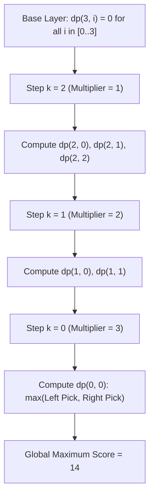

# Guided Example: Maximum Score from Performing Multiplication Operations

We trace the step-by-step execution of the dimension-reduced dynamic programming approach on a representative problem instance:

- **Input:** `nums = [1, 2, 3]`, `multipliers = [3, 2, 1]`
- **Required Output:** `14`

This instance demonstrates how identifying implicit state coupling (deriving the right pointer directly from the turn count and left pick count) reduces a 3D state space to a compact 2D table, enabling exact optimal substructure resolution without exponential search.

---

## 1. Instance & Teaching Goal

We are given an array `nums` of length $n$ and an array `multipliers` of length $m$, with $m \le n$. We perform exactly $m$ operations.
On operation $k$ ($0 \le k < m$):
1. Pick one element $x$ from either the current beginning or current end of `nums`.
2. Add $x \times \text{multipliers}[k]$ to the total score.
3. Remove $x$ from `nums`.

We seek the maximum possible total score after $m$ operations.

A naive recursive exploration that evaluates both choices at every step constructs a binary decision tree of depth $m$, incurring $\mathcal{O}(2^m)$ time—intractable for $m = 1000$.
A naive memoization with three parameters $(i, j, k)$ (left index, right index, operation count) produces $\mathcal{O}(n^2 \cdot m)$ states—which exceeds memory limits when $n = 10^5$.

### State Space Reduction
Notice the fundamental coupling invariant:
At step $k$, exactly $k$ numbers have been removed from `nums`. If $i$ numbers were chosen from the left, then exactly $k - i$ numbers must have been chosen from the right.
Thus, the current right boundary pointer $j$ is strictly determined:
$$j = (n - 1) - (k - i)$$
The entire state of the game is fully captured by just two variables:
- $k \in [0, m]$: Number of operations performed so far.
- $i \in [0, k]$: Number of elements taken from the left end.

This collapses the number of distinct states from $\mathcal{O}(n^2 \cdot m)$ to $\mathcal{O}(m^2)$, entirely independent of the outer array size $n$.

---

## 2. Conceptual Foundation & Invariants

### State Representation

| Component | Mathematical Definition | Role |
|---|---|---|
| Step / Turn $k$ | Integer $0 \le k \le m$ | Active multiplier index $\text{multipliers}[k]$ |
| Left Picks $i$ | Integer $0 \le i \le k$ | Number of elements selected from the left boundary |
| Derived Right Index $j$ | $n - 1 - (k - i)$ | Current rightmost available element in `nums` |
| Subproblem Value $dp(k, i)$ | Maximum score obtainable from step $k$ onwards | Dynamic programming memo table |

### Mathematical Invariants

> **Dual-Choice Optimal Substructure Recurrence.**
> Let $dp(k, i)$ denote the maximal score achievable from operation $k$ through $m - 1$ given that $i$ elements were previously consumed from the left.
> The available choices are:
> 1. **Pick Left:** Select $\text{nums}[i]$, gain $\text{nums}[i] \times \text{multipliers}[k]$, transitioning to $(k + 1, i + 1)$.
> 2. **Pick Right:** Select $\text{nums}[j] = \text{nums}[n - 1 - (k - i)]$, gain $\text{nums}[j] \times \text{multipliers}[k]$, transitioning to $(k + 1, i)$.
>
> The Bellman optimality equation is:
> $$dp(k, i) = \max \begin{cases}
> \text{nums}[i] \cdot \text{multipliers}[k] + dp(k + 1, i + 1) \\
> \text{nums}[n - 1 - (k - i)] \cdot \text{multipliers}[k] + dp(k + 1, i)
> \end{cases}$$
> with base condition:
> $$dp(m, i) = 0 \quad \text{for all } 0 \le i \le m$$

---

## 3. Step-by-Step Worked Execution

We trace `nums = [1, 2, 3]` ($n = 3$) and `multipliers = [3, 2, 1]` ($m = 3$).
We compute $dp(k, i)$ backward from $k = 3$ down to $k = 0$.

---

### Step 1: Base Case Initialization ($k = 3$)
At $k = 3$, all $m = 3$ multipliers have been applied. No further operations remain:
$$dp(3, 0) = 0, \quad dp(3, 1) = 0, \quad dp(3, 2) = 0, \quad dp(3, 3) = 0$$

---

### Step 2: Backward Evaluation for Step $k = 2$ (Multiplier = $1$)

Here $\text{multipliers}[2] = 1$. The possible left pick counts are $i \in \{0, 1, 2\}$.

#### Case $i = 0$:
- Right picks: $k - i = 2 - 0 = 2$.
- Right index: $j = 3 - 1 - 2 = 0$.
- Candidate Left: $\text{nums}[0] \times 1 + dp(3, 1) = 1 \times 1 + 0 = 1$.
- Candidate Right: $\text{nums}[0] \times 1 + dp(3, 0) = 1 \times 1 + 0 = 1$.
- $$dp(2, 0) = \max(1, 1) = 1$$

#### Case $i = 1$:
- Right picks: $k - i = 2 - 1 = 1$.
- Right index: $j = 3 - 1 - 1 = 1$.
- Candidate Left: $\text{nums}[1] \times 1 + dp(3, 2) = 2 \times 1 + 0 = 2$.
- Candidate Right: $\text{nums}[1] \times 1 + dp(3, 1) = 2 \times 1 + 0 = 2$.
- $$dp(2, 1) = \max(2, 2) = 2$$

#### Case $i = 2$:
- Right picks: $k - i = 2 - 2 = 0$.
- Right index: $j = 3 - 1 - 0 = 2$.
- Candidate Left: $\text{nums}[2] \times 1 + dp(3, 3) = 3 \times 1 + 0 = 3$.
- Candidate Right: $\text{nums}[2] \times 1 + dp(3, 2) = 3 \times 1 + 0 = 3$.
- $$dp(2, 2) = \max(3, 3) = 3$$

---

### Step 3: Backward Evaluation for Step $k = 1$ (Multiplier = $2$)

Here $\text{multipliers}[1] = 2$. The possible left pick counts are $i \in \{0, 1\}$.

#### Case $i = 0$:
- Right index: $j = 3 - 1 - (1 - 0) = 1$.
- Option Left: Pick $\text{nums}[0] = 1$:
  $$\text{Gain} = 1 \times 2 + dp(2, 1) = 2 + 2 = 4$$
- Option Right: Pick $\text{nums}[1] = 2$:
  $$\text{Gain} = 2 \times 2 + dp(2, 0) = 4 + 1 = 5$$
- $$dp(1, 0) = \max(4, 5) = 5 \quad \text{(Right Pick Wins)}$$

#### Case $i = 1$:
- Right index: $j = 3 - 1 - (1 - 1) = 2$.
- Option Left: Pick $\text{nums}[1] = 2$:
  $$\text{Gain} = 2 \times 2 + dp(2, 2) = 4 + 3 = 7$$
- Option Right: Pick $\text{nums}[2] = 3$:
  $$\text{Gain} = 3 \times 2 + dp(2, 1) = 6 + 2 = 8$$
- $$dp(1, 1) = \max(7, 8) = 8 \quad \text{(Right Pick Wins)}$$

---

### Step 4: Final Evaluation for Step $k = 0$ (Multiplier = $3$)

Here $\text{multipliers}[0] = 3$ and $i = 0$.
- Right index: $j = 3 - 1 - (0 - 0) = 2$.
- Option Left: Pick $\text{nums}[0] = 1$:
  $$\text{Gain} = 1 \times 3 + dp(1, 1) = 3 + 8 = 11$$
- Option Right: Pick $\text{nums}[2] = 3$:
  $$\text{Gain} = 3 \times 3 + dp(1, 0) = 9 + 5 = 14$$
- $$dp(0, 0) = \max(11, 14) = 14 \quad \text{(Right Pick Wins)}$$

---

## 4. Complete Execution Trace

| Step $k$ | Multiplier | Left Picks $i$ | Right Index $j$ | Left Pick Value $\times \text{mult} + dp(k+1, i+1)$ | Right Pick Value $\times \text{mult} + dp(k+1, i)$ | Optimal $dp(k, i)$ | Best Decision |
|---|---|---|---|---|---|---|---|
| $3$ | — | $0, 1, 2, 3$ | — | — | — | **$0$** | Base state |
| $2$ | $1$ | $0$ | $0$ | $1 \times 1 + 0 = 1$ | $1 \times 1 + 0 = 1$ | **$1$** | Either |
| $2$ | $1$ | $1$ | $1$ | $2 \times 1 + 0 = 2$ | $2 \times 1 + 0 = 2$ | **$2$** | Either |
| $2$ | $1$ | $2$ | $2$ | $3 \times 1 + 0 = 3$ | $3 \times 1 + 0 = 3$ | **$3$** | Either |
| $1$ | $2$ | $0$ | $1$ | $1 \times 2 + 2 = 4$ | $2 \times 2 + 1 = 5$ | **$5$** | Pick Right ($\text{nums}[1]$) |
| $1$ | $2$ | $1$ | $2$ | $2 \times 2 + 3 = 7$ | $3 \times 2 + 2 = 8$ | **$8$** | Pick Right ($\text{nums}[2]$) |
| $0$ | $3$ | $0$ | $2$ | $1 \times 3 + 8 = 11$ | $3 \times 3 + 5 = 14$ | **$14$** | Pick Right ($\text{nums}[2]$) |

Final Result:
$$\text{Max Score} = dp(0, 0) = 14$$

---

## 5. Algorithmic Correctness

### Key Invariants and Correctness Argument

1. **State Completeness Without Ambiguity:**
   Any game sequence of length $m$ is completely characterized by the sequence of binary decisions (Left or Right). Given total turns $k$ and left count $i$, the set of remaining elements is always precisely $\text{nums}[i \dots n - 1 - (k - i)]$. No two distinct decision paths that produce the same $(k, i)$ state can differ in their set of remaining available numbers.
2. **Optimal Substructure:**
   The score gained from step $k$ onward depends strictly on the current available boundaries and future choices, completely independent of the order in which the past $k$ numbers were removed. Hence, the Bellman principle of optimality holds strictly.

### Boundary and Edge Cases

| Scenario | Input Configuration | Expected Output | Strategic Handling |
|---|---|---|---|
| Negative Multipliers & Negative Numbers | `nums = [-5, -2]`, `multipliers = [-3]` | $15$ | $(-5) \times (-3) = 15 > (-2) \times (-3) = 6$; chooses largest negative. |
| Mixed Signs on Ends | `nums = [-10, 10]`, `multipliers = [5]` | $50$ | $10 \times 5 = 50 > -10 \times 5 = -50$; picks positive end. |
| Single Step ($m = 1$) | `nums = [2, 5, 1]`, `multipliers = [4]` | $20$ | Compares left ($2 \times 4 = 8$) and right ($1 \times 4 = 4$); picks left. |
| Full Consumption ($m = n$) | $m = n$ | All elements consumed | Consumes entire array in optimal order. |

---

## 6. Complexity Derivation

- **Time Complexity:** $\mathcal{O}(m^2)$ where $m$ is the length of `multipliers`.
  - For each step $k \in [0, m - 1]$, the variable $i$ ranges from $0$ to $k$, giving $k + 1$ states.
  - Total states evaluated:
    $$\sum_{k=0}^{m-1} (k + 1) = \frac{m(m + 1)}{2} = \mathcal{O}(m^2)$$
  - Each state performs $\mathcal{O}(1)$ arithmetic operations and a two-way maximum.
  - For $m \le 1000$, total state calculations are $\approx 5 \times 10^5$, executing in under $0.05\text{ s}$, independent of $n \le 10^5$.
- **Space Complexity:** $\mathcal{O}(m^2)$ auxiliary space for memoization, or $\mathcal{O}(m)$ space by storing only the next row $k + 1$ during bottom-up DP.
